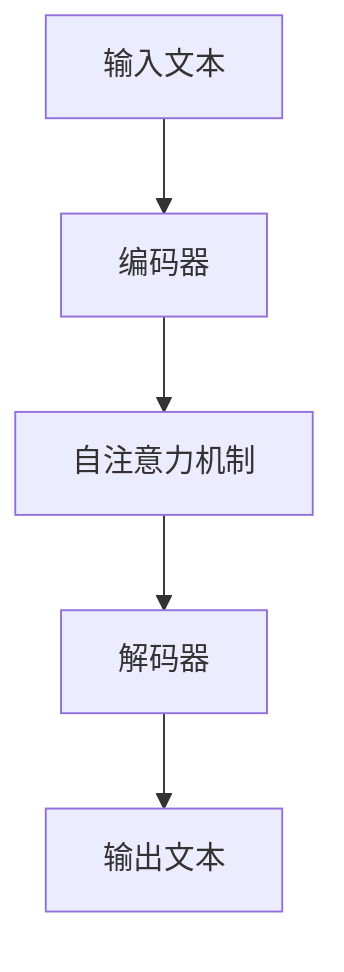

# 大语言模型原理与工程实践：提示词的基础要素

## 1.背景介绍

大语言模型（Large Language Model, LLM）是近年来人工智能领域的一个重要突破。它们通过大量的文本数据进行训练，能够生成高质量的自然语言文本，完成各种复杂的语言任务。提示词（Prompt）作为与大语言模型交互的关键要素，决定了模型输出的质量和效果。本文将深入探讨大语言模型的原理、提示词的基础要素及其工程实践。

## 2.核心概念与联系

### 2.1 大语言模型

大语言模型是基于深度学习的自然语言处理模型，通常采用Transformer架构。它们通过大量的文本数据进行训练，能够理解和生成自然语言文本。常见的大语言模型包括GPT-3、BERT等。

### 2.2 提示词

提示词是与大语言模型交互的输入文本，决定了模型的输出内容。提示词的设计和优化是使用大语言模型的关键。

### 2.3 提示词与大语言模型的关系

提示词是大语言模型生成文本的起点。通过设计合适的提示词，可以引导模型生成符合预期的文本。提示词的质量直接影响模型的输出效果。

## 3.核心算法原理具体操作步骤

### 3.1 Transformer架构

Transformer是大语言模型的核心架构。它由编码器和解码器组成，通过自注意力机制（Self-Attention）实现对输入文本的理解和生成。



### 3.2 训练过程

大语言模型的训练过程包括以下步骤：

1. 数据预处理：将文本数据转换为模型可处理的格式。
2. 模型初始化：初始化模型参数。
3. 前向传播：通过模型生成预测结果。
4. 计算损失：计算预测结果与真实结果之间的差异。
5. 反向传播：更新模型参数以最小化损失。
6. 重复步骤3-5，直到模型收敛。

### 3.3 提示词设计

提示词设计的关键在于明确任务目标和上下文信息。以下是提示词设计的一些原则：

1. 明确任务目标：提示词应清晰描述任务目标。
2. 提供上下文信息：提示词应包含足够的上下文信息，以帮助模型理解任务。
3. 简洁明了：提示词应简洁明了，避免冗长和模糊。

## 4.数学模型和公式详细讲解举例说明

### 4.1 自注意力机制

自注意力机制是Transformer的核心。它通过计算输入序列中每个位置的注意力权重，实现对输入文本的理解。自注意力机制的计算公式如下：

$$
\text{Attention}(Q, K, V) = \text{softmax}\left(\frac{QK^T}{\sqrt{d_k}}\right)V
$$

其中，$Q$、$K$、$V$分别表示查询矩阵、键矩阵和值矩阵，$d_k$表示键矩阵的维度。

### 4.2 损失函数

大语言模型的训练目标是最小化预测结果与真实结果之间的差异。常用的损失函数是交叉熵损失（Cross-Entropy Loss），其公式如下：

$$
L = -\sum_{i=1}^{N} y_i \log(\hat{y}_i)
$$

其中，$y_i$表示真实标签，$\hat{y}_i$表示模型预测的概率。

## 5.项目实践：代码实例和详细解释说明

### 5.1 环境配置

首先，确保安装了必要的库和工具：

```bash
pip install transformers torch
```

### 5.2 加载预训练模型

使用Hugging Face的Transformers库加载预训练的大语言模型：

```python
from transformers import GPT2LMHeadModel, GPT2Tokenizer

model_name = 'gpt2'
model = GPT2LMHeadModel.from_pretrained(model_name)
tokenizer = GPT2Tokenizer.from_pretrained(model_name)
```

### 5.3 提示词生成

设计提示词并生成文本：

```python
prompt = "在未来的人工智能领域，"
inputs = tokenizer(prompt, return_tensors='pt')
outputs = model.generate(inputs['input_ids'], max_length=50, num_return_sequences=1)

generated_text = tokenizer.decode(outputs[0], skip_special_tokens=True)
print(generated_text)
```

### 5.4 结果分析

通过分析生成的文本，评估提示词的效果，并进行优化。

## 6.实际应用场景

### 6.1 文本生成

大语言模型可以用于生成高质量的自然语言文本，如新闻报道、小说创作等。

### 6.2 问答系统

通过设计合适的提示词，大语言模型可以用于构建智能问答系统，提供准确的答案。

### 6.3 机器翻译

大语言模型可以用于机器翻译任务，通过提示词引导模型生成目标语言的文本。

## 7.工具和资源推荐

### 7.1 开源库

- [Hugging Face Transformers](https://github.com/huggingface/transformers)：提供了丰富的大语言模型和工具。
- [OpenAI GPT](https://github.com/openai/gpt-3)：OpenAI提供的大语言模型。

### 7.2 在线资源

- [ArXiv](https://arxiv.org/)：提供了大量的学术论文和研究成果。
- [Kaggle](https://www.kaggle.com/)：提供了丰富的数据集和竞赛。

## 8.总结：未来发展趋势与挑战

大语言模型在自然语言处理领域展现了巨大的潜力，但也面临一些挑战。未来的发展趋势包括：

1. 模型规模的进一步扩大：更大规模的模型将带来更强的语言理解和生成能力。
2. 提示词优化：研究如何设计和优化提示词，以提高模型的输出质量。
3. 多模态学习：结合图像、音频等多模态数据，提高模型的综合能力。

同时，大语言模型也面临一些挑战，如计算资源的消耗、数据隐私和伦理问题等。

## 9.附录：常见问题与解答

### 9.1 如何选择合适的大语言模型？

选择大语言模型时，应考虑任务需求、模型性能和计算资源等因素。常见的大语言模型包括GPT-3、BERT等。

### 9.2 如何设计高质量的提示词？

设计高质量的提示词时，应明确任务目标、提供足够的上下文信息，并保持简洁明了。

### 9.3 如何评估大语言模型的输出质量？

评估大语言模型的输出质量可以通过人工评估和自动评估相结合的方法。常用的评估指标包括BLEU、ROUGE等。

---

作者：禅与计算机程序设计艺术 / Zen and the Art of Computer Programming