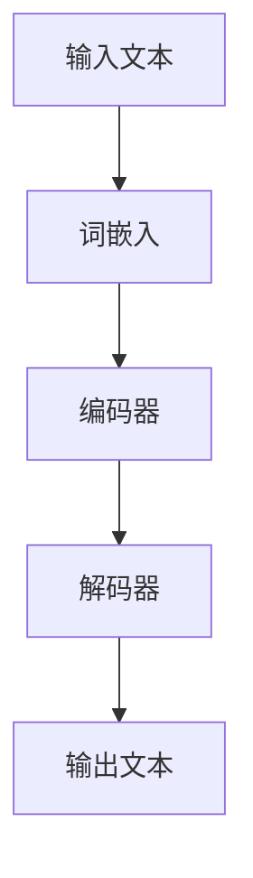
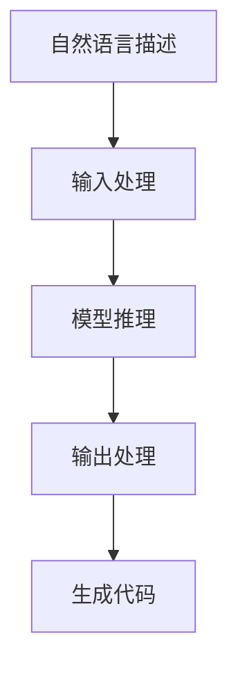
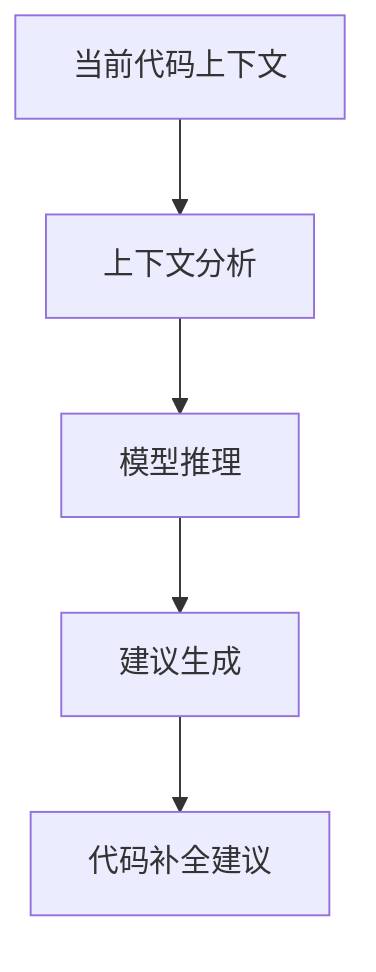

# 大语言模型应用指南：人工编程与自动编程

## 1.背景介绍

在过去的几十年里，人工智能（AI）技术取得了飞速的发展，尤其是大语言模型（Large Language Models, LLMs）的出现，彻底改变了我们与计算机交互的方式。大语言模型，如OpenAI的GPT系列和Google的BERT，不仅在自然语言处理（NLP）任务中表现出色，还在编程领域展现了巨大的潜力。本文旨在探讨大语言模型在人工编程和自动编程中的应用，提供深入的技术分析和实用的编程示例。

## 2.核心概念与联系

### 2.1 大语言模型简介

大语言模型是基于深度学习的模型，通常使用数十亿甚至数百亿的参数进行训练。它们通过大量的文本数据进行预训练，能够理解和生成自然语言文本。以下是大语言模型的基本架构：



### 2.2 人工编程与自动编程

- **人工编程**：指人类程序员手动编写代码，解决特定问题。人工编程依赖于程序员的知识和经验。
- **自动编程**：利用大语言模型等AI技术自动生成代码，减少人类干预。自动编程可以提高开发效率，减少错误。

### 2.3 大语言模型在编程中的角色

大语言模型在编程中的应用主要包括以下几个方面：

1. **代码生成**：根据自然语言描述生成代码。
2. **代码补全**：在编写代码时提供智能补全建议。
3. **代码翻译**：将代码从一种编程语言翻译成另一种。
4. **代码优化**：提供代码优化建议，提高代码性能。

## 3.核心算法原理具体操作步骤

### 3.1 预训练与微调

大语言模型的训练过程分为两个阶段：预训练和微调。

- **预训练**：在大规模文本数据上进行无监督学习，模型学习语言的基本结构和语义。
- **微调**：在特定任务的数据集上进行有监督学习，模型适应特定任务的需求。

### 3.2 代码生成算法

代码生成是大语言模型在编程中的重要应用。以下是代码生成的基本步骤：

1. **输入处理**：将自然语言描述转换为模型可理解的输入格式。
2. **模型推理**：使用大语言模型生成代码。
3. **输出处理**：将生成的代码转换为可执行的格式。



### 3.3 代码补全算法

代码补全通过预测程序员下一步可能编写的代码，提高编程效率。其基本步骤如下：

1. **上下文分析**：分析当前代码上下文。
2. **模型推理**：使用大语言模型预测可能的代码补全。
3. **建议生成**：生成代码补全建议。



## 4.数学模型和公式详细讲解举例说明

### 4.1 词嵌入

词嵌入是将词语转换为向量的技术。常用的词嵌入方法包括Word2Vec和GloVe。词嵌入的数学表示如下：

$$
\text{Word2Vec}(w) = \mathbf{v}_w
$$

其中，$\mathbf{v}_w$ 是词 $w$ 的向量表示。

### 4.2 注意力机制

注意力机制是大语言模型的核心组件。它通过计算输入序列中每个元素的重要性来生成输出。注意力机制的数学表示如下：

$$
\text{Attention}(Q, K, V) = \text{softmax}\left(\frac{QK^T}{\sqrt{d_k}}\right)V
$$

其中，$Q$ 是查询矩阵，$K$ 是键矩阵，$V$ 是值矩阵，$d_k$ 是键向量的维度。

### 4.3 变换器模型

变换器模型是大语言模型的基础架构。其核心组件包括多头注意力机制和前馈神经网络。变换器模型的数学表示如下：

$$
\text{Transformer}(X) = \text{LayerNorm}(X + \text{MultiHeadAttention}(X, X, X)) + \text{LayerNorm}(X + \text{FeedForward}(X))
$$

其中，$X$ 是输入序列，$\text{LayerNorm}$ 是层归一化，$\text{MultiHeadAttention}$ 是多头注意力机制，$\text{FeedForward}$ 是前馈神经网络。

## 5.项目实践：代码实例和详细解释说明

### 5.1 代码生成示例

以下是一个使用大语言模型生成Python代码的示例：

```python
import openai

# 设置API密钥
openai.api_key = 'your-api-key'

# 自然语言描述
description = "写一个函数计算两个数的和"

# 调用大语言模型生成代码
response = openai.Completion.create(
    engine="davinci-codex",
    prompt=description,
    max_tokens=50
)

# 输出生成的代码
print(response.choices[0].text.strip())
```

### 5.2 代码补全示例

以下是一个使用大语言模型进行代码补全的示例：

```python
import openai

# 设置API密钥
openai.api_key = 'your-api-key'

# 当前代码上下文
context = """
def calculate_sum(a, b):
    return a + b

def main():
    x = 10
    y = 20
    result = calculate_sum(x, y)
    print(result)
"""

# 调用大语言模型进行代码补全
response = openai.Completion.create(
    engine="davinci-codex",
    prompt=context,
    max_tokens=50
)

# 输出代码补全建议
print(response.choices[0].text.strip())
```

## 6.实际应用场景

### 6.1 软件开发

大语言模型在软件开发中的应用包括代码生成、代码补全、代码翻译和代码优化。它们可以提高开发效率，减少错误，帮助开发者更快地实现功能。

### 6.2 数据分析

在数据分析领域，大语言模型可以自动生成数据处理代码，帮助分析师快速处理和分析数据，提高工作效率。

### 6.3 教育与培训

大语言模型可以用于编程教育和培训，自动生成编程练习和答案，帮助学生更好地学习编程知识。

## 7.工具和资源推荐

### 7.1 开发工具

- **OpenAI Codex**：一个强大的代码生成工具，支持多种编程语言。
- **GitHub Copilot**：一个基于大语言模型的代码补全工具，集成在Visual Studio Code中。

### 7.2 学习资源

- **《深度学习》**：一本经典的深度学习教材，介绍了大语言模型的基础知识。
- **Coursera上的NLP课程**：提供大语言模型和自然语言处理的在线课程。

## 8.总结：未来发展趋势与挑战

大语言模型在人工编程和自动编程中的应用前景广阔，但也面临一些挑战。未来的发展趋势包括：

- **模型规模和性能的提升**：更大规模和更高性能的大语言模型将进一步提高代码生成和补全的质量。
- **多模态模型的应用**：结合文本、图像和语音等多模态数据的大语言模型将带来更多创新应用。
- **伦理和安全问题**：大语言模型的应用需要考虑伦理和安全问题，确保其使用不会带来负面影响。

## 9.附录：常见问题与解答

### 9.1 大语言模型生成的代码是否可靠？

大语言模型生成的代码在大多数情况下是可靠的，但仍需人工审核和测试，确保代码的正确性和安全性。

### 9.2 如何选择合适的大语言模型？

选择大语言模型时，应考虑模型的性能、支持的编程语言和具体应用场景。可以通过实验和比较不同模型的效果来选择最合适的模型。

### 9.3 大语言模型是否会取代程序员？

大语言模型不会完全取代程序员，但会成为程序员的重要工具，帮助他们提高工作效率，专注于更高层次的设计和创新。

---

作者：禅与计算机程序设计艺术 / Zen and the Art of Computer Programming