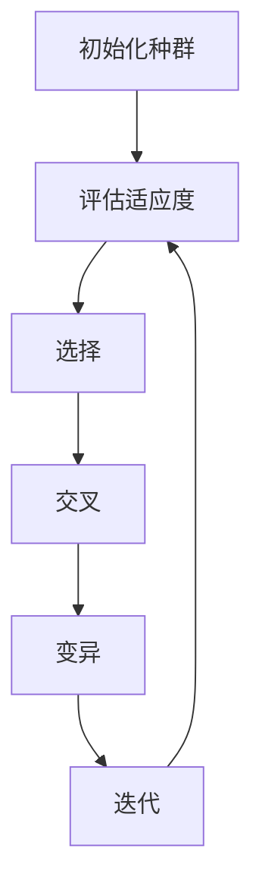

# 大语言模型应用指南：无梯度优化

## 1.背景介绍

大语言模型（Large Language Models, LLMs）近年来在自然语言处理（NLP）领域取得了显著的进展。它们在各种任务中表现出色，如文本生成、翻译、问答系统等。然而，训练这些模型通常需要大量的计算资源和时间，主要原因是梯度下降法的计算复杂度。本文将探讨一种新兴的优化方法——无梯度优化（Gradient-Free Optimization），并展示其在大语言模型中的应用潜力。

## 2.核心概念与联系

### 2.1 大语言模型

大语言模型是基于深度学习的模型，通常使用数十亿甚至上百亿的参数来捕捉语言的复杂性。常见的大语言模型包括GPT-3、BERT等。

### 2.2 梯度下降法

梯度下降法是训练深度学习模型的主要优化方法。它通过计算损失函数相对于模型参数的梯度，逐步调整参数以最小化损失。

### 2.3 无梯度优化

无梯度优化是一种不依赖梯度信息的优化方法。它通过直接评估目标函数的值来指导参数调整，适用于梯度难以计算或不稳定的情况。

### 2.4 核心联系

无梯度优化在大语言模型中的应用主要体现在以下几个方面：
- **计算效率**：减少梯度计算的开销。
- **稳定性**：避免梯度爆炸或消失问题。
- **适用性**：适用于非连续或非光滑的损失函数。

## 3.核心算法原理具体操作步骤

### 3.1 无梯度优化算法概述

无梯度优化算法包括多种方法，如遗传算法、粒子群优化、模拟退火等。本文将重点介绍遗传算法在大语言模型中的应用。

### 3.2 遗传算法步骤

1. **初始化种群**：随机生成一组模型参数。
2. **评估适应度**：计算每个个体的适应度，即模型在验证集上的表现。
3. **选择**：根据适应度选择优秀个体。
4. **交叉**：通过交叉操作生成新个体。
5. **变异**：对新个体进行随机变异。
6. **迭代**：重复上述步骤，直到满足终止条件。



## 4.数学模型和公式详细讲解举例说明

### 4.1 遗传算法数学模型

遗传算法的核心在于模拟自然选择和遗传变异。其数学模型可以表示为：

$$
P(t+1) = \text{Select}(\text{Mutate}(\text{Crossover}(P(t))))
$$

其中，$P(t)$ 表示第 $t$ 代的种群，$\text{Select}$、$\text{Mutate}$ 和 $\text{Crossover}$ 分别表示选择、变异和交叉操作。

### 4.2 适应度函数

适应度函数用于评估个体的优劣。对于大语言模型，可以使用验证集上的损失函数作为适应度函数：

$$
\text{Fitness}(x) = -\text{Loss}(x)
$$

其中，$x$ 表示模型参数，$\text{Loss}$ 表示验证集上的损失。

### 4.3 交叉和变异操作

交叉操作可以通过单点交叉、多点交叉等方式实现。变异操作则通过随机改变个体的部分参数来实现。

$$
\text{Crossover}(x_1, x_2) = (x_1[:k] + x_2[k:])
$$

$$
\text{Mutate}(x) = x + \epsilon
$$

其中，$k$ 是交叉点，$\epsilon$ 是随机噪声。

## 5.项目实践：代码实例和详细解释说明

### 5.1 环境准备

首先，确保安装了必要的Python库：

```bash
pip install numpy torch transformers
```

### 5.2 初始化种群

```python
import numpy as np

def initialize_population(size, param_shape):
    return [np.random.randn(*param_shape) for _ in range(size)]
```

### 5.3 评估适应度

```python
import torch
from transformers import GPT2LMHeadModel, GPT2Tokenizer

def evaluate_fitness(model_params, tokenizer, model, data):
    model.load_state_dict(model_params)
    model.eval()
    with torch.no_grad():
        inputs = tokenizer(data, return_tensors='pt')
        outputs = model(**inputs, labels=inputs['input_ids'])
        loss = outputs.loss.item()
    return -loss
```

### 5.4 选择、交叉和变异

```python
def select(population, fitnesses, num_select):
    selected_indices = np.argsort(fitnesses)[-num_select:]
    return [population[i] for i in selected_indices]

def crossover(parent1, parent2):
    crossover_point = np.random.randint(len(parent1))
    child = np.concatenate((parent1[:crossover_point], parent2[crossover_point:]))
    return child

def mutate(individual, mutation_rate=0.01):
    mutation = np.random.randn(*individual.shape) * mutation_rate
    return individual + mutation
```

### 5.5 迭代优化

```python
def genetic_algorithm(data, tokenizer, model, num_generations=100, population_size=50, num_select=10):
    param_shape = model.state_dict().values().shape
    population = initialize_population(population_size, param_shape)
    for generation in range(num_generations):
        fitnesses = [evaluate_fitness(params, tokenizer, model, data) for params in population]
        selected = select(population, fitnesses, num_select)
        new_population = []
        for i in range(population_size):
            parent1, parent2 = np.random.choice(selected, 2)
            child = crossover(parent1, parent2)
            child = mutate(child)
            new_population.append(child)
        population = new_population
    best_individual = select(population, fitnesses, 1)[0]
    return best_individual
```

## 6.实际应用场景

### 6.1 文本生成

无梯度优化可以用于优化文本生成模型的参数，以提高生成文本的质量。

### 6.2 机器翻译

在机器翻译任务中，无梯度优化可以帮助找到更优的模型参数，从而提高翻译的准确性。

### 6.3 问答系统

无梯度优化可以用于优化问答系统的参数，以提高回答的准确性和相关性。

## 7.工具和资源推荐

### 7.1 工具

- **NumPy**：用于数值计算。
- **PyTorch**：用于深度学习模型的构建和训练。
- **Transformers**：用于加载和使用预训练的大语言模型。

### 7.2 资源

- **论文**：阅读相关的研究论文，如《Genetic Algorithms in Machine Learning》。
- **开源项目**：参考开源项目，如Hugging Face的Transformers库。

## 8.总结：未来发展趋势与挑战

无梯度优化在大语言模型中的应用仍处于早期阶段，但其潜力巨大。未来的发展趋势包括：

- **算法改进**：开发更高效的无梯度优化算法。
- **混合方法**：结合梯度下降法和无梯度优化，发挥各自优势。
- **应用扩展**：探索无梯度优化在更多NLP任务中的应用。

然而，挑战也不容忽视，如计算资源的需求和算法的稳定性问题。

## 9.附录：常见问题与解答

### 9.1 无梯度优化是否适用于所有大语言模型？

无梯度优化适用于大多数大语言模型，但其效果取决于具体的任务和模型结构。

### 9.2 无梯度优化的计算开销如何？

无梯度优化通常需要更多的计算资源，因为它需要评估大量的个体。然而，通过并行计算可以显著提高效率。

### 9.3 如何选择适应度函数？

适应度函数应根据具体任务选择，通常使用验证集上的损失函数作为适应度函数。

### 9.4 无梯度优化是否可以完全替代梯度下降法？

无梯度优化和梯度下降法各有优缺点，通常可以结合使用，以发挥各自的优势。

---

作者：禅与计算机程序设计艺术 / Zen and the Art of Computer Programming