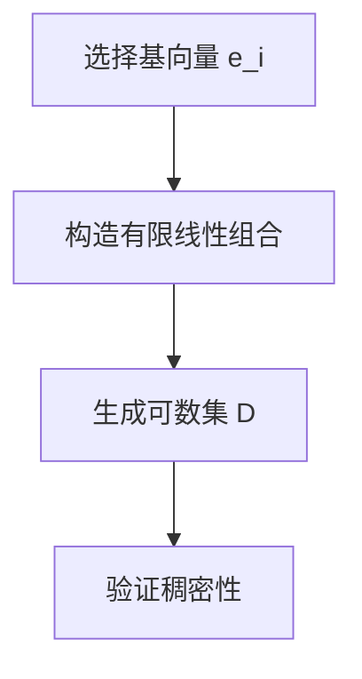

# 巴拿赫空间引论：空间的可分性

## 1.背景介绍

巴拿赫空间（Banach Space）是泛函分析中的一个重要概念，得名于波兰数学家斯特凡·巴拿赫。它是一个完备的赋范向量空间，广泛应用于数学、物理学和计算机科学等领域。巴拿赫空间的研究不仅有助于理解抽象数学理论，还能为实际问题提供解决方案。

在巴拿赫空间的研究中，空间的可分性是一个重要的性质。可分性指的是空间中存在一个可数的稠密子集。这个性质在许多应用中非常关键，例如在数值分析、信号处理和机器学习中。本文将深入探讨巴拿赫空间的可分性，介绍其核心概念、算法原理、数学模型、实际应用以及未来发展趋势。

## 2.核心概念与联系

### 2.1 巴拿赫空间的定义

巴拿赫空间是一个赋范向量空间，其中每个柯西序列都收敛于空间中的某个元素。形式化地说，一个向量空间 $X$ 配备了一个范数 $\| \cdot \|$，如果对于任意的柯西序列 $\{x_n\}$，存在 $x \in X$ 使得 $\|x_n - x\| \to 0$，则称 $X$ 是一个巴拿赫空间。

### 2.2 可分性

一个拓扑空间是可分的，如果存在一个可数的稠密子集。对于巴拿赫空间 $X$，如果存在一个可数集 $D \subset X$，使得 $D$ 在 $X$ 中稠密，即对于任意 $x \in X$ 和任意 $\epsilon > 0$，存在 $d \in D$ 使得 $\|x - d\| < \epsilon$，则称 $X$ 是可分的。

### 2.3 可分性与其他性质的联系

可分性与其他许多重要性质有密切联系。例如，可分空间中的每个紧子集都是可数的。此外，可分性在数值分析中也非常重要，因为它可以简化许多计算问题。

## 3.核心算法原理具体操作步骤

### 3.1 判定空间可分性的算法

判定一个巴拿赫空间是否可分，通常需要构造一个可数的稠密子集。以下是一个常见的算法步骤：

1. **选择基向量**：选择空间中的一组基向量 $\{e_i\}$。
2. **构造稠密子集**：通过有限线性组合构造一个可数集 $D$，例如 $D = \{\sum_{i=1}^n a_i e_i \mid a_i \in \mathbb{Q}, n \in \mathbb{N}\}$。
3. **验证稠密性**：验证 $D$ 是否在空间中稠密，即对于任意 $x \in X$ 和任意 $\epsilon > 0$，存在 $d \in D$ 使得 $\|x - d\| < \epsilon$。

### 3.2 示例算法

假设我们有一个巴拿赫空间 $X$，其基向量为 $\{e_i\}$。我们可以通过以下步骤构造一个可数的稠密子集：



## 4.数学模型和公式详细讲解举例说明

### 4.1 数学模型

设 $X$ 是一个巴拿赫空间，$\{e_i\}$ 是 $X$ 的一组基向量。我们可以构造一个可数集 $D$，使得 $D$ 在 $X$ 中稠密。具体地，$D$ 可以表示为：

$$
D = \left\{ \sum_{i=1}^n a_i e_i \mid a_i \in \mathbb{Q}, n \in \mathbb{N} \right\}
$$

### 4.2 举例说明

假设 $X = \ell^2$，即所有平方可和的序列构成的空间。其基向量为 $\{e_i\}$，其中 $e_i$ 是第 $i$ 个位置为 1，其余位置为 0 的序列。我们可以构造一个可数集 $D$：

$$
D = \left\{ \sum_{i=1}^n a_i e_i \mid a_i \in \mathbb{Q}, n \in \mathbb{N} \right\}
$$

验证 $D$ 在 $X$ 中稠密：对于任意 $x \in \ell^2$ 和任意 $\epsilon > 0$，存在 $d \in D$ 使得 $\|x - d\| < \epsilon$。具体地，设 $x = (x_1, x_2, \ldots)$，我们可以选择 $d = (d_1, d_2, \ldots)$，其中 $d_i \in \mathbb{Q}$ 且 $|x_i - d_i| < \epsilon / \sqrt{n}$，则有：

$$
\|x - d\| = \sqrt{\sum_{i=1}^n (x_i - d_i)^2} < \epsilon
$$

## 5.项目实践：代码实例和详细解释说明

### 5.1 Python代码示例

以下是一个简单的Python代码示例，用于验证 $\ell^2$ 空间的可分性：

```python
import numpy as np

def is_dense(x, D, epsilon):
    for d in D:
        if np.linalg.norm(x - d) < epsilon:
            return True
    return False

# 生成基向量
def generate_basis(n):
    basis = []
    for i in range(n):
        e = np.zeros(n)
        e[i] = 1
        basis.append(e)
    return basis

# 生成可数稠密子集
def generate_dense_set(basis, q_range):
    D = []
    for q in q_range:
        for b in basis:
            D.append(q * b)
    return D

# 示例
n = 3
epsilon = 0.1
x = np.array([1.0, 2.0, 3.0])
basis = generate_basis(n)
q_range = np.arange(-10, 10, 0.1)
D = generate_dense_set(basis, q_range)

print("Is dense:", is_dense(x, D, epsilon))
```

### 5.2 代码解释

1. **is_dense**：函数用于验证向量 $x$ 是否在集合 $D$ 的 $\epsilon$-邻域内。
2. **generate_basis**：函数生成 $\ell^2$ 空间的基向量。
3. **generate_dense_set**：函数生成可数稠密子集 $D$。
4. **示例**：生成 $\ell^2$ 空间的基向量和可数稠密子集，并验证向量 $x$ 是否在 $D$ 的 $\epsilon$-邻域内。

## 6.实际应用场景

### 6.1 数值分析

在数值分析中，许多问题可以通过将连续问题离散化来解决。可分空间的性质使得我们可以使用有限的计算资源来逼近无限维度的问题。例如，在有限元分析中，使用可数的基函数来逼近解。

### 6.2 信号处理

在信号处理领域，信号通常表示为函数空间中的元素。可分空间的性质使得我们可以使用有限的采样点来逼近信号，从而实现信号的压缩和重建。

### 6.3 机器学习

在机器学习中，许多算法依赖于空间的可分性。例如，支持向量机（SVM）通过寻找一个超平面来分离数据点，而数据点通常位于一个可分的特征空间中。

## 7.工具和资源推荐

### 7.1 工具

1. **NumPy**：用于数值计算的Python库，适合处理向量和矩阵运算。
2. **SciPy**：用于科学计算的Python库，提供了许多数学函数和算法。
3. **Matplotlib**：用于数据可视化的Python库，可以帮助我们绘制函数图像和数据分布。

### 7.2 资源

1. **《Functional Analysis》 by Walter Rudin**：一本经典的泛函分析教材，详细介绍了巴拿赫空间的理论。
2. **《Introduction to Hilbert Spaces with Applications》 by Lokenath Debnath and Piotr Mikusinski**：一本介绍希尔伯特空间及其应用的书籍，适合初学者。
3. **Coursera上的泛函分析课程**：提供了许多高质量的在线课程，适合自学。

## 8.总结：未来发展趋势与挑战

巴拿赫空间的研究在未来仍将是一个重要的研究方向。随着计算能力的提升和数据量的增加，如何在高维空间中进行有效的计算和分析将成为一个重要的挑战。可分空间的性质在许多应用中具有重要意义，例如在大数据分析、机器学习和量子计算中。

未来的研究可能会集中在以下几个方面：

1. **高维数据分析**：如何在高维空间中进行有效的计算和分析。
2. **量子计算**：如何利用巴拿赫空间的性质来设计高效的量子算法。
3. **机器学习**：如何利用可分空间的性质来提高算法的性能和稳定性。

## 9.附录：常见问题与解答

### 9.1 什么是巴拿赫空间？

巴拿赫空间是一个完备的赋范向量空间，其中每个柯西序列都收敛于空间中的某个元素。

### 9.2 什么是可分性？

可分性指的是空间中存在一个可数的稠密子集。对于巴拿赫空间 $X$，如果存在一个可数集 $D \subset X$，使得 $D$ 在 $X$ 中稠密，则称 $X$ 是可分的。

### 9.3 如何判定一个空间是否可分？

通常需要构造一个可数的稠密子集，并验证该子集在空间中是否稠密。

### 9.4 可分性在实际应用中有什么重要性？

可分性在数值分析、信号处理和机器学习中具有重要意义，因为它可以简化许多计算问题。

### 9.5 有哪些推荐的工具和资源？

推荐使用NumPy、SciPy和Matplotlib等工具进行数值计算和数据可视化。推荐阅读《Functional Analysis》和《Introduction to Hilbert Spaces with Applications》等书籍。

---

作者：禅与计算机程序设计艺术 / Zen and the Art of Computer Programming