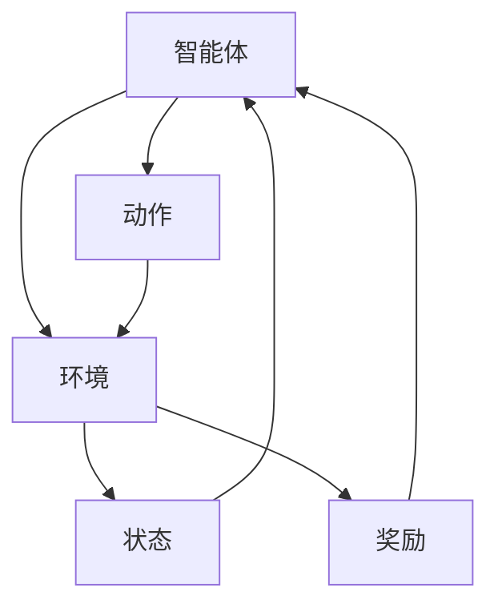

# 强化学习：利用软件模拟环境进行训练

## 1.背景介绍

强化学习（Reinforcement Learning, RL）是机器学习的一个重要分支，近年来在人工智能领域取得了显著的进展。与监督学习和无监督学习不同，强化学习通过与环境的交互来学习策略，以最大化累积奖励。RL在游戏、机器人控制、自动驾驶等领域展现了巨大的潜力。

在RL中，智能体（Agent）通过在环境（Environment）中采取行动（Action），根据环境反馈的奖励（Reward）来调整策略（Policy）。这种学习过程通常需要大量的训练数据和计算资源，因此，利用软件模拟环境进行训练成为一种高效且经济的选择。

## 2.核心概念与联系

### 2.1 智能体（Agent）

智能体是执行动作并从环境中获取反馈的实体。它的目标是通过不断地试探和学习，找到最优策略以最大化累积奖励。

### 2.2 环境（Environment）

环境是智能体所处的外部系统，它根据智能体的动作提供反馈。环境可以是物理世界中的实际场景，也可以是计算机模拟的虚拟环境。

### 2.3 状态（State）

状态是环境在某一时刻的描述。智能体通过观察状态来决定下一步的动作。

### 2.4 动作（Action）

动作是智能体在某一状态下采取的行为。不同的动作会导致环境状态的变化。

### 2.5 奖励（Reward）

奖励是环境对智能体动作的反馈，用于指导智能体的学习过程。奖励可以是正数（表示好的行为）或负数（表示不好的行为）。

### 2.6 策略（Policy）

策略是智能体在每个状态下选择动作的规则。策略可以是确定性的（Deterministic）或随机的（Stochastic）。

### 2.7 价值函数（Value Function）

价值函数用于评估某一状态或状态-动作对的好坏。常见的价值函数包括状态价值函数（V(s)）和动作价值函数（Q(s, a)）。

### 2.8 强化学习的基本框架



## 3.核心算法原理具体操作步骤

### 3.1 Q-Learning

Q-Learning是一种基于价值函数的强化学习算法。其核心思想是通过更新Q值来学习最优策略。

#### 3.1.1 算法步骤

1. 初始化Q值表
2. 重复以下步骤直到收敛：
   - 在当前状态s选择动作a
   - 执行动作a，观察奖励r和下一个状态s'
   - 更新Q值：$$ Q(s, a) \leftarrow Q(s, a) + \alpha [r + \gamma \max_{a'} Q(s', a') - Q(s, a)] $$
   - 将状态s更新为s'

### 3.2 深度Q网络（DQN）

DQN结合了深度学习和Q-Learning，通过神经网络来近似Q值函数。

#### 3.2.1 算法步骤

1. 初始化经验回放池和Q网络
2. 重复以下步骤直到收敛：
   - 在当前状态s选择动作a
   - 执行动作a，观察奖励r和下一个状态s'
   - 将经验(s, a, r, s')存入回放池
   - 从回放池中随机抽取小批量样本
   - 计算目标Q值：$$ y = r + \gamma \max_{a'} Q(s', a') $$
   - 最小化损失函数：$$ L = (y - Q(s, a))^2 $$

## 4.数学模型和公式详细讲解举例说明

### 4.1 马尔可夫决策过程（MDP）

强化学习问题通常可以建模为马尔可夫决策过程（Markov Decision Process, MDP）。MDP由五元组(S, A, P, R, γ)组成：

- S：状态空间
- A：动作空间
- P：状态转移概率矩阵
- R：奖励函数
- γ：折扣因子

### 4.2 贝尔曼方程

贝尔曼方程是强化学习中的核心公式，用于描述状态价值函数和动作价值函数。

#### 4.2.1 状态价值函数

$$ V(s) = \max_{a} \sum_{s'} P(s'|s, a) [R(s, a, s') + \gamma V(s')] $$

#### 4.2.2 动作价值函数

$$ Q(s, a) = \sum_{s'} P(s'|s, a) [R(s, a, s') + \gamma \max_{a'} Q(s', a')] $$

### 4.3 例子：迷宫问题

假设一个简单的迷宫问题，智能体需要从起点到达终点。状态空间S是迷宫中的每个位置，动作空间A是上下左右四个方向。奖励函数R定义为到达终点时获得正奖励，其他情况下获得负奖励。

通过Q-Learning算法，智能体可以逐步学习到最优路径。

## 5.项目实践：代码实例和详细解释说明

### 5.1 环境搭建

使用OpenAI Gym库来创建和管理模拟环境。

```python
import gym

env = gym.make('CartPole-v1')
state = env.reset()
```

### 5.2 Q-Learning实现

```python
import numpy as np

# 初始化Q值表
Q = np.zeros((env.observation_space.n, env.action_space.n))
alpha = 0.1
gamma = 0.99
epsilon = 0.1

for episode in range(1000):
    state = env.reset()
    done = False
    while not done:
        if np.random.rand() < epsilon:
            action = env.action_space.sample()
        else:
            action = np.argmax(Q[state])
        
        next_state, reward, done, _ = env.step(action)
        Q[state, action] += alpha * (reward + gamma * np.max(Q[next_state]) - Q[state, action])
        state = next_state
```

### 5.3 DQN实现

```python
import torch
import torch.nn as nn
import torch.optim as optim
import random
from collections import deque

class DQN(nn.Module):
    def __init__(self, state_dim, action_dim):
        super(DQN, self).__init__()
        self.fc1 = nn.Linear(state_dim, 24)
        self.fc2 = nn.Linear(24, 24)
        self.fc3 = nn.Linear(24, action_dim)
    
    def forward(self, x):
        x = torch.relu(self.fc1(x))
        x = torch.relu(self.fc2(x))
        return self.fc3(x)

# 初始化DQN和经验回放池
state_dim = env.observation_space.shape[0]
action_dim = env.action_space.n
dqn = DQN(state_dim, action_dim)
optimizer = optim.Adam(dqn.parameters())
memory = deque(maxlen=2000)
batch_size = 64

for episode in range(1000):
    state = env.reset()
    state = torch.FloatTensor(state)
    done = False
    while not done:
        if random.random() < epsilon:
            action = env.action_space.sample()
        else:
            action = torch.argmax(dqn(state)).item()
        
        next_state, reward, done, _ = env.step(action)
        next_state = torch.FloatTensor(next_state)
        memory.append((state, action, reward, next_state, done))
        state = next_state
        
        if len(memory) > batch_size:
            batch = random.sample(memory, batch_size)
            states, actions, rewards, next_states, dones = zip(*batch)
            states = torch.stack(states)
            actions = torch.LongTensor(actions)
            rewards = torch.FloatTensor(rewards)
            next_states = torch.stack(next_states)
            dones = torch.FloatTensor(dones)
            
            q_values = dqn(states).gather(1, actions.unsqueeze(1)).squeeze(1)
            next_q_values = dqn(next_states).max(1)[0]
            target_q_values = rewards + gamma * next_q_values * (1 - dones)
            
            loss = (q_values - target_q_values.detach()).pow(2).mean()
            optimizer.zero_grad()
            loss.backward()
            optimizer.step()
```

## 6.实际应用场景

### 6.1 游戏AI

强化学习在游戏AI中有广泛应用，如AlphaGo、Dota 2等。通过模拟环境，智能体可以在虚拟世界中不断尝试和优化策略。

### 6.2 机器人控制

在机器人控制中，RL可以帮助机器人学习复杂的运动和操作任务，如抓取物体、行走等。

### 6.3 自动驾驶

自动驾驶汽车需要在复杂的交通环境中做出实时决策，RL可以通过模拟环境进行大量训练，提高决策的准确性和安全性。

### 6.4 金融交易

在金融市场中，RL可以用于优化交易策略，通过模拟市场环境进行训练，最大化投资回报。

## 7.工具和资源推荐

### 7.1 开源库

- OpenAI Gym：提供多种模拟环境，便于RL算法的开发和测试。
- TensorFlow和PyTorch：深度学习框架，支持DQN等深度强化学习算法的实现。

### 7.2 在线课程

- Coursera上的“深度强化学习”课程
- Udacity的“强化学习纳米学位”

### 7.3 书籍推荐

- 《强化学习：原理与实践》 by Richard S. Sutton and Andrew G. Barto
- 《深度强化学习》 by Aske Plaat

## 8.总结：未来发展趋势与挑战

强化学习在许多领域展现了巨大的潜力，但也面临一些挑战。未来的发展趋势包括：

### 8.1 更高效的算法

现有的RL算法在大规模环境中训练效率较低，未来需要开发更高效的算法。

### 8.2 更强的泛化能力

RL算法在训练环境中表现良好，但在新环境中的泛化能力有限。提高算法的泛化能力是一个重要的研究方向。

### 8.3 安全性和可靠性

在自动驾驶等关键应用中，RL算法的安全性和可靠性至关重要。未来需要更多的研究来确保RL算法在实际应用中的安全性。

## 9.附录：常见问题与解答

### 9.1 强化学习与监督学习的区别是什么？

强化学习通过与环境的交互来学习策略，而监督学习通过已标注的数据进行训练。RL注重长期累积奖励，而监督学习注重单次预测的准确性。

### 9.2 如何选择合适的模拟环境？

选择模拟环境时，应考虑环境的复杂性、训练时间和计算资源。OpenAI Gym提供了多种环境，适合不同的RL任务。

### 9.3 如何调试和优化RL算法？

调试和优化RL算法可以从以下几个方面入手：
- 调整超参数，如学习率、折扣因子等
- 增加训练数据和训练时间
- 使用更复杂的模型，如深度神经网络

### 9.4 强化学习在实际应用中有哪些挑战？

实际应用中的挑战包括：
- 训练时间长，计算资源消耗大
- 环境复杂，难以建模
- 安全性和可靠性要求高

作者：禅与计算机程序设计艺术 / Zen and the Art of Computer Programming