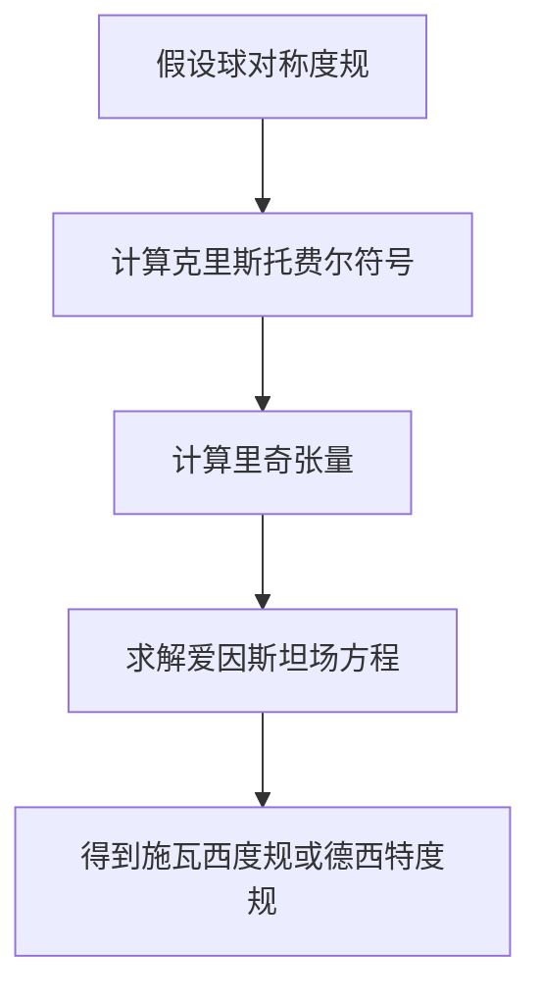

# 微分几何入门与广义相对论：施瓦西.德西特时空

## 1.背景介绍

微分几何和广义相对论是现代物理学和数学的重要分支。微分几何提供了研究曲面和流形的工具，而广义相对论则是爱因斯坦提出的描述引力的理论。施瓦西解和德西特解是广义相对论中两个重要的解，它们分别描述了静态球对称的真空解和具有宇宙常数的真空解。

### 1.1 微分几何的基本概念

微分几何是研究曲面和流形的数学分支。它利用微积分和线性代数的工具来研究几何对象的局部性质和整体结构。微分几何的基本概念包括流形、切空间、联络和曲率等。

### 1.2 广义相对论的基本概念

广义相对论是爱因斯坦于1915年提出的引力理论。它将引力描述为时空的弯曲，而不是传统的力。广义相对论的基本方程是爱因斯坦场方程，它描述了时空的几何性质与物质和能量的分布之间的关系。

### 1.3 施瓦西解和德西特解

施瓦西解是广义相对论中描述静态球对称真空解的一个重要解。它描述了一个不旋转、无电荷的球对称天体的外部时空。德西特解则是描述具有宇宙常数的真空解，它在宇宙学中具有重要意义。

## 2.核心概念与联系

在深入探讨施瓦西解和德西特解之前，我们需要理解一些核心概念和它们之间的联系。

### 2.1 流形与度量

流形是微分几何中的基本对象，它是一个局部类似于欧几里得空间的拓扑空间。度量是定义在流形上的一个对称、非退化的双线性形式，它用于测量流形上的距离和角度。

### 2.2 曲率与联络

曲率是描述流形弯曲程度的一个量。联络是定义在流形上的一个工具，它用于定义平行移动和测量曲率。曲率张量是由联络导出的一个重要张量，它描述了流形的局部几何性质。

### 2.3 爱因斯坦场方程

爱因斯坦场方程是广义相对论的基本方程，它描述了时空的几何性质与物质和能量的分布之间的关系。场方程的形式为：

$$
G_{\mu\nu} + \Lambda g_{\mu\nu} = \frac{8\pi G}{c^4} T_{\mu\nu}
$$

其中，$G_{\mu\nu}$ 是爱因斯坦张量，$\Lambda$ 是宇宙常数，$g_{\mu\nu}$ 是度量张量，$T_{\mu\nu}$ 是能量-动量张量。

### 2.4 施瓦西度规与德西特度规

施瓦西度规是描述静态球对称真空解的度规，其形式为：

$$
ds^2 = -\left(1 - \frac{2GM}{c^2r}\right)c^2dt^2 + \left(1 - \frac{2GM}{c^2r}\right)^{-1}dr^2 + r^2(d\theta^2 + \sin^2\theta d\phi^2)
$$

德西特度规是描述具有宇宙常数的真空解的度规，其形式为：

$$
ds^2 = -\left(1 - \frac{\Lambda r^2}{3}\right)c^2dt^2 + \left(1 - \frac{\Lambda r^2}{3}\right)^{-1}dr^2 + r^2(d\theta^2 + \sin^2\theta d\phi^2)
$$

## 3.核心算法原理具体操作步骤

在理解了核心概念之后，我们可以进一步探讨施瓦西解和德西特解的具体计算步骤。

### 3.1 施瓦西解的推导

施瓦西解是通过求解爱因斯坦场方程得到的。具体步骤如下：

1. **假设球对称度规**：假设度规具有球对称形式。
2. **计算克里斯托费尔符号**：利用度规计算克里斯托费尔符号。
3. **计算里奇张量**：利用克里斯托费尔符号计算里奇张量。
4. **求解爱因斯坦场方程**：将里奇张量代入爱因斯坦场方程，求解得到施瓦西度规。

### 3.2 德西特解的推导

德西特解的推导类似于施瓦西解，但需要考虑宇宙常数。具体步骤如下：

1. **假设球对称度规**：假设度规具有球对称形式。
2. **计算克里斯托费尔符号**：利用度规计算克里斯托费尔符号。
3. **计算里奇张量**：利用克里斯托费尔符号计算里奇张量。
4. **求解爱因斯坦场方程**：将里奇张量代入带有宇宙常数的爱因斯坦场方程，求解得到德西特度规。

### 3.3 计算步骤的Mermaid流程图



## 4.数学模型和公式详细讲解举例说明

在这一部分，我们将详细讲解施瓦西解和德西特解的数学模型和公式，并通过具体例子说明。

### 4.1 施瓦西解的数学模型

施瓦西解的度规为：

$$
ds^2 = -\left(1 - \frac{2GM}{c^2r}\right)c^2dt^2 + \left(1 - \frac{2GM}{c^2r}\right)^{-1}dr^2 + r^2(d\theta^2 + \sin^2\theta d\phi^2)
$$

其中，$G$ 是引力常数，$M$ 是天体的质量，$c$ 是光速，$r$ 是径向坐标，$t$ 是时间坐标，$\theta$ 和 $\phi$ 是球坐标。

### 4.2 德西特解的数学模型

德西特解的度规为：

$$
ds^2 = -\left(1 - \frac{\Lambda r^2}{3}\right)c^2dt^2 + \left(1 - \frac{\Lambda r^2}{3}\right)^{-1}dr^2 + r^2(d\theta^2 + \sin^2\theta d\phi^2)
$$

其中，$\Lambda$ 是宇宙常数，其他符号与施瓦西解相同。

### 4.3 具体例子说明

假设我们有一个质量为 $M = 10^{30}$ kg 的天体，我们可以计算其施瓦西半径：

$$
r_s = \frac{2GM}{c^2}
$$

将 $G = 6.674 \times 10^{-11}$ m$^3$kg$^{-1}$s$^{-2}$ 和 $c = 3 \times 10^8$ m/s 代入，得到：

$$
r_s = \frac{2 \times 6.674 \times 10^{-11} \times 10^{30}}{(3 \times 10^8)^2} \approx 1.48 \times 10^3 \text{ m}
$$

这意味着该天体的施瓦西半径约为 1.48 公里。

## 5.项目实践：代码实例和详细解释说明

为了更好地理解施瓦西解和德西特解，我们可以通过编写代码来进行实际计算和模拟。

### 5.1 施瓦西解的代码实例

以下是一个使用 Python 计算施瓦西半径的简单示例：

```python
import math

def schwarzschild_radius(mass):
    G = 6.674 * 10**-11  # 引力常数
    c = 3 * 10**8  # 光速
    return 2 * G * mass / c**2

mass = 10**30  # 天体质量
radius = schwarzschild_radius(mass)
print(f"施瓦西半径: {radius} 米")
```

### 5.2 德西特解的代码实例

以下是一个使用 Python 计算德西特度规的简单示例：

```python
import numpy as np

def de_sitter_metric(r, Lambda):
    c = 3 * 10**8  # 光速
    return - (1 - Lambda * r**2 / 3) * c**2

r = 1.0  # 径向坐标
Lambda = 1.0e-52  # 宇宙常数
metric = de_sitter_metric(r, Lambda)
print(f"德西特度规: {metric} 米^2")
```

### 5.3 代码解释

在施瓦西解的代码中，我们定义了一个函数 `schwarzschild_radius` 来计算施瓦西半径。我们使用引力常数 $G$ 和光速 $c$，并将天体的质量作为输入参数。

在德西特解的代码中，我们定义了一个函数 `de_sitter_metric` 来计算德西特度规。我们使用光速 $c$ 和宇宙常数 $\Lambda$，并将径向坐标 $r$ 作为输入参数。

## 6.实际应用场景

施瓦西解和德西特解在物理学和天文学中具有重要的应用。

### 6.1 黑洞

施瓦西解是描述黑洞外部时空的一个重要解。黑洞是具有极强引力的天体，连光也无法逃脱。施瓦西半径是黑洞的事件视界，即光无法逃脱的边界。

### 6.2 宇宙学

德西特解在宇宙学中具有重要意义。它描述了具有宇宙常数的真空解，适用于描述膨胀的宇宙。宇宙常数 $\Lambda$ 与暗能量有关，暗能量是驱动宇宙加速膨胀的神秘能量。

### 6.3 引力波

施瓦西解和德西特解在引力波研究中也具有重要应用。引力波是时空的涟漪，由加速运动的质量产生。通过研究施瓦西解和德西特解，我们可以更好地理解引力波的性质和传播。

## 7.工具和资源推荐

为了更好地学习和研究施瓦西解和德西特解，我们可以利用一些工具和资源。

### 7.1 计算工具

- **Mathematica**：强大的数学计算工具，适用于符号计算和数值计算。
- **Python**：广泛使用的编程语言，具有丰富的科学计算库，如 NumPy 和 SciPy。

### 7.2 学习资源

- **《广义相对论基础》**：经典的广义相对论教材，适合初学者。
- **《微分几何与广义相对论》**：深入探讨微分几何和广义相对论的关系，适合进阶学习。

### 7.3 在线资源

- **arXiv**：预印本服务器，提供大量最新的物理学和数学论文。
- **YouTube**：许多优秀的教育频道提供广义相对论和微分几何的讲解视频。

## 8.总结：未来发展趋势与挑战

施瓦西解和德西特解是广义相对论中两个重要的解，它们在物理学和天文学中具有广泛的应用。未来，随着观测技术的进步和理论研究的深入，我们将能够更好地理解黑洞、宇宙膨胀和引力波等现象。

### 8.1 未来发展趋势

- **引力波探测**：引力波探测技术的进步将为我们提供更多关于黑洞和宇宙膨胀的信息。
- **暗能量研究**：暗能量是驱动宇宙加速膨胀的神秘能量，未来的研究将揭示其本质。
- **量子引力**：量子引力理论是将广义相对论与量子力学结合的理论，未来的研究将揭示时空的量子性质。

### 8.2 挑战

- **数学复杂性**：广义相对论和微分几何的数学复杂性是一个重要挑战，需要深入的数学知识。
- **观测技术**：高精度的观测技术是研究黑洞和宇宙膨胀的关键，需要不断的技术创新。
- **理论统一**：将广义相对论与量子力学统一起来是物理学的一个重大挑战，需要新的理论突破。

## 9.附录：常见问题与解答

### 9.1 什么是施瓦西半径？

施瓦西半径是描述黑洞事件视界的一个重要量。它是一个不旋转、无电荷的球对称天体的引力半径，光无法逃脱该半径内的引力。

### 9.2 什么是宇宙常数？

宇宙常数是爱因斯坦场方程中的一个常数项，表示真空能量密度。它与暗能量有关，驱动宇宙加速膨胀。

### 9.3 施瓦西解和德西特解的区别是什么？

施瓦西解描述的是静态球对称的真空解，适用于描述黑洞外部时空。德西特解描述的是具有宇宙常数的真空解，适用于描述膨胀的宇宙。

### 9.4 如何计算施瓦西半径？

施瓦西半径的计算公式为：

$$
r_s = \frac{2GM}{c^2}
$$

其中，$G$ 是引力常数，$M$ 是天体的质量，$c$ 是光速。

### 9.5 如何理解德西特度规？

德西特度规描述了具有宇宙常数的真空解，其形式为：

$$
ds^2 = -\left(1 - \frac{\Lambda r^2}{3}\right)c^2dt^2 + \left(1 - \frac{\Lambda r^2}{3}\right)^{-1}dr^2 + r^2(d\theta^2 + \sin^2\theta d\phi^2)
$$

其中，$\Lambda$ 是宇宙常数，$r$ 是径向坐标，$t$ 是时间坐标，$\theta$ 和 $\phi$ 是球坐标。

---

作者：禅与计算机程序设计艺术 / Zen and the Art of Computer Programming