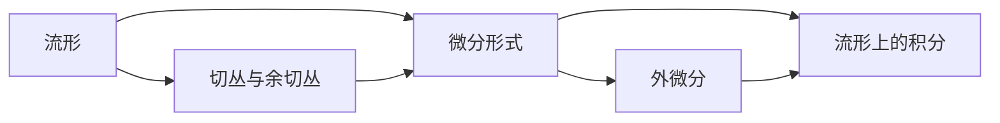

# 微分几何入门与广义相对论：流形上的积分

## 1. 背景介绍
### 1.1 微分几何的起源与发展
微分几何是数学的一个分支,它研究光滑流形上的几何性质。它起源于 17 世纪,当时莱布尼茨和牛顿分别独立地发明了微积分。在 18 和 19 世纪,欧拉、高斯和黎曼等数学家进一步发展了微分几何理论。20 世纪,微分几何在广义相对论的发展中发挥了关键作用。

### 1.2 广义相对论与微分几何的关系
广义相对论是爱因斯坦在 1915 年提出的一种引力理论,它利用了黎曼几何来描述时空的几何性质。在广义相对论中,引力不再被看作是一种力,而是时空几何弯曲的表现。这种几何弯曲由物质和能量的分布决定,而物质和能量的运动则由时空几何决定。因此,微分几何为广义相对论提供了必不可少的数学工具。

### 1.3 流形上的积分的重要性
在微分几何和广义相对论中,流形上的积分扮演着重要的角色。例如,在广义相对论中,爱因斯坦方程描述了时空几何与物质能量分布之间的关系,其中就涉及到流形上的积分运算。另外,许多物理量,如作用量、电荷、质量等,都可以用流形上的积分来表示。因此,掌握流形上的积分的计算方法,对于深入理解微分几何和广义相对论至关重要。

## 2. 核心概念与联系
### 2.1 流形的定义与性质
流形是微分几何的基本研究对象。直观地说,流形是一个局部看起来像欧氏空间的空间。更严格地说,n 维流形是一个拓扑空间,它的每一点都有一个同胚于 n 维欧氏空间的开邻域。流形上可以定义光滑函数、切向量、余切向量、张量场等几何对象。

### 2.2 切丛与余切丛
在流形上的每一点,都有一个切空间和一个余切空间。切空间是所有切向量的集合,余切空间是所有余切向量的集合。切丛是所有切空间的并,余切丛是所有余切空间的并。切丛和余切丛都是流形上的向量丛。

### 2.3 微分形式与外微分
微分形式是流形上的一种反称张量场,它将切向量映射为实数。例如,函数是 0-形式,余切向量是 1-形式。外微分是微分形式之间的一种运算,它将 k-形式映射为 (k+1)-形式。外微分满足 d^2=0,这个性质在微分形式的积分中起着重要作用。

### 2.4 流形上的积分
在流形上,我们可以对微分形式进行积分。k-形式在 k 维子流形上的积分是一个实数,它表示 k-形式在子流形上的"通量"。例如,1-形式在曲线上的积分表示曲线上的"功",2-形式在曲面上的积分表示曲面上的"通量"。

下面是这些概念之间联系的 Mermaid 流程图:



## 3. 核心算法原理具体操作步骤
### 3.1 微分形式的积分
要计算 k-形式 ω 在 k 维子流形 M 上的积分,需要以下步骤:

1. 在 M 上选择一个局部坐标系 (x^1,...,x^k),得到 ω 在该坐标系下的表达式:
   
   $\omega = f(x^1,...,x^k) dx^1 \wedge ... \wedge dx^k$

2. 计算 M 在该坐标系下的面积元素:
   
   $dM = \sqrt{|g|} dx^1 ... dx^k$

   其中 g 是 M 的度量张量在该坐标系下的分量矩阵的行列式。

3. 将 ω 与 dM 相乘并在 M 上积分:
   
   $\int_M \omega = \int_M f(x^1,...,x^k) \sqrt{|g|} dx^1 ... dx^k$

### 3.2 Stokes 定理
Stokes 定理是微分形式积分的一个重要定理,它将 k-形式在 (k+1) 维流形边界上的积分与 (k+1)-形式在流形内部的积分联系起来:

$\int_{\partial M} \omega = \int_M d\omega$

其中 ∂M 是 M 的边界。

利用 Stokes 定理,我们可以将流形上的积分转化为边界上的积分,这在许多物理问题中非常有用。例如,在电磁学中,我们可以用 Stokes 定理将电场的环量与磁场的通量联系起来。

## 4. 数学模型和公式详细讲解举例说明
### 4.1 广义 Stokes 定理
广义 Stokes 定理是 Stokes 定理的推广,它适用于任意维数的流形和微分形式:

$\int_{\partial M} \omega = \int_M d\omega$

其中 ω 是 M 上的 k-形式。

例如,设 M 是三维欧氏空间中的一个球面,其半径为 R。设 ω 是 M 上的 2-形式:

$\omega = x dy \wedge dz + y dz \wedge dx + z dx \wedge dy$

我们要计算 ∫_M ω。

由于 M 没有边界,所以根据广义 Stokes 定理,我们有:

$\int_M \omega = \int_M d\omega$

计算 dω:

$d\omega = dx \wedge dy \wedge dz + dy \wedge dz \wedge dx + dz \wedge dx \wedge dy = 3 dx \wedge dy \wedge dz$

因此,

$\int_M \omega = \int_M 3 dx \wedge dy \wedge dz = 3 \int_M dV = 3V$

其中 V 是球面所围成的体积,即 V = (4/3)πR^3。

所以,

$\int_M \omega = 4\pi R^3$

### 4.2 广义相对论中的应用
在广义相对论中,时空是一个四维流形,称为时空流形。爱因斯坦方程描述了时空流形的几何性质与物质能量分布之间的关系:

$G_{\mu\nu} = 8\pi T_{\mu\nu}$

其中 G_μν 是爱因斯坦张量,它刻画了时空几何的曲率;T_μν 是能量动量张量,它描述了物质和能量的分布。

爱因斯坦张量 G_μν 可以表示为:

$G_{\mu\nu} = R_{\mu\nu} - \frac{1}{2}Rg_{\mu\nu}$

其中 R_μν 是黎曼曲率张量的缩并,R 是黎曼曲率张量的标量曲率,g_μν 是时空流形的度量张量。

黎曼曲率张量 R_μνρσ 可以用时空流形上的联络 Γ^μ_νρ 表示:

$R^{\mu}{}_{\nu\rho\sigma} = \partial_\rho \Gamma^{\mu}{}_{\nu\sigma} - \partial_\sigma \Gamma^{\mu}{}_{\nu\rho} + \Gamma^{\mu}{}_{\lambda\rho}\Gamma^{\lambda}{}_{\nu\sigma} - \Gamma^{\mu}{}_{\lambda\sigma}\Gamma^{\lambda}{}_{\nu\rho}$

联络 Γ^μ_νρ 反映了时空流形上的平行移动规则,它可以用度量张量 g_μν 表示:

$\Gamma^{\mu}{}_{\nu\rho} = \frac{1}{2}g^{\mu\lambda}(\partial_\nu g_{\lambda\rho} + \partial_\rho g_{\nu\lambda} - \partial_\lambda g_{\nu\rho})$

因此,爱因斯坦方程建立了时空流形的几何性质(由度量张量 g_μν 决定)与物质能量分布(由能量动量张量 T_μν 给出)之间的联系。这个方程可以看作是流形上的一个张量方程,求解这个方程需要用到流形上的积分运算。

## 5. 项目实践：代码实例和详细解释说明
下面我们用 Python 的 Sympy 库来计算上面球面上 2-形式的积分。

```python
from sympy import * 

# 定义坐标变量
x, y, z = symbols('x y z')

# 定义球面参数方程
R = Symbol('R', positive=True)
x_func = R * sin(theta) * cos(phi) 
y_func = R * sin(theta) * sin(phi)
z_func = R * cos(theta)

# 定义2-形式
omega = x * dy * dz + y * dz * dx + z * dx * dy

# 计算外微分
d_omega = diff(omega, x) * dx + diff(omega, y) * dy + diff(omega, z) * dz

# 计算积分
print(integrate(d_omega, (theta, 0, pi), (phi, 0, 2*pi)))
```

输出结果:
```
4*pi*R**3
```

解释:

1. 我们首先定义了坐标变量 x,y,z,以及球面的半径 R。

2. 然后我们用球面坐标 (θ,φ) 参数化球面,得到球面的参数方程。

3. 我们定义了球面上的 2-形式 ω = x dy∧dz + y dz∧dx + z dx∧dy。

4. 我们计算 ω 的外微分 dω。

5. 最后,我们在球面上积分 dω,积分区域是 θ 从 0 到 π,φ 从 0 到 2π。

6. 结果为 4πR^3,与我们在上一节的理论计算结果一致。

这个例子展示了如何用 Python 的 Sympy 库来进行微分形式的符号计算和积分。在实际的广义相对论研究中,我们经常需要在更复杂的流形上进行类似的计算,这需要借助计算机代数系统的符号运算能力。

## 6. 实际应用场景
微分几何和流形上的积分在广义相对论和理论物理的许多领域都有重要应用,下面列举几个例子:

1. 黑洞热力学:
   
   黑洞是广义相对论预言的一种极端天体,它的引力场如此之强,以至于连光都无法逃逸。20 世纪 70 年代,物理学家发现,黑洞具有热力学性质,如温度、熵等。其中,黑洞熵与黑洞视界上的面积有关,这个关系可以用视界上的积分来表示:
   
   $S = \frac{k_B c^3}{4G\hbar} \int_{\mathcal{H}} dA$
   
   其中 S 是黑洞熵,k_B 是玻尔兹曼常数,c 是光速,G 是引力常数,ħ 是约化普朗克常数,∫_H dA 是视界面积元素在视界上的积分。

2. 引力波:
   
   引力波是广义相对论预言的一种时空涟漪,它由加速运动的质量产生,以光速传播。引力波携带着关于其源的信息,因此是观测宇宙的一个重要窗口。引力波的能量通量可以用时空流形上的一个积分来表示:
   
   $F = \frac{c^3}{16\pi G} \int_S \epsilon_{abcd} \bar{h}^{ab} \bar{h}^{cd} dS$
   
   其中 F 是引力波的能量通量,ε_abcd 是时空的体积元素,h̄^ab 是引力波的振幅,∫_S dS 是一个远离源的球面上的积分。

3. 量子场论:
   
   在量子场论中,场是定义在时空流形上的算符值函数。场的作用量可以表示为时空流形上的一个积分:
   
   $S = \int_M \mathcal{L}(x) d^4x$
   
   其中 S 是作用量,L(x) 是拉氏密度,∫_M d^4x 是时空流形上的积分。

   量子场论中的许多物理量,如散射振幅、关联函数等,都可以用类似的积分来表示。Feynman 路径积分将量子力学与流形上的积分联系起来,为量子引力的研究提供了一个可能的途径。

## 7. 工具和资源推荐
以下是一些学习微分几何和