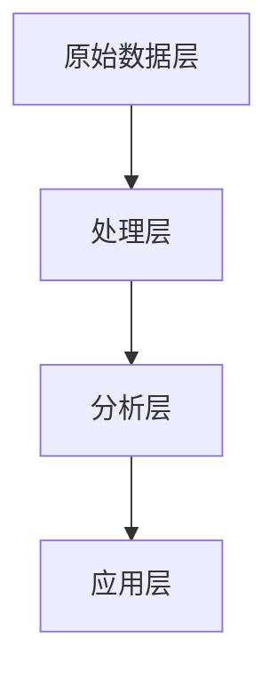

# 数据湖 原理与代码实例讲解

## 1.背景介绍

在大数据时代，数据的爆炸性增长使得传统的数据存储和处理方式面临巨大的挑战。数据湖（Data Lake）作为一种新兴的数据管理架构，能够有效地解决这些问题。数据湖允许企业以原始格式存储大量的结构化和非结构化数据，并提供灵活的数据处理和分析能力。

数据湖的概念最早由James Dixon提出，他将其描述为一个可以存储所有数据的中央存储库。与传统的数据仓库不同，数据湖不需要在数据进入之前进行严格的结构化处理，这使得数据湖在处理多样化和大规模数据时具有显著优势。

## 2.核心概念与联系

### 2.1 数据湖的定义

数据湖是一个存储大量原始数据的中央存储库，这些数据可以是结构化、半结构化或非结构化的。数据湖的核心理念是“存储一切”，即将所有数据以原始格式存储，以便在需要时进行处理和分析。

### 2.2 数据湖与数据仓库的区别

数据湖与数据仓库在数据存储和处理方式上有显著区别：

- **数据存储**：数据湖存储原始数据，而数据仓库存储经过处理和结构化的数据。
- **数据处理**：数据湖在数据进入时不进行严格的结构化处理，而数据仓库在数据进入前需要进行ETL（Extract, Transform, Load）处理。
- **数据类型**：数据湖可以存储各种类型的数据，包括结构化、半结构化和非结构化数据，而数据仓库主要存储结构化数据。

### 2.3 数据湖的核心组件

数据湖的核心组件包括：

- **数据存储**：用于存储原始数据的存储系统，如Hadoop HDFS、Amazon S3等。
- **数据处理**：用于处理和分析数据的计算引擎，如Apache Spark、Presto等。
- **数据管理**：用于管理数据的元数据管理系统，如Apache Atlas、AWS Glue等。
- **数据安全**：用于保护数据的安全机制，如数据加密、访问控制等。

### 2.4 数据湖的架构

数据湖的架构通常包括以下几个层次：

- **原始数据层**：存储原始数据的层次。
- **处理层**：用于数据清洗、转换和处理的层次。
- **分析层**：用于数据分析和查询的层次。
- **应用层**：用于数据应用和展示的层次。

以下是数据湖架构的Mermaid流程图：



## 3.核心算法原理具体操作步骤

### 3.1 数据导入

数据湖的第一步是将数据导入到存储系统中。数据可以来自各种来源，如数据库、日志文件、传感器数据等。导入数据时，可以使用批处理或流处理的方式。

### 3.2 数据清洗

导入的数据通常包含噪声和错误，需要进行清洗。数据清洗的步骤包括：

- **去重**：删除重复的数据。
- **填补缺失值**：处理数据中的缺失值。
- **数据转换**：将数据转换为统一的格式。

### 3.3 数据处理

清洗后的数据需要进行处理，以便进行后续的分析。数据处理的步骤包括：

- **数据聚合**：将数据按一定规则进行聚合。
- **数据过滤**：根据条件过滤数据。
- **数据转换**：将数据转换为分析所需的格式。

### 3.4 数据分析

处理后的数据可以进行分析，以获取有价值的信息。数据分析的步骤包括：

- **数据查询**：使用SQL或其他查询语言查询数据。
- **数据挖掘**：使用机器学习算法挖掘数据中的模式和规律。
- **数据可视化**：将数据以图表的形式展示。

## 4.数学模型和公式详细讲解举例说明

### 4.1 数据聚合

数据聚合是将数据按一定规则进行汇总的过程。常见的聚合操作包括求和、平均值、最大值、最小值等。假设我们有一个包含销售数据的表格，我们可以使用以下公式计算总销售额：

$$
\text{总销售额} = \sum_{i=1}^{n} \text{销售额}_i
$$

### 4.2 数据过滤

数据过滤是根据条件筛选数据的过程。假设我们有一个包含用户数据的表格，我们可以使用以下公式筛选出年龄大于30岁的用户：

$$
\text{筛选条件} = \{ \text{用户} \mid \text{年龄} > 30 \}
$$

### 4.3 数据转换

数据转换是将数据从一种格式转换为另一种格式的过程。假设我们有一个包含温度数据的表格，我们可以使用以下公式将摄氏温度转换为华氏温度：

$$
\text{华氏温度} = \text{摄氏温度} \times \frac{9}{5} + 32
$$

### 4.4 数据挖掘

数据挖掘是使用机器学习算法挖掘数据中的模式和规律的过程。假设我们有一个包含用户购买行为的数据集，我们可以使用以下公式计算用户的购买概率：

$$
P(\text{购买}) = \frac{\text{购买次数}}{\text{总访问次数}}
$$

## 5.项目实践：代码实例和详细解释说明

### 5.1 数据导入

以下是使用Python和Pandas库导入数据的示例代码：

```python
import pandas as pd

# 从CSV文件导入数据
data = pd.read_csv('data.csv')

# 显示数据的前五行
print(data.head())
```

### 5.2 数据清洗

以下是使用Python和Pandas库进行数据清洗的示例代码：

```python
# 删除重复的数据
data = data.drop_duplicates()

# 填补缺失值
data = data.fillna(method='ffill')

# 数据转换
data['date'] = pd.to_datetime(data['date'])
```

### 5.3 数据处理

以下是使用Python和Pandas库进行数据处理的示例代码：

```python
# 数据聚合
total_sales = data['sales'].sum()

# 数据过滤
filtered_data = data[data['age'] > 30]

# 数据转换
data['temperature_f'] = data['temperature_c'] * 9/5 + 32
```

### 5.4 数据分析

以下是使用Python和Pandas库进行数据分析的示例代码：

```python
# 数据查询
query_result = data.query('age > 30')

# 数据挖掘
purchase_probability = data['purchase'].sum() / data['visit'].count()

# 数据可视化
import matplotlib.pyplot as plt

data['sales'].plot(kind='bar')
plt.show()
```

## 6.实际应用场景

### 6.1 电子商务

在电子商务领域，数据湖可以用于存储和分析用户行为数据、销售数据、库存数据等。通过数据湖，企业可以实时监控销售情况，优化库存管理，并根据用户行为数据进行个性化推荐。

### 6.2 金融服务

在金融服务领域，数据湖可以用于存储和分析交易数据、客户数据、市场数据等。通过数据湖，金融机构可以进行风险管理、欺诈检测、客户分析等。

### 6.3 医疗健康

在医疗健康领域，数据湖可以用于存储和分析患者数据、医疗记录、基因数据等。通过数据湖，医疗机构可以进行疾病预测、个性化治疗、公共卫生监测等。

### 6.4 物联网

在物联网领域，数据湖可以用于存储和分析传感器数据、设备数据、日志数据等。通过数据湖，企业可以进行设备监控、故障预测、能效优化等。

## 7.工具和资源推荐

### 7.1 数据存储工具

- **Hadoop HDFS**：一个分布式文件系统，适用于大规模数据存储。
- **Amazon S3**：一个云存储服务，适用于存储和检索任意数量的数据。

### 7.2 数据处理工具

- **Apache Spark**：一个快速、通用的分布式数据处理引擎，适用于大规模数据处理。
- **Presto**：一个分布式SQL查询引擎，适用于大规模数据查询。

### 7.3 数据管理工具

- **Apache Atlas**：一个数据治理和元数据管理工具，适用于数据湖的元数据管理。
- **AWS Glue**：一个完全托管的ETL服务，适用于数据湖的数据管理。

### 7.4 数据安全工具

- **Apache Ranger**：一个数据安全管理工具，适用于数据湖的访问控制和审计。
- **AWS KMS**：一个密钥管理服务，适用于数据湖的数据加密。

## 8.总结：未来发展趋势与挑战

### 8.1 未来发展趋势

- **多云数据湖**：随着云计算的发展，多云数据湖将成为一种趋势，企业可以在多个云平台上构建数据湖，以实现数据的跨平台存储和处理。
- **智能数据湖**：随着人工智能的发展，智能数据湖将成为一种趋势，企业可以利用人工智能技术对数据湖中的数据进行智能分析和处理。
- **实时数据湖**：随着物联网和实时数据处理技术的发展，实时数据湖将成为一种趋势，企业可以实时处理和分析数据湖中的数据。

### 8.2 挑战

- **数据治理**：数据湖中的数据量巨大，数据治理是一个重要的挑战。企业需要建立有效的数据治理机制，以确保数据的质量和一致性。
- **数据安全**：数据湖中的数据涉及敏感信息，数据安全是一个重要的挑战。企业需要建立有效的数据安全机制，以保护数据的安全。
- **数据整合**：数据湖中的数据来源多样，数据整合是一个重要的挑战。企业需要建立有效的数据整合机制，以实现数据的统一管理和处理。

## 9.附录：常见问题与解答

### 9.1 数据湖与数据仓库可以共存吗？

是的，数据湖和数据仓库可以共存。数据湖适用于存储和处理原始数据，而数据仓库适用于存储和分析结构化数据。企业可以将数据湖和数据仓库结合使用，以实现数据的全面管理和分析。

### 9.2 如何选择合适的数据湖存储工具？

选择合适的数据湖存储工具需要考虑以下因素：

- **数据量**：数据量大的情况下，可以选择Hadoop HDFS或Amazon S3。
- **数据类型**：需要存储多种类型的数据时，可以选择支持多种数据类型的存储工具。
- **成本**：需要考虑存储工具的成本，选择性价比高的存储工具。

### 9.3 如何确保数据湖中的数据安全？

确保数据湖中的数据安全需要采取以下措施：

- **数据加密**：对数据进行加密，以保护数据的安全。
- **访问控制**：建立严格的访问控制机制，以防止未经授权的访问。
- **审计**：对数据的访问和操作进行审计，以发现和防止安全问题。

### 9.4 数据湖的性能如何优化？

优化数据湖的性能需要采取以下措施：

- **数据分区**：对数据进行分区，以提高数据的访问和处理速度。
- **索引**：对数据建立索引，以提高数据的查询速度。
- **缓存**：使用缓存技术，以提高数据的访问速度。

### 9.5 数据湖的元数据管理如何实现？

实现数据湖的元数据管理需要使用元数据管理工具，如Apache Atlas或AWS Glue。这些工具可以帮助企业管理数据湖中的元数据，包括数据的来源、结构、质量等信息。

---

作者：禅与计算机程序设计艺术 / Zen and the Art of Computer Programming