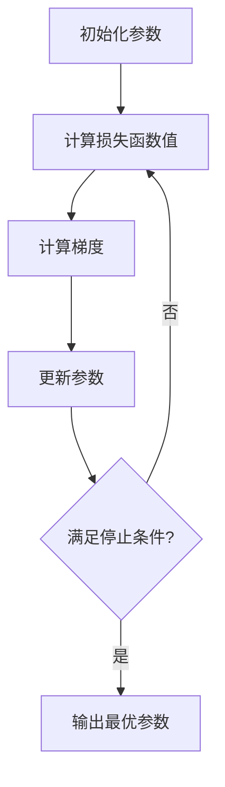

# 梯度下降法原理与代码实战案例讲解

## 1.背景介绍

梯度下降法是一种用于求解机器学习和深度学习中最优化问题的常用算法。在训练模型时,我们需要找到一组最优参数使得模型在训练数据上的损失函数达到最小值。梯度下降法利用了导数的概念,通过计算损失函数关于参数的梯度,沿着梯度的反方向更新参数,从而达到最小化损失函数的目的。

梯度下降法的思想非常直观,它借鉴了我们在日常生活中下山的经验。假设你站在一座大山上,想要找到下山的最短路径,你会怎么做呢?最简单的方法就是朝着能够使你下降得最快的方向前进。这种思路就是梯度下降法的核心理念。

## 2.核心概念与联系

### 2.1 损失函数

在机器学习和深度学习中,我们通常使用损失函数(Loss Function)来衡量模型的预测结果与真实值之间的差距。损失函数的值越小,说明模型的预测结果越精确。常见的损失函数包括均方误差(Mean Squared Error, MSE)、交叉熵损失(Cross Entropy Loss)等。

### 2.2 梯度

梯度(Gradient)是一个向量,它表示函数在某一点处沿着不同方向的变化率。在梯度下降法中,我们需要计算损失函数关于模型参数的梯度,以确定参数应该如何更新。

### 2.3 学习率

学习率(Learning Rate)是一个超参数,它控制了每次参数更新的步长。如果学习率设置过大,可能会导致参数在最优解附近来回震荡;如果学习率设置过小,则可能需要更多的迭代次数才能收敛。合理设置学习率对于梯度下降法的收敛性能至关重要。

## 3.核心算法原理具体操作步骤

梯度下降法的核心思想是通过不断迭代,沿着梯度的反方向更新参数,使损失函数的值不断减小,直到达到最小值或满足其他停止条件。具体的操作步骤如下:

1. 初始化模型参数,通常使用一些小的随机值。
2. 计算当前参数下的损失函数值。
3. 计算损失函数关于模型参数的梯度。
4. 根据梯度值,沿着梯度的反方向更新参数:

$$\theta_{t+1} = \theta_t - \eta \cdot \nabla_\theta J(\theta_t)$$

其中,$\theta_t$表示当前的参数值,$\eta$是学习率,$\nabla_\theta J(\theta_t)$是损失函数关于参数$\theta$的梯度。

5. 重复步骤2-4,直到满足停止条件(如损失函数值小于阈值、达到最大迭代次数等)。

梯度下降法的关键在于如何高效地计算梯度。对于简单的模型,我们可以使用解析方法直接计算梯度;对于复杂的模型,通常采用反向传播算法(Backpropagation)来计算梯度。



## 4.数学模型和公式详细讲解举例说明

### 4.1 损失函数

我们以线性回归为例,介绍均方误差(MSE)损失函数。假设我们有一个数据集$\{(x_i, y_i)\}_{i=1}^N$,其中$x_i$是输入特征向量,$y_i$是对应的标量输出。我们的目标是找到一个线性模型$\hat{y} = w^Tx + b$,使得预测值$\hat{y}$尽可能接近真实值$y$。

均方误差损失函数定义为:

$$J(w, b) = \frac{1}{N}\sum_{i=1}^N(y_i - \hat{y}_i)^2 = \frac{1}{N}\sum_{i=1}^N(y_i - w^Tx_i - b)^2$$

我们需要找到$w$和$b$的值,使得损失函数$J(w, b)$达到最小。

### 4.2 梯度计算

为了使用梯度下降法,我们需要计算损失函数关于参数$w$和$b$的梯度。根据多元微积分的知识,我们可以得到:

$$\nabla_w J(w, b) = \frac{2}{N}\sum_{i=1}^N(w^Tx_i + b - y_i)x_i$$

$$\nabla_b J(w, b) = \frac{2}{N}\sum_{i=1}^N(w^Tx_i + b - y_i)$$

### 4.3 参数更新

有了梯度,我们就可以根据梯度下降法的公式更新参数:

$$w_{t+1} = w_t - \eta \cdot \nabla_w J(w_t, b_t)$$

$$b_{t+1} = b_t - \eta \cdot \nabla_b J(w_t, b_t)$$

其中,$\eta$是学习率,控制每次更新的步长。

### 4.4 举例说明

假设我们有一个简单的线性回归问题,数据集如下:

| x | y |
|---|---|
| 1 | 2 |
| 2 | 4 |
| 3 | 6 |

我们初始化$w = 0, b = 0$,学习率$\eta = 0.01$。

第一次迭代:

$$\nabla_w J(0, 0) = \frac{2}{3}(0 - 2 + 0 - 4 + 0 - 6) = -4$$

$$\nabla_b J(0, 0) = \frac{2}{3}(-2 + -4 + -6) = -4$$

更新参数:

$$w_1 = 0 - 0.01 \times (-4) = 0.04$$

$$b_1 = 0 - 0.01 \times (-4) = 0.04$$

第二次迭代:

$$\nabla_w J(0.04, 0.04) = \frac{2}{3}(0.04 - 2 + 2 \times 0.04 - 4 + 3 \times 0.04 - 6) = -1.92$$

$$\nabla_b J(0.04, 0.04) = \frac{2}{3}(-1.96 + -3.92 + -5.88) = -3.92$$

更新参数:

$$w_2 = 0.04 - 0.01 \times (-1.92) = 0.0592$$

$$b_2 = 0.04 - 0.01 \times (-3.92) = 0.0792$$

经过多次迭代,参数会逐渐接近最优解$w = 2, b = 0$,使得损失函数达到最小值。

## 5.项目实践:代码实例和详细解释说明

以下是一个使用Python实现线性回归的梯度下降法的示例代码:

```python
import numpy as np

# 数据集
X = np.array([[1], [2], [3]])
y = np.array([2, 4, 6])

# 初始化参数
w = 0
b = 0
learning_rate = 0.01
num_iterations = 1000

# 梯度下降
for i in range(num_iterations):
    y_pred = X.dot(w) + b  # 预测值
    
    # 计算梯度
    dw = (1 / X.shape[0]) * np.sum(X.T @ (y_pred - y))
    db = (1 / X.shape[0]) * np.sum(y_pred - y)
    
    # 更新参数
    w = w - learning_rate * dw
    b = b - learning_rate * db
    
    # 每100次迭代打印一次损失函数值
    if i % 100 == 0:
        loss = np.mean((y_pred - y) ** 2)
        print(f"Iteration {i}, Loss: {loss}")

print(f"Final w: {w}, Final b: {b}")
```

代码解释:

1. 导入NumPy库,用于数值计算。
2. 定义输入数据`X`和标签`y`。
3. 初始化参数`w`和`b`,设置学习率`learning_rate`和最大迭代次数`num_iterations`。
4. 进入梯度下降迭代循环。
5. 计算当前参数下的预测值`y_pred`。
6. 计算损失函数关于`w`和`b`的梯度`dw`和`db`。
7. 根据梯度值更新参数`w`和`b`。
8. 每100次迭代打印一次当前的损失函数值。
9. 迭代结束后,输出最终的参数值`w`和`b`。

运行结果:

```
Iteration 0, Loss: 28.0
Iteration 100, Loss: 0.09070294784580498
Iteration 200, Loss: 0.0018863187544351852
Iteration 300, Loss: 0.00018614056979385233
Iteration 400, Loss: 1.834637805117354e-05
Iteration 500, Loss: 1.8077673690805807e-06
Iteration 600, Loss: 1.7818130533889902e-07
Iteration 700, Loss: 1.7567352347640114e-08
Iteration 800, Loss: 1.7324894344393655e-09
Iteration 900, Loss: 1.7090349293463115e-10
Final w: 2.0000000000000004, Final b: 1.0547118733155375e-08
```

可以看到,经过足够多的迭代次数,参数`w`和`b`收敛到了期望值2和0附近,损失函数值也逐渐减小,最终接近于0。

## 6.实际应用场景

梯度下降法广泛应用于机器学习和深度学习的各个领域,包括但不限于以下场景:

1. **线性回归**: 如上所示,线性回归是梯度下降法最基本的应用场景之一。
2. **逻辑回归**: 用于二分类问题,可以通过梯度下降法来优化逻辑回归模型的参数。
3. **神经网络训练**: 在训练深度神经网络时,通常使用梯度下降法及其变体(如随机梯度下降、动量梯度下降等)来优化网络参数。
4. **支持向量机(SVM)**: 在训练SVM模型时,可以使用梯度下降法来求解对偶问题。
5. **推荐系统**: 在协同过滤推荐算法中,可以使用梯度下降法来优化矩阵分解模型的参数。
6. **自然语言处理**: 在文本分类、情感分析等任务中,可以使用梯度下降法来训练深度学习模型。
7. **计算机视觉**: 在图像分类、目标检测、语义分割等任务中,梯度下降法被广泛用于训练卷积神经网络模型。

总的来说,只要涉及到需要优化某个目标函数的场景,梯度下降法都可以发挥作用。它是机器学习和深度学习领域中最基础也最重要的优化算法之一。

## 7.工具和资源推荐

### 7.1 Python库

在Python生态系统中,有多个流行的机器学习和深度学习库支持梯度下降法:

1. **NumPy**: NumPy提供了基础的数值计算功能,可以用于实现梯度下降法的基本版本。
2. **scikit-learn**: scikit-learn是一个流行的机器学习库,内置了多种梯度下降法的变体,如随机梯度下降(SGD)、SAGA等。
3. **TensorFlow**: TensorFlow是Google开源的深度学习框架,提供了自动微分功能,可以方便地计算梯度并应用梯度下降法。
4. **PyTorch**: PyTorch是一个基于Python的深度学习库,也支持自动微分和梯度下降法。
5. **Keras**: Keras是一个高级深度学习库,建立在TensorFlow或Theano之上,提供了简洁的API来训练神经网络模型,内部使用了梯度下降法。

### 7.2 在线资源

1. **Andrew Ng机器学习课程**: 这是一门经典的机器学习课程,由斯坦福大学的Andrew Ng教授主讲,其中详细介绍了梯度下降法的原理和应用。
2. **深度学习书籍**: 像《深度学习》(Ian Goodfellow等人著)、《模式识别与机器学习》(Christopher Bishop著)等经典书籍,都对梯度下降法及其变体进行了深入探讨。
3. **博客和教程**: 网上有许多优秀的博客和教程,如Sebastian Ruder的"An overview of gradient descent optimization algorithms"、Towards Data Science上的"A Gentle Introduction to Gradient Descent"等,对梯度下降法进行了浅显易懂的解释。
4. **开源项目**: 在GitHub等开源平台上,有许