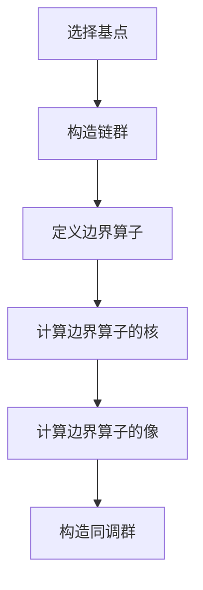

# 流形拓扑学理论与概念的实质：上同调群

## 1.背景介绍

流形拓扑学是数学中一个重要的分支，研究流形的拓扑性质。流形是局部类似于欧几里得空间的空间，但在全局上可能具有复杂的结构。上同调群是流形拓扑学中的一个核心概念，用于描述流形的拓扑性质。本文将深入探讨流形拓扑学中的上同调群，解释其核心概念、算法原理、数学模型，并通过实际项目实例展示其应用。

## 2.核心概念与联系

### 2.1 流形

流形是一个局部类似于欧几里得空间的空间。具体来说，一个 $n$ 维流形是一个在每一点附近都类似于 $n$ 维欧几里得空间的空间。流形的例子包括曲线、曲面以及更高维的空间。

### 2.2 拓扑学

拓扑学是研究空间在连续变换下保持不变的性质的数学分支。拓扑学中的基本概念包括开集、闭集、连通性、紧致性等。

### 2.3 上同调群

上同调群是拓扑学中的一个重要工具，用于描述空间的拓扑性质。上同调群通过代数结构（如群和环）来捕捉空间的拓扑信息。具体来说，上同调群是通过构造链复形并计算其同调群得到的。

### 2.4 核心联系

流形、拓扑学和上同调群之间的联系在于，上同调群提供了一种代数方法来研究流形的拓扑性质。通过计算流形的上同调群，我们可以获得关于流形的连通性、孔洞结构等重要信息。

## 3.核心算法原理具体操作步骤

### 3.1 链复形的构造

链复形是由一系列链群和边界算子组成的代数结构。构造链复形的步骤如下：

1. **选择基点**：选择流形上的一组基点。
2. **构造链群**：对于每个维度 $k$，构造 $k$-链群 $C_k$，其元素是 $k$-单纯形的形式和。
3. **定义边界算子**：定义边界算子 $\partial_k: C_k \to C_{k-1}$，将 $k$-单纯形映射到其边界。

### 3.2 同调群的计算

同调群是通过计算链复形的边界算子的核和像得到的。具体步骤如下：

1. **计算边界算子的核**：计算每个链群的边界算子的核，即满足 $\partial_k c = 0$ 的 $k$-链 $c$ 的集合，记为 $Z_k$。
2. **计算边界算子的像**：计算每个链群的边界算子的像，即存在 $c' \in C_{k+1}$ 使得 $\partial_{k+1} c' = c$ 的 $k$-链 $c$ 的集合，记为 $B_k$。
3. **构造同调群**：同调群 $H_k$ 定义为 $Z_k / B_k$，即 $k$-链群的边界算子核与像的商群。

### 3.3 算法流程图



## 4.数学模型和公式详细讲解举例说明

### 4.1 链复形的数学定义

设 $X$ 是一个流形，$C_k(X)$ 表示 $X$ 上的 $k$-链群。$k$-链是 $k$-单纯形的形式和，可以表示为：

$$
c = \sum_{i} a_i \sigma_i
$$

其中，$a_i$ 是系数，$\sigma_i$ 是 $k$-单纯形。

### 4.2 边界算子

边界算子 $\partial_k: C_k(X) \to C_{k-1}(X)$ 定义为：

$$
\partial_k \sigma = \sum_{j=0}^{k} (-1)^j [v_0, \ldots, \hat{v_j}, \ldots, v_k]
$$

其中，$[v_0, \ldots, \hat{v_j}, \ldots, v_k]$ 表示去掉第 $j$ 个顶点后的 $(k-1)$-单纯形。

### 4.3 同调群

$k$-同调群 $H_k(X)$ 定义为：

$$
H_k(X) = \frac{\ker(\partial_k)}{\text{im}(\partial_{k+1})}
$$

其中，$\ker(\partial_k)$ 表示 $k$-链群的边界算子的核，$\text{im}(\partial_{k+1})$ 表示 $(k+1)$-链群的边界算子的像。

### 4.4 举例说明

考虑一个简单的例子：二维球面 $S^2$。$S^2$ 的同调群如下：

- $H_0(S^2) \cong \mathbb{Z}$：表示球面是连通的。
- $H_1(S^2) = 0$：表示球面没有一维孔洞。
- $H_2(S^2) \cong \mathbb{Z}$：表示球面有一个二维孔洞。

## 5.项目实践：代码实例和详细解释说明

### 5.1 Python 实现链复形和同调群计算

以下是一个简单的 Python 代码示例，用于计算二维球面 $S^2$ 的同调群。

```python
import numpy as np

class Simplex:
    def __init__(self, vertices):
        self.vertices = tuple(sorted(vertices))

    def __hash__(self):
        return hash(self.vertices)

    def __eq__(self, other):
        return self.vertices == other.vertices

def boundary(simplex):
    n = len(simplex.vertices)
    boundaries = []
    for i in range(n):
        boundary_vertices = simplex.vertices[:i] + simplex.vertices[i+1:]
        boundaries.append(Simplex(boundary_vertices))
    return boundaries

def chain_complex(simplices):
    max_dim = max(len(s.vertices) for s in simplices) - 1
    chain_groups = {k: [] for k in range(max_dim + 1)}
    for simplex in simplices:
        chain_groups[len(simplex.vertices) - 1].append(simplex)
    return chain_groups

def compute_homology(chain_groups):
    homology_groups = {}
    for k in chain_groups:
        boundaries = []
        for simplex in chain_groups[k]:
            boundaries.extend(boundary(simplex))
        boundaries = set(boundaries)
        homology_groups[k] = len(chain_groups[k]) - len(boundaries)
    return homology_groups

# 定义二维球面的单纯形
simplices = [
    Simplex([0]), Simplex([1]), Simplex([2]),
    Simplex([0, 1]), Simplex([1, 2]), Simplex([2, 0]),
    Simplex([0, 1, 2])
]

# 构造链复形
chain_groups = chain_complex(simplices)

# 计算同调群
homology_groups = compute_homology(chain_groups)

print("同调群:", homology_groups)
```

### 5.2 代码解释

1. **Simplex 类**：表示单纯形，包含顶点的集合。
2. **boundary 函数**：计算单纯形的边界。
3. **chain_complex 函数**：构造链复形。
4. **compute_homology 函数**：计算同调群。

## 6.实际应用场景

### 6.1 数据分析与机器学习

上同调群在数据分析和机器学习中有广泛的应用。例如，拓扑数据分析（TDA）利用上同调群来分析数据的拓扑结构，识别数据中的模式和特征。

### 6.2 计算机图形学

在计算机图形学中，上同调群用于分析和处理三维模型的拓扑结构。例如，检测模型中的孔洞、连通分量等。

### 6.3 物理学与材料科学

上同调群在物理学和材料科学中用于研究物质的拓扑性质。例如，拓扑绝缘体的研究利用上同调群来描述其电子结构的拓扑性质。

## 7.工具和资源推荐

### 7.1 软件工具

- **Python**：用于实现链复形和同调群计算的编程语言。
- **Matplotlib**：用于可视化拓扑数据分析结果的绘图库。
- **GUDHI**：一个用于拓扑数据分析的 Python 库，提供了计算同调群的功能。

### 7.2 参考书籍

- 《Algebraic Topology》 by Allen Hatcher
- 《Topology and Geometry》 by Glen E. Bredon
- 《Computational Topology: An Introduction》 by Herbert Edelsbrunner and John Harer

### 7.3 在线资源

- [Topology Atlas](http://at.yorku.ca/topology/)
- [Homology Theory](https://en.wikipedia.org/wiki/Homology_(mathematics))

## 8.总结：未来发展趋势与挑战

### 8.1 未来发展趋势

随着计算能力的提升和数据量的增加，拓扑数据分析和上同调群的应用前景广阔。未来，可能会有更多的算法和工具被开发出来，以更高效地计算和应用上同调群。

### 8.2 挑战

尽管上同调群在许多领域有广泛的应用，但其计算复杂度和数据规模仍然是一个挑战。如何在大规模数据集上高效地计算上同调群，以及如何将其应用于实际问题，是未来研究的重点。

## 9.附录：常见问题与解答

### 9.1 什么是上同调群？

上同调群是拓扑学中的一个重要工具，用于描述空间的拓扑性质。通过计算链复形的边界算子的核和像得到。

### 9.2 如何计算上同调群？

计算上同调群的步骤包括构造链复形、定义边界算子、计算边界算子的核和像，并构造同调群。

### 9.3 上同调群有哪些实际应用？

上同调群在数据分析、机器学习、计算机图形学、物理学和材料科学等领域有广泛的应用。

### 9.4 有哪些推荐的工具和资源？

推荐的工具包括 Python、Matplotlib 和 GUDHI。推荐的参考书籍包括《Algebraic Topology》、《Topology and Geometry》和《Computational Topology: An Introduction》。

---

作者：禅与计算机程序设计艺术 / Zen and the Art of Computer Programming