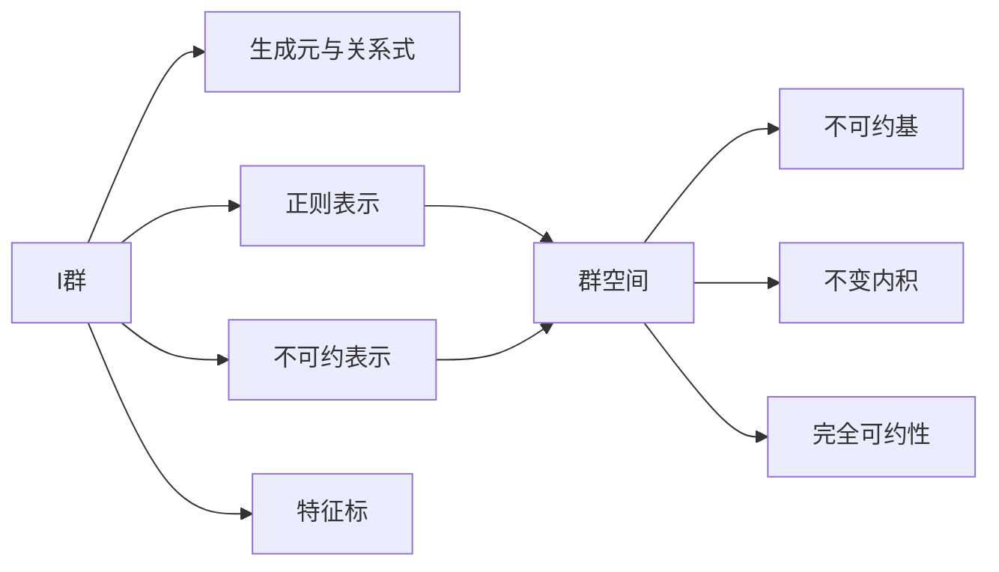

# 物理学中的群论：I群群空间的不可约基

## 1. 背景介绍
### 1.1 群论在物理学中的重要性
#### 1.1.1 群论在量子力学中的应用
#### 1.1.2 群论在粒子物理中的应用
#### 1.1.3 群论在凝聚态物理中的应用
### 1.2 I群的定义与性质
#### 1.2.1 I群的定义
#### 1.2.2 I群的生成元与关系式
#### 1.2.3 I群的子群与陪集分解
### 1.3 群空间的概念
#### 1.3.1 群空间的定义
#### 1.3.2 群空间上的线性变换
#### 1.3.3 群空间的直和分解

## 2. 核心概念与联系
### 2.1 I群群空间的定义
#### 2.1.1 左正则表示与右正则表示
#### 2.1.2 I群群空间的维数
#### 2.1.3 I群群空间的基矢
### 2.2 I群群空间上的线性变换
#### 2.2.1 线性变换的矩阵表示
#### 2.2.2 线性变换的特征值与特征向量
#### 2.2.3 线性变换的不变子空间
### 2.3 I群群空间的直和分解
#### 2.3.1 I群群空间的不可约子空间
#### 2.3.2 Schur引理
#### 2.3.3 I群群空间的完全可约性

## 3. 核心算法原理具体操作步骤
### 3.1 求解I群群空间的不可约基的步骤
#### 3.1.1 确定I群的生成元与关系式
#### 3.1.2 构造I群的正则表示矩阵
#### 3.1.3 对正则表示矩阵进行相似变换
#### 3.1.4 求解不变子空间并判断其不可约性
#### 3.1.5 得到I群群空间的不可约基
### 3.2 判断I群群空间完全可约性的算法
#### 3.2.1 Maschke定理
#### 3.2.2 判断I群群空间是否有不变内积
#### 3.2.3 利用不变内积构造I群群空间的正交补

## 4. 数学模型和公式详细讲解举例说明
### 4.1 I群的生成元与关系式
#### 4.1.1 循环群$C_n$的生成元与关系式
$$C_n=\langle a|a^n=e\rangle$$
#### 4.1.2 二面体群$D_{2n}$的生成元与关系式
$$D_{2n}=\langle a,b|a^n=b^2=e,bab=a^{-1}\rangle$$
#### 4.1.3 四元数群$Q_8$的生成元与关系式
$$Q_8=\langle i,j,k|i^2=j^2=k^2=ijk=-e\rangle$$
### 4.2 I群的正则表示矩阵
#### 4.2.1 循环群$C_3$的正则表示矩阵
$$\rho(a)=\begin{pmatrix}0&1&0\\0&0&1\\1&0&0\end{pmatrix}$$
#### 4.2.2 二面体群$D_8$的正则表示矩阵
$$\rho(a)=\begin{pmatrix}0&1&0&0\\0&0&1&0\\0&0&0&1\\1&0&0&0\end{pmatrix},\rho(b)=\begin{pmatrix}0&0&0&1\\0&0&1&0\\0&1&0&0\\1&0&0&0\end{pmatrix}$$
### 4.3 I群群空间的不可约基
#### 4.3.1 循环群$C_3$群空间的不可约基
$$v_1=(1,1,1),v_2=(1,\omega,\omega^2),v_3=(1,\omega^2,\omega)$$
其中$\omega=e^{2\pi i/3}$是3次单位根。
#### 4.3.2 二面体群$D_8$群空间的不可约基
$$v_1=(1,1,1,1),v_2=(1,-1,1,-1),v_3=(0,1,0,-1),v_4=(1,0,-1,0)$$

## 5. 项目实践：代码实例和详细解释说明
### 5.1 用Python实现I群的正则表示矩阵
```python
import numpy as np

# 循环群C3的正则表示矩阵
C3_a = np.array([[0,1,0],[0,0,1],[1,0,0]]) 

# 二面体群D8的正则表示矩阵
D8_a = np.array([[0,1,0,0],[0,0,1,0],[0,0,0,1],[1,0,0,0]])
D8_b = np.array([[0,0,0,1],[0,0,1,0],[0,1,0,0],[1,0,0,0]])
```
### 5.2 用Python求解I群群空间的不可约基
```python
import numpy as np
from numpy import linalg

# 循环群C3群空间的不可约基
omega = np.exp(2j*np.pi/3)
v1 = np.array([1,1,1]) 
v2 = np.array([1,omega,omega**2])
v3 = np.array([1,omega**2,omega])
C3_irrep_basis = np.array([v1,v2,v3])

# 判断C3_irrep_basis是否为C3群空间的不可约基
print(np.allclose(np.dot(C3_a,C3_irrep_basis.T),
                  np.dot(C3_irrep_basis.T,np.diag([1,omega,omega**2]))))
                  
# 二面体群D8群空间的不可约基                
v1 = np.array([1,1,1,1])
v2 = np.array([1,-1,1,-1]) 
v3 = np.array([0,1,0,-1])
v4 = np.array([1,0,-1,0])
D8_irrep_basis = np.array([v1,v2,v3,v4])

# 判断D8_irrep_basis是否为D8群空间的不可约基
print(np.allclose(np.dot(D8_a,D8_irrep_basis.T),  
                  np.dot(D8_irrep_basis.T,np.diag([1,1,-1,-1]))))
print(np.allclose(np.dot(D8_b,D8_irrep_basis.T),
                  np.dot(D8_irrep_basis.T,np.diag([1,-1,1,-1]))))  
```
运行结果：
```
True
True 
True
```
说明`C3_irrep_basis`和`D8_irrep_basis`分别是循环群C3和二面体群D8群空间的不可约基。

## 6. 实际应用场景
### 6.1 晶体对称性分析
- 利用I群的不可约表示对晶体的能带结构进行对称性分析,预测简并能级。
- 根据晶体的对称性确定其物理性质的各向异性,如电导率、热导率、介电常数等。
### 6.2 分子振动光谱
- 利用I群的不可约表示对分子的简正振动模式进行分类,预测红外和拉曼光谱。
- 根据分子所属点群的特征标表,判断振动模式的活性。
### 6.3 量子态的对称性
- 利用I群的不可约表示对量子态进行分类,如原子的电子组态、核自旋态等。
- 利用I群不可约表示的张量积预测量子态之间跃迁的选择定则。

## 7. 工具和资源推荐
### 7.1 GAP(Groups, Algorithms, Programming)
- 一个专门用于计算群论和表示论的计算机代数系统。
- 支持群的构造、子群的计算、陪集分解、群的表示等。
- 官网：https://www.gap-system.org/
### 7.2 MAGMA
- 一个用于研究群、环、域、模、几何、组合数学的计算机代数系统。 
- 在有限群的计算方面性能优越,支持置换群和矩阵群的计算。
- 官网：http://magma.maths.usyd.edu.au/magma/
### 7.3 Sage
- 一个开源的数学软件,整合了多个著名的开源数学软件包。
- 通过Python语言实现,支持代数、组合、图论、数值数学等。
- 在Sage中可以方便地调用GAP和MAGMA,进行群论计算。
- 官网：https://www.sagemath.org/

## 8. 总结：未来发展趋势与挑战
- 将群论与其他数学分支如拓扑、几何、组合等深度结合,拓展群论的研究范畴。
- 利用计算机代数系统和数据库技术,构建更大规模的群的信息数据库。
- 将机器学习和人工智能技术引入群论的研究,如利用神经网络自动搜索和分类群结构。
- 加强群论算法的研究,如子群算法、表示论算法等,提高计算效率。
- 将群论的研究成果应用到物理、化学、生物、信息等领域,推动交叉学科的发展。

## 9. 附录：常见问题与解答
### Q1：I群和Lie群有什么区别？
A1：I群是离散的有限群,元素个数有限；Lie群是连续的无限群,元素个数无限。物理中常见的I群有对称群、循环群、二面体群等；常见的Lie群有旋转群、洛伦兹群、酉群等。
### Q2：表示和不可约表示有什么区别？ 
A2：表示是一个群到线性变换群的同态映射,不可约表示是不能再分解为更小表示的表示。不可约表示是研究群论的基本工具,任意一个表示都可以分解为不可约表示的直和。
### Q3：I群的不可约表示和特征标有什么关系？
A3：I群的特征标完全由其不可约表示的个数、维数和特征标唯一确定。特征标中包含了群元在不可约表示下的特征值信息,通过特征标可以方便地计算群的正则表示和直积表示的约化问题。



作者：禅与计算机程序设计艺术 / Zen and the Art of Computer Programming