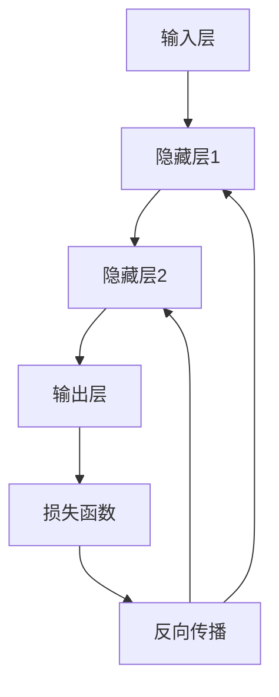

# 神经网络(Neural Networks) - 原理与代码实例讲解

## 1.背景介绍

神经网络（Neural Networks）作为人工智能和机器学习领域的核心技术，已经在多个领域取得了显著的成果。从图像识别、自然语言处理到自动驾驶，神经网络的应用无处不在。本文将深入探讨神经网络的原理、算法、数学模型，并通过代码实例进行详细讲解，帮助读者全面理解这一重要技术。

## 2.核心概念与联系

### 2.1 神经元与感知器

神经网络的基本构建单元是神经元（Neuron），其灵感来源于生物神经元。一个神经元接收多个输入信号，通过加权求和和激活函数处理后，输出一个信号。感知器（Perceptron）是最简单的神经元模型。

### 2.2 层与网络结构

神经网络由多个层（Layer）组成，包括输入层、隐藏层和输出层。每一层包含若干神经元，层与层之间通过权重连接。网络结构可以是前馈神经网络（Feedforward Neural Network）或循环神经网络（Recurrent Neural Network）。

### 2.3 激活函数

激活函数（Activation Function）用于引入非线性特性，使神经网络能够处理复杂的模式。常见的激活函数包括Sigmoid、ReLU和Tanh。

### 2.4 损失函数与优化算法

损失函数（Loss Function）用于衡量模型预测值与真实值之间的差异。优化算法（Optimization Algorithm）如梯度下降（Gradient Descent）用于最小化损失函数，调整网络权重。

## 3.核心算法原理具体操作步骤

### 3.1 前向传播

前向传播（Forward Propagation）是指输入数据通过网络层层传递，最终输出预测结果的过程。每一层的输出作为下一层的输入。

### 3.2 反向传播

反向传播（Backpropagation）是通过计算损失函数的梯度，调整网络权重的过程。反向传播算法包括以下步骤：

1. 计算损失函数的梯度。
2. 通过链式法则计算每一层的梯度。
3. 更新权重。

### 3.3 梯度下降

梯度下降（Gradient Descent）是一种优化算法，用于最小化损失函数。常见的梯度下降变种包括随机梯度下降（SGD）和Adam优化算法。



## 4.数学模型和公式详细讲解举例说明

### 4.1 神经元模型

一个神经元的输出可以表示为：

$$
y = f\left(\sum_{i=1}^{n} w_i x_i + b\right)
$$

其中，$w_i$ 是权重，$x_i$ 是输入，$b$ 是偏置，$f$ 是激活函数。

### 4.2 损失函数

常见的损失函数包括均方误差（MSE）和交叉熵（Cross-Entropy）：

$$
\text{MSE} = \frac{1}{n} \sum_{i=1}^{n} (y_i - \hat{y}_i)^2
$$

$$
\text{Cross-Entropy} = -\sum_{i=1}^{n} y_i \log(\hat{y}_i)
$$

### 4.3 梯度计算

反向传播中，损失函数对权重的梯度计算如下：

$$
\frac{\partial L}{\partial w_i} = \frac{\partial L}{\partial y} \cdot \frac{\partial y}{\partial z} \cdot \frac{\partial z}{\partial w_i}
$$

其中，$L$ 是损失函数，$z$ 是加权求和。

## 5.项目实践：代码实例和详细解释说明

### 5.1 简单的前馈神经网络

以下是一个使用Python和TensorFlow实现的简单前馈神经网络示例：

```python
import tensorflow as tf
from tensorflow.keras.models import Sequential
from tensorflow.keras.layers import Dense

# 创建模型
model = Sequential([
    Dense(64, activation='relu', input_shape=(784,)),
    Dense(64, activation='relu'),
    Dense(10, activation='softmax')
])

# 编译模型
model.compile(optimizer='adam',
              loss='sparse_categorical_crossentropy',
              metrics=['accuracy'])

# 训练模型
model.fit(x_train, y_train, epochs=10, batch_size=32)

# 评估模型
model.evaluate(x_test, y_test)
```

### 5.2 代码解释

- `Sequential`：创建一个顺序模型。
- `Dense`：全连接层，包含64个神经元，使用ReLU激活函数。
- `compile`：编译模型，指定优化器、损失函数和评估指标。
- `fit`：训练模型，指定训练数据、训练轮数和批次大小。
- `evaluate`：评估模型性能。

## 6.实际应用场景

### 6.1 图像识别

神经网络在图像识别中的应用非常广泛，如人脸识别、物体检测等。卷积神经网络（CNN）是处理图像数据的常用模型。

### 6.2 自然语言处理

在自然语言处理（NLP）领域，神经网络用于文本分类、情感分析、机器翻译等任务。循环神经网络（RNN）和长短期记忆网络（LSTM）是常用的模型。

### 6.3 自动驾驶

神经网络在自动驾驶中的应用包括环境感知、路径规划和决策控制。深度强化学习（Deep Reinforcement Learning）是实现自动驾驶的重要技术。

## 7.工具和资源推荐

### 7.1 开发工具

- TensorFlow：谷歌开发的开源深度学习框架。
- PyTorch：Facebook开发的开源深度学习框架。
- Keras：高级神经网络API，支持TensorFlow和Theano。

### 7.2 学习资源

- 《深度学习》：Ian Goodfellow等著，深度学习领域的经典教材。
- Coursera：提供多门深度学习和神经网络相关的在线课程。
- GitHub：丰富的开源项目和代码示例。

## 8.总结：未来发展趋势与挑战

神经网络在过去几年取得了巨大的进展，但仍面临许多挑战。未来的发展趋势包括：

- 更高效的模型：研究更高效的神经网络模型，减少计算资源的消耗。
- 可解释性：提高神经网络的可解释性，使其决策过程更加透明。
- 跨领域应用：探索神经网络在更多领域的应用，如医疗、金融等。

## 9.附录：常见问题与解答

### 9.1 神经网络为什么需要激活函数？

激活函数引入非线性特性，使神经网络能够处理复杂的模式和数据。如果没有激活函数，神经网络只能表示线性变换，无法解决复杂问题。

### 9.2 如何选择合适的优化算法？

选择优化算法时，需要考虑数据规模、计算资源和模型复杂度。常见的优化算法包括SGD、Adam和RMSprop。Adam优化算法在大多数情况下表现良好，是一个常用的选择。

### 9.3 如何防止神经网络过拟合？

防止过拟合的方法包括：

- 使用正则化技术，如L2正则化和Dropout。
- 增加训练数据量。
- 使用早停（Early Stopping）技术。

---

作者：禅与计算机程序设计艺术 / Zen and the Art of Computer Programming