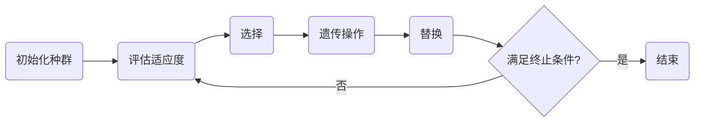

## 1. 背景介绍

随着人工智能的飞速发展，神经网络已成为解决复杂问题的强大工具。然而，传统的神经网络训练方法，如反向传播，虽然有效，但在某些领域存在局限性。例如，当环境不断变化或当我们需要发现全新的网络拓扑结构时，传统方法可能难以适应。神经进化算法（Neuroevolution, NE）作为一种新兴的技术，通过模拟自然选择的过程来优化神经网络的结构和权重，为解决这些问题提供了新的思路。

## 2. 核心概念与联系

神经进化算法是一种启发式搜索算法，它结合了遗传算法（Genetic Algorithms, GA）和神经网络。核心概念包括种群（population）、个体（individual）、基因（gene）、适应度（fitness）和遗传操作（genetic operations）。种群由多个个体组成，每个个体代表一个神经网络。基因是构成个体的基本单位，可以是网络的权重、拓扑结构或其他参数。适应度是衡量个体性能的指标，通常与任务目标直接相关。遗传操作包括选择（selection）、交叉（crossover）和变异（mutation），用于生成新一代的个体。

## 3. 核心算法原理具体操作步骤

神经进化算法的操作步骤通常包括以下几个阶段：

1. 初始化种群：随机生成一组神经网络个体。
2. 评估适应度：每个个体在特定任务上的表现决定其适应度。
3. 选择：根据适应度选择表现较好的个体进行繁殖。
4. 遗传操作：通过交叉和变异操作产生新一代个体。
5. 替换：新一代个体替换旧个体，形成新的种群。
6. 迭代：重复步骤2-5，直到满足终止条件。



## 4. 数学模型和公式详细讲解举例说明

在神经进化中，个体的适应度函数通常定义为：

$$
f(x) = \frac{1}{1 + e^{-\sum_{i=1}^{n} w_i x_i}}
$$

其中，$f(x)$ 是适应度函数，$x_i$ 是输入特征，$w_i$ 是对应的权重，$n$ 是特征数量。适应度函数的选择取决于具体任务，例如在游戏中可能是得分，在分类任务中可能是准确率。

## 5. 项目实践：代码实例和详细解释说明

以下是一个简单的神经进化算法的Python代码实例：

```python
import numpy as np

# 定义个体类
class Individual:
    def __init__(self, weights):
        self.weights = weights
        self.fitness = 0

# 初始化种群
def init_population(pop_size, weight_size):
    return [Individual(np.random.randn(weight_size)) for _ in range(pop_size)]

# 评估适应度
def evaluate(individual, env):
    # 这里的env代表环境，用于计算个体的适应度
    individual.fitness = env.calculate_fitness(individual.weights)

# 选择
def select(population):
    # 根据适应度排序并选择一部分个体
    sorted_population = sorted(population, key=lambda ind: ind.fitness, reverse=True)
    return sorted_population[:len(population)//2]

# 交叉
def crossover(parent1, parent2):
    child1_weights = (parent1.weights + parent2.weights) / 2
    child2_weights = (parent1.weights - parent2.weights) / 2
    return Individual(child1_weights), Individual(child2_weights)

# 变异
def mutate(individual):
    mutation_strength = 0.1
    individual.weights += np.random.randn(*individual.weights.shape) * mutation_strength

# 主函数
def neuroevolution(env, pop_size, weight_size, generations):
    population = init_population(pop_size, weight_size)
    for gen in range(generations):
        for individual in population:
            evaluate(individual, env)
        selected = select(population)
        offspring = []
        for i in range(0, len(selected), 2):
            child1, child2 = crossover(selected[i], selected[i+1])
            mutate(child1)
            mutate(child2)
            offspring.extend([child1, child2])
        population = selected + offspring
    return population

# 示例环境和任务
class ExampleEnv:
    def calculate_fitness(self, weights):
        # 假设适应度函数是权重的平方和
        return -np.sum(weights**2)

# 运行算法
env = ExampleEnv()
final_population = neuroevolution(env, pop_size=100, weight_size=10, generations=50)
best_individual = max(final_population, key=lambda ind: ind.fitness)
print("Best individual weights:", best_individual.weights)
```

在这个例子中，我们定义了一个简单的环境`ExampleEnv`，其中适应度函数是权重的平方和的负数。我们的目标是最小化这个值。代码展示了如何初始化种群、评估适应度、选择、交叉、变异和迭代过程。

## 6. 实际应用场景

神经进化算法在多个领域都有应用，包括但不限于：

- 游戏AI：通过NE优化游戏中的非玩家角色行为。
- 机器人控制：优化机器人的控制策略以适应复杂环境。
- 优化问题：解决旅行商问题和其他组合优化问题。
- 特征选择：在高维数据中选择最有信息量的特征。

## 7. 工具和资源推荐

- NEAT (NeuroEvolution of Augmenting Topologies)：一个流行的NE库，可以自动优化网络结构。
- TensorFlow和PyTorch：两个主流的深度学习框架，可以用于实现NE算法。
- OpenAI Gym：提供多种环境，用于测试和比较NE算法。

## 8. 总结：未来发展趋势与挑战

神经进化算法的研究仍在进行中，未来的发展趋势可能包括算法效率的提升、更复杂网络结构的探索以及与深度学习技术的结合。挑战包括如何在大规模问题上保持算法的可扩展性和如何处理高维数据。

## 9. 附录：常见问题与解答

Q1: 神经进化算法与传统的神经网络训练方法有何不同？
A1: NE算法通过模拟自然进化过程来优化网络结构和权重，而传统方法通常使用梯度下降和反向传播算法。

Q2: 神经进化算法的计算成本如何？
A2: NE算法通常需要较多的计算资源，因为它需要评估种群中每个个体的适应度。但是，由于其并行性，可以通过分布式计算来缓解这一问题。

Q3: NE算法适用于哪些类型的问题？
A3: NE算法适用于需要网络结构和权重联合优化的问题，尤其是在环境不断变化或任务结构未知的情况下。

作者：禅与计算机程序设计艺术 / Zen and the Art of Computer Programming