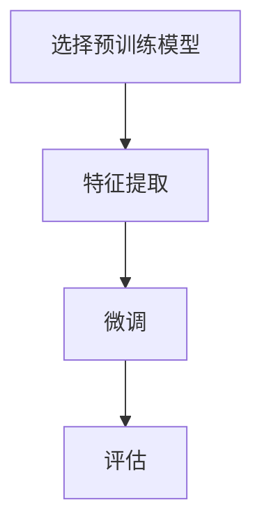

# 迁移学习 原理与代码实例讲解

## 1.背景介绍

迁移学习（Transfer Learning）是机器学习和深度学习领域中的一个重要分支。它的核心思想是将已经在某个任务上训练好的模型应用到另一个相关任务上，从而减少新任务的训练时间和数据需求。迁移学习在计算机视觉、自然语言处理等领域取得了显著的成果，极大地推动了这些领域的发展。

### 1.1 迁移学习的起源与发展

迁移学习的概念最早可以追溯到20世纪90年代，但真正的突破是在深度学习兴起之后。随着深度神经网络在各种任务上的成功，人们发现这些网络在不同任务之间具有一定的通用性，这为迁移学习提供了理论基础。

### 1.2 迁移学习的重要性

在实际应用中，获取大量标注数据往往是昂贵且耗时的。迁移学习通过利用已有的知识，可以显著减少对新任务数据的需求，从而降低成本，提高效率。此外，迁移学习还可以在数据稀缺的情况下提高模型的性能。

## 2.核心概念与联系

迁移学习涉及多个核心概念和技术，包括源域（Source Domain）、目标域（Target Domain）、特征提取（Feature Extraction）、微调（Fine-Tuning）等。理解这些概念对于掌握迁移学习的原理和应用至关重要。

### 2.1 源域与目标域

源域是指模型最初训练的任务和数据集，而目标域是指模型迁移后应用的新任务和数据集。源域和目标域之间可以有不同的特征空间和标签空间。

### 2.2 特征提取与微调

特征提取是指利用预训练模型的前几层提取特征，然后在这些特征上训练一个新的分类器。微调则是指在预训练模型的基础上，对整个模型或部分层进行重新训练，以适应新任务。

### 2.3 迁移学习的类型

迁移学习可以分为不同的类型，包括同构迁移学习（Homogeneous Transfer Learning）和异构迁移学习（Heterogeneous Transfer Learning）。同构迁移学习是指源域和目标域具有相同的特征空间和标签空间，而异构迁移学习则是指它们具有不同的特征空间或标签空间。

## 3.核心算法原理具体操作步骤

迁移学习的核心算法可以分为以下几个步骤：选择预训练模型、特征提取、微调和评估。

### 3.1 选择预训练模型

选择一个在大规模数据集上预训练的模型，如ImageNet上的ResNet、VGG等。这些模型已经学习到了丰富的特征，可以作为迁移学习的基础。

### 3.2 特征提取

使用预训练模型的前几层提取特征，这些层通常包含了通用的低级特征，如边缘、纹理等。

### 3.3 微调

在特征提取的基础上，对整个模型或部分层进行微调，以适应目标任务的数据和需求。

### 3.4 评估

使用目标任务的数据对微调后的模型进行评估，确保其性能满足要求。



## 4.数学模型和公式详细讲解举例说明

迁移学习的数学模型可以通过以下公式进行描述：

### 4.1 预训练模型

假设我们有一个在源域 $D_S$ 上训练的模型 $f_S(x)$，其损失函数为 $L_S$：

$$
L_S = \frac{1}{N_S} \sum_{i=1}^{N_S} \ell(f_S(x_i), y_i)
$$

其中，$N_S$ 是源域数据的数量，$\ell$ 是损失函数，$x_i$ 和 $y_i$ 分别是源域数据和标签。

### 4.2 特征提取

在特征提取阶段，我们使用预训练模型的前几层提取特征：

$$
h(x) = f_S^{(1:k)}(x)
$$

其中，$f_S^{(1:k)}$ 表示预训练模型的前 $k$ 层。

### 4.3 微调

在微调阶段，我们在目标域 $D_T$ 上对模型进行重新训练，其损失函数为 $L_T$：

$$
L_T = \frac{1}{N_T} \sum_{i=1}^{N_T} \ell(f_T(h(x_i)), y_i)
$$

其中，$N_T$ 是目标域数据的数量，$f_T$ 是微调后的模型。

### 4.4 评估

评估阶段，我们使用目标域的数据对微调后的模型进行评估，计算其在目标任务上的性能指标，如准确率、精确率、召回率等。

## 5.项目实践：代码实例和详细解释说明

下面我们通过一个具体的代码实例来演示迁移学习的实际操作。我们将使用PyTorch框架进行实现。

### 5.1 环境准备

首先，我们需要安装必要的库：

```bash
pip install torch torchvision
```

### 5.2 选择预训练模型

我们选择ResNet-18作为预训练模型：

```python
import torch
import torchvision.models as models

model = models.resnet18(pretrained=True)
```

### 5.3 特征提取

我们将ResNet-18的最后一层替换为一个新的全连接层：

```python
import torch.nn as nn

num_ftrs = model.fc.in_features
model.fc = nn.Linear(num_ftrs, num_classes)
```

### 5.4 微调

我们在目标任务的数据集上进行微调：

```python
import torch.optim as optim
from torchvision import datasets, transforms

# 数据预处理
data_transforms = {
    'train': transforms.Compose([
        transforms.RandomResizedCrop(224),
        transforms.RandomHorizontalFlip(),
        transforms.ToTensor(),
    ]),
    'val': transforms.Compose([
        transforms.Resize(256),
        transforms.CenterCrop(224),
        transforms.ToTensor(),
    ]),
}

# 加载数据集
image_datasets = {x: datasets.ImageFolder(os.path.join(data_dir, x),
                                          data_transforms[x])
                  for x in ['train', 'val']}
dataloaders = {x: torch.utils.data.DataLoader(image_datasets[x], batch_size=4,
                                             shuffle=True, num_workers=4)
              for x in ['train', 'val']}

# 定义损失函数和优化器
criterion = nn.CrossEntropyLoss()
optimizer = optim.SGD(model.parameters(), lr=0.001, momentum=0.9)

# 训练模型
num_epochs = 25
for epoch in range(num_epochs):
    for phase in ['train', 'val']:
        if phase == 'train':
            model.train()
        else:
            model.eval()

        running_loss = 0.0
        running_corrects = 0

        for inputs, labels in dataloaders[phase]:
            optimizer.zero_grad()

            with torch.set_grad_enabled(phase == 'train'):
                outputs = model(inputs)
                loss = criterion(outputs, labels)
                _, preds = torch.max(outputs, 1)

                if phase == 'train':
                    loss.backward()
                    optimizer.step()

            running_loss += loss.item() * inputs.size(0)
            running_corrects += torch.sum(preds == labels.data)

        epoch_loss = running_loss / len(image_datasets[phase])
        epoch_acc = running_corrects.double() / len(image_datasets[phase])

        print(f'{phase} Loss: {epoch_loss:.4f} Acc: {epoch_acc:.4f}')
```

### 5.5 评估

在验证集上评估模型的性能：

```python
model.eval()
running_corrects = 0

for inputs, labels in dataloaders['val']:
    outputs = model(inputs)
    _, preds = torch.max(outputs, 1)
    running_corrects += torch.sum(preds == labels.data)

val_acc = running_corrects.double() / len(image_datasets['val'])
print(f'Validation Accuracy: {val_acc:.4f}')
```

## 6.实际应用场景

迁移学习在多个领域都有广泛的应用，以下是一些典型的应用场景。

### 6.1 计算机视觉

在计算机视觉领域，迁移学习被广泛应用于图像分类、目标检测、图像分割等任务。例如，使用在ImageNet上预训练的模型进行特定领域的图像分类任务，可以显著提高模型的性能。

### 6.2 自然语言处理

在自然语言处理领域，迁移学习被应用于文本分类、情感分析、机器翻译等任务。例如，使用在大规模语料库上预训练的BERT模型进行特定领域的文本分类任务，可以显著提高模型的性能。

### 6.3 医疗诊断

在医疗诊断领域，迁移学习被应用于医学影像分析、疾病预测等任务。例如，使用在大规模医学影像数据上预训练的模型进行特定疾病的诊断，可以显著提高诊断的准确性。

## 7.工具和资源推荐

以下是一些常用的迁移学习工具和资源，供读者参考。

### 7.1 工具

- **PyTorch**：一个开源的深度学习框架，支持动态计算图，适合进行迁移学习。
- **TensorFlow**：一个开源的深度学习框架，支持静态计算图，适合进行大规模分布式训练。
- **Keras**：一个高级神经网络API，支持快速构建和训练深度学习模型，适合进行迁移学习。

### 7.2 资源

- **ImageNet**：一个大规模图像数据集，包含超过1000万张标注图像，常用于预训练模型。
- **COCO**：一个大规模目标检测、分割和图像描述数据集，常用于迁移学习。
- **BERT**：一个在大规模语料库上预训练的语言模型，常用于自然语言处理任务的迁移学习。

## 8.总结：未来发展趋势与挑战

迁移学习作为一种重要的机器学习技术，已经在多个领域取得了显著的成果。然而，迁移学习仍然面临一些挑战和发展趋势。

### 8.1 挑战

- **领域差异**：源域和目标域之间的差异可能导致迁移学习效果不佳，需要研究如何有效地缩小这种差异。
- **数据隐私**：在某些应用场景中，源域数据可能涉及隐私问题，需要研究如何在保护隐私的前提下进行迁移学习。
- **模型复杂度**：预训练模型通常具有较高的复杂度，可能导致计算资源的消耗，需要研究如何在保证性能的前提下降低模型复杂度。

### 8.2 发展趋势

- **自监督学习**：自监督学习通过构建无监督任务进行预训练，可以进一步提高迁移学习的效果。
- **元学习**：元学习通过学习如何学习，可以提高模型在不同任务之间的迁移能力。
- **跨领域迁移**：跨领域迁移学习研究如何在不同领域之间进行知识迁移，具有广泛的应用前景。

## 9.附录：常见问题与解答

### 9.1 迁移学习适用于哪些任务？

迁移学习适用于数据量较少、标注成本较高的任务，如图像分类、目标检测、文本分类等。

### 9.2 如何选择预训练模型？

选择预训练模型时，可以根据目标任务的特征选择在相似任务上预训练的模型，如选择在ImageNet上预训练的模型进行图像分类任务。

### 9.3 迁移学习的效果如何评估？

迁移学习的效果可以通过在目标任务的数据集上进行评估，计算模型的性能指标，如准确率、精确率、召回率等。

### 9.4 迁移学习是否总是有效？

迁移学习并不总是有效，源域和目标域之间的差异过大可能导致迁移学习效果不佳。在这种情况下，可以考虑使用自监督学习、元学习等方法。

### 9.5 迁移学习的计算资源需求如何？

迁移学习通常需要较高的计算资源，特别是在使用大规模预训练模型时。可以考虑使用云计算资源或分布式计算来满足需求。

---

作者：禅与计算机程序设计艺术 / Zen and the Art of Computer Programming