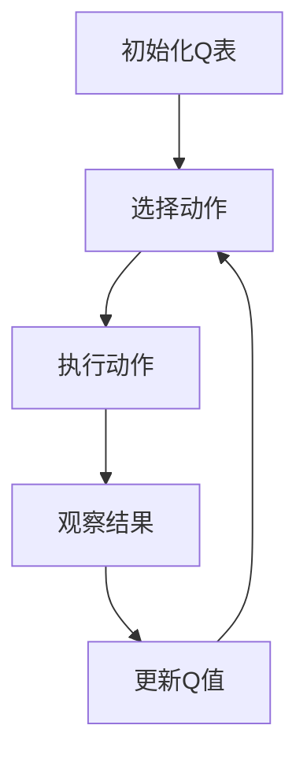
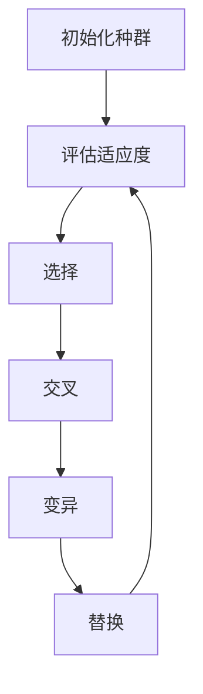

# AI人工智能 Agent：资源配置中智能体的应用

## 1.背景介绍

在现代社会中，资源配置是一个至关重要的问题。无论是在企业管理、物流运输、能源分配还是医疗资源调度中，如何高效地分配有限资源以达到最佳效果，都是一个亟待解决的难题。随着人工智能技术的迅猛发展，智能体（Agent）在资源配置中的应用逐渐成为研究热点。智能体通过自主学习和决策，能够在复杂环境中实现资源的最优配置，从而提高效率和降低成本。

## 2.核心概念与联系

### 2.1 智能体（Agent）

智能体是一个能够感知环境并采取行动以实现特定目标的自主实体。智能体可以是软件程序、机器人或其他形式的自动化系统。智能体的核心特征包括感知、决策和行动。

### 2.2 资源配置

资源配置是指在有限资源的约束下，如何将资源分配给不同的任务或需求，以实现整体效益的最大化。资源配置问题通常涉及多个变量和约束条件，具有高度的复杂性。

### 2.3 智能体与资源配置的联系

智能体在资源配置中的应用主要体现在以下几个方面：
- **自主决策**：智能体能够根据环境变化和历史数据，自主做出资源分配决策。
- **实时优化**：智能体可以实时监控资源使用情况，并动态调整分配策略。
- **学习能力**：通过机器学习算法，智能体能够不断优化其决策模型，提高资源配置效率。

## 3.核心算法原理具体操作步骤

### 3.1 强化学习算法

强化学习（Reinforcement Learning, RL）是一种通过与环境交互来学习最优策略的机器学习方法。智能体在资源配置中可以通过强化学习算法来优化其决策过程。

#### 3.1.1 Q-Learning

Q-Learning 是一种常用的强化学习算法，通过学习状态-动作值函数（Q函数）来指导智能体的决策。

#### 3.1.2 操作步骤

1. **初始化Q表**：将所有状态-动作对的Q值初始化为零。
2. **选择动作**：根据当前状态，使用ε-贪婪策略选择动作。
3. **执行动作**：智能体在环境中执行选择的动作，并观察结果。
4. **更新Q值**：根据奖励和下一状态，更新Q值。
5. **重复**：重复上述步骤，直到收敛。



### 3.2 遗传算法

遗传算法（Genetic Algorithm, GA）是一种基于自然选择和遗传机制的优化算法。智能体可以通过遗传算法来优化资源配置策略。

#### 3.2.1 操作步骤

1. **初始化种群**：随机生成一组初始解。
2. **评估适应度**：计算每个个体的适应度值。
3. **选择**：根据适应度值选择个体进行繁殖。
4. **交叉**：对选择的个体进行交叉操作，生成新个体。
5. **变异**：对新个体进行变异操作。
6. **替换**：用新个体替换旧个体，形成新一代种群。
7. **重复**：重复上述步骤，直到满足终止条件。



## 4.数学模型和公式详细讲解举例说明

### 4.1 强化学习中的Q-Learning

在Q-Learning中，Q值的更新公式为：

$$
Q(s, a) \leftarrow Q(s, a) + \alpha [r + \gamma \max_{a'} Q(s', a') - Q(s, a)]
$$

其中：
- $s$ 和 $s'$ 分别表示当前状态和下一状态。
- $a$ 和 $a'$ 分别表示当前动作和下一动作。
- $r$ 表示当前奖励。
- $\alpha$ 表示学习率。
- $\gamma$ 表示折扣因子。

### 4.2 遗传算法中的适应度函数

在遗传算法中，适应度函数用于评估个体的优劣。假设我们有一个资源配置问题，其目标是最小化总成本。适应度函数可以定义为：

$$
f(x) = \frac{1}{1 + C(x)}
$$

其中，$C(x)$ 表示个体 $x$ 的总成本。

### 4.3 实例说明

假设我们有一个简单的资源配置问题，需要将三种资源分配给四个任务。我们可以使用Q-Learning和遗传算法来解决这个问题。

#### Q-Learning实例

1. **初始化Q表**：假设有4个状态和3个动作，Q表初始化为零。
2. **选择动作**：根据当前状态，使用ε-贪婪策略选择动作。
3. **执行动作**：智能体在环境中执行选择的动作，并观察结果。
4. **更新Q值**：根据奖励和下一状态，更新Q值。
5. **重复**：重复上述步骤，直到收敛。

#### 遗传算法实例

1. **初始化种群**：随机生成一组初始解。
2. **评估适应度**：计算每个个体的适应度值。
3. **选择**：根据适应度值选择个体进行繁殖。
4. **交叉**：对选择的个体进行交叉操作，生成新个体。
5. **变异**：对新个体进行变异操作。
6. **替换**：用新个体替换旧个体，形成新一代种群。
7. **重复**：重复上述步骤，直到满足终止条件。

## 5.项目实践：代码实例和详细解释说明

### 5.1 Q-Learning代码实例

以下是一个使用Q-Learning解决资源配置问题的Python代码示例：

```python
import numpy as np

# 定义环境
states = ['S1', 'S2', 'S3', 'S4']
actions = ['A1', 'A2', 'A3']
Q = np.zeros((len(states), len(actions)))

# 参数设置
alpha = 0.1
gamma = 0.9
epsilon = 0.1

# 奖励函数
def reward(state, action):
    # 根据具体问题定义奖励函数
    return np.random.rand()

# 选择动作
def choose_action(state):
    if np.random.rand() < epsilon:
        return np.random.choice(actions)
    else:
        return actions[np.argmax(Q[state])]

# 更新Q值
def update_Q(state, action, reward, next_state):
    Q[state, action] += alpha * (reward + gamma * np.max(Q[next_state]) - Q[state, action])

# 训练过程
for episode in range(1000):
    state = np.random.choice(states)
    while True:
        action = choose_action(state)
        next_state = np.random.choice(states)
        r = reward(state, action)
        update_Q(state, action, r, next_state)
        state = next_state
        if state == 'S4':  # 终止条件
            break

print("Q表：")
print(Q)
```

### 5.2 遗传算法代码实例

以下是一个使用遗传算法解决资源配置问题的Python代码示例：

```python
import numpy as np

# 参数设置
population_size = 50
generations = 100
mutation_rate = 0.01

# 初始化种群
def initialize_population(size):
    return np.random.randint(0, 2, (size, 10))

# 适应度函数
def fitness(individual):
    return 1 / (1 + np.sum(individual))

# 选择
def selection(population, fitnesses):
    idx = np.random.choice(np.arange(len(population)), size=len(population), p=fitnesses/fitnesses.sum())
    return population[idx]

# 交叉
def crossover(parent1, parent2):
    point = np.random.randint(1, len(parent1)-1)
    child1 = np.concatenate([parent1[:point], parent2[point:]])
    child2 = np.concatenate([parent2[:point], parent1[point:]])
    return child1, child2

# 变异
def mutate(individual):
    for i in range(len(individual)):
        if np.random.rand() < mutation_rate:
            individual[i] = 1 - individual[i]
    return individual

# 主程序
population = initialize_population(population_size)
for generation in range(generations):
    fitnesses = np.array([fitness(ind) for ind in population])
    population = selection(population, fitnesses)
    new_population = []
    for i in range(0, len(population), 2):
        parent1, parent2 = population[i], population[i+1]
        child1, child2 = crossover(parent1, parent2)
        new_population.append(mutate(child1))
        new_population.append(mutate(child2))
    population = np.array(new_population)

best_individual = population[np.argmax([fitness(ind) for ind in population])]
print("最佳个体：", best_individual)
```

## 6.实际应用场景

### 6.1 物流运输

在物流运输中，智能体可以通过优化运输路线和调度策略，实现货物的高效配送。通过实时监控交通状况和货物需求，智能体能够动态调整运输计划，减少运输成本和时间。

### 6.2 能源分配

在能源分配中，智能体可以通过预测能源需求和优化能源供应，实现能源的高效利用。智能电网中的智能体可以根据实时数据，动态调整电力分配策略，减少能源浪费和成本。

### 6.3 医疗资源调度

在医疗资源调度中，智能体可以通过优化医生、护士和设备的调度，实现医疗资源的高效利用。智能体可以根据患者的病情和医院的资源情况，动态调整调度计划，提高医疗服务质量和效率。

## 7.工具和资源推荐

### 7.1 开源库

- **TensorFlow**：一个开源的机器学习框架，支持强化学习和深度学习。
- **PyTorch**：另一个流行的开源机器学习框架，具有灵活性和易用性。
- **OpenAI Gym**：一个用于开发和比较强化学习算法的工具包。

### 7.2 在线课程

- **Coursera**：提供多种人工智能和机器学习相关的在线课程。
- **Udacity**：提供强化学习和深度学习的纳米学位课程。

### 7.3 书籍推荐

- **《强化学习：原理与实践》**：一本详细介绍强化学习理论和实践的书籍。
- **《遗传算法及其应用》**：一本介绍遗传算法基本原理和应用的书籍。

## 8.总结：未来发展趋势与挑战

### 8.1 未来发展趋势

随着人工智能技术的不断进步，智能体在资源配置中的应用将会越来越广泛。未来，智能体将能够处理更加复杂的资源配置问题，实现更高效的资源利用。同时，智能体的自主学习和决策能力也将不断提升，能够在更多领域中发挥重要作用。

### 8.2 挑战

尽管智能体在资源配置中具有广阔的应用前景，但仍面临一些挑战。首先，智能体的决策过程需要大量的数据支持，而数据的获取和处理成本较高。其次，智能体的决策模型需要不断优化，以适应复杂多变的环境。最后，智能体的应用还需要解决伦理和安全问题，确保其决策过程透明、公正和安全。

## 9.附录：常见问题与解答

### 9.1 Q：智能体在资源配置中的优势是什么？

A：智能体在资源配置中的优势主要体现在以下几个方面：
- **自主决策**：智能体能够根据环境变化和历史数据，自主做出资源分配决策。
- **实时优化**：智能体可以实时监控资源使用情况，并动态调整分配策略。
- **学习能力**：通过机器学习算法，智能体能够不断优化其决策模型，提高资源配置效率。

### 9.2 Q：如何选择合适的算法来解决资源配置问题？

A：选择合适的算法需要根据具体问题的特点和需求来确定。对于需要实时决策和优化的问题，可以选择强化学习算法。对于需要全局优化的问题，可以选择遗传算法。此外，还可以结合多种算法，形成混合策略，以提高资源配置效率。

### 9.3 Q：智能体在资源配置中的应用有哪些实际案例？

A：智能体在资源配置中的应用非常广泛，包括物流运输、能源分配、医疗资源调度等。例如，亚马逊通过智能体优化其仓储和配送系统，实现了高效的物流管理；智能电网通过智能体优化电力分配策略，提高了能源利用效率；医院通过智能体优化医生和设备的调度，提高了医疗服务质量和效率。

---

作者：禅与计算机程序设计艺术 / Zen and the Art of Computer Programming