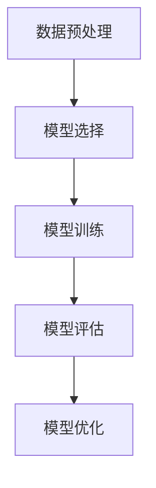

# AI人工智能深度学习算法：在股市分析中应用智能深度学习代理

## 1.背景介绍

### 1.1 股市分析的复杂性
股市分析一直以来都是金融领域的一个重要课题。股市的波动性和复杂性使得传统的分析方法难以应对。投资者和分析师需要处理大量的历史数据、实时数据以及各种影响市场的因素，如经济指标、公司财报、政治事件等。

### 1.2 人工智能与深度学习的崛起
随着人工智能（AI）和深度学习（Deep Learning）技术的迅猛发展，这些技术在金融领域的应用也越来越广泛。深度学习算法能够处理大量复杂的数据，并从中提取有价值的信息，这为股市分析提供了新的可能性。

### 1.3 文章目标
本文旨在探讨如何利用深度学习算法进行股市分析，介绍核心概念、算法原理、数学模型、实际应用场景以及未来的发展趋势和挑战。

## 2.核心概念与联系

### 2.1 深度学习简介
深度学习是机器学习的一个分支，主要通过多层神经网络来模拟人脑的工作方式。其核心在于通过大量数据的训练，使模型能够自动提取特征并进行预测。

### 2.2 股市数据的特性
股市数据具有时间序列特性，通常包括开盘价、收盘价、最高价、最低价、成交量等。深度学习算法需要处理这些时间序列数据，并从中提取出有用的特征。

### 2.3 深度学习与股市分析的联系
深度学习算法可以通过历史数据的训练，预测未来的股价走势。这种预测不仅可以帮助投资者做出更明智的决策，还可以用于自动化交易系统中，提高交易效率。

## 3.核心算法原理具体操作步骤

### 3.1 数据预处理
数据预处理是深度学习模型训练的第一步。包括数据清洗、归一化、特征提取等步骤。

### 3.2 模型选择
常用的深度学习模型包括卷积神经网络（CNN）、循环神经网络（RNN）和长短期记忆网络（LSTM）。在股市分析中，LSTM由于其处理时间序列数据的优势，应用较为广泛。

### 3.3 模型训练
模型训练是通过大量的历史数据，对模型进行参数调整，使其能够准确预测股价。训练过程中需要设置超参数，如学习率、批量大小等。

### 3.4 模型评估
模型评估是通过测试数据集，对模型的预测效果进行验证。常用的评估指标包括均方误差（MSE）、平均绝对误差（MAE）等。

### 3.5 模型优化
通过调整超参数、增加训练数据、使用更复杂的模型结构等方法，对模型进行优化，提高其预测精度。



## 4.数学模型和公式详细讲解举例说明

### 4.1 LSTM网络结构
LSTM网络是一种特殊的RNN，能够有效处理长时间依赖问题。其核心在于引入了记忆单元和门控机制。

### 4.2 数学公式
LSTM的核心公式包括输入门、遗忘门、输出门和记忆单元的更新公式。

$$
i_t = \sigma(W_i \cdot [h_{t-1}, x_t] + b_i)
$$

$$
f_t = \sigma(W_f \cdot [h_{t-1}, x_t] + b_f)
$$

$$
o_t = \sigma(W_o \cdot [h_{t-1}, x_t] + b_o)
$$

$$
C_t = f_t * C_{t-1} + i_t * \tanh(W_C \cdot [h_{t-1}, x_t] + b_C)
$$

$$
h_t = o_t * \tanh(C_t)
$$

### 4.3 举例说明
假设我们有一组股市数据，包含过去10天的开盘价、收盘价、最高价、最低价和成交量。我们可以将这些数据输入到LSTM网络中，预测第11天的股价。

## 5.项目实践：代码实例和详细解释说明

### 5.1 数据准备
首先，我们需要准备股市数据。可以通过API获取历史数据，或者使用现有的数据集。

```python
import pandas as pd
import numpy as np

# 读取数据
data = pd.read_csv('stock_data.csv')
# 数据预处理
data = data[['Open', 'High', 'Low', 'Close', 'Volume']]
data = data.values
```

### 5.2 构建LSTM模型
使用Keras构建LSTM模型。

```python
from keras.models import Sequential
from keras.layers import LSTM, Dense

# 构建模型
model = Sequential()
model.add(LSTM(50, return_sequences=True, input_shape=(10, 5)))
model.add(LSTM(50))
model.add(Dense(1))

# 编译模型
model.compile(optimizer='adam', loss='mean_squared_error')
```

### 5.3 模型训练
将数据分为训练集和测试集，进行模型训练。

```python
# 数据分割
train_data = data[:int(len(data)*0.8)]
test_data = data[int(len(data)*0.8):]

# 数据归一化
from sklearn.preprocessing import MinMaxScaler
scaler = MinMaxScaler(feature_range=(0, 1))
train_data = scaler.fit_transform(train_data)
test_data = scaler.transform(test_data)

# 构建训练集
X_train, y_train = [], []
for i in range(10, len(train_data)):
    X_train.append(train_data[i-10:i])
    y_train.append(train_data[i, 3])  # 预测收盘价
X_train, y_train = np.array(X_train), np.array(y_train)

# 模型训练
model.fit(X_train, y_train, epochs=50, batch_size=32)
```

### 5.4 模型评估
使用测试集评估模型效果。

```python
# 构建测试集
X_test, y_test = [], []
for i in range(10, len(test_data)):
    X_test.append(test_data[i-10:i])
    y_test.append(test_data[i, 3])
X_test, y_test = np.array(X_test), np.array(y_test)

# 模型预测
predictions = model.predict(X_test)
predictions = scaler.inverse_transform(predictions)

# 评估模型
from sklearn.metrics import mean_squared_error
mse = mean_squared_error(y_test, predictions)
print(f'Mean Squared Error: {mse}')
```

## 6.实际应用场景

### 6.1 投资决策支持
深度学习算法可以帮助投资者分析历史数据，预测未来股价走势，从而做出更明智的投资决策。

### 6.2 自动化交易系统
通过深度学习算法，构建自动化交易系统，实现高频交易和套利交易，提高交易效率和收益。

### 6.3 风险管理
深度学习算法可以帮助金融机构识别和预测市场风险，制定相应的风险管理策略。

## 7.工具和资源推荐

### 7.1 开源框架
- TensorFlow：谷歌开发的开源深度学习框架，支持多种神经网络模型。
- Keras：一个高层神经网络API，能够运行在TensorFlow、Theano和CNTK之上。
- PyTorch：Facebook开发的开源深度学习框架，支持动态计算图。

### 7.2 数据源
- Alpha Vantage：提供免费的股市数据API。
- Yahoo Finance：提供历史股市数据和实时数据。
- Quandl：提供多种金融数据集。

### 7.3 学习资源
- 《深度学习》：Ian Goodfellow等人编写的经典教材，详细介绍了深度学习的基本概念和算法。
- Coursera：提供多种深度学习和机器学习的在线课程。
- GitHub：上面有大量的开源项目和代码实例，可以帮助你更好地理解和应用深度学习算法。

## 8.总结：未来发展趋势与挑战

### 8.1 未来发展趋势
随着计算能力的提升和数据量的增加，深度学习算法在股市分析中的应用将会越来越广泛。未来，可能会出现更加复杂和精确的模型，能够更好地预测股市走势。

### 8.2 挑战
尽管深度学习算法在股市分析中有着广泛的应用前景，但也面临着一些挑战。首先，股市数据的噪声和不确定性较高，模型的预测精度可能受到影响。其次，深度学习模型的训练需要大量的计算资源和时间，这对普通投资者来说可能是一个障碍。

## 9.附录：常见问题与解答

### 9.1 深度学习算法在股市分析中的优势是什么？
深度学习算法能够处理大量复杂的数据，并从中提取有价值的信息，具有较高的预测精度。

### 9.2 如何选择合适的深度学习模型？
选择合适的深度学习模型需要考虑数据的特性和具体的应用场景。对于时间序列数据，LSTM是一个较好的选择。

### 9.3 模型训练需要多长时间？
模型训练的时间取决于数据量、模型复杂度和计算资源。一般来说，数据量越大、模型越复杂，训练时间越长。

### 9.4 如何提高模型的预测精度？
可以通过增加训练数据、调整超参数、使用更复杂的模型结构等方法，提高模型的预测精度。

### 9.5 深度学习算法在股市分析中的应用有哪些限制？
深度学习算法在股市分析中的应用主要受到数据噪声和不确定性的影响。此外，模型的训练需要大量的计算资源和时间。

---

作者：禅与计算机程序设计艺术 / Zen and the Art of Computer Programming