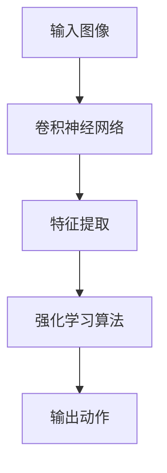

# AI人工智能深度学习算法：计算机视觉在深度学习代理中的集成

## 1.背景介绍

在过去的十年中，人工智能（AI）和深度学习（DL）技术取得了显著的进展，尤其是在计算机视觉（CV）领域。计算机视觉的目标是使计算机能够理解和解释视觉信息，这在自动驾驶、医疗影像分析、安防监控等领域有着广泛的应用。与此同时，深度学习代理（DLA）作为一种智能体，能够通过学习和适应环境来完成复杂任务。将计算机视觉集成到深度学习代理中，可以显著提升代理的感知能力和决策能力，从而实现更高效、更智能的系统。

## 2.核心概念与联系

### 2.1 计算机视觉

计算机视觉是指通过计算机处理和分析图像或视频数据，以获取有用信息的技术。其核心任务包括图像分类、目标检测、图像分割、姿态估计等。

### 2.2 深度学习

深度学习是一种基于人工神经网络的机器学习方法，能够通过多层网络结构自动提取数据的特征。常见的深度学习模型包括卷积神经网络（CNN）、循环神经网络（RNN）和生成对抗网络（GAN）等。

### 2.3 深度学习代理

深度学习代理是一种能够通过与环境交互来学习和适应的智能体。它通常使用强化学习（RL）算法来优化其行为策略，以最大化累积奖励。

### 2.4 计算机视觉与深度学习代理的联系

将计算机视觉技术集成到深度学习代理中，可以使代理具备视觉感知能力，从而更好地理解和适应环境。例如，在自动驾驶中，计算机视觉可以帮助车辆识别道路标志、行人和其他车辆，而深度学习代理则可以根据这些信息做出驾驶决策。

## 3.核心算法原理具体操作步骤

### 3.1 卷积神经网络（CNN）

卷积神经网络是计算机视觉中最常用的深度学习模型。其核心操作包括卷积、池化和全连接层。

#### 3.1.1 卷积操作

卷积操作通过卷积核在输入图像上滑动，提取局部特征。其数学表达式为：

$$
y_{i,j} = \sum_{m=0}^{M-1} \sum_{n=0}^{N-1} x_{i+m,j+n} \cdot k_{m,n}
$$

#### 3.1.2 池化操作

池化操作通过下采样减少特征图的尺寸，常见的池化方法有最大池化和平均池化。

#### 3.1.3 全连接层

全连接层将池化后的特征图展平，并通过一系列线性变换和激活函数进行分类或回归。

### 3.2 强化学习（RL）

强化学习是一种通过与环境交互来学习最优策略的机器学习方法。其核心组件包括状态（State）、动作（Action）、奖励（Reward）和策略（Policy）。

#### 3.2.1 Q-Learning

Q-Learning是一种常见的强化学习算法，通过学习状态-动作值函数（Q函数）来优化策略。其更新公式为：

$$
Q(s,a) \leftarrow Q(s,a) + \alpha [r + \gamma \max_{a'} Q(s',a') - Q(s,a)]
$$

#### 3.2.2 深度Q网络（DQN）

深度Q网络将Q-Learning与深度神经网络结合，通过神经网络近似Q函数，从而处理高维状态空间。

### 3.3 计算机视觉与深度学习代理的集成

将计算机视觉与深度学习代理集成的关键在于设计一个能够处理视觉输入并生成适当动作的模型。常见的方法包括使用卷积神经网络提取视觉特征，并将其输入到强化学习算法中。



## 4.数学模型和公式详细讲解举例说明

### 4.1 卷积神经网络的数学模型

卷积神经网络的核心在于卷积操作，其数学模型如下：

$$
y_{i,j} = \sum_{m=0}^{M-1} \sum_{n=0}^{N-1} x_{i+m,j+n} \cdot k_{m,n}
$$

其中，$x$ 是输入图像，$k$ 是卷积核，$y$ 是输出特征图。

### 4.2 强化学习的数学模型

强化学习的目标是通过最大化累积奖励来优化策略。其数学模型如下：

$$
Q(s,a) \leftarrow Q(s,a) + \alpha [r + \gamma \max_{a'} Q(s',a') - Q(s,a)]
$$

其中，$Q(s,a)$ 是状态-动作值函数，$\alpha$ 是学习率，$r$ 是即时奖励，$\gamma$ 是折扣因子。

### 4.3 计算机视觉与深度学习代理的集成模型

将计算机视觉与深度学习代理集成的数学模型可以表示为：

$$
a_t = \pi(s_t; \theta)
$$

其中，$s_t$ 是通过卷积神经网络提取的视觉特征，$\pi$ 是策略函数，$\theta$ 是模型参数。

## 5.项目实践：代码实例和详细解释说明

### 5.1 环境准备

首先，确保安装了必要的库：

```bash
pip install tensorflow gym opencv-python
```

### 5.2 卷积神经网络的实现

```python
import tensorflow as tf
from tensorflow.keras import layers, models

def create_cnn_model(input_shape):
    model = models.Sequential()
    model.add(layers.Conv2D(32, (3, 3), activation='relu', input_shape=input_shape))
    model.add(layers.MaxPooling2D((2, 2)))
    model.add(layers.Conv2D(64, (3, 3), activation='relu'))
    model.add(layers.MaxPooling2D((2, 2)))
    model.add(layers.Conv2D(64, (3, 3), activation='relu'))
    model.add(layers.Flatten())
    model.add(layers.Dense(64, activation='relu'))
    model.add(layers.Dense(10, activation='softmax'))
    return model
```

### 5.3 深度Q网络的实现

```python
import gym
import numpy as np

class DQNAgent:
    def __init__(self, state_size, action_size):
        self.state_size = state_size
        self.action_size = action_size
        self.memory = []
        self.gamma = 0.95
        self.epsilon = 1.0
        self.epsilon_min = 0.01
        self.epsilon_decay = 0.995
        self.learning_rate = 0.001
        self.model = self._build_model()

    def _build_model(self):
        model = models.Sequential()
        model.add(layers.Dense(24, input_dim=self.state_size, activation='relu'))
        model.add(layers.Dense(24, activation='relu'))
        model.add(layers.Dense(self.action_size, activation='linear'))
        model.compile(loss='mse', optimizer=tf.keras.optimizers.Adam(lr=self.learning_rate))
        return model

    def remember(self, state, action, reward, next_state, done):
        self.memory.append((state, action, reward, next_state, done))

    def act(self, state):
        if np.random.rand() <= self.epsilon:
            return np.random.choice(self.action_size)
        act_values = self.model.predict(state)
        return np.argmax(act_values[0])

    def replay(self, batch_size):
        minibatch = np.random.choice(self.memory, batch_size)
        for state, action, reward, next_state, done in minibatch:
            target = reward
            if not done:
                target = reward + self.gamma * np.amax(self.model.predict(next_state)[0])
            target_f = self.model.predict(state)
            target_f[0][action] = target
            self.model.fit(state, target_f, epochs=1, verbose=0)
        if self.epsilon > self.epsilon_min:
            self.epsilon *= self.epsilon_decay
```

### 5.4 集成计算机视觉与深度学习代理

```python
import cv2

class VisionDQNAgent(DQNAgent):
    def __init__(self, state_size, action_size, input_shape):
        super().__init__(state_size, action_size)
        self.cnn_model = create_cnn_model(input_shape)

    def preprocess_image(self, image):
        image = cv2.resize(image, (input_shape[0], input_shape[1]))
        image = image / 255.0
        return np.expand_dims(image, axis=0)

    def act(self, image):
        state = self.preprocess_image(image)
        features = self.cnn_model.predict(state)
        return super().act(features)
```

## 6.实际应用场景

### 6.1 自动驾驶

在自动驾驶中，计算机视觉用于识别道路标志、行人和其他车辆，而深度学习代理则根据这些信息做出驾驶决策。

### 6.2 医疗影像分析

在医疗影像分析中，计算机视觉用于检测和分类病变区域，而深度学习代理可以根据这些信息提供诊断建议。

### 6.3 安防监控

在安防监控中，计算机视觉用于识别异常行为和可疑人物，而深度学习代理可以根据这些信息触发警报或采取其他措施。

## 7.工具和资源推荐

### 7.1 开源框架

- TensorFlow
- PyTorch
- OpenCV

### 7.2 数据集

- ImageNet
- COCO
- CIFAR-10

### 7.3 在线课程

- Coursera: Deep Learning Specialization
- Udacity: Computer Vision Nanodegree
- edX: Artificial Intelligence

## 8.总结：未来发展趋势与挑战

### 8.1 未来发展趋势

随着计算能力的提升和数据量的增加，计算机视觉和深度学习代理的集成将变得更加普遍。未来的发展趋势包括：

- 更高效的模型架构
- 更强大的计算资源
- 更丰富的数据集

### 8.2 挑战

尽管计算机视觉和深度学习代理的集成有着广阔的前景，但仍面临一些挑战：

- 数据隐私和安全问题
- 模型的可解释性
- 实时处理能力

## 9.附录：常见问题与解答

### 9.1 如何选择合适的卷积神经网络架构？

选择合适的卷积神经网络架构取决于具体的应用场景和数据集。常见的架构包括VGG、ResNet和Inception等。

### 9.2 如何调试深度学习代理？

调试深度学习代理可以通过以下方法：

- 可视化训练过程
- 调整超参数
- 使用更丰富的特征表示

### 9.3 如何处理数据不足的问题？

数据不足可以通过数据增强、迁移学习和生成对抗网络等方法来缓解。

---

作者：禅与计算机程序设计艺术 / Zen and the Art of Computer Programming