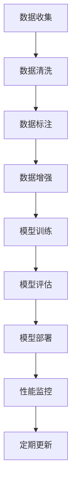

# AI工程最佳实践原理与代码实战案例讲解

## 1.背景介绍

人工智能（AI）已经成为现代科技的核心驱动力之一，从自动驾驶汽车到智能助手，AI的应用无处不在。然而，AI工程不仅仅是算法和模型的开发，它还涉及到数据处理、系统架构、部署和维护等多个方面。本文旨在通过详细的理论讲解和实际代码示例，帮助读者理解AI工程的最佳实践。

## 2.核心概念与联系

在AI工程中，有几个核心概念需要理解：

### 2.1 数据处理

数据是AI的基础，数据处理包括数据收集、清洗、标注和增强等步骤。数据的质量直接影响模型的性能。

### 2.2 模型训练

模型训练是AI工程的核心步骤，涉及选择合适的算法、调整超参数和评估模型性能。

### 2.3 系统架构

AI系统的架构设计需要考虑数据流、计算资源和系统的可扩展性。一个良好的架构可以提高系统的效率和稳定性。

### 2.4 部署与维护

模型的部署和维护是AI工程的最后一步，但同样重要。部署需要考虑模型的响应时间、资源消耗和可扩展性，而维护则需要定期更新模型和监控系统性能。

## 3.核心算法原理具体操作步骤

### 3.1 数据处理步骤

1. **数据收集**：从各种来源收集数据，如数据库、API、传感器等。
2. **数据清洗**：处理缺失值、异常值和重复数据。
3. **数据标注**：为数据添加标签，通常需要人工干预。
4. **数据增强**：通过数据增强技术增加数据的多样性，如旋转、缩放、翻转等。

### 3.2 模型训练步骤

1. **选择算法**：根据问题类型选择合适的算法，如回归、分类、聚类等。
2. **数据分割**：将数据分为训练集、验证集和测试集。
3. **超参数调整**：使用网格搜索或随机搜索调整模型的超参数。
4. **模型评估**：使用交叉验证评估模型性能。

### 3.3 系统架构设计步骤

1. **数据流设计**：设计数据从输入到输出的流动路径。
2. **计算资源分配**：根据任务需求分配计算资源，如CPU、GPU等。
3. **系统可扩展性**：设计系统的可扩展性，以应对未来的需求增长。

### 3.4 部署与维护步骤

1. **模型部署**：将模型部署到生产环境中，通常使用Docker或Kubernetes。
2. **性能监控**：监控模型的性能，如响应时间、准确率等。
3. **定期更新**：根据新数据和新需求定期更新模型。

## 4.数学模型和公式详细讲解举例说明

### 4.1 线性回归模型

线性回归是最基本的回归模型，其数学公式为：

$$
y = \beta_0 + \beta_1 x_1 + \beta_2 x_2 + \cdots + \beta_n x_n + \epsilon
$$

其中，$y$ 是目标变量，$x_1, x_2, \ldots, x_n$ 是特征变量，$\beta_0, \beta_1, \ldots, \beta_n$ 是回归系数，$\epsilon$ 是误差项。

### 4.2 逻辑回归模型

逻辑回归用于分类问题，其数学公式为：

$$
P(y=1|x) = \frac{1}{1 + e^{-(\beta_0 + \beta_1 x_1 + \beta_2 x_2 + \cdots + \beta_n x_n)}}
$$

其中，$P(y=1|x)$ 是样本属于类别1的概率，其他符号与线性回归相同。

### 4.3 神经网络模型

神经网络是复杂的非线性模型，其基本单元是神经元。一个简单的神经元计算公式为：

$$
y = f(\sum_{i=1}^{n} w_i x_i + b)
$$

其中，$f$ 是激活函数，$w_i$ 是权重，$x_i$ 是输入，$b$ 是偏置。

### 4.4 示例：线性回归的具体操作步骤

1. **数据准备**：假设我们有一个数据集，其中包含房屋面积和价格。
2. **模型定义**：定义线性回归模型，目标是预测房屋价格。
3. **训练模型**：使用最小二乘法估计回归系数。
4. **评估模型**：使用均方误差（MSE）评估模型性能。

## 5.项目实践：代码实例和详细解释说明

### 5.1 数据处理代码示例

```python
import pandas as pd
from sklearn.model_selection import train_test_split

# 数据收集
data = pd.read_csv('housing.csv')

# 数据清洗
data = data.dropna()

# 数据分割
train_data, test_data = train_test_split(data, test_size=0.2, random_state=42)
```

### 5.2 模型训练代码示例

```python
from sklearn.linear_model import LinearRegression
from sklearn.metrics import mean_squared_error

# 特征和标签
X_train = train_data[['area']]
y_train = train_data['price']

# 模型定义
model = LinearRegression()

# 模型训练
model.fit(X_train, y_train)

# 模型评估
X_test = test_data[['area']]
y_test = test_data['price']
y_pred = model.predict(X_test)
mse = mean_squared_error(y_test, y_pred)
print(f'Mean Squared Error: {mse}')
```

### 5.3 系统架构设计示例



### 5.4 部署与维护代码示例

```yaml
# Dockerfile
FROM python:3.8-slim

COPY . /app
WORKDIR /app

RUN pip install -r requirements.txt

CMD ["python", "app.py"]
```

```yaml
# Kubernetes Deployment
apiVersion: apps/v1
kind: Deployment
metadata:
  name: ai-model-deployment
spec:
  replicas: 3
  selector:
    matchLabels:
      app: ai-model
  template:
    metadata:
      labels:
        app: ai-model
    spec:
      containers:
      - name: ai-model
        image: ai-model:latest
        ports:
        - containerPort: 80
```

## 6.实际应用场景

### 6.1 医疗诊断

AI在医疗诊断中的应用已经取得了显著成果，如通过图像识别技术进行癌症早期筛查。

### 6.2 自动驾驶

自动驾驶汽车依赖于AI技术进行环境感知、路径规划和决策控制。

### 6.3 金融风控

AI在金融领域用于信用评分、欺诈检测和投资策略优化。

### 6.4 智能客服

智能客服系统通过自然语言处理技术实现自动应答，提高客户服务效率。

## 7.工具和资源推荐

### 7.1 编程语言

- **Python**：AI开发的首选语言，拥有丰富的库和框架。
- **R**：适用于统计分析和数据可视化。

### 7.2 开发框架

- **TensorFlow**：谷歌开发的深度学习框架，支持大规模分布式训练。
- **PyTorch**：Facebook开发的深度学习框架，易于使用和调试。

### 7.3 数据库

- **MySQL**：关系型数据库，适用于结构化数据存储。
- **MongoDB**：非关系型数据库，适用于大规模数据存储。

### 7.4 云服务

- **AWS**：提供全面的AI和机器学习服务。
- **Google Cloud**：提供强大的AI和机器学习工具。

## 8.总结：未来发展趋势与挑战

### 8.1 发展趋势

- **自动化**：AI工程的自动化程度将不断提高，从数据处理到模型训练和部署。
- **可解释性**：AI模型的可解释性将成为研究热点，帮助用户理解模型的决策过程。
- **边缘计算**：随着物联网的发展，AI将更多地应用于边缘设备，提高实时性和效率。

### 8.2 挑战

- **数据隐私**：如何在保护用户隐私的前提下使用数据是一个重要挑战。
- **模型鲁棒性**：提高模型在不同环境下的鲁棒性和稳定性。
- **伦理问题**：AI的伦理问题，如算法偏见和决策透明性，需要引起重视。

## 9.附录：常见问题与解答

### 9.1 如何选择合适的算法？

选择算法需要根据问题类型、数据特征和计算资源等因素综合考虑。一般来说，回归问题选择回归算法，分类问题选择分类算法，聚类问题选择聚类算法。

### 9.2 如何处理数据缺失值？

常见的方法有删除缺失值、用均值或中位数填补缺失值、使用插值法等。

### 9.3 如何提高模型的泛化能力？

可以通过交叉验证、正则化、数据增强等方法提高模型的泛化能力。

### 9.4 如何监控模型的性能？

可以使用监控工具如Prometheus、Grafana等，实时监控模型的响应时间、准确率等性能指标。

### 9.5 如何应对模型的过拟合问题？

可以通过增加训练数据、使用正则化技术、简化模型结构等方法应对过拟合问题。

---

作者：禅与计算机程序设计艺术 / Zen and the Art of Computer Programming