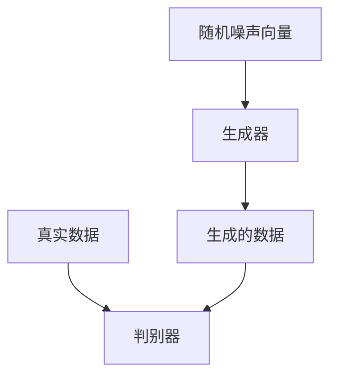

## 1.背景介绍

生成对抗网络（GAN）自从2014年由Ian Goodfellow和他的同事们首次提出以来，已经在计算机视觉领域引起了巨大的变革。GAN是一种创新的机器学习框架，被设计用来生成与真实数据分布相似的人造数据。它的核心思想是让两个模型相互竞争：一个生成器（Generator）和一个判别器（Discriminator）。生成器负责生成数据，而判别器的任务是区分生成的数据和真实数据。在这个过程中，生成器不断改进其生成的数据，以使其更接近真实数据，而判别器则努力提高其识别能力。

## 2.核心概念与联系

在GAN的架构中，生成器是一个关键的组成部分。它是一个神经网络，负责从一个随机噪声向量中生成数据。生成器的目标是生成的数据能够“欺骗”判别器，使其无法区分生成的数据和真实数据。

生成器和判别器之间的关系可以类比于造假者和警察。生成器（造假者）试图制造假钞，而判别器（警察）的任务是识别出假钞。在这个“游戏”中，生成器和判别器不断提升自己的技能，最终生成器能够制造出越来越逼真的假钞，判别器也变得越来越擅长于识别假钞。



## 3.核心算法原理具体操作步骤

生成器的训练过程是通过反向传播和优化器来实现的，具体步骤如下：

1. 生成随机噪声向量。
2. 使用生成器生成数据。
3. 使用判别器对生成的数据进行预测。
4. 计算损失函数，这里通常使用的是交叉熵损失函数。
5. 使用反向传播算法计算梯度。
6. 使用优化器（如Adam）更新生成器的权重。

这个过程会不断重复，直到生成器的性能达到满意的程度。

## 4.数学模型和公式详细讲解举例说明

生成器的训练过程可以用数学公式来描述。首先，我们定义损失函数 $L$，它是判别器对生成数据的预测和真实标签之间的交叉熵：

$$ L = -\frac{1}{N}\sum_{i=1}^{N} y_i log(\hat{y_i}) + (1 - y_i) log(1 - \hat{y_i}) $$

其中，$N$ 是批次大小，$y_i$ 是真实标签，$\hat{y_i}$ 是判别器对生成数据的预测。对于生成器，真实标签 $y_i$ 总是1，因为生成器的目标是生成的数据被判别器判断为真。

然后，我们使用反向传播算法计算损失函数 $L$ 关于生成器权重 $W$ 的梯度：

$$ \frac{\partial L}{\partial W} = \frac{1}{N}\sum_{i=1}^{N} \frac{\partial L}{\partial \hat{y_i}} \frac{\partial \hat{y_i}}{\partial W} $$

最后，我们使用优化器更新生成器的权重：

$$ W = W - \alpha \frac{\partial L}{\partial W} $$

其中，$\alpha$ 是学习率，它控制了权重更新的步长。

## 5.项目实践：代码实例和详细解释说明

接下来，我们将使用PyTorch实现一个简单的生成器。首先，我们定义生成器的架构。这里我们使用一个简单的全连接神经网络，输入是一个100维的随机噪声向量，输出是一个784维的向量，代表一个28x28的图像。

```python
import torch
import torch.nn as nn

class Generator(nn.Module):
    def __init__(self):
        super(Generator, self).__init__()
        self.main = nn.Sequential(
            nn.Linear(100, 256),
            nn.ReLU(),
            nn.Linear(256, 512),
            nn.ReLU(),
            nn.Linear(512, 1024),
            nn.ReLU(),
            nn.Linear(1024, 784),
            nn.Tanh()
        )

    def forward(self, input):
        return self.main(input)
```

然后，我们定义损失函数和优化器：

```python
criterion = nn.BCELoss()
optimizer = torch.optim.Adam(generator.parameters(), lr=0.0002)
```

接下来，我们开始训练生成器：

```python
for epoch in range(num_epochs):
    for i, (images, _) in enumerate(dataloader):
        # 创建标签，1表示真实图像，0表示生成图像
        real_labels = torch.ones(batch_size, 1).to(device)
        fake_labels = torch.zeros(batch_size, 1).to(device)

        # 训练生成器
        z = torch.randn(batch_size, 100).to(device)
        fake_images = generator(z)
        outputs = discriminator(fake_images)
        g_loss = criterion(outputs, real_labels)
        optimizer.zero_grad()
        g_loss.backward()
        optimizer.step()
```

在这个代码中，我们首先生成一个随机噪声向量，然后使用生成器生成图像。然后，我们使用判别器对生成的图像进行预测，计算损失函数，然后使用反向传播和优化器更新生成器的权重。

## 6.实际应用场景

生成器在许多实际应用中都有重要的作用。例如，它可以用于生成新的图像、音频、文本等。在计算机视觉领域，生成器可以用于生成新的人脸图像、动漫角色图像等。在自然语言处理领域，生成器可以用于生成新的句子、文章等。此外，生成器还可以用于生成新的数据样本，用于增强机器学习模型的训练。

## 7.工具和资源推荐

如果你对生成器和GAN感兴趣，以下是一些推荐的工具和资源：

1. [PyTorch](https://pytorch.org/)：一个强大的深度学习框架，易于理解，非常适合初学者。
2. [TensorFlow](https://www.tensorflow.org/)：另一个强大的深度学习框架，由Google开发，有很多高级功能和优化。
3. [Keras](https://keras.io/)：一个高级深度学习框架，可以运行在TensorFlow之上，易于使用，适合初学者。
4. [GANs in Action](https://www.manning.com/books/gans-in-action)：一本关于GAN的书籍，包含了很多实例和详细的解释。
5. [GAN Zoo](https://github.com/hindupuravinash/the-gan-zoo)：一个包含了所有GAN变体的列表，非常全面。

## 8.总结：未来发展趋势与挑战

生成器和GAN是深度学习领域的热门研究方向，它们的潜力巨大。然而，它们也面临着一些挑战，如模式崩溃、训练不稳定等。未来，我们期待有更多的研究能够解决这些问题，进一步提升生成器和GAN的性能。

## 9.附录：常见问题与解答

1. **生成器和判别器是如何一起训练的？**

生成器和判别器是交替训练的。在一个训练循环中，首先固定生成器，更新判别器的权重，然后固定判别器，更新生成器的权重。

2. **生成器的输出是什么？**

生成器的输出取决于你想要生成的数据。例如，如果你想生成图像，那么生成器的输出就是一个图像；如果你想生成音频，那么生成器的输出就是一个音频信号。

3. **生成器和判别器的架构是什么样的？**

生成器和判别器的架构可以是任何类型的神经网络，如全连接网络、卷积神经网络、循环神经网络等。通常，生成器的架构和判别器的架构是对称的。

4. **生成器是如何生成新的数据的？**

生成器从一个随机噪声向量开始，然后通过一系列的神经网络层，将这个噪声向量转化为数据。

作者：禅与计算机程序设计艺术 / Zen and the Art of Computer Programming