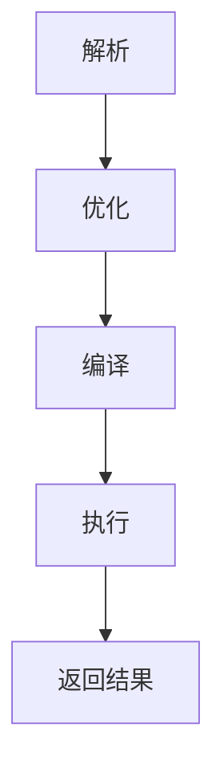

# HiveQL原理与代码实例讲解

## 1.背景介绍

在大数据时代，数据的存储和处理变得尤为重要。Apache Hive作为一个基于Hadoop的数据仓库工具，提供了一个类似SQL的查询语言——HiveQL，使得用户可以方便地对存储在Hadoop分布式文件系统（HDFS）中的大规模数据进行查询和分析。HiveQL的出现极大地降低了大数据处理的门槛，使得数据分析师和工程师可以使用熟悉的SQL语法进行大数据处理，而不需要深入了解底层的MapReduce编程模型。

## 2.核心概念与联系

### 2.1 Hive与Hadoop的关系

Hive是构建在Hadoop之上的数据仓库工具，主要用于数据的存储、查询和分析。Hadoop提供了分布式存储和计算的基础设施，而Hive则提供了一个高层次的抽象，使得用户可以使用SQL语法进行数据操作。

### 2.2 HiveQL的基本概念

HiveQL（Hive Query Language）是Hive提供的一种查询语言，类似于SQL。它支持数据定义语言（DDL）、数据操作语言（DML）和数据查询语言（DQL）。通过HiveQL，用户可以创建表、插入数据、查询数据等。

### 2.3 HiveQL与SQL的区别

虽然HiveQL与SQL语法相似，但它们之间还是存在一些区别。HiveQL的查询是转换为MapReduce任务在Hadoop上执行的，因此在性能和功能上与传统的关系型数据库SQL有所不同。例如，HiveQL不支持事务、索引等高级功能。

## 3.核心算法原理具体操作步骤

### 3.1 HiveQL查询的执行流程

HiveQL查询的执行流程可以分为以下几个步骤：

1. **解析**：将HiveQL查询语句解析为抽象语法树（AST）。
2. **优化**：对AST进行逻辑优化和物理优化，生成优化后的查询计划。
3. **编译**：将优化后的查询计划编译为一系列MapReduce任务。
4. **执行**：在Hadoop集群上执行MapReduce任务，并将结果返回给用户。

以下是一个简单的Mermaid流程图，展示了HiveQL查询的执行流程：



### 3.2 MapReduce任务的生成

HiveQL查询在编译阶段会被转换为一系列的MapReduce任务。每个任务负责处理查询的一个子任务，例如过滤、聚合、连接等。通过将查询分解为多个MapReduce任务，Hive能够充分利用Hadoop的分布式计算能力。

## 4.数学模型和公式详细讲解举例说明

### 4.1 数据分区与分桶

在Hive中，数据可以通过分区和分桶进行组织，以提高查询效率。分区是将数据按某个字段的值进行划分，每个分区对应一个目录。分桶是将数据按某个字段的哈希值进行划分，每个桶对应一个文件。

假设我们有一个包含用户信息的表`users`，我们可以按用户的注册日期进行分区，并按用户ID进行分桶：

```sql
CREATE TABLE users (
    user_id INT,
    user_name STRING,
    registration_date DATE
)
PARTITIONED BY (registration_date)
CLUSTERED BY (user_id) INTO 10 BUCKETS;
```

### 4.2 数据聚合与分组

数据聚合是HiveQL中常用的操作，例如计算平均值、总和、计数等。假设我们有一个包含订单信息的表`orders`，我们可以按用户ID对订单金额进行聚合，计算每个用户的总订单金额：

```sql
SELECT user_id, SUM(order_amount) AS total_amount
FROM orders
GROUP BY user_id;
```

### 4.3 数学公式示例

假设我们要计算每个用户的平均订单金额，可以使用以下公式：

$$
\text{平均订单金额} = \frac{\text{总订单金额}}{\text{订单数量}}
$$

在HiveQL中，可以使用以下查询实现：

```sql
SELECT user_id, AVG(order_amount) AS avg_amount
FROM orders
GROUP BY user_id;
```

## 5.项目实践：代码实例和详细解释说明

### 5.1 创建数据库和表

首先，我们需要创建一个数据库和表来存储数据：

```sql
CREATE DATABASE IF NOT EXISTS mydb;
USE mydb;

CREATE TABLE users (
    user_id INT,
    user_name STRING,
    registration_date DATE
)
PARTITIONED BY (registration_date)
CLUSTERED BY (user_id) INTO 10 BUCKETS;

CREATE TABLE orders (
    order_id INT,
    user_id INT,
    order_amount DOUBLE,
    order_date DATE
);
```

### 5.2 插入数据

接下来，我们向表中插入一些数据：

```sql
INSERT INTO TABLE users PARTITION (registration_date='2023-01-01')
VALUES (1, 'Alice', '2023-01-01'),
       (2, 'Bob', '2023-01-01');

INSERT INTO TABLE orders
VALUES (1, 1, 100.0, '2023-01-01'),
       (2, 1, 200.0, '2023-01-02'),
       (3, 2, 150.0, '2023-01-01');
```

### 5.3 查询数据

我们可以使用HiveQL查询数据，例如计算每个用户的总订单金额和平均订单金额：

```sql
SELECT user_id, SUM(order_amount) AS total_amount, AVG(order_amount) AS avg_amount
FROM orders
GROUP BY user_id;
```

### 5.4 解释查询结果

上述查询将返回每个用户的总订单金额和平均订单金额。例如，对于用户ID为1的用户，查询结果可能如下：

| user_id | total_amount | avg_amount |
|---------|--------------|------------|
| 1       | 300.0        | 150.0      |
| 2       | 150.0        | 150.0      |

## 6.实际应用场景

### 6.1 数据仓库

Hive常用于构建企业级数据仓库，存储和管理大规模数据。通过HiveQL，数据分析师可以方便地对数据进行查询和分析，生成报表和数据洞察。

### 6.2 日志分析

Hive可以用于分析服务器日志、应用日志等大规模日志数据。通过将日志数据导入Hive表中，用户可以使用HiveQL进行复杂的查询和分析，发现系统性能瓶颈和异常情况。

### 6.3 数据ETL

Hive可以用于数据的抽取、转换和加载（ETL）过程。通过HiveQL，用户可以对原始数据进行清洗、转换和聚合，生成符合业务需求的数据集。

## 7.工具和资源推荐

### 7.1 Hive客户端工具

- **Beeline**：Hive提供的命令行客户端工具，支持连接到Hive服务器并执行HiveQL查询。
- **Hue**：一个开源的Web界面，支持Hive查询和数据管理。

### 7.2 学习资源

- **《Programming Hive》**：一本详细介绍Hive的书籍，适合初学者和进阶用户。
- **Apache Hive官网**：提供了Hive的官方文档和教程。

## 8.总结：未来发展趋势与挑战

随着大数据技术的不断发展，Hive也在不断演进。未来，Hive可能会在以下几个方面有所突破：

- **性能优化**：通过引入新的查询优化技术和存储格式，提高查询性能。
- **功能扩展**：支持更多的SQL功能和高级分析功能，例如窗口函数、子查询等。
- **与其他大数据工具的集成**：与Spark、Flink等大数据处理工具的深度集成，提供更强大的数据处理能力。

然而，Hive也面临一些挑战，例如如何在保证性能的同时支持更多的SQL功能，如何处理实时数据等。

## 9.附录：常见问题与解答

### 9.1 HiveQL与SQL的主要区别是什么？

HiveQL与SQL语法相似，但HiveQL的查询是转换为MapReduce任务在Hadoop上执行的，因此在性能和功能上与传统的关系型数据库SQL有所不同。例如，HiveQL不支持事务、索引等高级功能。

### 9.2 如何提高Hive查询的性能？

可以通过以下几种方法提高Hive查询的性能：
- 使用分区和分桶对数据进行组织。
- 使用合适的文件格式，例如ORC、Parquet等。
- 调整Hive的配置参数，例如内存、并行度等。

### 9.3 Hive支持哪些数据类型？

Hive支持多种数据类型，包括基本数据类型（如INT、STRING、DOUBLE等）和复杂数据类型（如ARRAY、MAP、STRUCT等）。

### 9.4 如何处理Hive中的空值？

在Hive中，可以使用`IS NULL`和`IS NOT NULL`来判断空值。例如：

```sql
SELECT * FROM users WHERE user_name IS NULL;
```

### 9.5 Hive支持事务吗？

Hive不支持传统关系型数据库中的事务，但支持ACID（原子性、一致性、隔离性、持久性）特性的表，可以通过配置和使用ACID表来实现类似事务的功能。

---

作者：禅与计算机程序设计艺术 / Zen and the Art of Computer Programming