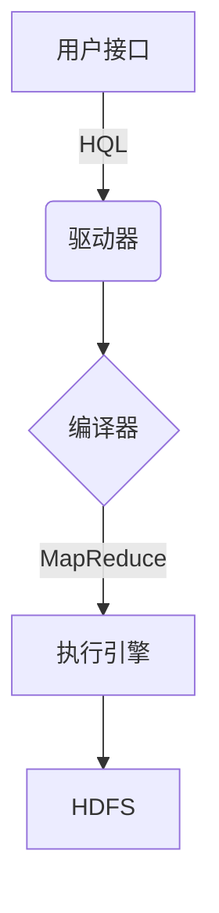
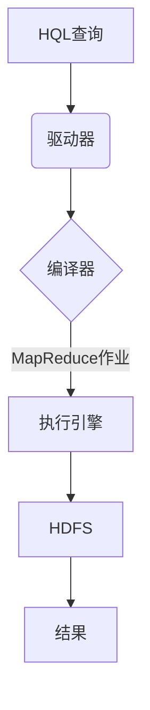

# Hive数据仓库原理与HQL代码实例讲解

## 1.背景介绍

在当今大数据时代，企业需要处理海量的结构化和非结构化数据。Apache Hive是一种建立在Hadoop之上的数据仓库工具，它提供了一种类似SQL的查询语言(HQL)来分析存储在Hadoop分布式文件系统(HDFS)中的大数据。Hive的出现极大地降低了大数据分析的门槛,使得数据分析师和开发人员无需直接编写MapReduce程序,就可以使用类似SQL的语法来查询和处理大数据。

### Hive架构

Hive采用了基于HDFS的分布式架构,能够高效地存储和处理大规模数据集。其核心组件包括:



1. **用户接口**: 用户可以通过命令行(CLI)、JDBC/ODBC或Web UI等方式与Hive交互。
2. **驱动器(Driver)**: 负责接收HQL查询,并与其他组件进行交互。
3. **编译器(Compiler)**: 将HQL查询转换为一系列的MapReduce作业。
4. **执行引擎(Execution Engine)**: 在Hadoop集群上执行MapReduce作业。
5. **HDFS**: 用于存储输入数据和输出结果。

### Hive的优势

- **SQL类查询语言**: Hive提供了类似SQL的查询语言HQL,降低了大数据分析的学习曲线。
- **容错性**: 由于建立在Hadoop之上,Hive继承了HDFS的容错性和可伸缩性。
- **成本效益**: 基于开源的Hadoop,Hive提供了一种经济高效的大数据分析解决方案。
- **可扩展性**: Hive可以在Hadoop集群上进行扩展,以处理更大规模的数据集。

## 2.核心概念与联系

### 表(Table)

Hive中的表类似于传统数据库中的表,用于组织和存储数据。Hive支持多种文件格式,如纯文本、SequenceFile、RCFile等。表由行(Row)和列(Column)组成,每一列都有相应的数据类型。

### 数据库(Database)

Hive中的数据库类似于传统数据库中的数据库,用于组织和管理表。一个Hive实例可以包含多个数据库,每个数据库又可以包含多个表。

### 分区(Partition)

分区是Hive中一种重要的优化技术,可以根据指定的键(如日期、地区等)对表进行逻辑分区。这样在查询时只需扫描相关的分区,而不必扫描整个表,从而提高查询效率。

### Bucket

Bucket是Hive中的一种数据组织方式,可以进一步优化查询性能。Bucket根据指定的列对表进行哈希分区,每个Bucket存储表的一部分数据。在处理部分数据时,只需扫描相关的Bucket,而不必扫描整个表。

## 3.核心算法原理具体操作步骤

Hive的查询执行过程可以概括为以下几个步骤:



1. **解析HQL查询**: 用户通过命令行、JDBC/ODBC或Web UI提交HQL查询。
2. **编译为MapReduce作业**: Hive的编译器将HQL查询转换为一系列的MapReduce作业。
3. **执行MapReduce作业**: 执行引擎在Hadoop集群上执行MapReduce作业,处理存储在HDFS中的数据。
4. **生成结果**: MapReduce作业的输出结果存储在HDFS中,供用户查询和分析。

### MapReduce作业执行原理

MapReduce是Hadoop的核心计算模型,用于并行处理大规模数据集。MapReduce作业分为两个阶段:Map阶段和Reduce阶段。

1. **Map阶段**: 输入数据被划分为多个数据块,每个数据块由一个Map任务处理。Map任务将输入数据转换为键值对(Key-Value)形式,并进行必要的过滤和转换操作。
2. **Reduce阶段**: Map阶段的输出被分区(Partition)和排序(Sort),然后由Reduce任务处理。Reduce任务对相同键的值进行聚合操作,生成最终结果。

MapReduce作业的执行过程由JobTracker(Hadoop 2.x之前)或ResourceManager(Hadoop 2.x及更高版本)协调和管理。

## 4.数学模型和公式详细讲解举例说明

在Hive中,一些常用的数学函数和统计函数可以使用内置的用户定义函数(UDF)来实现。以下是一些常见的数学公式和函数:

### 平均值(AVG)

$$\text{AVG}(x_1, x_2, \ldots, x_n) = \frac{1}{n} \sum_{i=1}^{n} x_i$$

在Hive中,可以使用`avg`函数计算平均值:

```sql
SELECT avg(column_name) FROM table_name;
```

### 标准差(STDDEV)

$$\text{STDDEV}(x_1, x_2, \ldots, x_n) = \sqrt{\frac{1}{n} \sum_{i=1}^{n} (x_i - \mu)^2}$$

其中,μ是平均值。在Hive中,可以使用`std`函数计算标准差:

```sql
SELECT std(column_name) FROM table_name;
```

### 相关系数(CORR)

相关系数用于衡量两个变量之间的线性相关程度,公式如下:

$$\text{CORR}(X, Y) = \frac{\text{COV}(X, Y)}{\sigma_X \sigma_Y}$$

其中,COV(X, Y)是X和Y的协方差,σX和σY分别是X和Y的标准差。在Hive中,可以使用`corr`函数计算相关系数:

```sql
SELECT corr(column1, column2) FROM table_name;
```

### 线性回归

线性回归是一种常用的机器学习算法,用于建立自变量和因变量之间的线性关系模型。线性回归模型的公式如下:

$$y = \beta_0 + \beta_1 x_1 + \beta_2 x_2 + \ldots + \beta_n x_n + \epsilon$$

其中,y是因变量,x1、x2、...、xn是自变量,β0是常数项,β1、β2、...、βn是回归系数,ε是残差项。

在Hive中,可以使用第三方库(如Apache MADlib)来实现线性回归算法。

## 5.项目实践:代码实例和详细解释说明

在本节中,我们将通过一个实际案例来演示如何使用Hive进行数据分析。假设我们有一个包含销售记录的表`sales`,其中包含以下列:

- `product_id`: 产品ID
- `category`: 产品类别
- `price`: 产品价格
- `quantity`: 销售数量
- `sale_date`: 销售日期

### 创建表

首先,我们需要创建一个表来存储销售数据。在Hive中,可以使用`CREATE TABLE`语句创建表:

```sql
CREATE TABLE sales (
    product_id INT,
    category STRING,
    price DOUBLE,
    quantity INT,
    sale_date DATE
)
ROW FORMAT DELIMITED
FIELDS TERMINATED BY ','
STORED AS TEXTFILE;
```

这个语句创建了一个名为`sales`的表,并指定了每一列的数据类型。`ROW FORMAT DELIMITED`子句指定了数据文件的格式,`FIELDS TERMINATED BY ','`表示每一行的字段由逗号分隔,`STORED AS TEXTFILE`表示数据以纯文本格式存储。

### 加载数据

接下来,我们需要将销售数据加载到`sales`表中。假设我们有一个名为`sales_data.txt`的文本文件,其中包含了销售记录,每一行代表一条记录,字段由逗号分隔。我们可以使用`LOAD DATA`语句将数据加载到表中:

```sql
LOAD DATA INPATH '/path/to/sales_data.txt' INTO TABLE sales;
```

这个语句将`/path/to/sales_data.txt`文件中的数据加载到`sales`表中。

### 查询数据

加载完数据后,我们就可以使用HQL语句对数据进行查询和分析了。以下是一些示例查询:

1. 计算每个产品类别的总销售额:

```sql
SELECT category, SUM(price * quantity) AS total_sales
FROM sales
GROUP BY category;
```

2. 查找销售额最高的前5个产品:

```sql
SELECT product_id, SUM(price * quantity) AS total_sales
FROM sales
GROUP BY product_id
ORDER BY total_sales DESC
LIMIT 5;
```

3. 计算每个月的总销售额:

```sql
SELECT MONTH(sale_date) AS month, SUM(price * quantity) AS total_sales
FROM sales
GROUP BY MONTH(sale_date);
```

4. 使用`CASE`语句根据价格范围对产品进行分类:

```sql
SELECT product_id,
    CASE
        WHEN price < 10 THEN 'Low'
        WHEN price BETWEEN 10 AND 20 THEN 'Medium'
        ELSE 'High'
    END AS price_category,
    SUM(price * quantity) AS total_sales
FROM sales
GROUP BY product_id, price_category;
```

这些示例展示了如何使用HQL进行数据聚合、过滤和分析。您可以根据具体的业务需求编写更复杂的查询。

## 6.实际应用场景

Hive广泛应用于各种大数据分析场景,包括但不限于:

1. **电子商务分析**: 分析用户购买行为、销售趋势和产品偏好等,为营销决策提供支持。
2. **网络日志分析**: 分析网站访问日志,了解用户浏览习惯和流量模式,优化网站性能和用户体验。
3. **金融风险分析**: 分析金融交易数据,识别潜在的风险和欺诈行为。
4. **社交网络分析**: 分析用户社交行为和关系网络,为推荐系统和广告投放提供依据。
5. **物联网数据分析**: 分析来自各种传感器和设备的大量数据,用于预测维护、优化资源利用等。
6. **生物信息学分析**: 分析基因组数据、蛋白质序列等,用于疾病研究和新药开发。

总的来说,Hive为各种行业提供了一种高效、经济的大数据分析解决方案,帮助企业从海量数据中发现有价值的见解和模式。

## 7.工具和资源推荐

在使用Hive进行大数据分析时,以下工具和资源可能会很有帮助:

1. **Hive官方文档**: Apache Hive的官方文档提供了详细的安装指南、语法参考和最佳实践。
2. **Hive视频教程**: 网上有许多免费的Hive视频教程,可以帮助您快速入门和掌握核心概念。
3. **Hive书籍**: 一些优秀的Hive书籍,如《Hive编程指南》和《Hive实战》,可以深入探讨Hive的原理和高级用法。
4. **Hive社区**: 加入Hive的在线社区,如Apache邮件列表和Stack Overflow,可以获取最新动态和解决疑难问题。
5. **Hive GUI工具**: 一些图形用户界面(GUI)工具,如Hue和DBeaver,可以提供更友好的查询编辑和可视化体验。
6. **Hive性能优化工具**: 工具如Hive性能优化器(HPO)和Tez视图,可以帮助您优化查询性能和调试MapReduce作业。
7. **Hive第三方库**: 一些第三方库,如Apache MADlib和Apache Spark,可以扩展Hive的功能,支持更高级的数据分析和机器学习算法。

利用这些工具和资源,您可以更高效地使用Hive进行大数据分析,并不断提升您的技能和知识。

## 8.总结:未来发展趋势与挑战

Hive作为一种大数据分析工具,已经得到了广泛的应用和发展。然而,随着大数据领域的不断演进,Hive也面临着一些挑战和发展趋势:

1. **实时查询能力**: 传统的Hive查询是基于批处理的,无法满足实时查询的需求。未来,Hive需要提供更好的实时查询支持,以适应新兴的流式数据处理场景。
2. **机器学习和人工智能集成**: 随着机器学习和人工智能技术的发展,Hive需要更好地与这些技术集