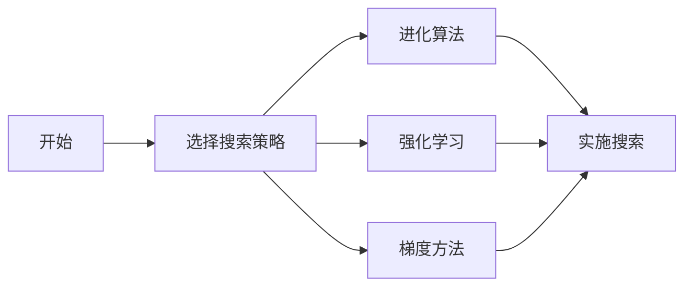

# Neural Architecture Search (NAS)原理与代码实例讲解

## 1. 背景介绍

在深度学习领域，神经网络的结构设计一直是一个复杂而关键的问题。传统上，这一任务依赖于研究者的直觉和经验，但这种方法既耗时又低效。Neural Architecture Search (NAS)的出现，旨在通过自动化搜索最优网络结构，来提高神经网络设计的效率和性能。

## 2. 核心概念与联系

### 2.1 NAS的定义
NAS是一种利用机器学习技术自动设计神经网络架构的方法。它通过定义一个搜索空间，然后在这个空间内搜索最优的网络结构。

### 2.2 搜索空间
搜索空间定义了所有可能的网络结构，包括层的类型、数量、连接方式等。

### 2.3 搜索策略
搜索策略决定了如何在搜索空间中寻找最优结构，常见的策略包括进化算法、强化学习、梯度方法等。

### 2.4 性能评估
性能评估是指如何评价一个网络结构的好坏，通常是通过在验证集上的准确率或其他指标来衡量。

## 3. 核心算法原理具体操作步骤

### 3.1 定义搜索空间


### 3.2 选择搜索策略


### 3.3 性能评估与反馈


## 4. 数学模型和公式详细讲解举例说明

### 4.1 搜索空间的数学表示
$$ S = \{ L, C, H \} $$
其中 $L$ 表示层的类型，$C$ 表示连接模式，$H$ 表示超参数的范围。

### 4.2 搜索策略的优化目标
$$ \max_{\alpha \in S} \mathcal{F}(v(\alpha)) $$
其中 $\alpha$ 表示网络结构，$v(\alpha)$ 表示在验证集上的性能，$\mathcal{F}$ 表示性能评估函数。

### 4.3 强化学习中的奖励函数
$$ R(\alpha) = \text{Accuracy}(v(\alpha)) - \lambda \cdot \text{Complexity}(\alpha) $$
其中 $\lambda$ 是平衡准确率和复杂度的系数。

## 5. 项目实践：代码实例和详细解释说明

### 5.1 环境搭建
```python
# 安装必要的库
!pip install tensorflow keras
```

### 5.2 定义搜索空间
```python
# 定义层类型
layer_types = ['Conv', 'Pool', 'Dense']

# 定义连接模式
connection_modes = ['Sequential', 'Residual']

# 定义超参数范围
hyperparameters = {
    'filters': [16, 32, 64],
    'kernel_size': [3, 5],
    'pool_size': [2],
    'units': [64, 128, 256]
}
```

### 5.3 实现搜索策略
```python
# 示例：使用随机搜索作为搜索策略
import random

def random_search(space, num_samples):
    sampled_architectures = []
    for _ in range(num_samples):
        architecture = {
            'layers': random.choice(space['layer_types']),
            'connection': random.choice(space['connection_modes']),
            'hyperparameters': {k: random.choice(v) for k, v in space['hyperparameters'].items()}
        }
        sampled_architectures.append(architecture)
    return sampled_architectures
```

### 5.4 性能评估
```python
def evaluate_architecture(architecture, data):
    # 构建和训练模型...
    # 在验证集上评估模型...
    return accuracy

# 选择最优结构
best_architecture = max(sampled_architectures, key=lambda arch: evaluate_architecture(arch, validation_data))
```

## 6. 实际应用场景

NAS在多个领域都有广泛的应用，包括但不限于图像识别、自然语言处理、医学图像分析等。

## 7. 工具和资源推荐

- TensorFlow和Keras：用于构建和训练模型的库。
- NAS-Bench-101：一个用于NAS研究的公共数据集。
- AutoKeras：一个自动化机器学习库，内置了NAS功能。

## 8. 总结：未来发展趋势与挑战

NAS技术仍在快速发展中，未来的趋势包括更高效的搜索算法、更广泛的应用场景以及更深入的理论研究。同时，NAS面临的挑战包括计算资源的大量需求、搜索空间的设计以及性能评估的准确性。

## 9. 附录：常见问题与解答

Q1: NAS的计算成本是否很高？
A1: 是的，但随着算法的优化和硬件的发展，成本正在逐渐降低。

Q2: NAS是否总能找到最优结构？
A2: 不一定，但它能够大大提高找到高性能结构的概率。

Q3: 如何选择合适的搜索策略？
A3: 这取决于具体问题、计算资源和期望的性能。通常需要根据实际情况进行试验和调整。

作者：禅与计算机程序设计艺术 / Zen and the Art of Computer Programming