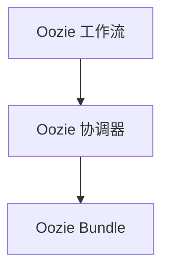

# Oozie Bundle原理与代码实例讲解

## 1.背景介绍

Apache Oozie 是一个工作流调度系统，专为管理 Apache Hadoop 作业而设计。Oozie 支持多种类型的 Hadoop 作业，包括 MapReduce、Pig、Hive 等。Oozie Bundle 是 Oozie 提供的一种高级功能，用于管理和调度一组相关的工作流和协调器作业。通过 Oozie Bundle，用户可以更方便地管理复杂的作业依赖关系和调度需求。

## 2.核心概念与联系

### 2.1 Oozie 工作流

Oozie 工作流是一个有向无环图（DAG），其中每个节点代表一个作业或控制流操作（如决策、并行执行等）。工作流定义了作业的执行顺序和依赖关系。

### 2.2 Oozie 协调器

Oozie 协调器用于基于时间或数据可用性来触发工作流。它允许用户定义复杂的调度规则，如每天运行一次、每小时运行一次等。

### 2.3 Oozie Bundle

Oozie Bundle 是一个高级功能，用于管理和调度一组相关的工作流和协调器作业。Bundle 允许用户定义一组作业的执行顺序和依赖关系，从而简化了复杂作业的管理。

### 2.4 核心联系

Oozie 工作流、协调器和 Bundle 之间的关系可以用以下 Mermaid 流程图表示：



## 3.核心算法原理具体操作步骤

### 3.1 工作流定义

Oozie 工作流定义使用 XML 格式，包含以下主要元素：

- `<workflow-app>`：工作流的根元素。
- `<start>`：工作流的起始节点。
- `<action>`：表示一个作业。
- `<decision>`：用于条件判断。
- `<fork>` 和 `<join>`：用于并行执行。

### 3.2 协调器定义

Oozie 协调器定义也使用 XML 格式，包含以下主要元素：

- `<coordinator-app>`：协调器的根元素。
- `<action>`：表示一个工作流实例。
- `<frequency>`：定义作业的调度频率。
- `<dataset>`：定义数据集的可用性。

### 3.3 Bundle 定义

Oozie Bundle 定义同样使用 XML 格式，包含以下主要元素：

- `<bundle-app>`：Bundle 的根元素。
- `<coordinator>`：表示一个协调器实例。
- `<controls>`：定义 Bundle 的控制参数，如启动时间、结束时间等。

## 4.数学模型和公式详细讲解举例说明

### 4.1 工作流的数学模型

Oozie 工作流可以用有向无环图（DAG）表示，其中每个节点代表一个作业，边表示作业之间的依赖关系。设 $G = (V, E)$ 为一个有向无环图，其中 $V$ 是节点集合，$E$ 是边集合。

### 4.2 协调器的数学模型

Oozie 协调器可以用时间序列模型表示。设 $T$ 为时间序列，$F(T)$ 为调度函数，定义为：

$$
F(T) = \{t_1, t_2, \ldots, t_n\}
$$

其中 $t_i$ 表示第 $i$ 次调度的时间点。

### 4.3 Bundle 的数学模型

Oozie Bundle 可以用集合模型表示。设 $B$ 为一个 Bundle，包含 $n$ 个协调器，定义为：

$$
B = \{C_1, C_2, \ldots, C_n\}
$$

其中 $C_i$ 表示第 $i$ 个协调器。

## 5.项目实践：代码实例和详细解释说明

### 5.1 工作流定义示例

以下是一个简单的 Oozie 工作流定义示例：

```xml
<workflow-app name="example-wf" xmlns="uri:oozie:workflow:0.5">
    <start to="first-action"/>
    <action name="first-action">
        <map-reduce>
            <job-tracker>${jobTracker}</job-tracker>
            <name-node>${nameNode}</name-node>
            <configuration>
                <property>
                    <name>mapred.mapper.class</name>
                    <value>org.apache.hadoop.examples.SleepJob</value>
                </property>
            </configuration>
        </map-reduce>
        <ok to="end"/>
        <error to="fail"/>
    </action>
    <kill name="fail">
        <message>Job failed, error message[${wf:errorMessage(wf:lastErrorNode())}]</message>
    </kill>
    <end name="end"/>
</workflow-app>
```

### 5.2 协调器定义示例

以下是一个简单的 Oozie 协调器定义示例：

```xml
<coordinator-app name="example-coord" frequency="5" start="2023-01-01T00:00Z" end="2023-12-31T23:59Z" timezone="UTC" xmlns="uri:oozie:coordinator:0.4">
    <action>
        <workflow>
            <app-path>${wfAppPath}</app-path>
        </workflow>
    </action>
</coordinator-app>
```

### 5.3 Bundle 定义示例

以下是一个简单的 Oozie Bundle 定义示例：

```xml
<bundle-app name="example-bundle" xmlns="uri:oozie:bundle:0.2">
    <coordinator name="coord-1">
        <app-path>${coordAppPath1}</app-path>
        <configuration>
            <property>
                <name>property1</name>
                <value>value1</value>
            </property>
        </configuration>
    </coordinator>
    <coordinator name="coord-2">
        <app-path>${coordAppPath2}</app-path>
        <configuration>
            <property>
                <name>property2</name>
                <value>value2</value>
            </property>
        </configuration>
    </coordinator>
</bundle-app>
```

## 6.实际应用场景

### 6.1 数据处理管道

Oozie Bundle 常用于管理复杂的数据处理管道。例如，一个数据处理管道可能包含多个步骤，每个步骤由不同的工作流和协调器作业组成。通过 Oozie Bundle，可以方便地管理这些步骤的执行顺序和依赖关系。

### 6.2 数据分析任务

在数据分析任务中，通常需要定期运行多个数据处理和分析作业。Oozie Bundle 可以帮助用户定义和调度这些作业，从而简化任务管理。

### 6.3 数据集成

在数据集成场景中，可能需要从多个数据源提取数据并进行处理。Oozie Bundle 可以帮助用户定义和调度这些数据集成作业，从而确保数据处理的顺序和依赖关系。

## 7.工具和资源推荐

### 7.1 Oozie 官方文档

Oozie 官方文档是学习和使用 Oozie 的最佳资源。它提供了详细的使用指南、API 文档和示例代码。

### 7.2 Oozie 社区

Oozie 社区是一个活跃的用户和开发者社区，用户可以在社区中提问、分享经验和获取帮助。

### 7.3 Hadoop 生态系统工具

Oozie 是 Hadoop 生态系统的一部分，用户可以结合使用其他 Hadoop 工具（如 HDFS、MapReduce、Hive 等）来构建和管理数据处理作业。

## 8.总结：未来发展趋势与挑战

### 8.1 未来发展趋势

随着大数据技术的不断发展，Oozie 作为一个成熟的工作流调度系统，将继续在大数据处理和分析领域发挥重要作用。未来，Oozie 可能会进一步集成更多的 Hadoop 生态系统工具，并提供更强大的调度和管理功能。

### 8.2 挑战

尽管 Oozie 功能强大，但其配置和使用相对复杂，用户需要具备一定的技术背景。此外，随着数据处理需求的不断增加，Oozie 需要不断优化性能和扩展性，以应对更大规模的数据处理任务。

## 9.附录：常见问题与解答

### 9.1 如何调试 Oozie 作业？

调试 Oozie 作业可以通过查看 Oozie 日志和 Hadoop 日志来进行。Oozie 提供了详细的日志记录，用户可以通过 Oozie Web UI 或命令行工具查看日志。

### 9.2 如何处理 Oozie 作业失败？

当 Oozie 作业失败时，用户可以通过查看日志来确定失败原因。常见的失败原因包括配置错误、数据不可用等。用户可以根据日志信息进行相应的调整和修复。

### 9.3 如何优化 Oozie 作业性能？

优化 Oozie 作业性能可以从以下几个方面入手：

- 优化作业配置：确保作业配置合理，避免资源浪费。
- 优化数据处理逻辑：简化数据处理逻辑，减少不必要的计算。
- 合理调度作业：避免同时运行过多的作业，合理安排作业调度时间。

---

作者：禅与计算机程序设计艺术 / Zen and the Art of Computer Programming