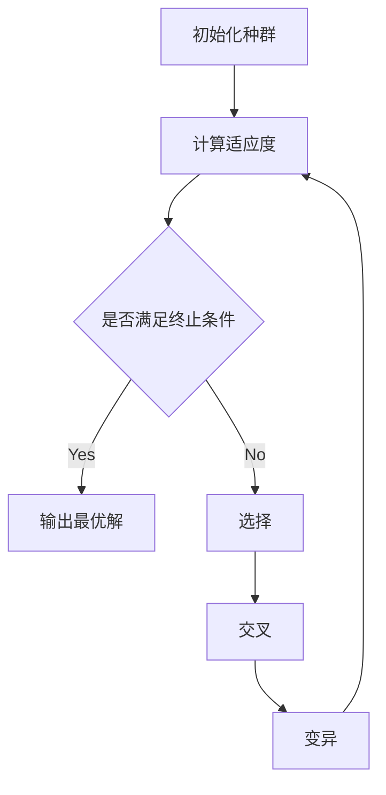

# Python机器学习实战：实现与优化遗传算法

## 1.背景介绍

### 1.1 什么是遗传算法？ 
遗传算法（Genetic Algorithm, GA）是一种模仿生物进化论中自然选择和遗传学机理的计算模型，用于在给定的约束条件下搜索最优解。它是20世纪70年代由美国密歇根大学的John Holland教授首先提出。作为一种启发式搜索算法，遗传算法已被广泛应用于组合优化、机器学习、信号处理、自适应控制和人工生命等领域。

### 1.2 遗传算法的优势
与传统的优化方法相比，遗传算法具有以下优点：

1. 直接对结构对象进行操作，不依赖于具体领域的知识。
2. 具有内在的隐并行性和更好的全局寻优能力。
3. 采用概率化的寻优方法，不需要确定的规则。
4. 可以自动获取和积累搜索空间的知识，自适应地控制搜索过程。

### 1.3 遗传算法在机器学习中的应用
遗传算法作为一种高效的优化算法，在机器学习领域有着广泛的应用。一些常见的应用场景包括：

1. 特征选择：使用遗传算法优化特征子集，提高模型性能。
2. 超参数优化：通过遗传算法搜索最优的模型超参数组合。
3. 神经网络结构优化：利用遗传算法优化神经网络的结构和连接权重。
4. 组合优化问题：如旅行商问题（TSP）、背包问题等的最优解搜索。

## 2.核心概念与联系

### 2.1 基本概念
- 个体（Individual）：问题的一个候选解。
- 种群（Population）：个体的集合。
- 基因（Gene）：个体编码的最小单位。
- 染色体（Chromosome）：由基因组成的字符串，表示个体的编码。
- 适应度（Fitness）：衡量个体优劣的指标。
- 选择（Selection）：根据适应度选择优秀个体。
- 交叉（Crossover）：模拟生物遗传过程，产生新个体。
- 变异（Mutation）：对个体的基因进行随机改变。

### 2.2 遗传算法的流程


## 3.核心算法原理具体操作步骤

### 3.1 初始化
随机生成一定数量的个体，构成初始种群。个体通常采用二进制编码或实数编码。

### 3.2 适应度计算
根据问题的目标函数，计算每个个体的适应度值。适应度函数设计要与问题紧密结合。

### 3.3 选择操作
采用一定的选择策略，如轮盘赌选择、锦标赛选择等，根据个体的适应度值选择一部分优秀个体。

### 3.4 交叉操作  
对选择出的个体进行两两随机配对，以一定的交叉概率对每对个体的染色体进行交叉重组，产生新的子代个体。常见的交叉方式有单点交叉、多点交叉和均匀交叉等。

### 3.5 变异操作
对新产生的个体以一定的变异概率进行变异，即对个体编码的某些基因值进行改变。通过变异引入新的基因，维持种群的多样性。

### 3.6 终止条件判断
若满足预设的终止条件（如达到最大迭代次数、适应度值收敛等），则终止进化；否则，回到步骤2继续迭代。

## 4.数学模型和公式详细讲解举例说明

### 4.1 个体编码
假设求解变量$x$的取值范围为$[a,b]$，采用二进制编码，编码长度为$l$，则$x$的编码可表示为：

$$x=a+\frac{b-a}{2^l-1}\times(\sum_{i=0}^{l-1}2^is_i)$$

其中，$s_i$为二进制编码的第$i$位，取值为0或1。

### 4.2 适应度函数
以求解最大值问题$\max f(x)$为例，个体$i$的适应度可定义为：

$$F(i)=\frac{f(x_i)-f_{\min}}{f_{\max}-f_{\min}}$$

其中，$x_i$为个体$i$对应的变量值，$f_{\max}$和$f_{\min}$分别为当前种群中的最大和最小目标函数值。

### 4.3 选择操作
以轮盘赌选择为例，个体$i$被选中的概率$p_i$与其适应度$F(i)$成正比：

$$p_i=\frac{F(i)}{\sum_{j=1}^{N}F(j)}$$

其中，$N$为种群大小。选择过程通过模拟轮盘赌的方式进行，适应度值较大的个体被选中的概率更高。

### 4.4 交叉操作
以单点交叉为例，对两个父代个体的染色体$A$和$B$，随机选择一个交叉点$k$，交叉产生两个子代个体$A'$和$B'$：

$$
\begin{aligned}
A' &= (a_1,\ldots,a_k,b_{k+1},\ldots,b_l) \\
B' &= (b_1,\ldots,b_k,a_{k+1},\ldots,a_l)
\end{aligned}
$$

其中，$a_i$和$b_i$分别为染色体$A$和$B$的第$i$位基因。

### 4.5 变异操作
以二进制编码的位翻转变异为例，对个体$A$的染色体，以变异概率$p_m$对每一位基因进行变异：

$$a'_i=\begin{cases}
1-a_i, & \text{if } \text{rand}()<p_m \\
a_i, & \text{otherwise}
\end{cases}$$

其中，$\text{rand}()$为$[0,1]$上的随机数，$a_i$和$a'_i$分别为变异前后的第$i$位基因。

## 5.项目实践：代码实例和详细解释说明

下面以求解函数$f(x)=x\sin(10\pi x)+2.0$在$x\in[-1,2]$上的最大值为例，给出Python实现的遗传算法代码。

```python
import numpy as np
import math

def objective(x):
    """目标函数"""
    return x * np.sin(10 * np.pi * x) + 2.0

def decode(chromosome, a, b, l):
    """解码染色体"""
    x = a + (b - a) / (2 ** l - 1) * sum(2 ** i * chromosome[i] for i in range(l))
    return x

def fitness(chromosome, a, b, l):
    """计算适应度"""
    x = decode(chromosome, a, b, l)
    return objective(x)

def selection(pop, fitness_values, num_parents):
    """轮盘赌选择"""
    probs = fitness_values / np.sum(fitness_values)
    indices = np.random.choice(len(pop), num_parents, p=probs)
    return [pop[i] for i in indices]

def crossover(parents, pc, l):
    """单点交叉"""
    offspring = []
    for i in range(0, len(parents), 2):
        parent1, parent2 = parents[i], parents[i+1]
        if np.random.rand() < pc:
            k = np.random.randint(1, l)
            child1 = np.concatenate((parent1[:k], parent2[k:]))
            child2 = np.concatenate((parent2[:k], parent1[k:]))
            offspring.append(child1)
            offspring.append(child2)
        else:
            offspring.append(parent1)
            offspring.append(parent2)
    return offspring

def mutation(pop, pm):
    """位翻转变异"""
    for i in range(len(pop)):
        if np.random.rand() < pm:
            j = np.random.randint(len(pop[i]))
            pop[i][j] = 1 - pop[i][j]
    return pop

def ga(a, b, l, pc, pm, pop_size, max_gen):
    """遗传算法主函数"""
    pop = np.random.randint(0, 2, (pop_size, l))
    best_chromosome = None
    best_fitness = float('-inf')
    
    for gen in range(max_gen):
        fitness_values = np.array([fitness(chromosome, a, b, l) for chromosome in pop])
        if np.max(fitness_values) > best_fitness:
            best_chromosome = pop[np.argmax(fitness_values)]
            best_fitness = np.max(fitness_values)
        
        parents = selection(pop, fitness_values, pop_size)
        offspring = crossover(parents, pc, l)
        pop = mutation(offspring, pm)
    
    best_x = decode(best_chromosome, a, b, l)
    best_y = objective(best_x)
    return best_x, best_y

# 参数设置
a = -1.0
b = 2.0
l = 20
pc = 0.8
pm = 0.1
pop_size = 100
max_gen = 50

best_x, best_y = ga(a, b, l, pc, pm, pop_size, max_gen)
print(f"最优解：x={best_x}, y={best_y}")
```

代码说明：

1. `objective`函数定义了要优化的目标函数。
2. `decode`函数将二进制编码的染色体解码为对应的变量值。
3. `fitness`函数计算个体的适应度值。
4. `selection`函数采用轮盘赌选择策略选择父代个体。
5. `crossover`函数对父代个体进行单点交叉操作，产生子代个体。
6. `mutation`函数对个体进行位翻转变异操作。
7. `ga`函数是遗传算法的主函数，包括初始化种群、迭代进化和终止条件判断等步骤。

运行该代码，可得到函数$f(x)$在$[-1,2]$区间上的最大值点。

## 6.实际应用场景

遗传算法在实际问题中有广泛的应用，一些典型的应用场景包括：

1. 旅行商问题（TSP）：求解最短的访问所有城市并返回起点的路径。
2. 背包问题：在满足背包容量限制的情况下，选择物品使总价值最大化。
3. 任务调度问题：合理安排任务的执行顺序和资源分配，使总执行时间最短。
4. 参数优化问题：搜索模型或算法的最优参数组合，提高性能。
5. 路径规划问题：如无人机路径规划、机器人运动规划等。
6. 图像处理：如图像分割、特征提取等。
7. 金融领域：如投资组合优化、风险评估等。

## 7.工具和资源推荐

1. Python库：
   - DEAP（Distributed Evolutionary Algorithms in Python）：遗传算法和进化计算的Python框架。
   - PyGAD（Python Genetic Algorithm）：简单易用的Python遗传算法库。
2. 书籍：
   - 《遗传算法原理及应用》 冷雪, 王煦法 著
   - 《遗传算法及其应用》 李仁元 著
   - 《Genetic Algorithms in Search, Optimization, and Machine Learning》 David E. Goldberg 著
3. 教程和课程：
   - 《Genetic Algorithm Tutorial》 tutorialspoint
   - 《Introduction to Genetic Algorithms》 Udacity 课程
   - 《Evolutionary Computation》 MIT OpenCourseWare
4. 开源项目：
   - GAlib：C++遗传算法库
   - JGAP（Java Genetic Algorithms Package）：Java遗传算法包
   - Jenetics：Java遗传算法库

## 8.总结：未来发展趋势与挑战

遗传算法作为一种重要的进化计算方法，在未来仍有广阔的发展空间和应用前景。一些值得关注的发展趋势包括：

1. 与其他智能优化算法的结合，如粒子群优化、蚁群算法等，形成更加高效和鲁棒的混合优化策略。
2. 遗传算法在动态和不确定环境下的优化问题研究，如动态多目标优化、鲁棒优化等。
3. 遗传算法在大规模和高维优化问题上的性能改进和算法设计。
4. 遗传算法与深度学习、强化学习等方法的结合，用于神经网络结构搜索、策略优化等任务。
5. 遗传算法在实际工程问题和新兴领域中的创新应用，如智能制造、生物信息学、金融科技等。

同时，遗传算法也面临一些挑战：

1. 编码方式的选择和设计对算法性能的影响。
2. 适应度函数的合理构建和多目标