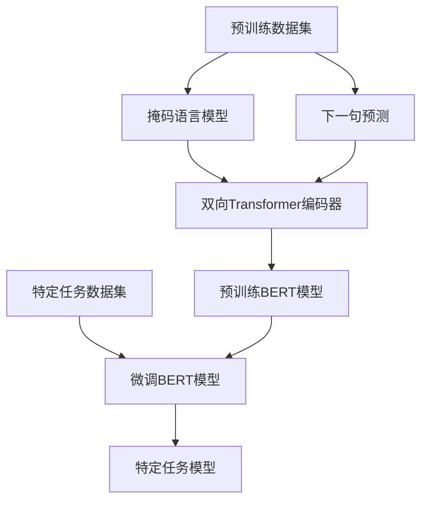

# Python深度学习实践：解析BERT如何改善文本理解

## 1.背景介绍

在自然语言处理（NLP）领域，文本理解一直是一个核心挑战。传统的NLP方法，如词袋模型（Bag of Words）和TF-IDF，虽然在某些任务中表现良好，但在处理复杂的语言现象时显得力不从心。近年来，深度学习技术的迅猛发展为NLP带来了新的希望，尤其是BERT（Bidirectional Encoder Representations from Transformers）的出现，彻底改变了文本理解的方式。

BERT由Google AI Language团队在2018年提出，是一种基于Transformer架构的预训练语言模型。与之前的语言模型不同，BERT采用了双向编码器，可以同时考虑上下文信息，从而在多种NLP任务中取得了显著的效果。

## 2.核心概念与联系

### 2.1 Transformer架构

Transformer是由Vaswani等人在2017年提出的一种全新的神经网络架构，专为处理序列数据而设计。与传统的循环神经网络（RNN）和长短期记忆网络（LSTM）不同，Transformer完全基于注意力机制，能够更高效地捕捉序列中的长距离依赖关系。

### 2.2 BERT的双向编码

BERT的核心创新在于其双向编码器。传统的语言模型通常是单向的，即只能从左到右或从右到左生成文本。而BERT通过掩码语言模型（Masked Language Model, MLM）和下一句预测（Next Sentence Prediction, NSP）任务，实现了双向编码，从而能够更好地理解上下文。

### 2.3 预训练与微调

BERT的训练分为两个阶段：预训练和微调。在预训练阶段，BERT在大规模的无标签文本数据上进行训练，以学习通用的语言表示。在微调阶段，BERT在特定任务的数据集上进行训练，以适应具体的应用场景。

## 3.核心算法原理具体操作步骤

### 3.1 掩码语言模型（MLM）

在MLM任务中，BERT随机掩盖输入序列中的一些词，然后通过上下文信息预测这些被掩盖的词。具体步骤如下：

1. 随机选择输入序列中的15%的词进行掩盖。
2. 将这些被掩盖的词替换为特殊的掩码标记 [MASK]。
3. 使用双向Transformer编码器对掩盖后的序列进行编码。
4. 通过输出层预测被掩盖的词。

### 3.2 下一句预测（NSP）

在NSP任务中，BERT通过判断两个句子是否连续出现来学习句子级别的关系。具体步骤如下：

1. 从语料库中随机选择一对连续的句子（A和B）。
2. 随机选择一对不连续的句子（A和C）。
3. 将句子对（A, B）和（A, C）输入到模型中。
4. 通过输出层预测句子对是否连续。

### 3.3 预训练与微调流程



## 4.数学模型和公式详细讲解举例说明

### 4.1 掩码语言模型（MLM）

在MLM任务中，给定输入序列 $X = \{x_1, x_2, ..., x_n\}$，我们随机选择15%的词进行掩盖，得到掩盖后的序列 $X' = \{x'_1, x'_2, ..., x'_n\}$。BERT的目标是通过上下文信息预测被掩盖的词。

$$
P(x_i | X') = \text{softmax}(W \cdot h_i)
$$

其中，$h_i$ 是双向Transformer编码器的输出，$W$ 是输出层的权重矩阵。

### 4.2 下一句预测（NSP）

在NSP任务中，给定句子对 $(A, B)$ 或 $(A, C)$，BERT的目标是预测句子对是否连续。我们使用一个二分类器来实现这一目标：

$$
P(\text{is\_next} | A, B) = \text{softmax}(W \cdot [h_{[CLS]}, h_A, h_B])
$$

其中，$h_{[CLS]}$ 是特殊标记 [CLS] 的输出，$h_A$ 和 $h_B$ 分别是句子 A 和句子 B 的输出。

## 5.项目实践：代码实例和详细解释说明

### 5.1 环境准备

首先，我们需要安装必要的Python库：

```bash
pip install transformers torch
```

### 5.2 加载预训练模型

我们使用Hugging Face的Transformers库来加载预训练的BERT模型：

```python
from transformers import BertTokenizer, BertForMaskedLM
import torch

# 加载预训练的BERT模型和分词器
tokenizer = BertTokenizer.from_pretrained('bert-base-uncased')
model = BertForMaskedLM.from_pretrained('bert-base-uncased')

# 输入文本
text = "[CLS] I love programming in [MASK]. [SEP]"

# 将文本转换为模型输入
input_ids = tokenizer.encode(text, return_tensors='pt')

# 预测被掩盖的词
with torch.no_grad():
    outputs = model(input_ids)
    predictions = outputs.logits

# 获取预测结果
predicted_index = torch.argmax(predictions[0, 5]).item()
predicted_token = tokenizer.convert_ids_to_tokens([predicted_index])[0]

print(f"Predicted token: {predicted_token}")
```

### 5.3 微调模型

我们可以使用自己的数据集对BERT进行微调。以下是一个简单的微调示例：

```python
from transformers import BertForSequenceClassification, Trainer, TrainingArguments

# 加载预训练的BERT模型
model = BertForSequenceClassification.from_pretrained('bert-base-uncased', num_labels=2)

# 定义训练参数
training_args = TrainingArguments(
    output_dir='./results',
    num_train_epochs=3,
    per_device_train_batch_size=8,
    per_device_eval_batch_size=8,
    warmup_steps=500,
    weight_decay=0.01,
    logging_dir='./logs',
)

# 定义训练数据集
train_dataset = ...

# 创建Trainer实例
trainer = Trainer(
    model=model,
    args=training_args,
    train_dataset=train_dataset,
)

# 开始训练
trainer.train()
```

## 6.实际应用场景

### 6.1 情感分析

BERT可以用于情感分析任务，通过微调BERT模型，我们可以实现对文本情感的准确分类。例如，判断一条推文是正面还是负面。

### 6.2 问答系统

BERT在问答系统中表现出色。通过微调BERT模型，我们可以实现对用户问题的准确回答。例如，基于给定的上下文回答用户的问题。

### 6.3 文本分类

BERT可以用于各种文本分类任务，如垃圾邮件检测、新闻分类等。通过微调BERT模型，我们可以实现对不同类别文本的准确分类。

## 7.工具和资源推荐

### 7.1 Hugging Face Transformers

Hugging Face的Transformers库是一个强大的工具，提供了多种预训练的Transformer模型，包括BERT。它支持多种NLP任务，如文本分类、问答系统等。

### 7.2 TensorFlow和PyTorch

TensorFlow和PyTorch是两个流行的深度学习框架，支持BERT的训练和微调。它们提供了丰富的API和工具，方便我们进行深度学习研究和应用。

### 7.3 数据集

以下是一些常用的NLP数据集：

- SQuAD（Stanford Question Answering Dataset）：用于问答系统的训练和评估。
- IMDB：用于情感分析的电影评论数据集。
- AG News：用于新闻分类的数据集。

## 8.总结：未来发展趋势与挑战

BERT的出现为NLP带来了革命性的变化，但也面临一些挑战。未来的发展趋势和挑战包括：

### 8.1 模型压缩与加速

BERT模型庞大，计算资源消耗高。未来的研究将致力于模型压缩与加速，以便在资源受限的环境中应用BERT。

### 8.2 多语言支持

当前的BERT模型主要针对英语，未来的研究将致力于多语言支持，以便在全球范围内应用BERT。

### 8.3 解释性与可解释性

深度学习模型的黑箱特性使得其解释性和可解释性成为一个重要的研究方向。未来的研究将致力于提高BERT模型的解释性和可解释性。

## 9.附录：常见问题与解答

### 9.1 BERT与传统NLP方法的区别是什么？

BERT采用了双向编码器，可以同时考虑上下文信息，而传统的NLP方法通常是单向的，无法捕捉上下文中的长距离依赖关系。

### 9.2 如何选择预训练模型？

选择预训练模型时，可以根据具体任务的需求选择不同的模型。例如，对于文本分类任务，可以选择BERT-base或BERT-large模型。

### 9.3 如何进行模型微调？

模型微调时，可以使用自己的数据集对预训练的BERT模型进行训练。具体步骤包括加载预训练模型、定义训练参数、创建训练数据集和开始训练。

### 9.4 BERT的应用场景有哪些？

BERT可以应用于多种NLP任务，如情感分析、问答系统、文本分类等。通过微调BERT模型，可以实现对不同任务的准确处理。

---

作者：禅与计算机程序设计艺术 / Zen and the Art of Computer Programming