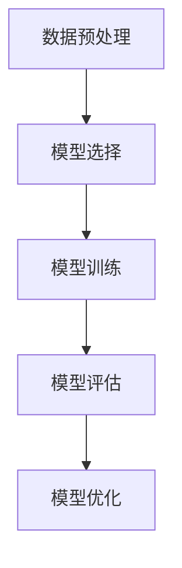

# Supervised Learning原理与代码实例讲解

## 1.背景介绍

监督学习（Supervised Learning）是机器学习领域中最常用和最基础的技术之一。它通过使用标注数据来训练模型，使其能够对新数据进行预测。监督学习在分类和回归问题中都有广泛应用，从图像识别、语音识别到股票价格预测、医疗诊断等领域，都能看到它的身影。

## 2.核心概念与联系

### 2.1 监督学习的定义

监督学习是一种机器学习任务，其中模型从标注数据中学习。标注数据由输入特征（Features）和对应的目标标签（Labels）组成。模型的目标是找到一个映射函数 $f: X \rightarrow Y$，使得对于新的输入数据 $X$，能够准确预测其对应的标签 $Y$。

### 2.2 分类与回归

监督学习主要分为两类任务：分类（Classification）和回归（Regression）。

- **分类**：目标是将输入数据分配到预定义的类别中。例如，垃圾邮件分类、图像分类等。
- **回归**：目标是预测连续值。例如，房价预测、股票价格预测等。

### 2.3 训练与测试

在监督学习中，数据通常分为训练集（Training Set）和测试集（Test Set）。训练集用于训练模型，测试集用于评估模型的性能。

### 2.4 评价指标

不同的任务有不同的评价指标。例如，分类任务中常用的指标有准确率（Accuracy）、精确率（Precision）、召回率（Recall）和F1分数（F1 Score）；回归任务中常用的指标有均方误差（Mean Squared Error, MSE）、均方根误差（Root Mean Squared Error, RMSE）等。

## 3.核心算法原理具体操作步骤

### 3.1 数据预处理

数据预处理是监督学习的第一步，通常包括数据清洗、特征选择和特征工程等步骤。

### 3.2 模型选择

根据任务的不同，选择合适的模型。例如，线性回归、逻辑回归、支持向量机（SVM）、决策树、随机森林、神经网络等。

### 3.3 模型训练

使用训练集对模型进行训练，调整模型参数，使其能够最好地拟合训练数据。

### 3.4 模型评估

使用测试集对模型进行评估，计算评价指标，判断模型的性能。

### 3.5 模型优化

根据评估结果，调整模型参数或选择不同的模型，进行优化。

以下是一个简单的Mermaid流程图，展示了监督学习的基本流程：



## 4.数学模型和公式详细讲解举例说明

### 4.1 线性回归

线性回归是最简单的回归模型之一，其目标是找到一个线性函数，使得输入特征与目标标签之间的误差最小。线性回归的数学模型如下：

$$
y = \beta_0 + \beta_1 x_1 + \beta_2 x_2 + \cdots + \beta_n x_n + \epsilon
$$

其中，$y$ 是目标变量，$x_1, x_2, \ldots, x_n$ 是输入特征，$\beta_0, \beta_1, \ldots, \beta_n$ 是模型参数，$\epsilon$ 是误差项。

### 4.2 逻辑回归

逻辑回归用于分类任务，其目标是预测输入数据属于某个类别的概率。逻辑回归的数学模型如下：

$$
P(y=1|x) = \frac{1}{1 + e^{-(\beta_0 + \beta_1 x_1 + \beta_2 x_2 + \cdots + \beta_n x_n)}}
$$

其中，$P(y=1|x)$ 是输入数据属于类别1的概率，$x_1, x_2, \ldots, x_n$ 是输入特征，$\beta_0, \beta_1, \ldots, \beta_n$ 是模型参数。

### 4.3 支持向量机

支持向量机（SVM）是一种用于分类和回归的强大模型。其目标是找到一个超平面，使得不同类别的数据点之间的间隔最大。SVM的数学模型如下：

$$
f(x) = \text{sign}(\sum_{i=1}^n \alpha_i y_i K(x_i, x) + b)
$$

其中，$f(x)$ 是预测函数，$\alpha_i$ 是拉格朗日乘子，$y_i$ 是训练数据的标签，$K(x_i, x)$ 是核函数，$b$ 是偏置项。

## 5.项目实践：代码实例和详细解释说明

### 5.1 数据预处理

以下是一个简单的Python代码示例，展示了如何进行数据预处理：

```python
import pandas as pd
from sklearn.model_selection import train_test_split
from sklearn.preprocessing import StandardScaler

# 读取数据
data = pd.read_csv('data.csv')

# 特征选择
features = data[['feature1', 'feature2', 'feature3']]
labels = data['label']

# 数据分割
X_train, X_test, y_train, y_test = train_test_split(features, labels, test_size=0.2, random_state=42)

# 数据标准化
scaler = StandardScaler()
X_train = scaler.fit_transform(X_train)
X_test = scaler.transform(X_test)
```

### 5.2 模型训练与评估

以下是一个简单的线性回归模型训练与评估的代码示例：

```python
from sklearn.linear_model import LinearRegression
from sklearn.metrics import mean_squared_error

# 模型训练
model = LinearRegression()
model.fit(X_train, y_train)

# 模型预测
y_pred = model.predict(X_test)

# 模型评估
mse = mean_squared_error(y_test, y_pred)
print(f'Mean Squared Error: {mse}')
```

### 5.3 模型优化

以下是一个简单的超参数优化示例，使用网格搜索（Grid Search）进行优化：

```python
from sklearn.model_selection import GridSearchCV

# 定义参数网格
param_grid = {
    'fit_intercept': [True, False],
    'normalize': [True, False]
}

# 网格搜索
grid_search = GridSearchCV(LinearRegression(), param_grid, cv=5, scoring='neg_mean_squared_error')
grid_search.fit(X_train, y_train)

# 最优参数
best_params = grid_search.best_params_
print(f'Best Parameters: {best_params}')
```

## 6.实际应用场景

### 6.1 图像分类

监督学习在图像分类中有广泛应用。例如，使用卷积神经网络（CNN）对手写数字进行分类，识别图片中的物体等。

### 6.2 语音识别

语音识别是另一个重要的应用场景。通过训练模型，能够将语音信号转换为文本。例如，智能助手中的语音识别功能。

### 6.3 医疗诊断

在医疗领域，监督学习可以用于疾病诊断。例如，通过分析患者的医疗数据，预测疾病的可能性，辅助医生进行诊断。

### 6.4 金融预测

在金融领域，监督学习可以用于股票价格预测、信用评分等。例如，通过分析历史股票数据，预测未来的股票价格走势。

## 7.工具和资源推荐

### 7.1 编程语言与库

- **Python**：最常用的机器学习编程语言，拥有丰富的库和工具。
- **Scikit-learn**：Python中最常用的机器学习库，提供了大量的算法和工具。
- **TensorFlow**：谷歌开发的开源机器学习框架，适用于深度学习。
- **PyTorch**：Facebook开发的开源深度学习框架，易于使用和调试。

### 7.2 数据集

- **Kaggle**：一个数据科学竞赛平台，提供大量的公开数据集。
- **UCI Machine Learning Repository**：一个经典的机器学习数据集库，包含各种各样的数据集。

### 7.3 在线课程与书籍

- **Coursera**：提供大量的机器学习和深度学习课程。
- **edX**：提供高质量的在线课程，包括机器学习和人工智能。
- **《机器学习实战》**：一本经典的机器学习入门书籍，包含大量的代码示例。
- **《深度学习》**：一本深入浅出的深度学习书籍，适合进阶学习。

## 8.总结：未来发展趋势与挑战

### 8.1 发展趋势

监督学习在未来将继续发展，主要趋势包括：

- **自动化机器学习（AutoML）**：通过自动化工具，降低机器学习的门槛，使更多的人能够使用机器学习技术。
- **深度学习**：深度学习在监督学习中的应用将越来越广泛，特别是在图像、语音和自然语言处理等领域。
- **大数据与云计算**：随着数据量的增加和计算能力的提升，监督学习将能够处理更大规模的数据，提供更准确的预测。

### 8.2 挑战

尽管监督学习有广泛的应用，但仍面临一些挑战：

- **数据标注**：监督学习依赖于大量的标注数据，数据标注成本高且耗时。
- **模型泛化**：如何提高模型在新数据上的泛化能力，避免过拟合，是一个重要的研究方向。
- **解释性**：复杂模型（如深度学习）的解释性较差，如何提高模型的可解释性，是一个重要的挑战。

## 9.附录：常见问题与解答

### 9.1 什么是过拟合和欠拟合？

- **过拟合**：模型在训练数据上表现很好，但在测试数据上表现较差，说明模型过于复杂，拟合了训练数据中的噪声。
- **欠拟合**：模型在训练数据和测试数据上都表现较差，说明模型过于简单，无法捕捉数据中的模式。

### 9.2 如何处理不平衡数据？

- **重采样**：通过过采样（Oversampling）或欠采样（Undersampling）的方法，使数据集中的各类别样本数量平衡。
- **使用合适的评价指标**：在不平衡数据中，准确率可能不是一个好的评价指标，可以使用精确率、召回率和F1分数等指标。

### 9.3 如何选择合适的模型？

- **根据任务类型**：分类任务可以选择逻辑回归、决策树、随机森林等；回归任务可以选择线性回归、支持向量机等。
- **根据数据特征**：不同模型对数据的要求不同，例如，线性回归要求数据线性可分，支持向量机适用于高维数据。

### 9.4 如何提高模型的泛化能力？

- **交叉验证**：通过交叉验证的方法，评估模型在不同数据集上的表现，选择最优模型。
- **正则化**：通过添加正则化项，防止模型过拟合。
- **数据增强**：通过数据增强的方法，增加训练数据的多样性，提高模型的泛化能力。

作者：禅与计算机程序设计艺术 / Zen and the Art of Computer Programming