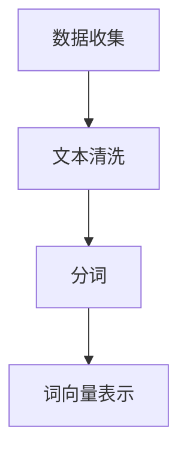
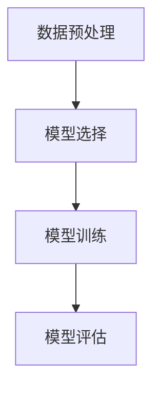

# 【LangChain编程：从入门到实践】语言模型

## 1.背景介绍

在人工智能和自然语言处理（NLP）领域，语言模型（Language Model, LM）是一个至关重要的概念。它们被广泛应用于各种任务，如机器翻译、文本生成、情感分析等。LangChain是一个新兴的编程框架，旨在简化和优化语言模型的开发和应用。本文将深入探讨LangChain编程的核心概念、算法原理、数学模型、项目实践、实际应用场景、工具和资源推荐，并展望其未来发展趋势与挑战。

## 2.核心概念与联系

### 2.1 语言模型的定义

语言模型是一种统计模型，用于预测一个句子或文本序列中下一个词的概率。它通过学习大量文本数据中的词汇和句子结构，来生成符合语法和语义的文本。

### 2.2 LangChain的定义

LangChain是一个专门为语言模型开发和应用设计的编程框架。它提供了一系列工具和库，简化了语言模型的训练、评估和部署过程。

### 2.3 语言模型与LangChain的联系

LangChain通过提供高效的编程接口和优化的算法，使得语言模型的开发更加便捷和高效。它不仅支持主流的深度学习框架，如TensorFlow和PyTorch，还集成了多种预训练模型和数据处理工具。

## 3.核心算法原理具体操作步骤

### 3.1 数据预处理

数据预处理是语言模型训练的第一步。它包括文本清洗、分词、词向量表示等步骤。



### 3.2 模型选择与训练

选择合适的模型架构（如RNN、LSTM、Transformer）并进行训练。LangChain提供了多种预训练模型，可以直接使用或进行微调。



### 3.3 模型评估与优化

使用验证集评估模型性能，并通过调整超参数、增加训练数据等方法进行优化。

### 3.4 模型部署

将训练好的模型部署到生产环境中，提供API接口供其他应用调用。

## 4.数学模型和公式详细讲解举例说明

### 4.1 语言模型的数学定义

语言模型的目标是计算一个给定词序列的概率 $P(w_1, w_2, ..., w_n)$。根据链式法则，这个概率可以分解为：

$$
P(w_1, w_2, ..., w_n) = P(w_1) \cdot P(w_2|w_1) \cdot P(w_3|w_1, w_2) \cdot ... \cdot P(w_n|w_1, w_2, ..., w_{n-1})
$$

### 4.2 N-gram模型

N-gram模型是一种简单且常用的语言模型。它假设每个词只依赖于前面的N-1个词。对于三元模型（Trigram），上述公式可以简化为：

$$
P(w_1, w_2, ..., w_n) \approx \prod_{i=1}^{n} P(w_i|w_{i-2}, w_{i-1})
$$

### 4.3 神经网络语言模型

神经网络语言模型通过使用神经网络来捕捉词汇之间的复杂关系。以LSTM为例，其核心公式为：

$$
f_t = \sigma(W_f \cdot [h_{t-1}, x_t] + b_f)
$$

$$
i_t = \sigma(W_i \cdot [h_{t-1}, x_t] + b_i)
$$

$$
o_t = \sigma(W_o \cdot [h_{t-1}, x_t] + b_o)
$$

$$
\tilde{C}_t = \tanh(W_C \cdot [h_{t-1}, x_t] + b_C)
$$

$$
C_t = f_t * C_{t-1} + i_t * \tilde{C}_t
$$

$$
h_t = o_t * \tanh(C_t)
$$

## 5.项目实践：代码实例和详细解释说明

### 5.1 数据预处理

```python
import re
import nltk
from nltk.tokenize import word_tokenize

# 下载必要的NLTK数据
nltk.download('punkt')

def preprocess_text(text):
    # 移除特殊字符
    text = re.sub(r'\W', ' ', text)
    # 转换为小写
    text = text.lower()
    # 分词
    tokens = word_tokenize(text)
    return tokens

sample_text = "LangChain is a powerful framework for language models."
tokens = preprocess_text(sample_text)
print(tokens)
```

### 5.2 模型训练

```python
import torch
import torch.nn as nn
import torch.optim as optim

class SimpleRNN(nn.Module):
    def __init__(self, input_size, hidden_size, output_size):
        super(SimpleRNN, self).__init__()
        self.hidden_size = hidden_size
        self.rnn = nn.RNN(input_size, hidden_size, batch_first=True)
        self.fc = nn.Linear(hidden_size, output_size)

    def forward(self, x):
        h0 = torch.zeros(1, x.size(0), self.hidden_size).to(x.device)
        out, _ = self.rnn(x, h0)
        out = self.fc(out[:, -1, :])
        return out

# 超参数
input_size = 10
hidden_size = 20
output_size = 10
num_epochs = 5
learning_rate = 0.001

model = SimpleRNN(input_size, hidden_size, output_size)
criterion = nn.CrossEntropyLoss()
optimizer = optim.Adam(model.parameters(), lr=learning_rate)

# 假设我们有一个数据加载器 data_loader
for epoch in range(num_epochs):
    for inputs, labels in data_loader:
        outputs = model(inputs)
        loss = criterion(outputs, labels)
        optimizer.zero_grad()
        loss.backward()
        optimizer.step()
    print(f'Epoch [{epoch+1}/{num_epochs}], Loss: {loss.item():.4f}')
```

### 5.3 模型评估

```python
from sklearn.metrics import accuracy_score

def evaluate_model(model, data_loader):
    model.eval()
    all_preds = []
    all_labels = []
    with torch.no_grad():
        for inputs, labels in data_loader:
            outputs = model(inputs)
            _, preds = torch.max(outputs, 1)
            all_preds.extend(preds.cpu().numpy())
            all_labels.extend(labels.cpu().numpy())
    accuracy = accuracy_score(all_labels, all_preds)
    return accuracy

accuracy = evaluate_model(model, data_loader)
print(f'Model Accuracy: {accuracy:.4f}')
```

### 5.4 模型部署

```python
from flask import Flask, request, jsonify

app = Flask(__name__)

@app.route('/predict', methods=['POST'])
def predict():
    data = request.get_json(force=True)
    tokens = preprocess_text(data['text'])
    # 假设我们有一个函数 convert_tokens_to_tensor
    inputs = convert_tokens_to_tensor(tokens)
    outputs = model(inputs)
    _, preds = torch.max(outputs, 1)
    return jsonify({'prediction': preds.item()})

if __name__ == '__main__':
    app.run(debug=True)
```

## 6.实际应用场景

### 6.1 机器翻译

语言模型在机器翻译中扮演着重要角色。通过学习大量的双语文本，模型可以生成高质量的翻译结果。

### 6.2 文本生成

语言模型可以用于生成自然流畅的文本，如新闻报道、小说创作等。GPT-3是一个典型的例子。

### 6.3 情感分析

通过分析文本中的词汇和句子结构，语言模型可以判断文本的情感倾向，如正面、负面或中性。

### 6.4 对话系统

语言模型在对话系统中用于生成自然的对话回复，提高用户体验。

## 7.工具和资源推荐

### 7.1 编程框架

- TensorFlow
- PyTorch
- Hugging Face Transformers

### 7.2 数据集

- Wikipedia
- Common Crawl
- OpenSubtitles

### 7.3 预训练模型

- GPT-3
- BERT
- T5

### 7.4 开发工具

- Jupyter Notebook
- Google Colab
- VS Code

## 8.总结：未来发展趋势与挑战

### 8.1 未来发展趋势

- **多模态模型**：结合文本、图像、音频等多种数据类型的模型将成为趋势。
- **更大规模的预训练模型**：随着计算资源的增加，更大规模的预训练模型将不断涌现。
- **个性化定制**：针对特定领域和应用的个性化语言模型将越来越多。

### 8.2 挑战

- **计算资源**：训练大规模语言模型需要大量的计算资源和时间。
- **数据隐私**：如何在保护用户隐私的前提下使用数据是一个重要挑战。
- **模型解释性**：复杂的神经网络模型往往难以解释其决策过程，这在某些应用场景中是一个问题。

## 9.附录：常见问题与解答

### 9.1 什么是语言模型？

语言模型是一种统计模型，用于预测一个句子或文本序列中下一个词的概率。

### 9.2 LangChain是什么？

LangChain是一个专门为语言模型开发和应用设计的编程框架，提供了一系列工具和库，简化了语言模型的训练、评估和部署过程。

### 9.3 如何选择合适的语言模型？

选择合适的语言模型需要考虑任务的具体需求、数据量、计算资源等因素。常见的模型包括N-gram、RNN、LSTM、Transformer等。

### 9.4 语言模型的实际应用有哪些？

语言模型广泛应用于机器翻译、文本生成、情感分析、对话系统等领域。

### 9.5 如何评估语言模型的性能？

常用的评估指标包括准确率、困惑度（Perplexity）、BLEU分数等。

---

作者：禅与计算机程序设计艺术 / Zen and the Art of Computer Programming