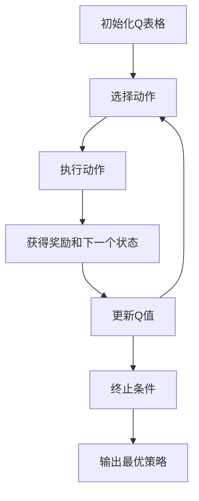

# 一切皆是映射：AI Q-learning环境模型建立

## 1.背景介绍

在人工智能领域，强化学习（Reinforcement Learning, RL）是一种通过与环境交互来学习策略的技术。Q-learning 是一种无模型的强化学习算法，它通过学习动作-状态对的价值来找到最优策略。Q-learning 的核心思想是通过不断更新 Q 值来逼近最优 Q 函数，从而指导智能体在不同状态下选择最优动作。

Q-learning 的应用范围非常广泛，从游戏 AI 到机器人控制，再到金融市场的决策系统，都可以看到它的身影。然而，Q-learning 的成功离不开对环境模型的准确建立。本文将深入探讨 Q-learning 环境模型的建立过程，帮助读者更好地理解和应用这一强大的算法。

## 2.核心概念与联系

### 2.1 强化学习

强化学习是一种通过试错法来学习策略的机器学习方法。智能体通过与环境交互，接收状态和奖励，并根据这些信息调整其策略。强化学习的目标是找到一个策略，使得智能体在长期内获得最大的累积奖励。

### 2.2 Q-learning

Q-learning 是一种无模型的强化学习算法，它通过学习 Q 值（状态-动作对的价值）来找到最优策略。Q-learning 的核心公式为：

$$
Q(s, a) \leftarrow Q(s, a) + \alpha [r + \gamma \max_{a'} Q(s', a') - Q(s, a)]
$$

其中，$s$ 是当前状态，$a$ 是当前动作，$r$ 是即时奖励，$s'$ 是下一个状态，$a'$ 是下一个动作，$\alpha$ 是学习率，$\gamma$ 是折扣因子。

### 2.3 环境模型

环境模型是 Q-learning 成功的关键。环境模型包括状态空间、动作空间、奖励函数和状态转移函数。准确的环境模型可以帮助智能体更快地学习到最优策略。

## 3.核心算法原理具体操作步骤

### 3.1 初始化

初始化 Q 表格，将所有状态-动作对的 Q 值设为零或随机值。

### 3.2 选择动作

根据当前状态 $s$，选择动作 $a$。常用的策略包括 $\epsilon$-贪婪策略和软策略。

### 3.3 执行动作

在环境中执行动作 $a$，获得即时奖励 $r$ 和下一个状态 $s'$。

### 3.4 更新 Q 值

使用 Q-learning 更新公式更新 Q 值：

$$
Q(s, a) \leftarrow Q(s, a) + \alpha [r + \gamma \max_{a'} Q(s', a') - Q(s, a)]
$$

### 3.5 重复

重复步骤 2 到 4，直到满足终止条件（如达到最大迭代次数或收敛）。

以下是 Q-learning 算法的流程图：



## 4.数学模型和公式详细讲解举例说明

### 4.1 Q-learning 更新公式

Q-learning 的核心在于其更新公式：

$$
Q(s, a) \leftarrow Q(s, a) + \alpha [r + \gamma \max_{a'} Q(s', a') - Q(s, a)]
$$

其中，$\alpha$ 是学习率，控制 Q 值更新的步长；$\gamma$ 是折扣因子，衡量未来奖励的重要性。

### 4.2 举例说明

假设一个简单的迷宫问题，智能体需要从起点到达终点。状态空间为迷宫中的每个位置，动作空间为上下左右四个方向。奖励函数为到达终点时获得正奖励，其他情况为零。

初始 Q 表格如下：

| 状态 | 上 | 下 | 左 | 右 |
|------|----|----|----|----|
| S1   | 0  | 0  | 0  | 0  |
| S2   | 0  | 0  | 0  | 0  |
| ...  | ...| ...| ...| ...|

假设当前状态为 S1，选择动作“右”，到达状态 S2，获得奖励 0。更新 Q 值：

$$
Q(S1, 右) \leftarrow Q(S1, 右) + \alpha [0 + \gamma \max_{a'} Q(S2, a') - Q(S1, 右)]
$$

重复上述过程，直到 Q 值收敛。

## 5.项目实践：代码实例和详细解释说明

以下是一个简单的 Q-learning 代码实例，使用 Python 实现。

```python
import numpy as np

# 定义环境
states = ['S1', 'S2', 'S3', 'S4']
actions = ['上', '下', '左', '右']
rewards = {
    'S1': {'右': 0, '下': 0},
    'S2': {'左': 0, '下': 0},
    'S3': {'上': 0, '右': 0},
    'S4': {'上': 1}
}
state_transition = {
    'S1': {'右': 'S2', '下': 'S3'},
    'S2': {'左': 'S1', '下': 'S4'},
    'S3': {'上': 'S1', '右': 'S4'},
    'S4': {'上': 'S2'}
}

# 初始化 Q 表格
Q = {state: {action: 0 for action in actions} for state in states}

# 参数设置
alpha = 0.1
gamma = 0.9
epsilon = 0.1
episodes = 1000

# Q-learning 算法
for episode in range(episodes):
    state = 'S1'
    while state != 'S4':
        if np.random.rand() < epsilon:
            action = np.random.choice(actions)
        else:
            action = max(Q[state], key=Q[state].get)
        
        next_state = state_transition[state].get(action, state)
        reward = rewards[state].get(action, 0)
        
        Q[state][action] += alpha * (reward + gamma * max(Q[next_state].values()) - Q[state][action])
        
        state = next_state

# 输出最优策略
optimal_policy = {state: max(Q[state], key=Q[state].get) for state in states}
print("最优策略:", optimal_policy)
```

### 代码解释

1. **定义环境**：包括状态、动作、奖励函数和状态转移函数。
2. **初始化 Q 表格**：将所有状态-动作对的 Q 值设为零。
3. **参数设置**：包括学习率 $\alpha$、折扣因子 $\gamma$、探索率 $\epsilon$ 和迭代次数。
4. **Q-learning 算法**：通过 $\epsilon$-贪婪策略选择动作，执行动作并更新 Q 值，直到 Q 值收敛。
5. **输出最优策略**：根据 Q 表格输出最优策略。

## 6.实际应用场景

### 6.1 游戏 AI

Q-learning 在游戏 AI 中有广泛应用。例如，AlphaGo 使用 Q-learning 来学习围棋的策略，通过与自己对弈不断优化策略，最终击败了人类顶尖棋手。

### 6.2 机器人控制

在机器人控制中，Q-learning 可以帮助机器人学习如何在复杂环境中导航。例如，机器人可以通过 Q-learning 学习如何避开障碍物，找到最短路径到达目标位置。

### 6.3 金融市场

在金融市场中，Q-learning 可以用于交易策略的优化。通过学习市场的历史数据，Q-learning 可以找到最优的买卖策略，最大化投资回报。

## 7.工具和资源推荐

### 7.1 开源库

- **OpenAI Gym**：一个用于开发和比较强化学习算法的工具包，提供了多种环境和接口。
- **TensorFlow**：一个开源的机器学习框架，支持强化学习算法的实现。
- **PyTorch**：另一个流行的机器学习框架，提供了灵活的强化学习实现。

### 7.2 在线课程

- **Coursera**：提供了多门关于强化学习的在线课程，包括斯坦福大学和深度学习研究所的课程。
- **Udacity**：提供了强化学习纳米学位课程，涵盖了 Q-learning 和其他强化学习算法。

### 7.3 书籍推荐

- **《强化学习：原理与实践》**：一本全面介绍强化学习的书籍，适合初学者和进阶读者。
- **《深度强化学习》**：深入探讨深度学习与强化学习结合的书籍，适合有一定基础的读者。

## 8.总结：未来发展趋势与挑战

### 8.1 发展趋势

随着计算能力的提升和数据量的增加，Q-learning 和其他强化学习算法将在更多领域得到应用。特别是在自动驾驶、智能家居和医疗诊断等领域，强化学习有望带来革命性的变化。

### 8.2 挑战

尽管 Q-learning 具有强大的能力，但在实际应用中仍面临一些挑战。例如，状态空间和动作空间过大时，Q-learning 的计算复杂度会显著增加。此外，Q-learning 对环境模型的依赖也限制了其在动态环境中的应用。

未来的研究将致力于解决这些挑战，进一步提升 Q-learning 的性能和适用范围。

## 9.附录：常见问题与解答

### 9.1 Q-learning 与深度 Q-learning 有何区别？

Q-learning 使用表格存储 Q 值，适用于小规模状态空间。深度 Q-learning 使用神经网络逼近 Q 函数，适用于大规模状态空间。

### 9.2 如何选择合适的学习率和折扣因子？

学习率 $\alpha$ 和折扣因子 $\gamma$ 的选择需要根据具体问题进行调优。一般来说，$\alpha$ 应该较小，以确保 Q 值的稳定更新；$\gamma$ 应该较大，以重视未来奖励。

### 9.3 Q-learning 是否适用于所有强化学习问题？

Q-learning 适用于无模型的强化学习问题，但在状态空间和动作空间过大时，可能需要结合其他方法（如深度学习）来提高性能。

---

作者：禅与计算机程序设计艺术 / Zen and the Art of Computer Programming