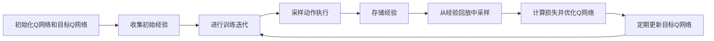
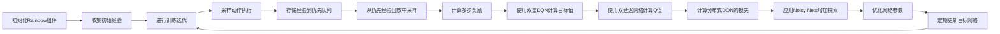

# 一切皆是映射：从DQN到Rainbow：全面指南与实践小结

## 1. 背景介绍

在人工智能的领域中，强化学习（Reinforcement Learning, RL）已经成为一种重要的自主学习方法。它通过与环境的交互来学习最优策略，以实现长期目标。深度Q网络（Deep Q-Network, DQN）是强化学习中的一个里程碑，它将深度学习与Q学习相结合，成功地解决了许多复杂的决策问题。随后，为了进一步提升性能，研究者们提出了多种DQN的改进版本，其中Rainbow是一个集成了多种改进技术的算法，显示出了卓越的性能。

## 2. 核心概念与联系

### 2.1 强化学习基础

- **状态（State）**：智能体可以观察到的环境信息。
- **动作（Action）**：智能体可以执行的操作。
- **奖励（Reward）**：智能体执行动作后获得的反馈。
- **策略（Policy）**：从状态到动作的映射，智能体的行为准则。

### 2.2 Q学习与DQN

- **Q学习**：一种无模型的强化学习算法，旨在学习一个动作价值函数Q，用于估计在给定状态下执行某个动作的期望回报。
- **深度Q网络（DQN）**：结合了Q学习与深度神经网络，用于近似复杂状态空间中的Q函数。

### 2.3 Rainbow的组成

- **双重DQN（Double DQN）**：解决了DQN中的过估计问题。
- **优先经验回放（Prioritized Experience Replay）**：更高效地从经验回放中采样。
- **多步学习（Multi-step Learning）**：考虑多步奖励来加速学习。
- **双延迟网络（Dueling Networks）**：分别估计状态价值和优势函数。
- **分布式DQN（Distributional DQN）**：学习奖励分布而非期望值。
- **Noisy Nets**：引入噪声，增加探索性。

## 3. 核心算法原理具体操作步骤

### 3.1 DQN的基本流程



### 3.2 Rainbow的改进步骤



## 4. 数学模型和公式详细讲解举例说明

### 4.1 Q学习的Bellman方程

$$
Q(s_t, a_t) \leftarrow Q(s_t, a_t) + \alpha [r_{t+1} + \gamma \max_{a}Q(s_{t+1}, a) - Q(s_t, a_t)]
$$

其中，$\alpha$ 是学习率，$\gamma$ 是折扣因子。

### 4.2 DQN的损失函数

$$
L(\theta) = \mathbb{E}[(r + \gamma \max_{a'}Q(s', a'; \theta^-) - Q(s, a; \theta))^2]
$$

$\theta$ 是当前Q网络的参数，$\theta^-$ 是目标Q网络的参数。

### 4.3 Rainbow的改进

- **双重DQN**：

$$
Q(s, a; \theta, \theta') = r + \gamma Q(s', \arg\max_{a'}Q(s', a'; \theta), \theta')
$$

- **优先经验回放**：

$$
P(i) = \frac{p_i^\alpha}{\sum_k p_k^\alpha}
$$

$p_i$ 是第$i$个经验的优先级，$\alpha$ 是优先级指数。

- **多步学习**：

$$
G_t^{(n)} = r_t + \gamma r_{t+1} + \dots + \gamma^{n-1} r_{t+n-1} + \gamma^n \max_{a} Q(s_{t+n}, a)
$$

$n$ 是步数。

- **双延迟网络**：

$$
Q(s, a; \theta) = V(s; \theta_V) + A(s, a; \theta_A) - \frac{1}{|\mathcal{A}|}\sum_{a'}A(s, a'; \theta_A)
$$

$\theta_V$ 和 $\theta_A$ 分别是状态价值和优势函数的参数。

- **分布式DQN**：

$$
L(\theta) = \mathbb{E}[D_{KL}(Z(s, a; \theta') || Z(s, a; \theta))]
$$

$Z$ 是奖励分布，$D_{KL}$ 是Kullback-Leibler散度。

## 5. 项目实践：代码实例和详细解释说明

由于篇幅限制，这里仅提供DQN的一个简化代码示例：

```python
import numpy as np
import tensorflow as tf

class DQNAgent:
    def __init__(self, state_size, action_size):
        self.state_size = state_size
        self.action_size = action_size
        self.model = self._build_model()

    def _build_model(self):
        model = tf.keras.models.Sequential([
            tf.keras.layers.Dense(24, input_dim=self.state_size, activation='relu'),
            tf.keras.layers.Dense(24, activation='relu'),
            tf.keras.layers.Dense(self.action_size, activation='linear')
        ])
        model.compile(loss='mse', optimizer=tf.keras.optimizers.Adam(0.001))
        return model

    def act(self, state):
        if np.random.rand() <= 0.1:
            return random.randrange(self.action_size)
        act_values = self.model.predict(state)
        return np.argmax(act_values[0])

    def train(self, state, action, reward, next_state, done):
        target = reward
        if not done:
            target = (reward + 0.95 * np.amax(self.model.predict(next_state)[0]))
        target_f = self.model.predict(state)
        target_f[0][action] = target
        self.model.fit(state, target_f, epochs=1, verbose=0)

# 示例化智能体并进行训练
agent = DQNAgent(state_size=4, action_size=2)
# 假设有一些状态、动作、奖励和下一个状态
state = np.reshape([1.0, 0.0, 0.0, 0.0], [1, 4])
action = 1
reward = 1
next_state = np.reshape([0.0, 1.0, 0.0, 0.0], [1, 4])
done = False
agent.train(state, action, reward, next_state, done)
```

这个代码示例展示了一个简单的DQN智能体的构建、决策和训练过程。实际的Rainbow实现会更加复杂，涉及到多个组件的集成。

## 6. 实际应用场景

强化学习和DQN及其变体在多个领域都有应用，包括但不限于：

- **游戏**：从简单的Atari游戏到复杂的多人在线战斗竞技场（MOBA）游戏。
- **机器人**：用于路径规划、操控和自适应控制。
- **金融**：在投资组合管理和交易策略中进行决策。
- **自动驾驶**：用于决策和路径规划。

## 7. 工具和资源推荐

- **TensorFlow** 和 **PyTorch**：两个主流的深度学习框架，适用于实现DQN和Rainbow。
- **OpenAI Gym**：提供了多种环境，用于测试和比较强化学习算法。
- **Stable Baselines**：一个基于OpenAI Gym的强化学习算法库，包含了多种预训练的模型。

## 8. 总结：未来发展趋势与挑战

强化学习和DQN的研究仍在快速发展中，未来的趋势可能包括算法的进一步集成和优化、多智能体学习、以及在更复杂环境中的应用。挑战包括提高算法的样本效率、稳定性和泛化能力。

## 9. 附录：常见问题与解答

- **Q: DQN和Rainbow的主要区别是什么？**
- A: Rainbow是DQN的一个扩展，它集成了多种改进技术，如双重DQN、优先经验回放等，以提高性能和稳定性。

- **Q: 如何选择合适的强化学习算法？**
- A: 这取决于具体的应用场景和问题的复杂性。一般来说，可以从简单的算法开始尝试，并根据需要逐步引入更复杂的算法。

- **Q: 强化学习在实际应用中的主要挑战是什么？**
- A: 强化学习算法通常需要大量的数据和计算资源，且在真实世界的应用中可能面临环境的不确定性和动态变化。

作者：禅与计算机程序设计艺术 / Zen and the Art of Computer Programming