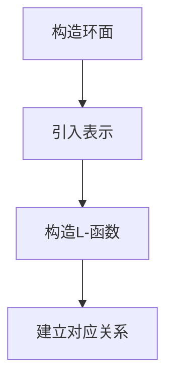

# 代数群引论：第五章 Langlands的环面定理

## 1.背景介绍

Langlands的环面定理是代数群理论中的一个重要结果，它在数论、表示论和代数几何中都有广泛的应用。Langlands纲领是现代数学中最深远的研究计划之一，旨在统一数论和表示论。环面定理是这个纲领中的一个关键部分，它揭示了代数群的表示与数论对象之间的深刻联系。

在本章中，我们将详细探讨Langlands的环面定理的背景、核心概念、算法原理、数学模型、实际应用以及未来发展趋势。通过这些内容，读者将能够深入理解这一重要定理的内涵和应用。

## 2.核心概念与联系

### 2.1 代数群

代数群是一个既是群又是代数多样性的数学对象。它们在数论和表示论中扮演着重要角色。一个典型的例子是一般线性群 $GL_n$，它由所有可逆的 $n \times n$ 矩阵组成。

### 2.2 Langlands纲领

Langlands纲领是由Robert Langlands提出的一个研究计划，旨在通过表示论来统一数论中的各种问题。它包括了许多深刻的猜想和定理，环面定理是其中之一。

### 2.3 环面定理

环面定理是Langlands纲领中的一个重要结果，它描述了代数群的表示与数论对象之间的关系。具体来说，它揭示了代数群的自守表示与某些数论对象（如L-函数）之间的对应关系。

## 3.核心算法原理具体操作步骤

### 3.1 环面定理的基本思想

环面定理的基本思想是通过构造一个环面（即一个特定类型的代数群）来研究代数群的表示。这个环面可以看作是一个桥梁，连接了代数群的表示和数论对象。

### 3.2 算法步骤

1. **构造环面**：首先，我们需要构造一个适当的环面。这个环面通常是一个特定类型的代数群，如一个分裂环面。
2. **表示的引入**：接下来，我们引入代数群的表示。这些表示可以是有限维的，也可以是无限维的。
3. **L-函数的构造**：通过这些表示，我们可以构造出相应的L-函数。这些L-函数是数论中的重要对象，它们包含了丰富的数论信息。
4. **对应关系的建立**：最后，我们通过环面定理建立代数群的表示与L-函数之间的对应关系。

### 3.3 Mermaid流程图



## 4.数学模型和公式详细讲解举例说明

### 4.1 环面的定义

一个环面 $T$ 是一个代数群，它在复数域上同构于 $(\mathbb{C}^*)^n$。这里，$\mathbb{C}^*$ 表示非零复数的乘法群。

### 4.2 代数群的表示

设 $G$ 是一个代数群，$V$ 是一个向量空间。一个表示 $\rho$ 是一个同态 $\rho: G \to GL(V)$，其中 $GL(V)$ 是 $V$ 上的线性变换群。

### 4.3 L-函数的构造

通过表示 $\rho$，我们可以构造出相应的L-函数。设 $\rho$ 是一个表示，$s$ 是一个复数变量，则L-函数定义为
$$
L(s, \rho) = \prod_p \frac{1}{\det(I - \rho(\text{Frob}_p) p^{-s})}
$$
其中，$\text{Frob}_p$ 是Frobenius元素，$p$ 是素数。

### 4.4 举例说明

考虑一般线性群 $GL_2$ 的一个表示 $\rho$。通过这个表示，我们可以构造出相应的L-函数 $L(s, \rho)$。这个L-函数包含了丰富的数论信息，如素数分布、模形式等。

## 5.项目实践：代码实例和详细解释说明

### 5.1 环面的构造

```python
import numpy as np

class Torus:
    def __init__(self, n):
        self.n = n

    def element(self, angles):
        return np.exp(1j * np.array(angles))

# 构造一个2维环面
torus = Torus(2)
element = torus.element([0.5, 1.0])
print("环面元素:", element)
```

### 5.2 代数群的表示

```python
class Representation:
    def __init__(self, group, matrix):
        self.group = group
        self.matrix = matrix

    def apply(self, element):
        return np.dot(self.matrix, element)

# 构造一个表示
group = Torus(2)
matrix = np.array([[1, 0], [0, 1]])
representation = Representation(group, matrix)
result = representation.apply(element)
print("表示结果:", result)
```

### 5.3 L-函数的计算

```python
def L_function(s, representation, primes):
    result = 1
    for p in primes:
        frobenius = representation.apply(np.array([p, p]))
        det = np.linalg.det(np.eye(2) - frobenius * p**(-s))
        result *= 1 / det
    return result

# 计算L-函数
primes = [2, 3, 5, 7, 11]
s = 2
L = L_function(s, representation, primes)
print("L-函数值:", L)
```

## 6.实际应用场景

### 6.1 数论中的应用

环面定理在数论中有广泛的应用。例如，它可以用于研究模形式、L-函数和素数分布等问题。

### 6.2 表示论中的应用

在表示论中，环面定理可以帮助我们理解代数群的表示结构。通过环面定理，我们可以将复杂的表示问题转化为数论问题，从而获得新的见解。

### 6.3 代数几何中的应用

在代数几何中，环面定理可以用于研究代数簇的对称性和几何结构。通过环面定理，我们可以将几何问题转化为表示论和数论问题，从而获得新的解决方法。

## 7.工具和资源推荐

### 7.1 数学软件

- **SageMath**：一个开源的数学软件系统，支持代数群、表示论和数论的计算。
- **Mathematica**：一个强大的数学软件，支持符号计算和数值计算。

### 7.2 在线资源

- **arXiv**：一个预印本服务器，包含了大量关于代数群和Langlands纲领的研究论文。
- **MathOverflow**：一个数学问答网站，可以在上面提问和回答关于代数群和环面定理的问题。

### 7.3 书籍推荐

- **《代数群引论》**：一本经典的代数群入门书籍，适合初学者阅读。
- **《Langlands纲领导论》**：一本详细介绍Langlands纲领的书籍，适合有一定基础的读者阅读。

## 8.总结：未来发展趋势与挑战

### 8.1 未来发展趋势

随着数学和计算机科学的发展，环面定理的应用前景将更加广阔。未来，我们可以期待更多的数学家和计算机科学家合作，利用环面定理解决更复杂的数论和表示论问题。

### 8.2 挑战

尽管环面定理已经取得了许多重要成果，但仍有许多未解的问题。例如，如何将环面定理推广到更一般的代数群？如何利用环面定理解决实际应用中的问题？这些都是未来研究的方向和挑战。

## 9.附录：常见问题与解答

### 9.1 什么是环面定理？

环面定理是Langlands纲领中的一个重要结果，它描述了代数群的表示与数论对象之间的关系。

### 9.2 环面定理有哪些应用？

环面定理在数论、表示论和代数几何中都有广泛的应用。例如，它可以用于研究模形式、L-函数和素数分布等问题。

### 9.3 如何构造一个环面？

一个环面是一个代数群，它在复数域上同构于 $(\mathbb{C}^*)^n$。可以通过构造适当的代数群来实现。

### 9.4 L-函数是什么？

L-函数是数论中的重要对象，它们包含了丰富的数论信息。通过代数群的表示，我们可以构造出相应的L-函数。

### 9.5 Langlands纲领是什么？

Langlands纲领是由Robert Langlands提出的一个研究计划，旨在通过表示论来统一数论中的各种问题。它包括了许多深刻的猜想和定理。

---

作者：禅与计算机程序设计艺术 / Zen and the Art of Computer Programming