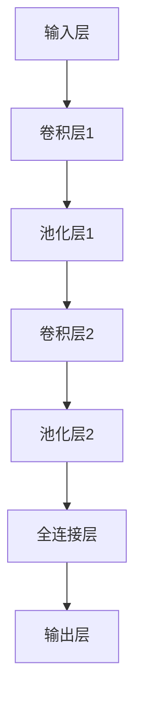

# 卷积神经网络CNN原理与代码实例讲解

## 1.背景介绍

卷积神经网络（Convolutional Neural Network, CNN）是深度学习领域中最为重要的模型之一，广泛应用于图像识别、自然语言处理、视频分析等多个领域。CNN的出现极大地提升了计算机视觉任务的性能，使得机器能够更好地理解和处理视觉信息。

### 1.1 卷积神经网络的起源

卷积神经网络的概念最早可以追溯到20世纪80年代，由Yann LeCun等人提出。LeCun等人设计的LeNet-5模型在手写数字识别任务中取得了显著的成功，标志着CNN的诞生。随着计算能力的提升和大规模数据集的出现，CNN在2012年的ImageNet竞赛中由AlexNet模型大放异彩，进一步推动了深度学习的研究和应用。

### 1.2 卷积神经网络的基本结构

CNN的基本结构包括卷积层、池化层和全连接层。卷积层通过卷积操作提取图像的局部特征，池化层用于降维和减少计算量，全连接层则用于特征的综合和分类。通过这些层的组合，CNN能够有效地捕捉图像中的空间层次结构。

## 2.核心概念与联系

### 2.1 卷积操作

卷积操作是CNN的核心，通过卷积核（filter）在输入图像上滑动，计算局部区域的加权和，从而提取特征。卷积操作的公式如下：

$$
y(i, j) = \sum_{m=0}^{M-1} \sum_{n=0}^{N-1} x(i+m, j+n) \cdot w(m, n)
$$

其中，$x$ 是输入图像，$w$ 是卷积核，$y$ 是输出特征图。

### 2.2 激活函数

激活函数用于引入非线性，使得模型能够拟合复杂的函数关系。常用的激活函数包括ReLU（Rectified Linear Unit）、Sigmoid和Tanh等。ReLU函数的公式为：

$$
f(x) = \max(0, x)
$$

### 2.3 池化操作

池化操作用于降维和减少计算量，常见的池化操作包括最大池化（Max Pooling）和平均池化（Average Pooling）。最大池化的公式为：

$$
y(i, j) = \max_{m, n} x(i+m, j+n)
$$

### 2.4 全连接层

全连接层将前一层的特征图展平，并通过权重矩阵进行线性变换，最终输出分类结果。全连接层的公式为：

$$
y = Wx + b
$$

其中，$W$ 是权重矩阵，$b$ 是偏置向量，$x$ 是输入特征，$y$ 是输出结果。

## 3.核心算法原理具体操作步骤

### 3.1 数据预处理

在进行卷积神经网络的训练之前，需要对数据进行预处理。常见的预处理步骤包括图像归一化、数据增强和数据分割等。

### 3.2 模型构建

构建卷积神经网络模型需要定义各个层的参数，包括卷积核大小、步长、池化窗口大小等。以下是一个简单的CNN模型结构：



### 3.3 模型训练

模型训练包括前向传播、损失计算和反向传播。前向传播通过各层的计算得到输出，损失计算通过损失函数衡量预测结果与真实标签的差异，反向传播则通过梯度下降算法更新模型参数。

### 3.4 模型评估

模型评估通过验证集上的性能指标（如准确率、精确率、召回率等）来衡量模型的泛化能力。常用的评估方法包括交叉验证和混淆矩阵等。

## 4.数学模型和公式详细讲解举例说明

### 4.1 卷积操作的数学模型

卷积操作的数学模型可以表示为：

$$
y(i, j) = \sum_{m=0}^{M-1} \sum_{n=0}^{N-1} x(i+m, j+n) \cdot w(m, n)
$$

其中，$x$ 是输入图像，$w$ 是卷积核，$y$ 是输出特征图。通过卷积操作，可以提取图像的局部特征。

### 4.2 激活函数的数学模型

激活函数用于引入非线性，使得模型能够拟合复杂的函数关系。常用的激活函数包括ReLU、Sigmoid和Tanh等。ReLU函数的公式为：

$$
f(x) = \max(0, x)
$$

### 4.3 池化操作的数学模型

池化操作用于降维和减少计算量，常见的池化操作包括最大池化和平均池化。最大池化的公式为：

$$
y(i, j) = \max_{m, n} x(i+m, j+n)
$$

### 4.4 全连接层的数学模型

全连接层将前一层的特征图展平，并通过权重矩阵进行线性变换，最终输出分类结果。全连接层的公式为：

$$
y = Wx + b
$$

其中，$W$ 是权重矩阵，$b$ 是偏置向量，$x$ 是输入特征，$y$ 是输出结果。

## 5.项目实践：代码实例和详细解释说明

### 5.1 数据集准备

在本项目中，我们将使用经典的MNIST手写数字数据集进行演示。MNIST数据集包含60000张训练图像和10000张测试图像，每张图像为28x28像素的灰度图像。

### 5.2 模型构建

我们将使用TensorFlow和Keras库来构建卷积神经网络模型。以下是一个简单的CNN模型代码示例：

```python
import tensorflow as tf
from tensorflow.keras import layers, models

# 构建模型
model = models.Sequential()
model.add(layers.Conv2D(32, (3, 3), activation='relu', input_shape=(28, 28, 1)))
model.add(layers.MaxPooling2D((2, 2)))
model.add(layers.Conv2D(64, (3, 3), activation='relu'))
model.add(layers.MaxPooling2D((2, 2)))
model.add(layers.Conv2D(64, (3, 3), activation='relu'))

model.add(layers.Flatten())
model.add(layers.Dense(64, activation='relu'))
model.add(layers.Dense(10, activation='softmax'))

# 打印模型结构
model.summary()
```

### 5.3 模型编译

在编译模型时，我们需要指定损失函数、优化器和评估指标。以下是编译模型的代码示例：

```python
model.compile(optimizer='adam',
              loss='sparse_categorical_crossentropy',
              metrics=['accuracy'])
```

### 5.4 模型训练

使用训练数据集对模型进行训练，以下是训练模型的代码示例：

```python
# 加载数据集
(train_images, train_labels), (test_images, test_labels) = tf.keras.datasets.mnist.load_data()

# 数据预处理
train_images = train_images.reshape((60000, 28, 28, 1)).astype('float32') / 255
test_images = test_images.reshape((10000, 28, 28, 1)).astype('float32') / 255

# 训练模型
model.fit(train_images, train_labels, epochs=5, batch_size=64, validation_split=0.2)
```

### 5.5 模型评估

使用测试数据集对模型进行评估，以下是评估模型的代码示例：

```python
test_loss, test_acc = model.evaluate(test_images, test_labels)
print(f'Test accuracy: {test_acc}')
```

## 6.实际应用场景

### 6.1 图像分类

卷积神经网络在图像分类任务中表现出色，广泛应用于人脸识别、物体检测、场景分类等领域。例如，Google Photos使用CNN进行图像分类和搜索，极大地提升了用户体验。

### 6.2 目标检测

目标检测任务需要在图像中定位并分类多个目标，常用的模型包括YOLO（You Only Look Once）、SSD（Single Shot MultiBox Detector）等。这些模型在自动驾驶、安防监控等领域有着广泛的应用。

### 6.3 图像分割

图像分割任务需要将图像划分为不同的区域，常用的模型包括U-Net、SegNet等。这些模型在医学图像分析、遥感图像处理等领域有着重要的应用。

### 6.4 自然语言处理

卷积神经网络在自然语言处理任务中也有应用，例如文本分类、情感分析等。通过对文本进行卷积操作，可以提取文本的局部特征，从而提升模型的性能。

## 7.工具和资源推荐

### 7.1 开发工具

- **TensorFlow**：谷歌开发的开源深度学习框架，支持多种平台和设备。
- **Keras**：基于TensorFlow的高级神经网络API，简化了模型的构建和训练过程。
- **PyTorch**：Facebook开发的开源深度学习框架，支持动态计算图和灵活的模型设计。

### 7.2 数据集

- **MNIST**：手写数字数据集，包含60000张训练图像和10000张测试图像。
- **CIFAR-10**：包含60000张32x32彩色图像的分类数据集，分为10个类别。
- **ImageNet**：包含超过1400万张图像的大规模数据集，分为1000个类别。

### 7.3 学习资源

- **《深度学习》**：Ian Goodfellow等人编写的经典教材，系统介绍了深度学习的基本概念和方法。
- **Coursera深度学习课程**：由Andrew Ng教授主讲的在线课程，涵盖了深度学习的基础知识和实践技巧。
- **Kaggle**：数据科学竞赛平台，提供丰富的数据集和实践机会。

## 8.总结：未来发展趋势与挑战

卷积神经网络在过去的十年中取得了巨大的成功，但仍然面临一些挑战和发展机遇。未来的发展趋势包括：

### 8.1 更深更复杂的网络结构

随着计算能力的提升和数据集的增大，研究人员不断设计更深更复杂的网络结构，如ResNet、DenseNet等。这些网络通过引入残差连接、密集连接等技术，进一步提升了模型的性能。

### 8.2 自动化模型设计

自动化机器学习（AutoML）技术的发展，使得模型设计和超参数调优变得更加自动化。例如，Google的AutoML技术可以自动搜索最优的神经网络结构，极大地降低了模型设计的难度。

### 8.3 模型压缩与加速

在实际应用中，模型的计算效率和存储需求是重要的考虑因素。模型压缩与加速技术，如剪枝、量化、蒸馏等，可以在保证模型性能的前提下，显著减少模型的计算量和存储需求。

### 8.4 跨领域应用

卷积神经网络的应用不仅限于计算机视觉领域，还在自然语言处理、语音识别、推荐系统等领域展现出巨大的潜力。跨领域的研究和应用将进一步推动CNN的发展和普及。

## 9.附录：常见问题与解答

### 9.1 为什么卷积神经网络在图像处理任务中表现优异？

卷积神经网络通过卷积操作提取图像的局部特征，能够捕捉图像中的空间层次结构。此外，CNN具有参数共享和稀疏连接的特点，减少了模型的参数数量，提高了计算效率。

### 9.2 如何选择卷积核的大小和数量？

卷积核的大小和数量需要根据具体任务和数据集进行选择。一般来说，较小的卷积核（如3x3）能够提取细节特征，而较大的卷积核（如5x5）能够提取全局特征。卷积核的数量则决定了特征图的深度，通常在网络的前几层使用较少的卷积核，后几层使用较多的卷积核。

### 9.3 如何防止卷积神经网络的过拟合？

防止过拟合的方法包括数据增强、正则化、Dropout等。数据增强通过对训练数据进行随机变换，增加了数据的多样性；正则化通过在损失函数中加入惩罚项，限制了模型的复杂度；Dropout通过随机丢弃部分神经元，减少了模型的依赖性。

### 9.4 卷积神经网络的训练时间为什么这么长？

卷积神经网络的训练时间较长，主要是因为模型参数数量多、计算量大。可以通过使用GPU加速计算、分布式训练等方法，缩短训练时间。

### 9.5 如何调试卷积神经网络模型？

调试卷积神经网络模型可以从以下几个方面入手：检查数据预处理是否正确、检查模型结构是否合理、检查损失函数和优化器的选择、使用可视化工具（如TensorBoard）监控训练过程等。

---

作者：禅与计算机程序设计艺术 / Zen and the Art of Computer Programming