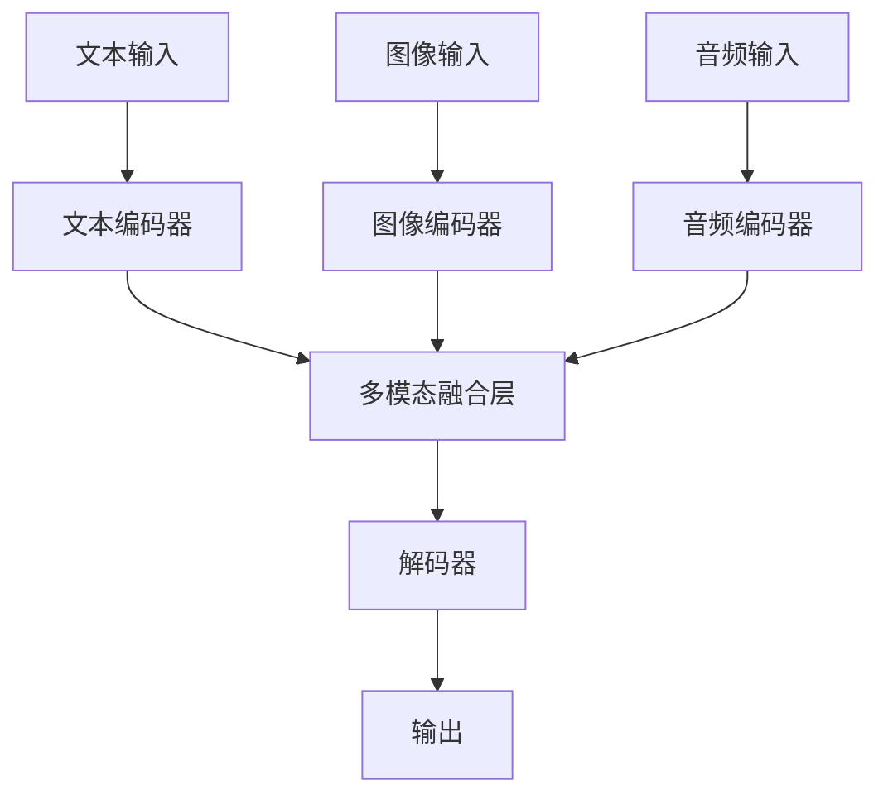

# 多模态大模型：技术原理与实战 GPT技术的发展历程

## 1.背景介绍

### 1.1 人工智能的发展历程
人工智能（AI）自20世纪50年代诞生以来，经历了多次起伏。从最初的符号主义到连接主义，再到如今的深度学习，AI技术不断演进。近年来，深度学习尤其是基于神经网络的模型在图像识别、自然语言处理等领域取得了显著的成果。

### 1.2 多模态大模型的兴起
多模态大模型是指能够处理和理解多种类型数据（如文本、图像、音频等）的模型。随着数据量的爆炸性增长和计算能力的提升，多模态大模型逐渐成为AI研究的热点。它们不仅能够在单一模态上表现出色，还能通过融合多种模态的信息，提供更为全面和准确的理解。

### 1.3 GPT技术的演变
生成式预训练模型（GPT）是由OpenAI提出的一种基于Transformer架构的语言模型。自GPT-1问世以来，GPT技术经历了多次迭代和改进，逐步发展成为如今的GPT-4。每一代GPT模型在参数规模、训练数据量和性能上都有显著提升。

## 2.核心概念与联系

### 2.1 多模态数据
多模态数据指的是来自不同来源和形式的数据，如文本、图像、音频、视频等。处理多模态数据的挑战在于如何有效地融合和理解这些不同类型的信息。

### 2.2 Transformer架构
Transformer是一种基于自注意力机制的神经网络架构，最早由Vaswani等人在2017年提出。它在自然语言处理任务中表现出色，并成为GPT等生成式模型的基础。

### 2.3 生成式预训练模型（GPT）
GPT是一种基于Transformer架构的生成式语言模型。它通过大规模的无监督预训练，学习语言的统计特性和语义信息，然后在特定任务上进行微调。

### 2.4 多模态融合
多模态融合是指将来自不同模态的数据进行整合，以便模型能够同时利用这些信息进行预测或生成。常见的多模态融合方法包括早期融合、晚期融合和中间融合。

## 3.核心算法原理具体操作步骤

### 3.1 数据预处理
数据预处理是多模态大模型训练的第一步。不同模态的数据需要进行不同的预处理步骤，如文本的分词和编码，图像的归一化和增强，音频的特征提取等。

### 3.2 模型架构设计
多模态大模型的架构设计通常基于Transformer。以下是一个典型的多模态大模型架构示意图：



### 3.3 预训练
预训练是多模态大模型的关键步骤。通过在大规模无标签数据上进行预训练，模型能够学习到丰富的特征表示。预训练任务可以是自监督任务，如掩码语言模型（MLM）和图像自编码器。

### 3.4 微调
在特定任务上进行微调是多模态大模型应用的最后一步。通过在有标签的数据上进行微调，模型能够适应特定任务的需求，提高性能。

## 4.数学模型和公式详细讲解举例说明

### 4.1 自注意力机制
自注意力机制是Transformer的核心。它通过计算输入序列中每个元素与其他元素的相关性，来捕捉全局信息。自注意力机制的计算公式如下：

$$
\text{Attention}(Q, K, V) = \text{softmax}\left(\frac{QK^T}{\sqrt{d_k}}\right)V
$$

其中，$Q$、$K$、$V$分别表示查询、键和值矩阵，$d_k$是键的维度。

### 4.2 生成式预训练
生成式预训练的目标是通过最大化条件概率来生成文本。GPT的训练目标可以表示为：

$$
L(\theta) = -\sum_{t=1}^{T} \log P(x_t | x_{<t}; \theta)
$$

其中，$x_t$表示第$t$个词，$\theta$表示模型参数。

### 4.3 多模态融合
多模态融合的数学表示可以通过加权求和或拼接等方式实现。假设有两种模态的特征表示$h_1$和$h_2$，则融合后的表示$h$可以表示为：

$$
h = \alpha h_1 + \beta h_2
$$

其中，$\alpha$和$\beta$是融合权重。

## 5.项目实践：代码实例和详细解释说明

### 5.1 数据预处理
以下是一个简单的文本和图像数据预处理示例：

```python
from transformers import BertTokenizer
from PIL import Image
import torchvision.transforms as transforms

# 文本预处理
tokenizer = BertTokenizer.from_pretrained('bert-base-uncased')
text = "This is a sample text."
tokens = tokenizer(text, return_tensors='pt')

# 图像预处理
image = Image.open('sample.jpg')
transform = transforms.Compose([
    transforms.Resize((224, 224)),
    transforms.ToTensor(),
    transforms.Normalize(mean=[0.485, 0.456, 0.406], std=[0.229, 0.224, 0.225]),
])
image_tensor = transform(image)
```

### 5.2 模型训练
以下是一个简单的多模态模型训练示例：

```python
import torch
import torch.nn as nn
import torch.optim as optim

class MultiModalModel(nn.Module):
    def __init__(self, text_model, image_model, fusion_dim):
        super(MultiModalModel, self).__init__()
        self.text_model = text_model
        self.image_model = image_model
        self.fusion_layer = nn.Linear(text_model.config.hidden_size + image_model.fc.in_features, fusion_dim)
        self.classifier = nn.Linear(fusion_dim, 2)

    def forward(self, text_input, image_input):
        text_features = self.text_model(**text_input).last_hidden_state[:, 0, :]
        image_features = self.image_model(image_input)
        combined_features = torch.cat((text_features, image_features), dim=1)
        fusion_output = self.fusion_layer(combined_features)
        logits = self.classifier(fusion_output)
        return logits

# 初始化模型
text_model = BertModel.from_pretrained('bert-base-uncased')
image_model = models.resnet50(pretrained=True)
model = MultiModalModel(text_model, image_model, fusion_dim=512)

# 定义损失函数和优化器
criterion = nn.CrossEntropyLoss()
optimizer = optim.Adam(model.parameters(), lr=1e-4)

# 训练循环
for epoch in range(num_epochs):
    for text_input, image_input, labels in dataloader:
        optimizer.zero_grad()
        outputs = model(text_input, image_input)
        loss = criterion(outputs, labels)
        loss.backward()
        optimizer.step()
```

### 5.3 模型评估
以下是一个简单的模型评估示例：

```python
from sklearn.metrics import accuracy_score

model.eval()
all_preds = []
all_labels = []

with torch.no_grad():
    for text_input, image_input, labels in dataloader:
        outputs = model(text_input, image_input)
        preds = torch.argmax(outputs, dim=1)
        all_preds.extend(preds.cpu().numpy())
        all_labels.extend(labels.cpu().numpy())

accuracy = accuracy_score(all_labels, all_preds)
print(f'Accuracy: {accuracy:.4f}')
```

## 6.实际应用场景

### 6.1 医疗影像分析
多模态大模型在医疗影像分析中具有广泛应用。例如，通过结合患者的病历文本和医学影像数据，模型可以提供更准确的诊断和治疗建议。

### 6.2 自动驾驶
在自动驾驶领域，多模态大模型可以融合摄像头、激光雷达和雷达等多种传感器数据，提高车辆的感知和决策能力。

### 6.3 多媒体内容生成
多模态大模型在多媒体内容生成中也有重要应用。例如，通过结合文本和图像，模型可以生成高质量的图文内容，应用于新闻报道、广告创作等领域。

### 6.4 智能客服
在智能客服系统中，多模态大模型可以结合用户的语音、文本和表情等多种信息，提供更自然和智能的交互体验。

## 7.工具和资源推荐

### 7.1 开源框架
- **Transformers**：由Hugging Face提供的开源库，支持多种预训练模型，包括BERT、GPT等。
- **PyTorch**：一个流行的深度学习框架，支持动态计算图和多种神经网络模型。
- **TensorFlow**：另一个流行的深度学习框架，提供丰富的工具和资源。

### 7.2 数据集
- **COCO**：一个大规模图像数据集，包含丰富的图像和标注信息。
- **ImageNet**：一个大规模图像分类数据集，广泛用于图像识别任务。
- **OpenAI GPT-3 Dataset**：用于训练GPT-3的文本数据集，包含丰富的文本信息。

### 7.3 在线资源
- **arXiv**：一个开放的学术论文预印本平台，提供最新的AI研究成果。
- **GitHub**：一个开源代码托管平台，提供丰富的开源项目和资源。
- **Kaggle**：一个数据科学竞赛平台，提供丰富的数据集和竞赛机会。

## 8.总结：未来发展趋势与挑战

### 8.1 未来发展趋势
多模态大模型的发展前景广阔。随着数据量的不断增加和计算能力的提升，多模态大模型将在更多领域展现出强大的应用潜力。未来，模型的规模和复杂度将进一步增加，模型的性能和泛化能力也将不断提升。

### 8.2 挑战与问题
尽管多模态大模型具有广泛的应用前景，但仍面临一些挑战和问题。例如，如何高效地融合和处理多模态数据，如何解决模型的可解释性和透明性问题，如何应对数据隐私和安全问题等。

## 9.附录：常见问题与解答

### 9.1 多模态大模型的优势是什么？
多模态大模型能够融合和理解多种类型的数据，提供更全面和准确的预测和生成结果。

### 9.2 如何选择合适的多模态融合方法？
选择多模态融合方法需要根据具体任务和数据特点进行权衡。早期融合适用于数据之间具有强相关性的情况，晚期融合适用于数据之间相关性较弱的情况，中间融合则适用于数据之间具有一定相关性的情况。

### 9.3 多模态大模型的训练需要哪些资源？
多模态大模型的训练通常需要大规模的计算资源和存储资源。高性能GPU和分布式计算平台是常见的选择。

### 9.4 如何评估多模态大模型的性能？
多模态大模型的性能评估可以通过多种指标进行，如准确率、精确率、召回率、F1-score等。具体选择哪些指标需要根据具体任务和应用场景进行确定。

### 9.5 多模态大模型的应用前景如何？
多模态大模型在医疗、自动驾驶、多媒体内容生成、智能客服等领域具有广泛的应用前景。随着技术的不断发展，多模态大模型将在更多领域展现出强大的应用潜力。

---

作者：禅与计算机程序设计艺术 / Zen and the Art of Computer Programming