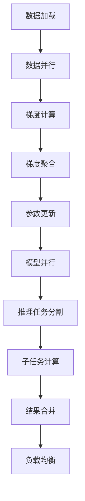

# 大规模语言模型从理论到实践 去中心化架构

## 1.背景介绍

大规模语言模型（Large Language Models, LLMs）近年来在自然语言处理（NLP）领域取得了显著的进展。诸如GPT-3、BERT等模型在各种任务中表现出色。然而，随着模型规模的不断扩大，集中式架构的局限性逐渐显现。去中心化架构作为一种新兴的解决方案，正在引起越来越多的关注。

去中心化架构不仅可以解决集中式架构中的单点故障问题，还能提高系统的可扩展性和容错性。本文将深入探讨大规模语言模型的去中心化架构，从理论到实践，全面解析其核心概念、算法原理、数学模型、项目实践、实际应用场景、工具和资源推荐，并展望其未来发展趋势与挑战。

## 2.核心概念与联系

### 2.1 大规模语言模型

大规模语言模型是基于深度学习的模型，通常包含数十亿甚至上千亿个参数。它们通过大量的文本数据进行训练，能够生成高质量的自然语言文本，完成翻译、问答、文本生成等任务。

### 2.2 去中心化架构

去中心化架构是一种分布式系统设计方法，旨在消除单点故障，提高系统的可扩展性和容错性。它通过将计算和数据存储分布在多个节点上，实现高效的资源利用和任务分配。

### 2.3 核心联系

大规模语言模型的训练和推理过程需要大量的计算资源和数据存储。去中心化架构可以通过分布式计算和存储，解决集中式架构中的瓶颈问题，提高系统的性能和可靠性。

## 3.核心算法原理具体操作步骤

### 3.1 分布式训练

分布式训练是去中心化架构的核心技术之一。它通过将模型参数和训练数据分布在多个计算节点上，并行进行训练，从而加速训练过程。

#### 3.1.1 数据并行

数据并行是将训练数据分割成多个小批次，并在不同的计算节点上并行处理。每个节点拥有完整的模型副本，独立计算梯度，然后通过参数服务器或全局通信机制进行梯度聚合和参数更新。

#### 3.1.2 模型并行

模型并行是将模型参数分割成多个部分，并在不同的计算节点上并行计算。每个节点只负责计算一部分参数的梯度，然后通过通信机制进行参数更新。

### 3.2 分布式推理

分布式推理是将推理任务分布在多个计算节点上，并行进行推理计算，从而提高推理速度和系统的吞吐量。

#### 3.2.1 任务分割

将推理任务分割成多个子任务，并分配给不同的计算节点。每个节点独立完成子任务的计算，然后通过通信机制进行结果合并。

#### 3.2.2 负载均衡

通过负载均衡算法，将推理任务均匀分配给各个计算节点，避免某些节点过载，提高系统的整体性能。

### 3.3 Mermaid 流程图

以下是分布式训练和推理的Mermaid流程图：



## 4.数学模型和公式详细讲解举例说明

### 4.1 梯度下降算法

梯度下降算法是训练大规模语言模型的核心算法。其基本思想是通过迭代优化模型参数，使损失函数达到最小值。

#### 4.1.1 数学公式

梯度下降算法的更新公式为：

$$
\theta_{t+1} = \theta_t - \eta \nabla_{\theta} L(\theta_t)
$$

其中，$\theta_t$ 表示第 $t$ 次迭代的模型参数，$\eta$ 表示学习率，$L(\theta_t)$ 表示损失函数。

### 4.2 分布式梯度下降

在分布式训练中，梯度下降算法需要在多个计算节点上并行计算梯度，并进行梯度聚合和参数更新。

#### 4.2.1 数学公式

分布式梯度下降的更新公式为：

$$
\theta_{t+1} = \theta_t - \eta \frac{1}{N} \sum_{i=1}^{N} \nabla_{\theta} L_i(\theta_t)
$$

其中，$N$ 表示计算节点的数量，$L_i(\theta_t)$ 表示第 $i$ 个节点计算的损失函数。

### 4.3 示例说明

假设我们有一个简单的线性回归模型，其损失函数为均方误差（MSE）：

$$
L(\theta) = \frac{1}{2m} \sum_{i=1}^{m} (y_i - \theta x_i)^2
$$

其中，$m$ 表示样本数量，$y_i$ 表示第 $i$ 个样本的真实值，$x_i$ 表示第 $i$ 个样本的特征值。

在分布式训练中，我们将样本数据分割成 $N$ 个子集，每个计算节点计算一个子集的梯度，然后进行梯度聚合和参数更新。

## 5.项目实践：代码实例和详细解释说明

### 5.1 分布式训练代码实例

以下是一个使用PyTorch进行分布式训练的代码示例：

```python
import torch
import torch.distributed as dist
import torch.multiprocessing as mp
from torch.nn.parallel import DistributedDataParallel as DDP

def setup(rank, world_size):
    dist.init_process_group("gloo", rank=rank, world_size=world_size)

def cleanup():
    dist.destroy_process_group()

def train(rank, world_size):
    setup(rank, world_size)
    
    model = torch.nn.Linear(10, 1).to(rank)
    ddp_model = DDP(model, device_ids=[rank])
    
    loss_fn = torch.nn.MSELoss()
    optimizer = torch.optim.SGD(ddp_model.parameters(), lr=0.001)
    
    for epoch in range(10):
        optimizer.zero_grad()
        outputs = ddp_model(torch.randn(20, 10).to(rank))
        labels = torch.randn(20, 1).to(rank)
        loss = loss_fn(outputs, labels)
        loss.backward()
        optimizer.step()
    
    cleanup()

def main():
    world_size = 4
    mp.spawn(train, args=(world_size,), nprocs=world_size, join=True)

if __name__ == "__main__":
    main()
```

### 5.2 代码解释

1. **setup**：初始化分布式进程组。
2. **cleanup**：销毁分布式进程组。
3. **train**：定义训练过程，包括模型定义、损失函数、优化器和训练循环。
4. **main**：使用 `mp.spawn` 启动多个进程进行分布式训练。

### 5.3 分布式推理代码实例

以下是一个使用Ray进行分布式推理的代码示例：

```python
import ray
import time

@ray.remote
def inference_task(data):
    time.sleep(1)  # 模拟推理计算
    return sum(data)

def main():
    ray.init()
    
    data_batches = [list(range(10)) for _ in range(4)]
    results = ray.get([inference_task.remote(data) for data in data_batches])
    
    print("Inference results:", results)
    
    ray.shutdown()

if __name__ == "__main__":
    main()
```

### 5.4 代码解释

1. **inference_task**：定义推理任务，模拟推理计算。
2. **main**：初始化Ray，分割数据并分配推理任务，获取推理结果并打印。

## 6.实际应用场景

### 6.1 自然语言处理

大规模语言模型在自然语言处理中的应用非常广泛，包括文本生成、机器翻译、问答系统等。去中心化架构可以提高这些应用的性能和可靠性。

### 6.2 智能客服

智能客服系统需要处理大量的用户请求，去中心化架构可以通过分布式计算，提高系统的响应速度和处理能力。

### 6.3 推荐系统

推荐系统需要实时处理大量的用户行为数据，去中心化架构可以通过分布式存储和计算，提高系统的推荐效果和用户体验。

## 7.工具和资源推荐

### 7.1 分布式训练工具

- **PyTorch Distributed**：PyTorch提供的分布式训练工具，支持数据并行和模型并行。
- **Horovod**：Uber开源的分布式深度学习训练框架，支持TensorFlow、Keras、PyTorch等。

### 7.2 分布式推理工具

- **Ray**：一个高性能的分布式计算框架，支持分布式推理和任务调度。
- **Dask**：一个并行计算库，支持大规模数据处理和分布式计算。

### 7.3 资源推荐

- **《Deep Learning》**：Ian Goodfellow等人编写的深度学习经典教材，详细介绍了深度学习的基本原理和应用。
- **《Distributed Systems》**：Andrew S. Tanenbaum编写的分布式系统经典教材，详细介绍了分布式系统的基本原理和设计方法。

## 8.总结：未来发展趋势与挑战

### 8.1 未来发展趋势

随着大规模语言模型的不断发展，去中心化架构将成为其重要的支撑技术。未来，去中心化架构将在以下几个方面取得突破：

- **更高效的分布式训练算法**：通过优化分布式训练算法，提高训练效率和模型性能。
- **更智能的任务调度机制**：通过智能任务调度机制，提高系统的资源利用率和任务处理能力。
- **更可靠的容错机制**：通过更可靠的容错机制，提高系统的稳定性和可靠性。

### 8.2 挑战

尽管去中心化架构具有诸多优势，但在实际应用中仍面临一些挑战：

- **通信开销**：分布式系统中的通信开销较大，需要优化通信机制，减少通信延迟。
- **数据一致性**：分布式系统中的数据一致性问题较为复杂，需要设计高效的数据一致性算法。
- **系统复杂性**：去中心化架构的系统设计和实现较为复杂，需要具备较高的技术水平和经验。

## 9.附录：常见问题与解答

### 9.1 去中心化架构的优势是什么？

去中心化架构的优势包括提高系统的可扩展性、容错性和资源利用率，解决集中式架构中的单点故障问题。

### 9.2 如何选择分布式训练工具？

选择分布式训练工具时，可以根据具体需求和应用场景选择合适的工具。例如，PyTorch Distributed适合PyTorch用户，Horovod适合多种深度学习框架用户。

### 9.3 去中心化架构在实际应用中面临哪些挑战？

去中心化架构在实际应用中面临的挑战包括通信开销大、数据一致性问题复杂、系统设计和实现复杂等。

### 9.4 如何优化分布式训练算法？

优化分布式训练算法可以通过减少通信开销、提高计算效率、优化梯度聚合和参数更新机制等方法实现。

### 9.5 去中心化架构的未来发展趋势是什么？

去中心化架构的未来发展趋势包括更高效的分布式训练算法、更智能的任务调度机制、更可靠的容错机制等。

---

作者：禅与计算机程序设计艺术 / Zen and the Art of Computer Programming