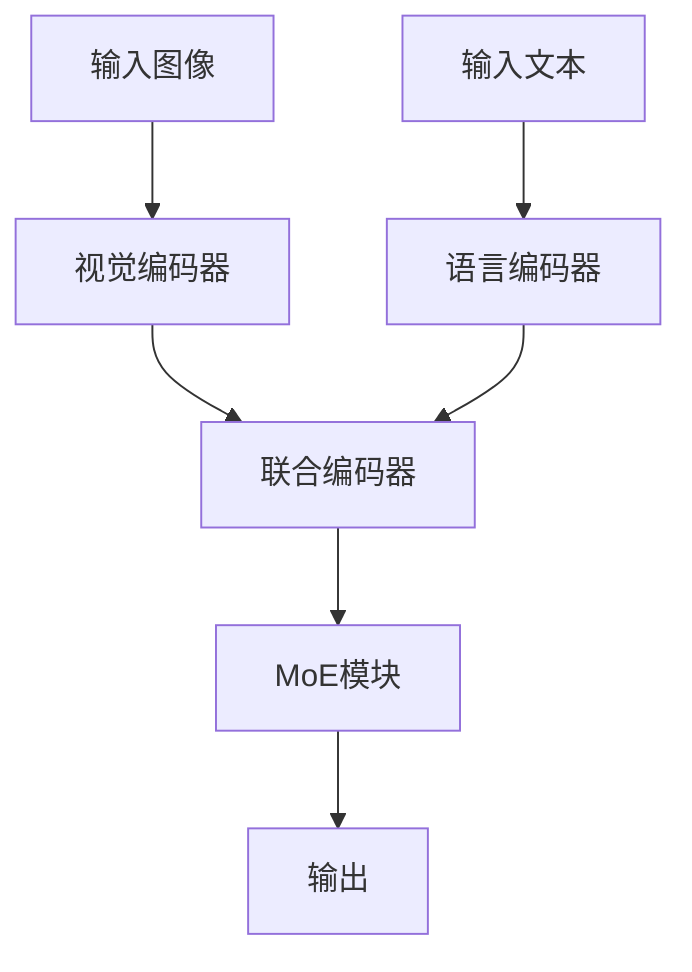

# 大语言模型原理基础与前沿 通过稀疏MoE扩展视觉语言模型

## 1.背景介绍

在人工智能领域，语言模型和视觉模型的结合已经成为一个重要的研究方向。大语言模型（Large Language Models, LLMs）如GPT-3、BERT等，已经在自然语言处理（NLP）任务中取得了显著的成果。而视觉语言模型（Vision-Language Models, VLMs）则通过结合视觉和语言信息，进一步提升了模型在多模态任务中的表现。稀疏专家模型（Mixture of Experts, MoE）作为一种有效的模型扩展方法，能够在保持计算效率的同时，显著提升模型的性能。

本文将深入探讨大语言模型的原理基础与前沿技术，重点介绍如何通过稀疏MoE扩展视觉语言模型。我们将从核心概念、算法原理、数学模型、项目实践、实际应用场景、工具和资源推荐等多个方面进行详细讲解。

## 2.核心概念与联系

### 2.1 大语言模型（LLMs）

大语言模型是基于深度学习的自然语言处理模型，通常具有数十亿甚至上千亿的参数。它们通过大规模的文本数据进行训练，能够生成高质量的自然语言文本，并在各种NLP任务中表现出色。

### 2.2 视觉语言模型（VLMs）

视觉语言模型结合了视觉和语言信息，能够处理多模态任务，如图像描述、视觉问答等。VLMs通常由一个视觉编码器和一个语言编码器组成，通过联合训练来学习视觉和语言之间的关系。

### 2.3 稀疏专家模型（MoE）

稀疏专家模型是一种模型扩展方法，通过引入多个专家（子模型），并在每次推理时仅激活部分专家，从而在保持计算效率的同时，提升模型的性能。MoE的核心思想是通过稀疏激活机制，选择最适合当前输入的专家进行处理。

### 2.4 核心联系

通过将稀疏MoE应用于视觉语言模型，我们可以在不显著增加计算成本的情况下，提升模型的性能和泛化能力。这种方法能够有效地处理多模态任务，并在实际应用中展现出强大的潜力。

## 3.核心算法原理具体操作步骤

### 3.1 模型架构设计

在设计视觉语言模型时，我们需要考虑如何将稀疏MoE集成到模型中。通常的做法是将MoE模块嵌入到视觉编码器和语言编码器之间，或者在联合编码器中引入MoE模块。



### 3.2 稀疏激活机制

稀疏激活机制是MoE的核心，通过选择最适合当前输入的专家进行处理。具体步骤如下：

1. **专家选择**：根据输入数据，计算每个专家的激活概率。
2. **稀疏激活**：选择激活概率最高的几个专家进行处理。
3. **专家融合**：将激活的专家输出进行融合，得到最终的输出。

### 3.3 训练过程

在训练过程中，我们需要同时优化视觉编码器、语言编码器和MoE模块的参数。常用的优化方法包括梯度下降、Adam等。

### 3.4 推理过程

在推理过程中，我们根据输入数据选择最适合的专家进行处理，从而在保持计算效率的同时，提升模型的性能。

## 4.数学模型和公式详细讲解举例说明

### 4.1 大语言模型的数学基础

大语言模型通常基于Transformer架构，其核心是自注意力机制。自注意力机制通过计算输入序列中每个位置的注意力权重，来捕捉序列中的长距离依赖关系。

$$
\text{Attention}(Q, K, V) = \text{softmax}\left(\frac{QK^T}{\sqrt{d_k}}\right)V
$$

其中，$Q$、$K$、$V$分别表示查询、键和值矩阵，$d_k$表示键的维度。

### 4.2 稀疏专家模型的数学基础

稀疏专家模型通过引入多个专家，并在每次推理时仅激活部分专家。假设有$N$个专家，每个专家的输出为$E_i(x)$，则最终输出为：

$$
y = \sum_{i=1}^{N} g_i(x) E_i(x)
$$

其中，$g_i(x)$表示第$i$个专家的激活概率，满足$\sum_{i=1}^{N} g_i(x) = 1$。

### 4.3 视觉语言模型的数学基础

视觉语言模型通过联合训练视觉编码器和语言编码器，学习视觉和语言之间的关系。假设视觉编码器的输出为$V(x)$，语言编码器的输出为$L(x)$，则联合编码器的输出为：

$$
h = f(V(x), L(x))
$$

其中，$f$表示联合编码器的函数。

### 4.4 数学公式举例说明

假设我们有一个图像描述任务，输入图像$x$和描述文本$y$，则模型的目标是最大化描述文本的概率：

$$
P(y|x) = \prod_{t=1}^{T} P(y_t|y_{<t}, x)
$$

其中，$T$表示描述文本的长度，$y_t$表示描述文本的第$t$个词。

## 5.项目实践：代码实例和详细解释说明

### 5.1 环境配置

在开始项目实践之前，我们需要配置好开发环境。推荐使用Python和PyTorch框架。

```bash
pip install torch torchvision transformers
```

### 5.2 数据准备

我们需要准备一个包含图像和描述文本的数据集。常用的数据集包括COCO、Flickr30k等。

### 5.3 模型实现

以下是一个简单的视觉语言模型实现示例，包含稀疏MoE模块。

```python
import torch
import torch.nn as nn
from transformers import BertModel, BertTokenizer

class VisionEncoder(nn.Module):
    def __init__(self):
        super(VisionEncoder, self).__init__()
        self.conv = nn.Conv2d(3, 64, kernel_size=3, stride=1, padding=1)
        self.pool = nn.MaxPool2d(kernel_size=2, stride=2, padding=0)

    def forward(self, x):
        x = self.pool(F.relu(self.conv(x)))
        return x

class MoE(nn.Module):
    def __init__(self, num_experts, input_dim, output_dim):
        super(MoE, self).__init__()
        self.experts = nn.ModuleList([nn.Linear(input_dim, output_dim) for _ in range(num_experts)])
        self.gate = nn.Linear(input_dim, num_experts)

    def forward(self, x):
        gate_output = torch.softmax(self.gate(x), dim=-1)
        expert_outputs = torch.stack([expert(x) for expert in self.experts], dim=1)
        output = torch.sum(gate_output.unsqueeze(-1) * expert_outputs, dim=1)
        return output

class VisionLanguageModel(nn.Module):
    def __init__(self, num_experts):
        super(VisionLanguageModel, self).__init__()
        self.vision_encoder = VisionEncoder()
        self.language_encoder = BertModel.from_pretrained('bert-base-uncased')
        self.moe = MoE(num_experts, 768, 768)

    def forward(self, image, text):
        vision_output = self.vision_encoder(image)
        text_output = self.language_encoder(text).last_hidden_state
        combined_output = torch.cat((vision_output, text_output), dim=1)
        output = self.moe(combined_output)
        return output

# 示例输入
image = torch.randn(1, 3, 224, 224)
text = torch.tensor([[101, 2054, 2003, 1996, 2171, 102]])

# 模型实例化
model = VisionLanguageModel(num_experts=4)
output = model(image, text)
print(output)
```

### 5.4 训练与评估

在训练过程中，我们需要定义损失函数和优化器，并进行模型训练和评估。

```python
import torch.optim as optim

# 定义损失函数和优化器
criterion = nn.CrossEntropyLoss()
optimizer = optim.Adam(model.parameters(), lr=0.001)

# 训练循环
for epoch in range(num_epochs):
    for images, texts, labels in dataloader:
        optimizer.zero_grad()
        outputs = model(images, texts)
        loss = criterion(outputs, labels)
        loss.backward()
        optimizer.step()

    print(f'Epoch {epoch+1}/{num_epochs}, Loss: {loss.item()}')

# 模型评估
model.eval()
with torch.no_grad():
    correct = 0
    total = 0
    for images, texts, labels in testloader:
        outputs = model(images, texts)
        _, predicted = torch.max(outputs.data, 1)
        total += labels.size(0)
        correct += (predicted == labels).sum().item()

    print(f'Accuracy: {100 * correct / total}%')
```

## 6.实际应用场景

### 6.1 图像描述

视觉语言模型可以用于图像描述任务，即根据输入图像生成自然语言描述。这在自动生成图像标签、图像搜索等应用中具有重要意义。

### 6.2 视觉问答

视觉问答任务要求模型根据输入图像和问题生成答案。视觉语言模型通过结合视觉和语言信息，能够在这一任务中表现出色。

### 6.3 多模态情感分析

多模态情感分析任务要求模型根据输入的图像和文本，判断情感类别。视觉语言模型通过联合训练视觉和语言编码器，能够有效地处理这一任务。

### 6.4 其他应用

视觉语言模型还可以应用于图像生成、视频理解、跨模态检索等多个领域，展现出广泛的应用前景。

## 7.工具和资源推荐

### 7.1 开发工具

- **PyTorch**：一个流行的深度学习框架，适用于大语言模型和视觉语言模型的开发。
- **Transformers**：Hugging Face提供的一个库，包含了多种预训练的语言模型，如BERT、GPT等。

### 7.2 数据集

- **COCO**：一个常用的图像描述数据集，包含大量的图像和对应的描述文本。
- **Flickr30k**：另一个常用的图像描述数据集，适用于视觉语言模型的训练和评估。

### 7.3 参考文献

- Vaswani, A., et al. (2017). "Attention is All You Need." Advances in Neural Information Processing Systems.
- Devlin, J., et al. (2018). "BERT: Pre-training of Deep Bidirectional Transformers for Language Understanding." arXiv preprint arXiv:1810.04805.

## 8.总结：未来发展趋势与挑战

### 8.1 未来发展趋势

随着大语言模型和视觉语言模型的不断发展，未来的研究方向可能包括：

- **更大规模的模型**：通过引入更多的参数和更大的数据集，提升模型的性能。
- **更高效的训练方法**：通过优化训练算法和硬件，加速模型的训练过程。
- **更广泛的应用场景**：探索视觉语言模型在更多实际应用中的潜力，如医疗影像分析、自动驾驶等。

### 8.2 挑战

尽管视觉语言模型展现出广泛的应用前景，但仍面临一些挑战：

- **计算成本**：大规模模型的训练和推理需要大量的计算资源，如何降低计算成本是一个重要问题。
- **数据依赖**：模型的性能高度依赖于大规模的高质量数据，如何获取和处理这些数据是一个挑战。
- **模型解释性**：大规模模型的复杂性使得其内部机制难以解释，如何提升模型的可解释性是一个重要研究方向。

## 9.附录：常见问题与解答

### 9.1 什么是大语言模型？

大语言模型是基于深度学习的自然语言处理模型，通常具有数十亿甚至上千亿的参数，能够生成高质量的自然语言文本，并在各种NLP任务中表现出色。

### 9.2 什么是视觉语言模型？

视觉语言模型结合了视觉和语言信息，能够处理多模态任务，如图像描述、视觉问答等。VLMs通常由一个视觉编码器和一个语言编码器组成，通过联合训练来学习视觉和语言之间的关系。

### 9.3 什么是稀疏专家模型？

稀疏专家模型是一种模型扩展方法，通过引入多个专家（子模型），并在每次推理时仅激活部分专家，从而在保持计算效率的同时，提升模型的性能。

### 9.4 如何通过稀疏MoE扩展视觉语言模型？

通过将稀疏MoE应用于视觉语言模型，我们可以在不显著增加计算成本的情况下，提升模型的性能和泛化能力。这种方法能够有效地处理多模态任务，并在实际应用中展现出强大的潜力。

### 9.5 视觉语言模型的实际应用有哪些？

视觉语言模型可以应用于图像描述、视觉问答、多模态情感分析、图像生成、视频理解、跨模态检索等多个领域，展现出广泛的应用前景。

---

作者：禅与计算机程序设计艺术 / Zen and the Art of Computer Programming