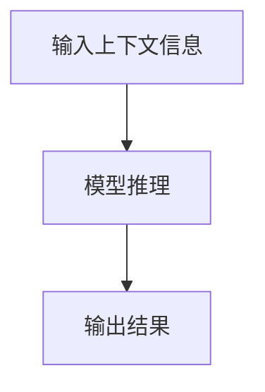

# 大语言模型的in-context学习原理与代码实例讲解

## 1.背景介绍

大语言模型（Large Language Models, LLMs）近年来在自然语言处理（NLP）领域取得了显著的进展。它们不仅在生成文本、翻译、问答等任务中表现出色，还展示了强大的in-context学习能力。in-context学习指的是模型在没有显式训练的情况下，通过上下文信息进行推理和学习。这种能力使得大语言模型在处理新任务时更加灵活和高效。

## 2.核心概念与联系

### 2.1 大语言模型简介

大语言模型是基于深度学习的神经网络模型，通常具有数十亿甚至上千亿的参数。它们通过大量的文本数据进行训练，能够捕捉语言的复杂结构和语义关系。常见的大语言模型包括GPT-3、BERT、T5等。

### 2.2 in-context学习的定义

in-context学习是指模型通过给定的上下文信息进行推理和学习，而不需要显式的训练过程。换句话说，模型可以根据输入的上下文信息，动态地调整其行为，以完成特定任务。

### 2.3 大语言模型与in-context学习的联系

大语言模型的in-context学习能力源于其庞大的参数和复杂的结构。通过大量的训练数据，这些模型能够学习到丰富的语言模式和语义关系，从而在给定上下文信息时，能够进行有效的推理和学习。

## 3.核心算法原理具体操作步骤

### 3.1 预训练

大语言模型的预训练阶段通常采用自回归或自编码的方式。自回归模型（如GPT-3）通过预测下一个词来进行训练，而自编码模型（如BERT）则通过掩码语言模型（Masked Language Model, MLM）进行训练。

### 3.2 微调

在预训练完成后，模型可以通过微调（Fine-tuning）来适应特定任务。微调阶段通常使用较小的任务特定数据集，对模型进行进一步训练。

### 3.3 in-context学习

in-context学习不需要显式的微调，而是通过给定的上下文信息，模型动态地调整其行为。具体操作步骤如下：

1. **输入上下文信息**：将任务描述、示例数据等信息作为输入，提供给模型。
2. **模型推理**：模型根据输入的上下文信息，进行推理和生成输出。
3. **输出结果**：模型生成的输出结果即为任务的解答。

以下是一个Mermaid流程图，展示了in-context学习的操作步骤：



## 4.数学模型和公式详细讲解举例说明

### 4.1 自回归模型

自回归模型通过最大化条件概率来进行训练。假设输入序列为 $x_1, x_2, \ldots, x_T$，模型的目标是最大化以下概率：

$$
P(x_1, x_2, \ldots, x_T) = \prod_{t=1}^{T} P(x_t | x_1, x_2, \ldots, x_{t-1})
$$

### 4.2 掩码语言模型

掩码语言模型通过掩码部分输入序列，并预测被掩码的词来进行训练。假设输入序列为 $x_1, x_2, \ldots, x_T$，掩码后的序列为 $\tilde{x}_1, \tilde{x}_2, \ldots, \tilde{x}_T$，模型的目标是最大化以下概率：

$$
P(x_i | \tilde{x}_1, \tilde{x}_2, \ldots, \tilde{x}_T)
$$

### 4.3 in-context学习的数学表示

in-context学习可以看作是条件生成问题。假设上下文信息为 $C$，模型的目标是生成符合上下文的输出 $Y$，即最大化以下条件概率：

$$
P(Y | C)
$$

## 5.项目实践：代码实例和详细解释说明

### 5.1 环境准备

首先，我们需要安装必要的库和工具。以下是一个示例代码，使用Python和Hugging Face的Transformers库：

```python
!pip install transformers
```

### 5.2 加载预训练模型

接下来，我们加载一个预训练的大语言模型，例如GPT-3：

```python
from transformers import GPT2LMHeadModel, GPT2Tokenizer

model_name = 'gpt2'
model = GPT2LMHeadModel.from_pretrained(model_name)
tokenizer = GPT2Tokenizer.from_pretrained(model_name)
```

### 5.3 输入上下文信息

我们定义一个上下文信息，并将其编码为模型的输入：

```python
context = "Translate English to French: The cat is on the mat."
input_ids = tokenizer.encode(context, return_tensors='pt')
```

### 5.4 模型推理

使用模型进行推理，生成输出：

```python
output = model.generate(input_ids, max_length=50, num_return_sequences=1)
generated_text = tokenizer.decode(output[0], skip_special_tokens=True)
print(generated_text)
```

### 5.5 结果分析

通过上述代码，我们可以看到模型根据上下文信息生成的翻译结果。这个过程展示了in-context学习的实际应用。

## 6.实际应用场景

### 6.1 机器翻译

in-context学习可以用于机器翻译任务，通过提供源语言和目标语言的示例，模型可以动态地生成翻译结果。

### 6.2 文本生成

在文本生成任务中，in-context学习可以根据给定的上下文信息，生成符合语境的文本内容。

### 6.3 问答系统

in-context学习在问答系统中也有广泛应用，通过提供问题和相关背景信息，模型可以生成准确的答案。

### 6.4 代码生成

in-context学习还可以用于代码生成任务，通过提供代码片段和注释，模型可以生成完整的代码实现。

## 7.工具和资源推荐

### 7.1 Hugging Face Transformers

Hugging Face的Transformers库是一个强大的工具，支持多种大语言模型的加载和使用。它提供了丰富的API和示例代码，方便开发者进行模型的训练和推理。

### 7.2 OpenAI GPT-3

OpenAI的GPT-3是目前最先进的大语言模型之一，具有强大的in-context学习能力。开发者可以通过OpenAI的API访问和使用GPT-3。

### 7.3 Google Colab

Google Colab是一个免费的在线Jupyter笔记本环境，支持GPU加速。它是进行大语言模型实验和开发的理想平台。

## 8.总结：未来发展趋势与挑战

### 8.1 未来发展趋势

大语言模型的in-context学习能力为NLP领域带来了新的可能性。未来，随着模型规模的进一步扩大和训练数据的增加，in-context学习的效果将会更加显著。此外，跨领域的应用和多模态学习也是未来的重要发展方向。

### 8.2 挑战

尽管大语言模型在in-context学习方面取得了显著进展，但仍然面临一些挑战。例如，模型的计算资源需求巨大，训练和推理成本高昂。此外，模型在处理长文本和复杂任务时，仍然存在一定的局限性。

## 9.附录：常见问题与解答

### 9.1 什么是in-context学习？

in-context学习是指模型通过给定的上下文信息进行推理和学习，而不需要显式的训练过程。

### 9.2 大语言模型如何实现in-context学习？

大语言模型通过大量的训练数据，学习到丰富的语言模式和语义关系，从而在给定上下文信息时，能够进行有效的推理和学习。

### 9.3 in-context学习的实际应用有哪些？

in-context学习在机器翻译、文本生成、问答系统和代码生成等任务中有广泛应用。

### 9.4 使用大语言模型进行in-context学习需要哪些工具？

常用的工具包括Hugging Face的Transformers库、OpenAI的GPT-3和Google Colab等。

---

作者：禅与计算机程序设计艺术 / Zen and the Art of Computer Programming