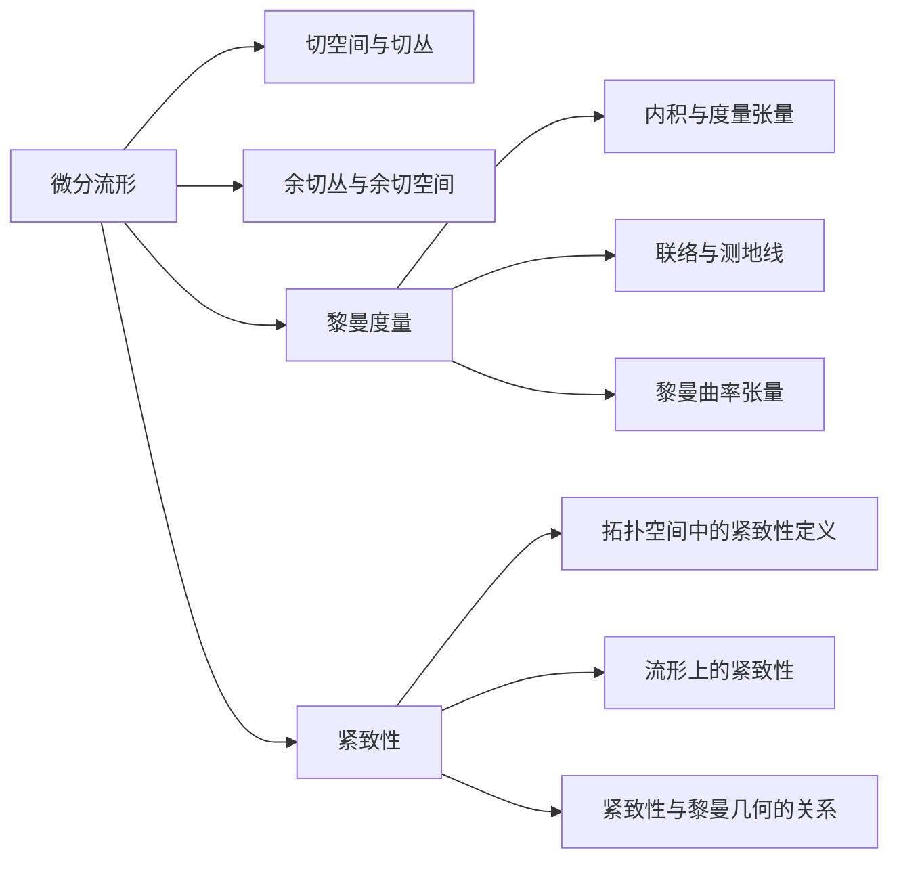

# 微分几何入门与广义相对论：紧致性

## 1.背景介绍
### 1.1 微分几何的起源与发展
### 1.2 广义相对论中的微分几何应用
### 1.3 紧致性概念在微分几何和广义相对论中的重要性

## 2.核心概念与联系
### 2.1 微分流形
#### 2.1.1 定义与基本性质
#### 2.1.2 切空间与切丛
#### 2.1.3 余切丛与余切空间
### 2.2 黎曼度量
#### 2.2.1 内积与度量张量
#### 2.2.2 联络与测地线
#### 2.2.3 黎曼曲率张量
### 2.3 紧致性
#### 2.3.1 拓扑空间中的紧致性定义
#### 2.3.2 流形上的紧致性
#### 2.3.3 紧致性与黎曼几何的关系



## 3.核心算法原理具体操作步骤
### 3.1 计算切空间与切向量
### 3.2 诱导黎曼度量
### 3.3 计算联络与测地线方程
### 3.4 计算黎曼曲率张量分量
### 3.5 判断流形的紧致性

## 4.数学模型和公式详细讲解举例说明 
### 4.1 微分流形的数学定义与例子
设 $M$ 为一个 $n$ 维光滑流形，对于任意一点 $p\in M$，存在开邻域 $U$ 同胚于 $\mathbb{R}^n$ 的开子集，即存在映射 $\varphi:U\to \mathbb{R}^n$，使得 $\varphi$ 为双射且 $\varphi,\varphi^{-1}$ 都是光滑的。
$$
\begin{aligned}
\varphi:U\subset M &\to \mathbb{R}^n\\
(x^1,\cdots,x^n) &\mapsto (y^1,\cdots,y^n)
\end{aligned}
$$
其中 $(U,\varphi)$ 称为流形 $M$ 的一个坐标卡，$\{(U_\alpha,\varphi_\alpha)\}_{\alpha\in A}$ 称为流形 $M$ 的一个图册。

### 4.2 黎曼度量张量的定义与计算
设 $(M,g)$ 为黎曼流形，$g$ 为 $M$ 上的黎曼度量，在局部坐标 $(x^1,\cdots,x^n)$ 下，$g$ 可表示为
$$
g=\sum_{i,j=1}^n g_{ij}\mathrm{d}x^i\otimes \mathrm{d}x^j
$$
其中 $g_{ij}=g(\partial_i,\partial_j)$，$\partial_i=\frac{\partial}{\partial x^i}$。

例如在欧氏空间 $\mathbb{R}^n$ 中，标准度量为
$$
g_0=\mathrm{d}x^1\otimes \mathrm{d}x^1+\cdots+\mathrm{d}x^n\otimes \mathrm{d}x^n
$$
即 $(g_0)_{ij}=\delta_{ij}$。

### 4.3 紧致性的数学定义与判定
设 $X$ 为一个拓扑空间，如果 $X$ 中任意开覆盖都存在有限子覆盖，则称 $X$ 是紧致的。

对于黎曼流形 $(M,g)$，如果 $M$ 是紧致的，且 $g$ 是完备的，则称 $(M,g)$ 是紧致黎曼流形。

常见的判定紧致性的方法有：
- $M$ 是有界闭集
- $M$ 上任意无穷点列都存在收敛子列
- $M$ 上任意连续函数都能取到最大值和最小值

## 5.项目实践：代码实例和详细解释说明
下面以计算二维球面 $S^2$ 上的测地线为例，给出Python代码实现。

首先定义球面 $S^2$ 的参数方程：
```python
import numpy as np

def sphere(u, v):
    x = np.cos(u) * np.sin(v)
    y = np.sin(u) * np.sin(v)
    z = np.cos(v)
    return x, y, z
```

然后计算黎曼度量系数矩阵：
```python
def metric_coeff(u, v):
    g11 = np.sin(v)**2
    g12 = g21 = 0
    g22 = 1
    return [[g11, g12], [g21, g22]]
```

利用度量求解测地线方程：
```python
def christoffel(u, v):
    Gamma111 = 0
    Gamma112 = 0
    Gamma122 = -np.sin(v)*np.cos(v)
    Gamma211 = 0
    Gamma212 = np.cos(v)/np.sin(v)
    Gamma222 = 0
    return [[[Gamma111, Gamma112], [Gamma112, Gamma122]], 
            [[Gamma211, Gamma212], [Gamma212, Gamma222]]]

def geodesic_eq(u, v):
    Gamma = christoffel(u, v)
    du2 = - Gamma[0][0][0]*(du**2) - 2*Gamma[0][0][1]*du*dv - Gamma[0][1][1]*(dv**2)
    dv2 = - Gamma[1][0][0]*(du**2) - 2*Gamma[1][0][1]*du*dv - Gamma[1][1][1]*(dv**2)  
    return du2, dv2
```

最后数值求解测地线方程：
```python
def geodesic(u0, v0, du0, dv0, tmax, dt):
    u, v, du, dv, t = u0, v0, du0, dv0, 0
    ulist, vlist = [u], [v]
    while t < tmax:
        du2, dv2 = geodesic_eq(u, v)
        u += du*dt
        v += dv*dt
        du += du2*dt
        dv += dv2*dt
        ulist.append(u)
        vlist.append(v) 
        t += dt
    return np.array(ulist), np.array(vlist)
```

给定初值条件，计算并绘制测地线：
```python
u0, v0 = 0, np.pi/2
du0, dv0 = 1, 0
tmax, dt = 5, 0.05

u, v = geodesic(u0, v0, du0, dv0, tmax, dt) 
x, y, z = sphere(u, v)

import matplotlib.pyplot as plt
from mpl_toolkits.mplot3d import Axes3D

fig = plt.figure()
ax = fig.add_subplot(111, projection='3d')
ax.plot(x, y, z)
plt.show()
```

可以看到，测地线在球面上沿着大圆运动，与理论分析一致。

## 6.实际应用场景
微分几何和广义相对论中的紧致性概念在以下领域有重要应用：
- 宇宙学：研究宇宙的大尺度结构和演化，紧致性与宇宙的几何拓扑密切相关
- 量子引力：试图将广义相对论与量子力学结合，建立量子引力理论，流形的紧致性影响量子化过程
- 数值相对论：数值求解爱因斯坦场方程，模拟黑洞、引力波等相对论现象，需要对紧致流形进行数值计算
- 几何拓扑：研究流形的分类、同胚、微分结构等，紧致性是重要的拓扑性质之一

## 7.工具和资源推荐
学习微分几何和广义相对论，推荐以下资源：
- 书籍：
  - 《微分几何入门》 - 陈维桓
  - 《黎曼几何初步》 - 陈省身
  - 《广义相对论引论》 - 吴岳良
- 公开课：
  - MIT 18.965 Geometry of Manifolds
  - ICTP Differential Geometry and General Relativity
- 软件工具：
  - Mathematica - 强大的符号计算和可视化功能
  - GRTensorII - 广义相对论的 Maple 软件包
  - SageManifolds - 微分几何的 Python 软件包

## 8.总结：未来发展趋势与挑战
微分几何作为数学的一个重要分支，与物理学尤其是广义相对论有着深刻的联系。紧致性概念在其中扮演着关键的角色。展望未来，微分几何与广义相对论的研究仍面临诸多挑战：
- 奇性问题：广义相对论预言黑洞、宇宙初始奇点等时空奇点的存在，但奇性处时空曲率发散，经典理论失效，需要量子引力理论来描述。
- 量子引力：如何将广义相对论与量子力学相容，建立自洽的量子引力理论，是理论物理学的一大难题。目前存在圈量子引力、弦理论等不同的尝试。
- 宇宙学难题：暗物质、暗能量的本质，宇宙的起源与归宿，真空能的计算，这些都是当代宇宙学面临的重大问题，需要广义相对论的深入研究。
- 数值模拟：随着计算机性能的提升，数值相对论成为研究广义相对论的重要手段。如何发展高效稳定的数值算法，对紧致流形进行精确离散，是数值相对论面临的挑战。

总之，微分几何与广义相对论的深入研究，对于揭示时空、引力和宇宙的本质具有重要意义，也为数学和物理学的发展提供了持续的动力。

## 9.附录：常见问题与解答
Q1：紧致流形一定有界吗？
A1：是的，紧致流形一定是有界的。事实上，紧致性比有界性的要求更强，除了要求有界，还要求是闭集。

Q2：紧致流形上的测地线一定是闭测地线吗？  
A2：不一定。虽然紧致性保证测地线总是有界的，但未必是闭合的。例如在二维球面上，赤道线是闭测地线，但其他大圆则不是。

Q3：爱因斯坦场方程与紧致性有何联系？
A3：爱因斯坦场方程描述了时空几何与物质分布之间的关系。紧致性假设对求解场方程有重要影响。例如宇宙学中的封闭宇宙模型，就假设空间拓扑是紧致的三维球面或三维环面。

Q4：紧致性对广义相对论量子化有何影响？
A4：在尝试将广义相对论量子化的过程中，紧致性往往能带来很多技术上的简化。例如径迹积分量子化中，紧致流形上的径迹积分往往更容易定义和处理。另一方面，量子引力中时空本身的量子涨落，可能导致宏观上的紧致性破缺。

作者：禅与计算机程序设计艺术 / Zen and the Art of Computer Programming