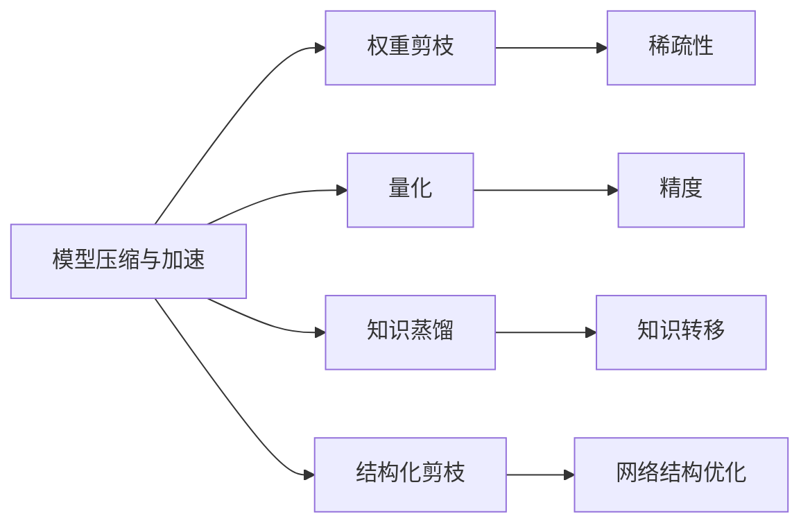

## 1. 背景介绍

在深度学习领域，模型的复杂度与其性能往往呈正相关。然而，随着模型规模的增大，所需的计算资源和存储空间也随之增加。在资源受限的环境下，如移动设备和嵌入式系统，这种大规模模型的部署变得极为困难。因此，模型压缩与加速技术应运而生，它们旨在减少模型的大小和计算量，同时尽可能保持模型的性能。

## 2. 核心概念与联系

模型压缩与加速包含多个核心概念，如权重剪枝、量化、知识蒸馏和结构化剪枝等。这些技术通过减少模型中的参数数量、降低计算精度或者转移学习能力来实现模型的轻量化。



## 3. 核心算法原理具体操作步骤

### 权重剪枝
1. 分析权重的重要性
2. 根据重要性对权重进行排序
3. 移除不重要的权重
4. 微调剩余权重以恢复性能

### 量化
1. 选择量化策略（如线性量化或非线性量化）
2. 确定量化的精度（如8位、16位）
3. 应用量化算法将浮点数转换为整数
4. 实施量化感知训练以优化性能

### 知识蒸馏
1. 训练一个大型的教师模型
2. 设计一个小型的学生模型
3. 使用教师模型的输出指导学生模型的训练
4. 微调学生模型以提高其泛化能力

### 结构化剪枝
1. 分析网络结构的重要性
2. 根据重要性对网络结构进行排序
3. 移除不重要的网络结构（如通道、层）
4. 微调剩余网络结构以恢复性能

## 4. 数学模型和公式详细讲解举例说明

### 权重剪枝的数学模型
权重剪枝的目标是最小化剪枝后模型的损失函数 $L$，其数学表达为：
$$
\min_{\mathbf{w}} L(\mathbf{w}) \quad \text{subject to} \quad ||\mathbf{w}||_0 \leq k
$$
其中，$\mathbf{w}$ 是模型权重，$||\mathbf{w}||_0$ 表示权重向量中非零元素的个数，$k$ 是剪枝后保留的权重数量。

### 量化的数学模型
量化的目标是找到最优的量化函数 $Q$，使得量化后的模型损失最小：
$$
\min_{Q} L(Q(\mathbf{w}))
$$
其中，$Q(\mathbf{w})$ 表示量化后的权重。

### 知识蒸馏的数学模型
知识蒸馏的目标是最小化学生模型的损失函数 $L_s$，同时考虑教师模型的软目标 $T$：
$$
\min_{\mathbf{w}_s} L_s(\mathbf{w}_s) + \lambda \cdot KL(\sigma(\mathbf{z}_s/T), \sigma(\mathbf{z}_t/T))
$$
其中，$\mathbf{w}_s$ 是学生模型权重，$\mathbf{z}_s$ 和 $\mathbf{z}_t$ 分别是学生和教师模型的输出，$\sigma$ 是softmax函数，$KL$ 是Kullback-Leibler散度，$\lambda$ 是平衡因子。

## 5. 项目实践：代码实例和详细解释说明

### 权重剪枝代码实例
```python
import torch
import torch.nn.utils.prune as prune

# 定义模型
model = ...

# 定义剪枝的比例
pruning_rate = 0.2

# 对模型的每一层进行迭代并应用L1Unstructured剪枝
for name, module in model.named_modules():
    if isinstance(module, torch.nn.Conv2d):
        prune.l1_unstructured(module, name='weight', amount=pruning_rate)

# 微调剪枝后的模型
...
```

### 量化代码实例
```python
import torch.quantization

# 定义模型
model = ...

# 指定模型为inference模式
model.eval()

# 指定量化配置
model.qconfig = torch.quantization.get_default_qconfig('fbgemm')

# 准备模型进行量化
torch.quantization.prepare(model, inplace=True)

# 运行模型以收集量化统计信息
...

# 转换模型为量化模型
torch.quantization.convert(model, inplace=True)

# 保存或部署量化模型
...
```

### 知识蒸馏代码实例
```python
import torch
import torch.nn as nn
import torch.nn.functional as F

# 定义教师模型和学生模型
teacher_model = ...
student_model = ...

# 定义损失函数和优化器
criterion = nn.CrossEntropyLoss()
optimizer = torch.optim.Adam(student_model.parameters())

# 训练学生模型
for data, target in dataloader:
    student_output = student_model(data)
    teacher_output = teacher_model(data)
    
    loss = criterion(student_output, target) + \
           0.5 * F.kl_div(F.log_softmax(student_output/T, dim=1),
                          F.softmax(teacher_output/T, dim=1), reduction='batchmean')
    
    optimizer.zero_grad()
    loss.backward()
    optimizer.step()
```

## 6. 实际应用场景

模型压缩与加速技术广泛应用于需要在资源受限环境中部署深度学习模型的场景，例如：
- 移动设备上的图像识别和语音识别应用
- 自动驾驶汽车中的实时物体检测
- 嵌入式系统中的视频监控分析
- IoT设备上的智能家居控制系统

## 7. 工具和资源推荐

- TensorFlow Lite：用于移动和嵌入式设备的轻量级深度学习框架
- PyTorch Mobile：PyTorch的移动端版本，支持模型量化和剪枝
- ONNX Runtime：跨平台、高性能的机器学习推理引擎
- Distiller：一个用于神经网络压缩研究的Python包

## 8. 总结：未来发展趋势与挑战

模型压缩与加速技术的发展趋势是向着更高效、更智能的方向发展。未来的挑战包括如何在不显著降低模型性能的情况下进一步减少模型大小，以及如何自动化模型压缩流程以适应不同的应用场景。

## 9. 附录：常见问题与解答

Q1: 模型压缩是否会显著影响模型的性能？
A1: 模型压缩可能会对性能产生一定影响，但通过合理的压缩策略和后续的微调，可以最小化性能损失。

Q2: 模型量化后如何保证模型的精度？
A2: 通过量化感知训练和适当的量化策略，可以在量化过程中保持模型精度。

Q3: 知识蒸馏的教师模型是否一定要比学生模型大？
A3: 通常情况下，教师模型会比学生模型大并且性能更好，以便传递更多的知识给学生模型。

作者：禅与计算机程序设计艺术 / Zen and the Art of Computer Programming