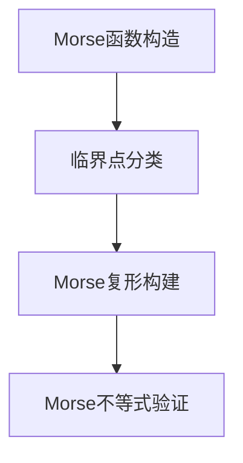

# 流形拓扑学理论与概念的实质：Morse理论(II)

## 1.背景介绍

Morse理论是流形拓扑学中的一个重要工具，它通过研究光滑函数的临界点和临界值来揭示流形的拓扑结构。Morse理论不仅在纯数学中有着深远的影响，还在物理学、计算机科学和工程学中有广泛的应用。本文将深入探讨Morse理论的核心概念、算法原理、数学模型及其实际应用。

## 2.核心概念与联系

### 2.1 流形与拓扑

流形是局部类似于欧几里得空间的拓扑空间。拓扑学研究这些空间的性质，而不考虑距离和角度。流形的一个重要特性是它们可以通过坐标图来描述，这些坐标图在局部是光滑的。

### 2.2 Morse函数

Morse函数是定义在流形上的光滑函数，其临界点是非退化的，即Hessian矩阵在这些点是非奇异的。Morse函数的临界点和临界值提供了流形的拓扑信息。

### 2.3 临界点与临界值

临界点是函数的梯度为零的点，临界值是函数在临界点处的值。Morse理论通过分析这些点和值来揭示流形的拓扑结构。

### 2.4 Morse不等式

Morse不等式是Morse理论的核心结果之一，它将流形的Betti数与Morse函数的临界点联系起来。这些不等式提供了流形拓扑结构的定量描述。

## 3.核心算法原理具体操作步骤

### 3.1 Morse函数的构造

构造一个Morse函数是Morse理论的第一步。通常，通过选择一个适当的光滑函数并验证其临界点的非退化性来实现。

### 3.2 临界点的分类

根据Hessian矩阵的正负惯性指数，临界点可以分类为不同的类型。这个分类有助于理解流形的局部拓扑结构。

### 3.3 Morse复形的构建

Morse复形是通过连接临界点来构建的，它提供了流形的一个细分。这个复形的结构反映了流形的拓扑性质。

### 3.4 Morse不等式的验证

通过计算Morse函数的临界点和流形的Betti数，可以验证Morse不等式。这一步骤需要深入的数学计算和验证。



## 4.数学模型和公式详细讲解举例说明

### 4.1 Morse函数的定义

设 $M$ 是一个光滑流形，$f: M \to \mathbb{R}$ 是一个光滑函数。如果 $p \in M$ 是 $f$ 的一个临界点，即 $\nabla f(p) = 0$，且 $f$ 的Hessian矩阵在 $p$ 处是非奇异的，则 $f$ 是一个Morse函数。

### 4.2 Hessian矩阵

Hessian矩阵 $H_f(p)$ 是 $f$ 在点 $p$ 处的二阶导数矩阵。对于一个Morse函数，Hessian矩阵在所有临界点处都是非奇异的。

$$
H_f(p) = \begin{bmatrix}
\frac{\partial^2 f}{\partial x_1^2} & \frac{\partial^2 f}{\partial x_1 \partial x_2} & \cdots & \frac{\partial^2 f}{\partial x_1 \partial x_n} \\
\frac{\partial^2 f}{\partial x_2 \partial x_1} & \frac{\partial^2 f}{\partial x_2^2} & \cdots & \frac{\partial^2 f}{\partial x_2 \partial x_n} \\
\vdots & \vdots & \ddots & \vdots \\
\frac{\partial^2 f}{\partial x_n \partial x_1} & \frac{\partial^2 f}{\partial x_n \partial x_2} & \cdots & \frac{\partial^2 f}{\partial x_n^2}
\end{bmatrix}
$$

### 4.3 Morse不等式

Morse不等式将流形的Betti数 $b_k$ 与Morse函数的临界点数 $m_k$ 联系起来：

$$
b_k \leq m_k
$$

更强的形式是：

$$
\sum_{i=0}^k (-1)^{k-i} m_i \geq \sum_{i=0}^k (-1)^{k-i} b_i
$$

### 4.4 示例：二维球面

考虑二维球面 $S^2$，定义一个Morse函数 $f: S^2 \to \mathbb{R}$，例如高度函数。这个函数有两个临界点：一个极大值点和一个极小值点。通过计算Hessian矩阵，可以验证这些点是非退化的。

## 5.项目实践：代码实例和详细解释说明

### 5.1 Python实现Morse函数

以下是一个简单的Python代码示例，用于构造和分析一个Morse函数。

```python
import numpy as np
import matplotlib.pyplot as plt

def morse_function(x, y):
    return x**2 + y**2 - x*y

def gradient(f, x, y):
    df_dx = (f(x + 1e-5, y) - f(x - 1e-5, y)) / 2e-5
    df_dy = (f(x, y + 1e-5) - f(x, y - 1e-5)) / 2e-5
    return np.array([df_dx, df_dy])

def hessian(f, x, y):
    d2f_dx2 = (f(x + 1e-5, y) - 2*f(x, y) + f(x - 1e-5, y)) / (1e-5)**2
    d2f_dy2 = (f(x, y + 1e-5) - 2*f(x, y) + f(x, y - 1e-5)) / (1e-5)**2
    d2f_dxdy = (f(x + 1e-5, y + 1e-5) - f(x + 1e-5, y - 1e-5) - f(x - 1e-5, y + 1e-5) + f(x - 1e-5, y - 1e-5)) / (4 * (1e-5)**2)
    return np.array([[d2f_dx2, d2f_dxdy], [d2f_dxdy, d2f_dy2]])

# 示例：计算临界点和Hessian矩阵
x, y = 1.0, 1.0
grad = gradient(morse_function, x, y)
hess = hessian(morse_function, x, y)

print("Gradient at (1,1):", grad)
print("Hessian at (1,1):", hess)
```

### 5.2 代码解释

上述代码定义了一个简单的Morse函数 $f(x, y) = x^2 + y^2 - xy$，并计算了其梯度和Hessian矩阵。通过数值方法验证了临界点和Hessian矩阵的非奇异性。

## 6.实际应用场景

### 6.1 物理学中的应用

Morse理论在物理学中有广泛的应用，例如在量子力学中用于分析波函数的节点结构，以及在广义相对论中用于研究时空的拓扑性质。

### 6.2 计算机科学中的应用

在计算机科学中，Morse理论用于图像处理、数据分析和机器学习。例如，Morse-Smale复形用于数据的拓扑分析，揭示数据的内在结构。

### 6.3 工程学中的应用

在工程学中，Morse理论用于优化问题和控制系统的稳定性分析。通过分析目标函数的临界点，可以找到最优解和系统的稳定状态。

## 7.工具和资源推荐

### 7.1 软件工具

- **Mathematica**：用于符号计算和数值分析的强大工具。
- **MATLAB**：广泛用于工程和科学计算的编程环境。
- **Python**：特别是NumPy和SciPy库，用于数值计算和数据分析。

### 7.2 在线资源

- **arXiv**：提供大量关于Morse理论和拓扑学的研究论文。
- **MathWorld**：Wolfram Research提供的数学资源网站，包含详细的数学概念解释。

### 7.3 书籍推荐

- **《Morse Theory》** by John Milnor：Morse理论的经典教材。
- **《Topology from the Differentiable Viewpoint》** by John Milnor：介绍流形和拓扑学的入门书籍。

## 8.总结：未来发展趋势与挑战

Morse理论作为流形拓扑学中的重要工具，已经在多个领域取得了显著的成果。未来，随着计算能力的提升和算法的改进，Morse理论将在更复杂的系统和更高维度的流形中发挥更大的作用。然而，挑战依然存在，例如如何处理高维数据的复杂性和如何在实际应用中高效地构造Morse函数。

## 9.附录：常见问题与解答

### 9.1 什么是Morse函数？

Morse函数是定义在流形上的光滑函数，其临界点是非退化的，即Hessian矩阵在这些点是非奇异的。

### 9.2 如何验证一个函数是否是Morse函数？

通过计算函数的梯度和Hessian矩阵，并验证所有临界点处的Hessian矩阵是非奇异的。

### 9.3 Morse理论有哪些实际应用？

Morse理论在物理学、计算机科学和工程学中有广泛的应用，例如量子力学中的波函数分析、数据拓扑分析和优化问题的求解。

### 9.4 Morse不等式的意义是什么？

Morse不等式将流形的Betti数与Morse函数的临界点联系起来，提供了流形拓扑结构的定量描述。

### 9.5 如何构造一个Morse函数？

通常，通过选择一个适当的光滑函数并验证其临界点的非退化性来构造Morse函数。

---

作者：禅与计算机程序设计艺术 / Zen and the Art of Computer Programming