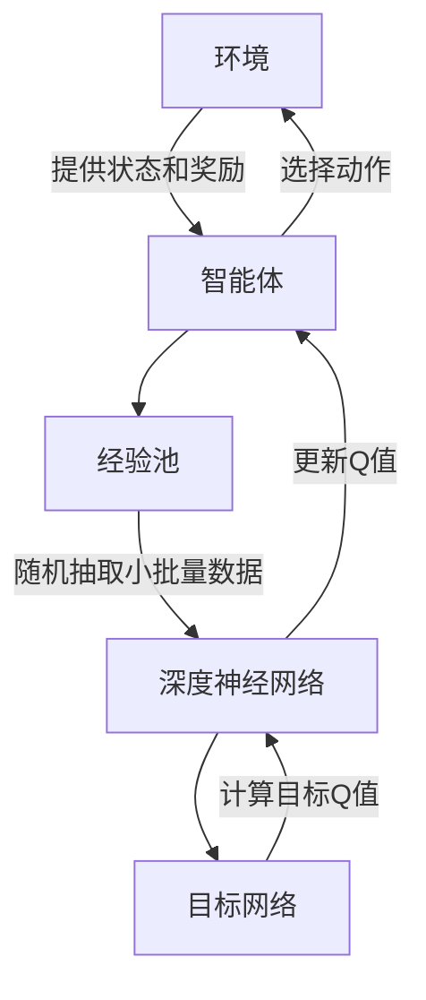

# 深度 Q-learning：利用软件模拟环境进行训练

## 1.背景介绍

深度 Q-learning 是一种结合了深度学习和强化学习的算法，广泛应用于解决复杂的决策问题。随着计算能力的提升和大数据的普及，深度 Q-learning 在游戏、机器人控制、自动驾驶等领域展现了强大的潜力。本文将深入探讨深度 Q-learning 的核心概念、算法原理、数学模型、项目实践、实际应用场景、工具和资源推荐，并展望其未来发展趋势与挑战。

## 2.核心概念与联系

### 2.1 强化学习

强化学习是一种通过与环境交互来学习策略的机器学习方法。其目标是通过试错法找到一个策略，使得智能体在特定环境中获得最大化的累积奖励。

### 2.2 Q-learning

Q-learning 是一种无模型的强化学习算法，通过学习状态-动作值函数（Q函数）来指导智能体的行为。Q函数表示在给定状态下采取某一动作所能获得的期望奖励。

### 2.3 深度学习

深度学习是一种基于人工神经网络的机器学习方法，能够自动提取数据的高层次特征。深度学习在图像识别、自然语言处理等领域取得了显著成果。

### 2.4 深度 Q-learning

深度 Q-learning 结合了 Q-learning 和深度学习，通过深度神经网络来近似 Q函数，从而解决高维状态空间下的决策问题。

## 3.核心算法原理具体操作步骤

### 3.1 环境与智能体

在深度 Q-learning 中，智能体通过与环境交互来学习策略。环境提供当前状态 $s_t$ 和奖励 $r_t$，智能体根据策略选择动作 $a_t$，并接收环境反馈的下一个状态 $s_{t+1}$ 和奖励 $r_{t+1}$。

### 3.2 Q函数更新

Q函数的更新公式为：
$$
Q(s_t, a_t) \leftarrow Q(s_t, a_t) + \alpha \left[ r_t + \gamma \max_{a'} Q(s_{t+1}, a') - Q(s_t, a_t) \right]
$$
其中，$\alpha$ 是学习率，$\gamma$ 是折扣因子。

### 3.3 深度神经网络

使用深度神经网络来近似 Q函数。输入为当前状态 $s_t$，输出为各个动作的 Q值。通过反向传播算法来更新网络参数。

### 3.4 经验回放

为了提高训练效率和稳定性，使用经验回放技术。将智能体的交互数据存储在经验池中，训练时随机抽取小批量数据进行更新。

### 3.5 目标网络

为了避免训练过程中的不稳定性，使用目标网络来计算目标 Q值。目标网络的参数定期更新为当前网络的参数。



## 4.数学模型和公式详细讲解举例说明

### 4.1 马尔可夫决策过程

深度 Q-learning 基于马尔可夫决策过程（MDP），MDP 由五元组 $(S, A, P, R, \gamma)$ 组成：
- $S$：状态空间
- $A$：动作空间
- $P$：状态转移概率
- $R$：奖励函数
- $\gamma$：折扣因子

### 4.2 贝尔曼方程

Q函数满足贝尔曼方程：
$$
Q(s, a) = R(s, a) + \gamma \sum_{s'} P(s'|s, a) \max_{a'} Q(s', a')
$$

### 4.3 损失函数

使用均方误差作为损失函数：
$$
L(\theta) = \mathbb{E}_{(s, a, r, s') \sim D} \left[ \left( r + \gamma \max_{a'} Q(s', a'; \theta^-) - Q(s, a; \theta) \right)^2 \right]
$$
其中，$\theta$ 是当前网络的参数，$\theta^-$ 是目标网络的参数，$D$ 是经验池。

### 4.4 反向传播

通过反向传播算法来最小化损失函数，更新网络参数：
$$
\theta \leftarrow \theta - \alpha \nabla_\theta L(\theta)
$$

## 5.项目实践：代码实例和详细解释说明

### 5.1 环境搭建

使用 OpenAI Gym 作为模拟环境，TensorFlow 或 PyTorch 作为深度学习框架。

```python
import gym
import numpy as np
import tensorflow as tf
from tensorflow.keras import layers

env = gym.make('CartPole-v1')
num_actions = env.action_space.n
state_shape = env.observation_space.shape
```

### 5.2 深度神经网络

定义深度神经网络模型：

```python
def create_q_model():
    inputs = layers.Input(shape=state_shape)
    layer1 = layers.Dense(24, activation='relu')(inputs)
    layer2 = layers.Dense(24, activation='relu')(layer1)
    action = layers.Dense(num_actions, activation='linear')(layer2)
    return tf.keras.Model(inputs=inputs, outputs=action)

model = create_q_model()
target_model = create_q_model()
target_model.set_weights(model.get_weights())
```

### 5.3 经验回放

定义经验池和采样函数：

```python
class ReplayBuffer:
    def __init__(self, size):
        self.buffer = []
        self.size = size

    def add(self, experience):
        if len(self.buffer) >= self.size:
            self.buffer.pop(0)
        self.buffer.append(experience)

    def sample(self, batch_size):
        indices = np.random.choice(len(self.buffer), batch_size, replace=False)
        return [self.buffer[i] for i in indices]

replay_buffer = ReplayBuffer(10000)
```

### 5.4 训练过程

定义训练过程：

```python
def train_model(model, target_model, replay_buffer, batch_size, gamma):
    if len(replay_buffer.buffer) < batch_size:
        return

    batch = replay_buffer.sample(batch_size)
    states, actions, rewards, next_states, dones = zip(*batch)

    states = np.array(states)
    next_states = np.array(next_states)
    rewards = np.array(rewards)
    dones = np.array(dones)

    future_rewards = target_model.predict(next_states)
    updated_q_values = rewards + gamma * np.max(future_rewards, axis=1) * (1 - dones)

    masks = tf.one_hot(actions, num_actions)

    with tf.GradientTape() as tape:
        q_values = model(states)
        q_action = tf.reduce_sum(tf.multiply(q_values, masks), axis=1)
        loss = tf.keras.losses.MSE(updated_q_values, q_action)

    grads = tape.gradient(loss, model.trainable_variables)
    optimizer.apply_gradients(zip(grads, model.trainable_variables))

optimizer = tf.keras.optimizers.Adam(learning_rate=0.001)
```

### 5.5 训练循环

定义训练循环：

```python
num_episodes = 1000
batch_size = 64
gamma = 0.99
epsilon = 1.0
epsilon_min = 0.1
epsilon_decay = 0.995

for episode in range(num_episodes):
    state = env.reset()
    done = False
    total_reward = 0

    while not done:
        if np.random.rand() < epsilon:
            action = np.random.choice(num_actions)
        else:
            q_values = model.predict(np.expand_dims(state, axis=0))
            action = np.argmax(q_values[0])

        next_state, reward, done, _ = env.step(action)
        replay_buffer.add((state, action, reward, next_state, done))
        state = next_state
        total_reward += reward

        train_model(model, target_model, replay_buffer, batch_size, gamma)

    if epsilon > epsilon_min:
        epsilon *= epsilon_decay

    if episode % 10 == 0:
        target_model.set_weights(model.get_weights())
        print(f'Episode {episode}, Total Reward: {total_reward}')
```

## 6.实际应用场景

### 6.1 游戏 AI

深度 Q-learning 在游戏 AI 中有广泛应用，如 AlphaGo、Dota 2 等，通过模拟环境进行训练，智能体能够在复杂的游戏环境中表现出超越人类的水平。

### 6.2 机器人控制

在机器人控制领域，深度 Q-learning 可以用于路径规划、动作控制等任务，通过与模拟环境的交互，机器人能够学习到高效的控制策略。

### 6.3 自动驾驶

深度 Q-learning 在自动驾驶中也有应用，通过模拟驾驶环境进行训练，自动驾驶系统能够学习到安全、高效的驾驶策略。

## 7.工具和资源推荐

### 7.1 开源框架

- **TensorFlow**：谷歌开发的深度学习框架，支持多种平台和设备。
- **PyTorch**：Facebook 开发的深度学习框架，易于使用和调试。
- **OpenAI Gym**：提供多种模拟环境，方便强化学习算法的开发和测试。

### 7.2 在线课程

- **Coursera**：提供多种深度学习和强化学习的在线课程，如 Andrew Ng 的深度学习课程。
- **Udacity**：提供强化学习纳米学位课程，涵盖深度 Q-learning 等内容。

### 7.3 书籍推荐

- **《深度强化学习》**：详细介绍了深度 Q-learning 及其应用。
- **《强化学习：原理与实践》**：系统讲解了强化学习的基本原理和算法。

## 8.总结：未来发展趋势与挑战

### 8.1 发展趋势

深度 Q-learning 作为深度学习和强化学习的结合，未来有望在更多领域取得突破。随着计算能力的提升和算法的改进，深度 Q-learning 将在更复杂的环境中展现出更强的学习能力。

### 8.2 挑战

深度 Q-learning 也面临一些挑战，如训练过程中的不稳定性、高维状态空间下的计算复杂度等。未来的研究将致力于解决这些问题，提高算法的稳定性和效率。

## 9.附录：常见问题与解答

### 9.1 深度 Q-learning 与传统 Q-learning 有何区别？

深度 Q-learning 使用深度神经网络来近似 Q函数，能够处理高维状态空间，而传统 Q-learning 只能处理低维状态空间。

### 9.2 如何选择深度神经网络的结构？

深度神经网络的结构选择需要根据具体问题进行调整。一般来说，可以从简单的结构开始，逐步增加网络层数和节点数，观察训练效果进行调整。

### 9.3 经验回放的作用是什么？

经验回放通过存储智能体的交互数据，打破数据的时间相关性，提高训练效率和稳定性。

### 9.4 目标网络的作用是什么？

目标网络用于计算目标 Q值，避免训练过程中的不稳定性。目标网络的参数定期更新为当前网络的参数。

### 9.5 如何调节超参数？

超参数的调节需要通过实验进行。可以使用网格搜索或随机搜索的方法，逐步调整学习率、折扣因子、经验池大小等超参数，找到最优配置。

---

作者：禅与计算机程序设计艺术 / Zen and the Art of Computer Programming