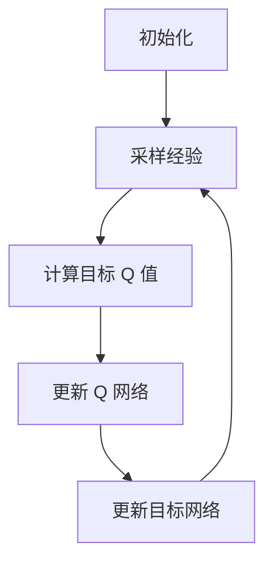

# 深度 Q-learning：在金融风控中的应用

## 1.背景介绍

在金融领域，风险控制（风控）是确保金融机构稳定运营的关键环节。随着金融市场的复杂性和不确定性增加，传统的风控方法逐渐显现出其局限性。近年来，人工智能（AI）和机器学习（ML）技术的迅猛发展为金融风控带来了新的机遇。特别是深度强化学习（Deep Reinforcement Learning, DRL）中的深度 Q-learning 方法，因其在处理高维度数据和复杂决策问题上的卓越表现，成为金融风控领域的研究热点。

## 2.核心概念与联系

### 2.1 强化学习

强化学习是一种通过与环境交互来学习策略的机器学习方法。其核心思想是通过试错法（Trial and Error）来获得最大化累积奖励的策略。强化学习的基本组成部分包括：

- **Agent（智能体）**：执行动作的决策者。
- **Environment（环境）**：智能体所处的外部环境。
- **State（状态）**：环境在某一时刻的具体情况。
- **Action（动作）**：智能体在某一状态下可以执行的操作。
- **Reward（奖励）**：智能体执行动作后从环境中获得的反馈。

### 2.2 深度 Q-learning

深度 Q-learning 是一种结合了 Q-learning 和深度神经网络的强化学习方法。Q-learning 是一种无模型的强化学习算法，通过学习状态-动作值函数（Q函数）来指导智能体的决策。深度 Q-learning 则利用深度神经网络来近似 Q 函数，从而能够处理高维度的状态空间。

### 2.3 金融风控

金融风控是指通过各种手段和方法，识别、评估、监控和控制金融风险的过程。其目标是最大限度地减少金融机构在经营过程中面临的各种风险，包括信用风险、市场风险、操作风险等。

## 3.核心算法原理具体操作步骤

### 3.1 Q-learning 算法

Q-learning 算法的核心是通过更新 Q 函数来学习最优策略。其更新公式为：

$$
Q(s, a) \leftarrow Q(s, a) + \alpha [r + \gamma \max_{a'} Q(s', a') - Q(s, a)]
$$

其中：
- $s$ 和 $s'$ 分别表示当前状态和下一状态。
- $a$ 和 $a'$ 分别表示当前动作和下一动作。
- $r$ 表示当前奖励。
- $\alpha$ 是学习率。
- $\gamma$ 是折扣因子。

### 3.2 深度 Q-learning 算法

深度 Q-learning 通过深度神经网络来近似 Q 函数。其基本步骤如下：

1. **初始化**：初始化经验回放池（Replay Buffer）和 Q 网络参数。
2. **采样**：从经验回放池中随机采样一批经验。
3. **计算目标 Q 值**：使用目标网络计算目标 Q 值。
4. **更新 Q 网络**：通过最小化损失函数来更新 Q 网络参数。
5. **更新目标网络**：定期将 Q 网络的参数复制到目标网络。

以下是深度 Q-learning 的流程图：



## 4.数学模型和公式详细讲解举例说明

### 4.1 Q-learning 更新公式

Q-learning 的更新公式为：

$$
Q(s, a) \leftarrow Q(s, a) + \alpha [r + \gamma \max_{a'} Q(s', a') - Q(s, a)]
$$

该公式表示在状态 $s$ 执行动作 $a$ 后，智能体根据获得的奖励 $r$ 和下一状态 $s'$ 的最大 Q 值来更新当前状态-动作对的 Q 值。学习率 $\alpha$ 控制了更新的步长，而折扣因子 $\gamma$ 则决定了未来奖励的重要性。

### 4.2 深度 Q-learning 损失函数

在深度 Q-learning 中，Q 网络的参数通过最小化以下损失函数来更新：

$$
L(\theta) = \mathbb{E}_{(s, a, r, s') \sim D} \left[ \left( r + \gamma \max_{a'} Q(s', a'; \theta^-) - Q(s, a; \theta) \right)^2 \right]
$$

其中：
- $\theta$ 表示 Q 网络的参数。
- $\theta^-$ 表示目标网络的参数。
- $D$ 表示经验回放池。

### 4.3 举例说明

假设我们有一个简单的金融风控场景，智能体需要在不同的市场状态下决定是否进行某种交易操作。我们可以将市场状态表示为一个高维度的特征向量，动作则是买入、卖出或持有。通过深度 Q-learning，智能体可以学习在不同市场状态下的最优交易策略，从而最大化累积收益。

## 5.项目实践：代码实例和详细解释说明

### 5.1 环境搭建

首先，我们需要搭建一个模拟的金融市场环境。可以使用 OpenAI Gym 来创建自定义环境。

```python
import gym
from gym import spaces
import numpy as np

class FinancialEnv(gym.Env):
    def __init__(self):
        super(FinancialEnv, self).__init__()
        self.action_space = spaces.Discrete(3)  # 三种动作：买入、卖出、持有
        self.observation_space = spaces.Box(low=0, high=1, shape=(10,), dtype=np.float32)  # 市场状态特征向量

    def reset(self):
        self.state = np.random.rand(10)
        return self.state

    def step(self, action):
        reward = np.random.rand()  # 随机奖励
        self.state = np.random.rand(10)
        done = False
        return self.state, reward, done, {}

env = FinancialEnv()
```

### 5.2 深度 Q-learning 实现

接下来，我们使用 TensorFlow 或 PyTorch 实现深度 Q-learning 算法。

```python
import tensorflow as tf
from tensorflow.keras import layers

class DQN(tf.keras.Model):
    def __init__(self, action_size):
        super(DQN, self).__init__()
        self.dense1 = layers.Dense(24, activation='relu')
        self.dense2 = layers.Dense(24, activation='relu')
        self.dense3 = layers.Dense(action_size, activation=None)

    def call(self, x):
        x = self.dense1(x)
        x = self.dense2(x)
        return self.dense3(x)

action_size = env.action_space.n
model = DQN(action_size)
target_model = DQN(action_size)
target_model.set_weights(model.get_weights())

optimizer = tf.keras.optimizers.Adam(learning_rate=0.001)
loss_function = tf.keras.losses.MeanSquaredError()
```

### 5.3 训练过程

```python
import random
from collections import deque

def train_dqn(env, model, target_model, optimizer, loss_function, episodes=1000, gamma=0.99, epsilon=1.0, epsilon_min=0.01, epsilon_decay=0.995):
    replay_buffer = deque(maxlen=2000)
    batch_size = 32

    for episode in range(episodes):
        state = env.reset()
        state = np.reshape(state, [1, 10])
        total_reward = 0

        for time in range(500):
            if np.random.rand() <= epsilon:
                action = random.randrange(action_size)
            else:
                q_values = model(state)
                action = np.argmax(q_values[0])

            next_state, reward, done, _ = env.step(action)
            next_state = np.reshape(next_state, [1, 10])
            replay_buffer.append((state, action, reward, next_state, done))
            state = next_state
            total_reward += reward

            if done:
                print(f"Episode: {episode}/{episodes}, Reward: {total_reward}, Epsilon: {epsilon:.2f}")
                break

            if len(replay_buffer) > batch_size:
                minibatch = random.sample(replay_buffer, batch_size)
                for state, action, reward, next_state, done in minibatch:
                    target = reward
                    if not done:
                        target = reward + gamma * np.amax(target_model(next_state)[0])
                    target_f = model(state)
                    target_f[0][action] = target
                    with tf.GradientTape() as tape:
                        q_values = model(state)
                        loss = loss_function(target_f, q_values)
                    grads = tape.gradient(loss, model.trainable_variables)
                    optimizer.apply_gradients(zip(grads, model.trainable_variables))

                if epsilon > epsilon_min:
                    epsilon *= epsilon_decay

        if episode % 10 == 0:
            target_model.set_weights(model.get_weights())

train_dqn(env, model, target_model, optimizer, loss_function)
```

## 6.实际应用场景

### 6.1 信用风险评估

深度 Q-learning 可以用于信用风险评估，通过学习历史数据中的信用风险模式，智能体可以预测未来的信用风险，并给出相应的风险控制策略。

### 6.2 市场风险管理

在市场风险管理中，深度 Q-learning 可以帮助金融机构在不同的市场状态下做出最优的投资决策，从而最大化收益并最小化风险。

### 6.3 操作风险控制

深度 Q-learning 还可以用于操作风险控制，通过分析操作流程中的风险点，智能体可以提出改进建议，从而减少操作风险。

## 7.工具和资源推荐

### 7.1 开源库

- **TensorFlow**：一个广泛使用的深度学习框架，支持深度 Q-learning 的实现。
- **PyTorch**：另一个流行的深度学习框架，具有灵活性和易用性。
- **OpenAI Gym**：一个用于开发和比较强化学习算法的工具包。

### 7.2 学习资源

- **《深度强化学习》**：一本详细介绍深度强化学习理论和实践的书籍。
- **Coursera 和 Udacity 的强化学习课程**：提供系统的强化学习课程，适合初学者和进阶学习者。

## 8.总结：未来发展趋势与挑战

深度 Q-learning 在金融风控中的应用前景广阔，但也面临一些挑战。未来的发展趋势包括：

- **更高效的算法**：研究更高效的深度 Q-learning 算法，以应对金融市场的高维度和复杂性。
- **实时性**：提高算法的实时性，使其能够在快速变化的市场环境中做出及时决策。
- **解释性**：增强算法的解释性，使其决策过程更加透明和可解释。

## 9.附录：常见问题与解答

### 9.1 深度 Q-learning 与传统 Q-learning 有何区别？

深度 Q-learning 通过深度神经网络来近似 Q 函数，从而能够处理高维度的状态空间，而传统 Q-learning 只能处理低维度的状态空间。

### 9.2 如何选择深度 Q-learning 的超参数？

超参数的选择需要根据具体问题进行调试。常见的超参数包括学习率、折扣因子、epsilon 初始值和衰减率等。

### 9.3 深度 Q-learning 在金融风控中的应用有哪些优势？

深度 Q-learning 可以处理高维度和复杂的金融数据，能够在不同的市场状态下做出最优决策，从而提高风控效果。

---

作者：禅与计算机程序设计艺术 / Zen and the Art of Computer Programming