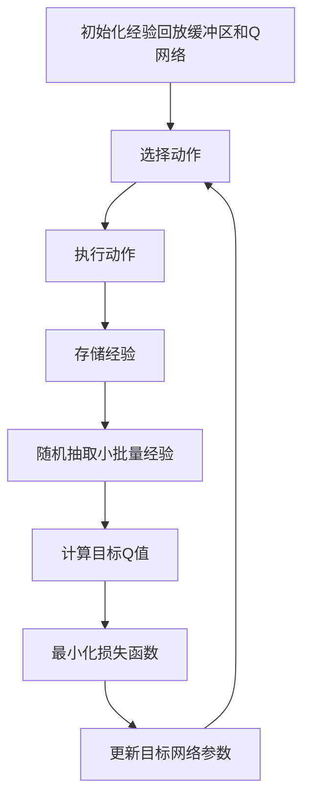

# 深度Q网络 (DQN)

## 1.背景介绍

深度Q网络（Deep Q-Network, DQN）是深度学习和强化学习相结合的一个重要突破。它由Google DeepMind团队在2013年提出，并在2015年发表的论文《Playing Atari with Deep Reinforcement Learning》中详细介绍。DQN的出现标志着人工智能在解决复杂决策问题上的一个重要里程碑。通过结合深度神经网络和Q学习，DQN能够在没有任何先验知识的情况下，仅通过与环境的交互学习到复杂的策略。

## 2.核心概念与联系

### 2.1 强化学习

强化学习是一种通过与环境交互来学习策略的机器学习方法。其核心思想是通过试错法来最大化累积奖励。强化学习的基本组成部分包括：

- **状态（State, S）**：环境的当前情况。
- **动作（Action, A）**：智能体在当前状态下可以采取的行为。
- **奖励（Reward, R）**：智能体采取某个动作后环境反馈的即时奖励。
- **策略（Policy, π）**：智能体在每个状态下选择动作的规则。

### 2.2 Q学习

Q学习是一种无模型的强化学习算法，通过学习状态-动作值函数（Q函数）来指导智能体的行为。Q函数表示在给定状态下采取某个动作的预期累积奖励。Q学习的更新公式为：

$$
Q(s, a) \leftarrow Q(s, a) + \alpha \left[ r + \gamma \max_{a'} Q(s', a') - Q(s, a) \right]
$$

其中，$\alpha$ 是学习率，$\gamma$ 是折扣因子，$r$ 是即时奖励，$s'$ 是下一状态，$a'$ 是下一动作。

### 2.3 深度神经网络

深度神经网络（DNN）是一种具有多层隐藏层的神经网络，能够自动提取数据的高层次特征。DNN在处理高维数据（如图像、语音）方面表现出色。

### 2.4 DQN的核心思想

DQN的核心思想是使用深度神经网络来逼近Q函数。通过这种方式，DQN能够处理高维状态空间的问题，如图像输入。DQN的主要创新点包括经验回放和目标网络，这些技术有效地稳定了训练过程。

## 3.核心算法原理具体操作步骤

### 3.1 经验回放

经验回放（Experience Replay）是DQN中的一个关键技术。它通过存储智能体与环境交互的经验（状态、动作、奖励、下一状态）在一个回放缓冲区中，并在训练时随机抽取小批量经验进行更新。这种方法打破了数据之间的相关性，提高了训练的稳定性和效率。

### 3.2 目标网络

目标网络（Target Network）是DQN中的另一个重要技术。它通过引入一个与主网络结构相同但参数固定的目标网络来计算目标Q值。目标网络的参数每隔一段时间才会更新为主网络的参数，从而减少了训练过程中的振荡。

### 3.3 DQN算法步骤

1. 初始化经验回放缓冲区 $D$ 和主Q网络 $Q$ 及目标Q网络 $\hat{Q}$，并将 $\hat{Q}$ 的参数设置为 $Q$ 的参数。
2. 对于每个训练步骤：
   1. 从当前状态 $s$ 选择动作 $a$，使用 $\epsilon$-贪婪策略。
   2. 执行动作 $a$，观察奖励 $r$ 和下一状态 $s'$。
   3. 将经验 $(s, a, r, s')$ 存储到缓冲区 $D$ 中。
   4. 从缓冲区 $D$ 中随机抽取一个小批量经验 $(s_j, a_j, r_j, s_j')$。
   5. 计算目标Q值：
      $$
      y_j = \begin{cases} 
      r_j & \text{if episode terminates at step } j+1 \\
      r_j + \gamma \max_{a'} \hat{Q}(s_j', a') & \text{otherwise}
      \end{cases}
      $$
   6. 使用梯度下降法最小化损失函数：
      $$
      L = \frac{1}{N} \sum_j \left( y_j - Q(s_j, a_j) \right)^2
      $$
   7. 每隔 $C$ 步，将目标网络 $\hat{Q}$ 的参数更新为主网络 $Q$ 的参数。

### 3.4 Mermaid流程图



## 4.数学模型和公式详细讲解举例说明

### 4.1 Q函数

Q函数 $Q(s, a)$ 表示在状态 $s$ 下采取动作 $a$ 的预期累积奖励。Q学习的目标是找到最优Q函数 $Q^*(s, a)$，使得智能体在每个状态下都能选择最优动作。

### 4.2 Bellman方程

Bellman方程是Q学习的核心，它描述了Q函数的递归关系：

$$
Q^*(s, a) = \mathbb{E} \left[ r + \gamma \max_{a'} Q^*(s', a') \mid s, a \right]
$$

### 4.3 DQN中的损失函数

DQN使用均方误差（MSE）作为损失函数来更新Q网络的参数：

$$
L(\theta) = \mathbb{E}_{(s, a, r, s') \sim D} \left[ \left( y - Q(s, a; \theta) \right)^2 \right]
$$

其中，$y$ 是目标Q值：

$$
y = r + \gamma \max_{a'} Q(s', a'; \theta^-)
$$

$\theta$ 是主Q网络的参数，$\theta^-$ 是目标Q网络的参数。

### 4.4 举例说明

假设一个简单的迷宫环境，智能体需要从起点到达终点。状态 $s$ 表示智能体在迷宫中的位置，动作 $a$ 表示智能体的移动方向（上、下、左、右）。奖励 $r$ 为智能体到达终点时的正奖励，其他情况下为负奖励。通过DQN，智能体可以学习到一条最优路径，使得总奖励最大化。

## 5.项目实践：代码实例和详细解释说明

### 5.1 环境设置

首先，我们需要设置一个简单的环境，例如OpenAI Gym中的CartPole环境。

```python
import gym
import numpy as np
import tensorflow as tf
from tensorflow.keras import layers

env = gym.make('CartPole-v1')
num_actions = env.action_space.n
state_shape = env.observation_space.shape
```

### 5.2 构建Q网络

接下来，我们构建一个简单的Q网络。

```python
def build_q_network(state_shape, num_actions):
    model = tf.keras.Sequential([
        layers.InputLayer(state_shape),
        layers.Dense(24, activation='relu'),
        layers.Dense(24, activation='relu'),
        layers.Dense(num_actions, activation='linear')
    ])
    return model

q_network = build_q_network(state_shape, num_actions)
target_q_network = build_q_network(state_shape, num_actions)
target_q_network.set_weights(q_network.get_weights())
```

### 5.3 经验回放缓冲区

我们需要一个经验回放缓冲区来存储智能体的经验。

```python
class ReplayBuffer:
    def __init__(self, buffer_size, batch_size):
        self.buffer_size = buffer_size
        self.batch_size = batch_size
        self.buffer = []
        self.position = 0

    def add(self, experience):
        if len(self.buffer) < self.buffer_size:
            self.buffer.append(None)
        self.buffer[self.position] = experience
        self.position = (self.position + 1) % self.buffer_size

    def sample(self):
        indices = np.random.choice(len(self.buffer), self.batch_size, replace=False)
        return [self.buffer[i] for i in indices]

    def __len__(self):
        return len(self.buffer)

buffer = ReplayBuffer(buffer_size=10000, batch_size=64)
```

### 5.4 训练DQN

最后，我们实现DQN的训练过程。

```python
optimizer = tf.keras.optimizers.Adam(learning_rate=0.001)
loss_function = tf.keras.losses.MeanSquaredError()

def train_step(states, actions, rewards, next_states, dones):
    future_rewards = target_q_network.predict(next_states)
    updated_q_values = rewards + gamma * np.max(future_rewards, axis=1) * (1 - dones)
    masks = tf.one_hot(actions, num_actions)

    with tf.GradientTape() as tape:
        q_values = q_network(states)
        q_action = tf.reduce_sum(tf.multiply(q_values, masks), axis=1)
        loss = loss_function(updated_q_values, q_action)

    grads = tape.gradient(loss, q_network.trainable_variables)
    optimizer.apply_gradients(zip(grads, q_network.trainable_variables))

gamma = 0.99
epsilon = 1.0
epsilon_min = 0.1
epsilon_decay = 0.995
num_episodes = 500

for episode in range(num_episodes):
    state = env.reset()
    state = np.reshape(state, [1, state_shape[0]])
    total_reward = 0

    for step in range(200):
        if np.random.rand() <= epsilon:
            action = np.random.choice(num_actions)
        else:
            q_values = q_network.predict(state)
            action = np.argmax(q_values[0])

        next_state, reward, done, _ = env.step(action)
        next_state = np.reshape(next_state, [1, state_shape[0]])
        buffer.add((state, action, reward, next_state, done))

        state = next_state
        total_reward += reward

        if done:
            print(f"Episode: {episode}, Total Reward: {total_reward}, Epsilon: {epsilon:.2}")
            break

        if len(buffer) > buffer.batch_size:
            experiences = buffer.sample()
            states, actions, rewards, next_states, dones = zip(*experiences)
            states = np.vstack(states)
            next_states = np.vstack(next_states)
            train_step(states, actions, rewards, next_states, dones)

    if epsilon > epsilon_min:
        epsilon *= epsilon_decay

    if episode % 10 == 0:
        target_q_network.set_weights(q_network.get_weights())
```

## 6.实际应用场景

### 6.1 游戏AI

DQN最初的成功应用之一是在Atari游戏中。通过DQN，AI能够在没有任何先验知识的情况下，仅通过观察屏幕像素和游戏得分，学会玩多种Atari游戏，并在某些游戏中达到甚至超过人类水平。

### 6.2 机器人控制

DQN在机器人控制领域也有广泛应用。例如，机器人可以通过DQN学习到如何在复杂环境中导航、避障和完成任务。这种方法特别适用于高维状态空间和连续动作空间的问题。

### 6.3 自动驾驶

在自动驾驶领域，DQN可以用于学习车辆的驾驶策略，如车道保持、避障和路径规划。通过与模拟环境的交互，自动驾驶系统可以不断优化其驾驶策略，提高安全性和效率。

### 6.4 金融交易

DQN在金融交易中也有应用。通过学习市场的动态变化，DQN可以帮助交易系统制定买卖策略，最大化投资回报。这种方法可以处理高维度的市场数据，并适应不断变化的市场环境。

## 7.工具和资源推荐

### 7.1 开源库

- **TensorFlow**：一个广泛使用的深度学习框架，支持构建和训练深度神经网络。
- **PyTorch**：另一个流行的深度学习框架，具有动态计算图和易于调试的特点。
- **OpenAI Gym**：一个用于开发和比较强化学习算法的工具包，提供了多种环境。

### 7.2 在线课程

- **Coursera**：提供多门关于深度学习和强化学习的课程，如Andrew Ng的《深度学习专项课程》和David Silver的《强化学习》课程。
- **Udacity**：提供《深度强化学习纳米学位》，涵盖DQN及其变体的详细内容。

### 7.3 书籍推荐

- **《深度强化学习》**：一本详细介绍深度强化学习理论和实践的书籍，适合初学者和进阶读者。
- **《强化学习：原理与实践》**：一本系统介绍强化学习基本原理和算法的书籍，包含大量实际案例和代码示例。

## 8.总结：未来发展趋势与挑战

### 8.1 未来发展趋势

- **多智能体强化学习**：研究多个智能体在同一环境中协作或竞争的学习方法，具有广泛的应用前景，如多机器人系统和多人游戏。
- **元强化学习**：研究如何让智能体在不同任务之间快速迁移和适应，提高学习效率和泛化能力。
- **安全强化学习**：研究如何在强化学习过程中保证智能体的安全性，特别是在自动驾驶和机器人控制等高风险领域。

### 8.2 挑战

- **样本效率**：DQN需要大量的交互数据才能有效学习，如何提高样本效率是一个重要挑战。
- **稳定性和收敛性**：尽管DQN引入了经验回放和目标网络，但训练过程仍然可能不稳定，如何进一步提高算法的稳定性和收敛性是一个研究热点。
- **高维连续动作空间**：DQN在处理高维连续动作空间时表现不佳，如何扩展DQN以适应这些问题是一个重要方向。

## 9.附录：常见问题与解答

### 9.1 为什么DQN需要经验回放？

经验回放通过打破数据之间的相关性，提高了训练的稳定性和效率。它允许智能体在训练过程中多次利用过去的经验，从而提高样本效率。

### 9.2 目标网络的作用是什么？

目标网络通过引入一个参数固定的网络来计算目标Q值，减少了训练过程中的振荡，提高了算法的稳定性。

### 9.3 如何选择超参数？

超参数的选择对DQN的性能有重要影响。通常需要通过实验来调整超参数，如学习率、折扣因子、经验回放缓冲区大小和批量大小。可以使用网格搜索或贝叶斯优化等方法来自动调整超参数。

### 9.4 DQN能否处理连续动作空间？

DQN在处理连续动作空间时表现不佳，因为它需要对每个可能的动作计算Q值。对于连续动作空间，可以使用深度确定性策略梯度（DDPG）等算法，这些算法能够直接输出连续动作。

### 9.5 如何处理部分可观测环境？

在部分可观测环境中，智能体无法完全观察到环境的状态。可以使用循环神经网络（RNN）或长短期记忆网络（LSTM）来处理部分可观测环境，这些网络能够记忆过去的状态信息，从而提高智能体的决策能力。

---

作者：禅与计算机程序设计艺术 / Zen and the Art of Computer Programming