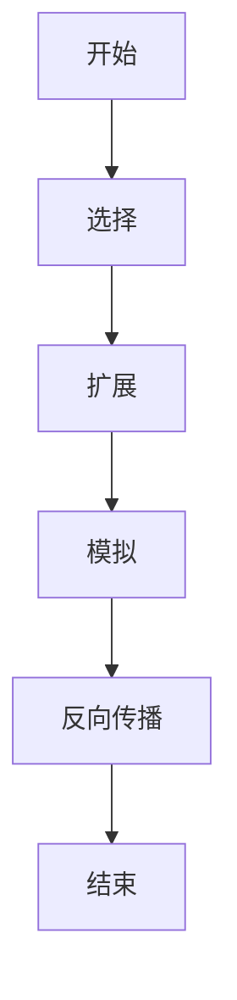

# 蒙特卡洛树搜索 原理与代码实例讲解

## 1.背景介绍

蒙特卡洛树搜索（Monte Carlo Tree Search，MCTS）是一种用于决策过程的算法，广泛应用于游戏AI、机器人路径规划和其他需要在不确定环境中进行决策的领域。MCTS结合了蒙特卡洛方法和树搜索技术，通过模拟未来可能的状态来评估当前决策的优劣。自从在计算机围棋中取得突破性进展以来，MCTS已经成为人工智能领域的重要工具。

## 2.核心概念与联系

### 2.1 蒙特卡洛方法

蒙特卡洛方法是一种通过随机采样来估计数学问题解的数值方法。它的核心思想是通过大量的随机样本来逼近问题的解。例如，在计算圆周率时，可以通过在单位正方形内随机投点，统计落在单位圆内的点数比例来估计 $\pi$ 的值。

### 2.2 树搜索

树搜索是一种系统地探索决策树的算法。决策树的每个节点代表一个状态，每条边代表一个动作。树搜索的目标是找到从根节点到叶节点的最优路径。常见的树搜索算法包括深度优先搜索（DFS）和广度优先搜索（BFS）。

### 2.3 蒙特卡洛树搜索

MCTS结合了蒙特卡洛方法和树搜索的优点，通过在决策树上进行随机模拟来评估每个节点的价值。MCTS的核心思想是通过多次模拟来逐步改进决策树的估计，从而找到最优决策路径。

## 3.核心算法原理具体操作步骤

MCTS的核心算法可以分为四个步骤：选择、扩展、模拟和反向传播。以下是每个步骤的详细解释：

### 3.1 选择

在选择步骤中，从根节点开始，根据某种策略选择一个子节点，直到到达一个未完全扩展的节点。常用的选择策略是上置信界（Upper Confidence Bound，UCB），其公式为：

$$
UCB = \frac{w_i}{n_i} + c \sqrt{\frac{\ln N}{n_i}}
$$

其中，$w_i$ 是节点 $i$ 的胜利次数，$n_i$ 是节点 $i$ 的访问次数，$N$ 是父节点的访问次数，$c$ 是一个常数，用于平衡探索和利用。

### 3.2 扩展

在扩展步骤中，从选择的节点中选择一个未被访问过的子节点，并将其添加到树中。

### 3.3 模拟

在模拟步骤中，从扩展的节点开始，进行一次随机模拟，直到到达终止状态。模拟的结果用于评估该节点的价值。

### 3.4 反向传播

在反向传播步骤中，将模拟的结果从扩展的节点向上传播到根节点，更新每个节点的统计信息。

以下是MCTS的流程图：



## 4.数学模型和公式详细讲解举例说明

### 4.1 UCB公式

UCB公式是MCTS选择步骤的核心。其公式为：

$$
UCB = \frac{w_i}{n_i} + c \sqrt{\frac{\ln N}{n_i}}
$$

其中，$w_i$ 是节点 $i$ 的胜利次数，$n_i$ 是节点 $i$ 的访问次数，$N$ 是父节点的访问次数，$c$ 是一个常数，用于平衡探索和利用。

### 4.2 示例

假设我们有一个根节点 $A$，其子节点为 $B$ 和 $C$。节点 $B$ 的胜利次数为 10，访问次数为 20；节点 $C$ 的胜利次数为 5，访问次数为 10。假设 $c = 1.41$，则节点 $B$ 和 $C$ 的 UCB 值分别为：

$$
UCB_B = \frac{10}{20} + 1.41 \sqrt{\frac{\ln 30}{20}} \approx 0.5 + 1.41 \sqrt{0.054} \approx 0.5 + 0.33 \approx 0.83
$$

$$
UCB_C = \frac{5}{10} + 1.41 \sqrt{\frac{\ln 30}{10}} \approx 0.5 + 1.41 \sqrt{0.11} \approx 0.5 + 0.47 \approx 0.97
$$

因此，在选择步骤中，我们会选择节点 $C$ 进行扩展。

## 5.项目实践：代码实例和详细解释说明

以下是一个简单的MCTS实现的Python代码示例：

```python
import math
import random

class Node:
    def __init__(self, state, parent=None):
        self.state = state
        self.parent = parent
        self.children = []
        self.visits = 0
        self.wins = 0

    def is_fully_expanded(self):
        return len(self.children) == len(self.state.get_legal_actions())

    def best_child(self, c_param=1.41):
        choices_weights = [
            (child.wins / child.visits) + c_param * math.sqrt((2 * math.log(self.visits) / child.visits))
            for child in self.children
        ]
        return self.children[choices_weights.index(max(choices_weights))]

    def expand(self):
        action = random.choice(self.state.get_legal_actions())
        next_state = self.state.move(action)
        child_node = Node(next_state, self)
        self.children.append(child_node)
        return child_node

    def simulate(self):
        current_state = self.state
        while not current_state.is_terminal():
            action = random.choice(current_state.get_legal_actions())
            current_state = current_state.move(action)
        return current_state.get_result()

    def backpropagate(self, result):
        self.visits += 1
        self.wins += result
        if self.parent:
            self.parent.backpropagate(result)

def mcts(root, iterations):
    for _ in range(iterations):
        node = root
        while node.is_fully_expanded():
            node = node.best_child()
        if not node.state.is_terminal():
            node = node.expand()
        result = node.simulate()
        node.backpropagate(result)
    return root.best_child(c_param=0)

# 示例状态类
class State:
    def get_legal_actions(self):
        pass

    def move(self, action):
        pass

    def is_terminal(self):
        pass

    def get_result(self):
        pass

# 使用示例
initial_state = State()
root = Node(initial_state)
best_node = mcts(root, 1000)
```

### 5.1 代码解释

- `Node` 类表示决策树的节点，包含状态、父节点、子节点、访问次数和胜利次数等信息。
- `is_fully_expanded` 方法判断节点是否已完全扩展。
- `best_child` 方法根据UCB公式选择最佳子节点。
- `expand` 方法扩展节点，添加一个新的子节点。
- `simulate` 方法进行随机模拟，返回模拟结果。
- `backpropagate` 方法将模拟结果向上传播，更新节点的统计信息。
- `mcts` 函数实现MCTS算法，进行多次迭代，返回最佳子节点。

## 6.实际应用场景

### 6.1 游戏AI

MCTS在游戏AI中有广泛应用，特别是在围棋、国际象棋和其他复杂策略游戏中。通过模拟未来可能的状态，MCTS可以评估每个动作的优劣，从而选择最优策略。

### 6.2 机器人路径规划

在机器人路径规划中，MCTS可以用于在不确定环境中寻找最优路径。通过模拟不同的路径，MCTS可以评估每条路径的可行性和优劣，从而选择最佳路径。

### 6.3 其他应用

MCTS还可以应用于金融决策、医疗诊断和其他需要在不确定环境中进行决策的领域。

## 7.工具和资源推荐

### 7.1 开源库

- [PyMCTS](https://github.com/ojrac/py-mcts): 一个Python实现的MCTS库，提供了简单易用的接口。
- [MCTS.jl](https://github.com/JuliaPOMDP/MCTS.jl): 一个Julia实现的MCTS库，适用于高性能计算。

### 7.2 书籍

- 《人工智能：一种现代方法》：经典的人工智能教材，包含了MCTS的详细介绍。
- 《强化学习：原理与实践》：深入介绍了强化学习和MCTS的应用。

### 7.3 在线资源

- [MCTS算法教程](https://www.geeksforgeeks.org/monte-carlo-tree-search-mcts/): GeeksforGeeks上的MCTS教程，适合初学者。
- [MCTS在AlphaGo中的应用](https://deepmind.com/research/case-studies/alphago-the-story-so-far): DeepMind关于AlphaGo的研究文章，详细介绍了MCTS在围棋中的应用。

## 8.总结：未来发展趋势与挑战

### 8.1 发展趋势

随着计算能力的提升和算法的改进，MCTS在复杂决策问题中的应用前景广阔。未来，MCTS有望在更多领域中发挥重要作用，如自动驾驶、智能制造和个性化推荐系统。

### 8.2 挑战

尽管MCTS在许多领域取得了成功，但仍面临一些挑战。例如，在高维度和连续状态空间中，MCTS的效率和效果可能受到限制。此外，如何结合深度学习和其他先进技术，进一步提升MCTS的性能，也是一个重要的研究方向。

## 9.附录：常见问题与解答

### 9.1 MCTS与传统树搜索算法有何不同？

MCTS结合了蒙特卡洛方法和树搜索技术，通过随机模拟来评估每个节点的价值，而传统树搜索算法通常依赖于确定性的评估函数。

### 9.2 如何选择MCTS的参数？

MCTS的参数选择需要根据具体问题进行调整。常用的参数包括UCB公式中的常数 $c$ 和模拟次数。一般来说，$c$ 的值在 1 到 2 之间，模拟次数越多，结果越准确。

### 9.3 MCTS是否适用于所有决策问题？

MCTS适用于大多数需要在不确定环境中进行决策的问题，但在高维度和连续状态空间中，MCTS的效率和效果可能受到限制。在这些情况下，可以考虑结合其他技术，如深度学习和强化学习。

---

作者：禅与计算机程序设计艺术 / Zen and the Art of Computer Programming