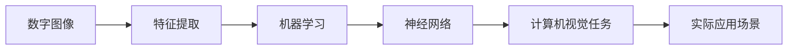

# 计算机视觉 原理与代码实例讲解

## 1.背景介绍
### 1.1 计算机视觉的定义与发展历程
计算机视觉(Computer Vision)是一门研究如何使计算机能够"看懂"数字图像或视频的科学。它是人工智能(AI)领域的一个重要分支,旨在赋予计算机类似人类视觉的感知和理解能力。计算机视觉的发展可以追溯到20世纪60年代,随着计算机技术的进步,特别是深度学习的兴起,近年来取得了突飞猛进的发展。

### 1.2 计算机视觉的主要任务与应用
计算机视觉主要涉及图像分类、目标检测、语义分割、实例分割、人脸识别、行为识别等任务。它在工业自动化、安防监控、自动驾驶、医学影像、人机交互等众多领域有广泛应用前景。计算机视觉正在深刻改变我们的生活和工作方式。

### 1.3 计算机视觉面临的挑战
尽管计算机视觉取得了长足进展,但仍面临诸多挑战:
- 图像的高维性和语义鸿沟
- 光照、视角、遮挡等因素引起的物体外观变化  
- 小样本学习和Few-shot Learning
- 弱监督和无监督学习
- 模型的可解释性和鲁棒性
- 算法的计算效率与硬件优化

## 2.核心概念与联系
### 2.1 数字图像
数字图像是计算机视觉的研究对象,可以看作是一个 H×W×C 的三维数组。其中H、W、C分别表示图像的高度、宽度和通道数。常见的图像有RGB图(3通道)和灰度图(1通道)。

### 2.2 特征提取
图像特征是对图像视觉属性的抽象表示,常见的手工特征有SIFT、SURF、HOG等,深度学习时代主要依靠卷积神经网络(CNN)自动提取层次化特征。特征提取是图像理解的基础。

### 2.3 机器学习
机器学习为计算机视觉的各项任务提供了统一框架。有监督学习通过构建输入(图像)到输出(类别、位置等)的映射来对模型进行训练。无监督学习和自监督学习则不依赖人工标注样本。Few-shot Learning 和 Zero-shot Learning 旨在缓解标注样本不足的问题。

### 2.4 神经网络
神经网络是当前计算机视觉的主流模型。CNN善于提取图像空间特征,RNN可以建模时序信息,Transformer 引入注意力机制建模长程依赖。目前的研究重点是设计高效的网络结构和提升模型泛化能力。

### 2.5 概念之间的联系
下图展示了计算机视觉的核心概念之间的联系:



## 3.核心算法原理具体操作步骤
本节以目标检测中的两阶段检测器Faster R-CNN为例,讲解其核心算法原理和操作步骤。

### 3.1 Faster R-CNN 总体流程
1. 对输入图像提取特征,得到特征图;  
2. 在特征图上生成候选区域(Region Proposal);
3. 对候选区域进行分类和回归,输出目标类别和位置。

### 3.2 特征提取
Faster R-CNN使用预训练的CNN(如ResNet)提取图像特征,得到 C×H×W 的特征图,其中C为通道数,H和W为特征图的高和宽。

### 3.3 区域生成网络(RPN)
1. 在特征图上滑动固定大小(如3x3)的窗口;
2. 对每个滑动窗口,生成k个锚框(Anchor box),预测其是否包含目标(二分类)以及位置偏移量(回归);
3. 根据分类和回归结果,选出一定数量(如2000个)的高质量候选区域。

### 3.4 区域卷积网络(R-CNN)
1. 将候选区域投影回原图,并裁剪、缩放到固定尺寸;
2. 将区域特征送入全连接层,预测目标类别(多分类)和位置偏移量(回归); 
3. 根据分类概率和回归位置对输出结果进行后处理(如NMS)。

## 4.数学模型和公式详细讲解举例说明
目标检测可以形式化为一个多任务联合优化问题:
$$
\min_{\theta} \mathcal{L}(\theta) = \mathcal{L}_{cls}(\theta) + \lambda \cdot \mathcal{L}_{reg}(\theta)
$$
其中 $\theta$ 为模型参数,$\mathcal{L}_{cls}$ 和 $\mathcal{L}_{reg}$ 分别为分类损失和回归损失,$\lambda$ 为平衡因子。

以RPN网络为例,其分类损失采用二元交叉熵:
$$
\mathcal{L}_{cls} = -\frac{1}{N_{cls}} \sum_i \left[ y_i \log p_i + (1-y_i) \log (1-p_i) \right]
$$
其中 $y_i \in \{0,1\}$ 为第 $i$ 个候选区域的真实标签,$p_i$ 为预测为正样本的概率。

回归损失采用 Smooth L1 函数:
$$
\mathcal{L}_{reg} = \frac{1}{N_{reg}} \sum_i \sum_{j \in \{x,y,w,h\}} \text{Smooth}_{L1} (t_j^i - \hat{t}_j^i) \\
\text{Smooth}_{L1}(x) = 
\begin{cases}
0.5x^2 & \text{if } |x| < 1 \\
|x| - 0.5 & \text{otherwise}
\end{cases}
$$
其中 $t_j^i$ 和 $\hat{t}_j^i$ 分别为第 $i$ 个候选区域在第 $j$ 个坐标的真实值和预测值。Smooth L1 函数在零点附近平滑,相比L2损失对离群点更加鲁棒。

## 5.项目实践：代码实例和详细解释说明
下面使用PyTorch实现Faster R-CNN的核心模块RPN网络,并对代码进行讲解。

```python
class RPN(nn.Module):
    def __init__(self, in_channels, num_anchors):
        super().__init__()
        # 3x3 卷积提取区域特征
        self.conv = nn.Conv2d(in_channels, 512, 3, 1, 1)
        # 分类支路预测是否包含目标
        self.cls_logits = nn.Conv2d(512, num_anchors, 1)
        # 回归支路预测位置偏移量
        self.bbox_pred = nn.Conv2d(512, num_anchors * 4, 1)
        
    def forward(self, x):
        # 提取区域特征
        x = F.relu(self.conv(x))
        # 分类预测
        logits = self.cls_logits(x)
        # 回归预测  
        bbox_reg = self.bbox_pred(x)
        return logits, bbox_reg
```
- `__init__` 方法定义了RPN网络的架构,包括一个3x3卷积和两个1x1卷积,分别对应分类和回归支路。`in_channels`为输入特征图的通道数,`num_anchors`为每个位置生成的锚框数。
- `forward` 方法定义了前向传播过程,输入特征图 `x` 首先经过一个3x3卷积提取区域特征,然后并行地通过分类支路预测前景/背景得分,通过回归支路预测位置偏移量。

在训练阶段,RPN网络的输出会与真实标签计算损失,进行反向传播和梯度更新。在推理阶段,RPN网络的输出会经过阈值处理和非极大值抑制,生成高质量的候选区域,供后续的R-CNN网络进行分类和回归。

## 6.实际应用场景
计算机视觉在现实生活中有广泛的应用,下面列举几个典型场景:

### 6.1 智慧安防
计算机视觉可用于安防监控,通过摄像头实时分析画面,检测可疑人员和行为,及时预警并联动响应,提升安防效率和准确性。

### 6.2 无人驾驶
无人驾驶汽车依靠计算机视觉感知周围环境,通过识别车道线、交通标志、行人、其他车辆等,实现自动避障和导航。计算机视觉是实现无人驾驶的关键技术之一。

### 6.3 医学影像
计算机视觉应用于医学影像分析,如辅助诊断肺部CT、眼底照片等,通过学习大量专家标注的数据,模型可以自动检测病变区域,定量分析病情,辅助医生诊断治疗。

### 6.4 工业质检
计算机视觉应用于工业生产的质量检测环节,通过工业相机拍摄产品图像,自动检测表面瑕疵、尺寸偏差等缺陷,提升质检效率和准确率,减少人力成本。

### 6.5 人机交互
计算机视觉使得更自然的人机交互方式成为可能,如手势识别、人脸识别、视线追踪等。用户可以通过简单的视觉交互完成复杂的控制,增强人机交互体验。

## 7.工具和资源推荐
对计算机视觉感兴趣的读者,可以参考以下工具和资源:

### 7.1 数据集
- [ImageNet](http://www.image-net.org/): 大规模图像分类数据集
- [COCO](https://cocodataset.org/): 通用目标检测数据集
- [KITTI](http://www.cvlibs.net/datasets/kitti/): 自动驾驶场景数据集
- [CelebA](http://mmlab.ie.cuhk.edu.hk/projects/CelebA.html): 人脸属性数据集

### 7.2 开源框架
- [PyTorch](https://pytorch.org/): 动态计算图的深度学习框架 
- [TensorFlow](https://www.tensorflow.org/): 静态计算图的深度学习框架
- [OpenCV](https://opencv.org/): 开源计算机视觉库
- [ONNX](https://onnx.ai/): 开放的神经网络交换格式

### 7.3 论文与教程
- [CS231n](http://cs231n.stanford.edu/): 斯坦福大学计算机视觉课程
- [CVPR](https://cvpr2023.thecvf.com/): 计算机视觉与模式识别会议
- [ICCV](https://iccv2023.thecvf.com/): 国际计算机视觉大会
- [ECCV](https://eccv2022.ecva.net/): 欧洲计算机视觉会议

## 8.总结：未来发展趋势与挑战
### 8.1 发展趋势
- 大规模多模态预训练模型成为主流范式
- 轻量化模型设计与硬件协同优化
- 小样本学习缓解标注数据稀缺问题
- 主动学习结合人机交互提升标注效率
- 领域自适应与模型泛化能力
- 数据隐私保护与联邦学习

### 8.2 面临挑战
- 缺乏可解释性和可信性
- 算法鲁棒性有待提升
- 计算开销大难以实时部署
- 数据偏差和模型公平性问题
- 缺乏常识推理和因果思考能力
- 与其他智能模块的融合问题

计算机视觉作为人工智能的核心领域之一,未来仍大有可为。随着深度学习等技术的发展,计算机视觉在性能上不断逼近甚至超越人类,但在可解释性、鲁棒性、计算效率等方面仍面临诸多挑战。未来的研究需要从数据、模型、硬件、评测等多个维度协同创新,并加强跨学科交叉融合,推动计算机视觉在更广阔的应用场景中发挥价值。

## 9.附录：常见问题与解答
### Q1: 计算机视觉与图像处理有何区别?
A1: 图像处理聚焦于图像的变换和编辑,如滤波、增强、压缩等,一般不涉及图像内容的理解。计算机视觉则致力于赋予计算机理解和解释图像内容的能力,需要借