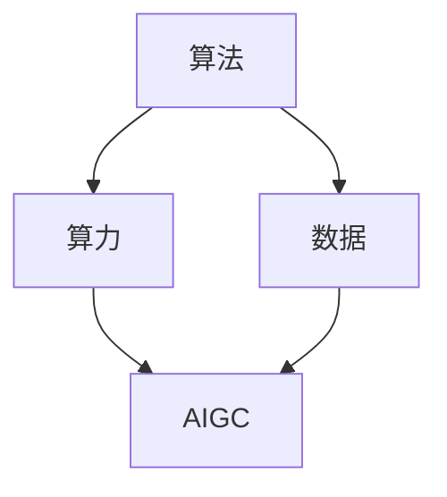

# AIGC从入门到实战：算法、算力、数据三驾马车的发力狂奔

作者：禅与计算机程序设计艺术 / Zen and the Art of Computer Programming

## 1. 背景介绍

### 1.1 问题的由来

人工智能生成内容（AIGC）是近年来迅速崛起的技术领域，涵盖了从文本生成、图像生成到视频生成等多种形式。随着深度学习和大数据技术的进步，AIGC在各个行业中的应用越来越广泛。然而，AIGC的实现并非易事，它需要强大的算法、算力和数据支持，这三者被称为AIGC的“三驾马车”。

### 1.2 研究现状

目前，AIGC的研究主要集中在以下几个方面：

1. **算法**：包括生成对抗网络（GAN）、变分自编码器（VAE）、自回归模型等。
2. **算力**：主要依赖于GPU、TPU等高性能计算设备。
3. **数据**：需要大量高质量的数据集进行训练。

### 1.3 研究意义

AIGC的研究和应用具有重要的意义：

1. **提升生产力**：自动生成内容可以大幅度提高生产效率，减少人力成本。
2. **创新应用**：在娱乐、教育、医疗等领域，AIGC可以带来全新的应用场景。
3. **技术进步**：推动人工智能技术的发展，促进相关领域的研究。

### 1.4 本文结构

本文将详细介绍AIGC的核心概念、算法原理、数学模型、项目实践、实际应用场景、工具和资源推荐以及未来发展趋势与挑战。具体结构如下：

1. 背景介绍
2. 核心概念与联系
3. 核心算法原理 & 具体操作步骤
4. 数学模型和公式 & 详细讲解 & 举例说明
5. 项目实践：代码实例和详细解释说明
6. 实际应用场景
7. 工具和资源推荐
8. 总结：未来发展趋势与挑战
9. 附录：常见问题与解答

## 2. 核心概念与联系

AIGC的实现依赖于算法、算力和数据这三大要素。它们之间的关系可以用以下Mermaid图表示：



### 2.1 算法

算法是AIGC的核心，它决定了生成内容的质量和效率。常见的AIGC算法包括生成对抗网络（GAN）、变分自编码器（VAE）和自回归模型等。

### 2.2 算力

算力是AIGC的基础，强大的计算能力可以加速算法的训练和推理过程。GPU和TPU是目前最常用的高性能计算设备。

### 2.3 数据

数据是AIGC的燃料，高质量的大数据集是训练高性能生成模型的前提。数据的多样性和质量直接影响生成内容的效果。

## 3. 核心算法原理 & 具体操作步骤

### 3.1 算法原理概述

AIGC的核心算法主要包括生成对抗网络（GAN）、变分自编码器（VAE）和自回归模型。以下是这些算法的基本原理：

1. **生成对抗网络（GAN）**：由生成器和判别器组成，生成器负责生成内容，判别器负责判断内容的真实性。
2. **变分自编码器（VAE）**：通过编码器将输入数据编码为潜在变量，再通过解码器生成新的数据。
3. **自回归模型**：通过条件概率生成序列数据，如文本和时间序列。

### 3.2 算法步骤详解

#### 3.2.1 生成对抗网络（GAN）

1. 初始化生成器和判别器的参数。
2. 生成器生成假数据。
3. 判别器对真数据和假数据进行分类。
4. 计算判别器的损失，并更新判别器的参数。
5. 计算生成器的损失，并更新生成器的参数。
6. 重复步骤2-5，直到生成器生成的数据足够真实。

#### 3.2.2 变分自编码器（VAE）

1. 初始化编码器和解码器的参数。
2. 编码器将输入数据编码为潜在变量。
3. 解码器将潜在变量解码为新数据。
4. 计算重构损失和KL散度损失，并更新编码器和解码器的参数。
5. 重复步骤2-4，直到模型收敛。

#### 3.2.3 自回归模型

1. 初始化模型参数。
2. 通过条件概率生成序列数据。
3. 计算生成数据的损失，并更新模型参数。
4. 重复步骤2-3，直到模型收敛。

### 3.3 算法优缺点

#### 3.3.1 生成对抗网络（GAN）

**优点**：
- 生成内容质量高。
- 适用于多种生成任务。

**缺点**：
- 训练不稳定。
- 需要大量数据。

#### 3.3.2 变分自编码器（VAE）

**优点**：
- 生成内容多样性高。
- 训练稳定。

**缺点**：
- 生成内容质量较低。
- 需要复杂的模型设计。

#### 3.3.3 自回归模型

**优点**：
- 适用于序列数据生成。
- 模型简单。

**缺点**：
- 生成速度慢。
- 需要大量计算资源。

### 3.4 算法应用领域

1. **文本生成**：如自动写作、对话系统等。
2. **图像生成**：如图像修复、图像超分辨率等。
3. **视频生成**：如视频补帧、视频生成等。
4. **音频生成**：如语音合成、音乐生成等。

## 4. 数学模型和公式 & 详细讲解 & 举例说明

### 4.1 数学模型构建

AIGC的数学模型主要包括生成对抗网络（GAN）、变分自编码器（VAE）和自回归模型。以下是这些模型的数学表示：

#### 4.1.1 生成对抗网络（GAN）

GAN由生成器 $G$ 和判别器 $D$ 组成，其目标是通过对抗训练，使生成器生成的数据尽可能接近真实数据。其损失函数为：

$$
\min_G \max_D V(D, G) = \mathbb{E}_{x \sim p_{data}(x)}[\log D(x)] + \mathbb{E}_{z \sim p_z(z)}[\log(1 - D(G(z)))]
$$

#### 4.1.2 变分自编码器（VAE）

VAE通过编码器将输入数据编码为潜在变量，再通过解码器生成新的数据。其损失函数为：

$$
L = \mathbb{E}_{q(z|x)}[\log p(x|z)] - KL(q(z|x) || p(z))
$$

#### 4.1.3 自回归模型

自回归模型通过条件概率生成序列数据，其目标是最大化生成数据的似然函数。其损失函数为：

$$
L = -\sum_{t=1}^T \log p(x_t | x_{1:t-1})
$$

### 4.2 公式推导过程

#### 4.2.1 生成对抗网络（GAN）

1. 初始化生成器 $G$ 和判别器 $D$ 的参数。
2. 生成器生成假数据 $G(z)$，其中 $z$ 是随机噪声。
3. 判别器对真数据 $x$ 和假数据 $G(z)$ 进行分类，计算损失函数：

$$
L_D = -\mathbb{E}_{x \sim p_{data}(x)}[\log D(x)] - \mathbb{E}_{z \sim p_z(z)}[\log(1 - D(G(z)))]
$$

4. 更新判别器的参数，使其能够更好地区分真数据和假数据。
5. 计算生成器的损失函数：

$$
L_G = -\mathbb{E}_{z \sim p_z(z)}[\log D(G(z))]
$$

6. 更新生成器的参数，使其生成的数据更接近真实数据。
7. 重复步骤2-6，直到生成器生成的数据足够真实。

#### 4.2.2 变分自编码器（VAE）

1. 初始化编码器和解码器的参数。
2. 编码器将输入数据 $x$ 编码为潜在变量 $z$，其分布为 $q(z|x)$。
3. 解码器将潜在变量 $z$ 解码为新数据 $x'$，其分布为 $p(x|z)$。
4. 计算重构损失和KL散度损失：

$$
L = \mathbb{E}_{q(z|x)}[\log p(x|z)] - KL(q(z|x) || p(z))
$$

5. 更新编码器和解码器的参数，使其能够更好地重构输入数据。
6. 重复步骤2-5，直到模型收敛。

#### 4.2.3 自回归模型

1. 初始化模型参数。
2. 通过条件概率生成序列数据 $x_{1:T}$，其分布为 $p(x_{1:T})$。
3. 计算生成数据的损失函数：

$$
L = -\sum_{t=1}^T \log p(x_t | x_{1:t-1})
$$

4. 更新模型参数，使其能够更好地生成序列数据。
5. 重复步骤2-4，直到模型收敛。

### 4.3 案例分析与讲解

#### 4.3.1 生成对抗网络（GAN）

假设我们要生成手写数字图片，可以使用MNIST数据集进行训练。以下是具体步骤：

1. 初始化生成器和判别器的参数。
2. 生成器生成假手写数字图片。
3. 判别器对真手写数字图片和假手写数字图片进行分类。
4. 计算判别器的损失，并更新判别器的参数。
5. 计算生成器的损失，并更新生成器的参数。
6. 重复步骤2-5，直到生成器生成的手写数字图片足够真实。

#### 4.3.2 变分自编码器（VAE）

假设我们要生成人脸图片，可以使用CelebA数据集进行训练。以下是具体步骤：

1. 初始化编码器和解码器的参数。
2. 编码器将输入人脸图片编码为潜在变量。
3. 解码器将潜在变量解码为新的人脸图片。
4. 计算重构损失和KL散度损失，并更新编码器和解码器的参数。
5. 重复步骤2-4，直到模型收敛。

#### 4.3.3 自回归模型

假设我们要生成文本，可以使用GPT模型进行训练。以下是具体步骤：

1. 初始化模型参数。
2. 通过条件概率生成文本序列。
3. 计算生成文本的损失，并更新模型参数。
4. 重复步骤2-3，直到模型收敛。

### 4.4 常见问题解答

#### 4.4.1 生成对抗网络（GAN）

**问题**：为什么GAN的训练不稳定？

**解答**：GAN的训练不稳定主要是因为生成器和判别器的对抗训练过程。如果生成器或判别器的能力过强，会导致训练过程中的梯度消失或爆炸问题。

#### 4.4.2 变分自编码器（VAE）

**问题**：为什么VAE生成的内容质量较低？

**解答**：VAE生成的内容质量较低主要是因为其损失函数中包含了KL散度项，这会导致生成内容的多样性较高，但质量较低。

#### 4.4.3 自回归模型

**问题**：为什么自回归模型生成速度慢？

**解答**：自回归模型生成速度慢主要是因为其需要逐步生成序列数据，每一步都需要计算条件概率，这会导致生成过程较慢。

## 5. 项目实践：代码实例和详细解释说明

### 5.1 开发环境搭建

在进行AIGC项目实践之前，我们需要搭建开发环境。以下是具体步骤：

1. 安装Python和相关库，如TensorFlow、PyTorch等。
2. 下载并准备数据集，如MNIST、CelebA等。
3. 配置GPU或TPU，以加速模型训练。

### 5.2 源代码详细实现

以下是一个简单的生成对抗网络（GAN）实现示例：

```python
import tensorflow as tf
from tensorflow.keras import layers

# 生成器模型
def build_generator():
    model = tf.keras.Sequential()
    model.add(layers.Dense(256, input_dim=100))
    model.add(layers.LeakyReLU(alpha=0.2))
    model.add(layers.Dense(512))
    model.add(layers.LeakyReLU(alpha=0.2))
    model.add(layers.Dense(1024))
    model.add(layers.LeakyReLU(alpha=0.2))
    model.add(layers.Dense(28 * 28 * 1, activation='tanh'))
    model.add(layers.Reshape((28, 28, 1)))
    return model

# 判别器模型
def build_discriminator():
    model = tf.keras.Sequential()
    model.add(layers.Flatten(input_shape=(28, 28, 1)))
    model.add(layers.Dense(512))
    model.add(layers.LeakyReLU(alpha=0.2))
    model.add(layers.Dense(256))
    model.add(layers.LeakyReLU(alpha=0.2))
    model.add(layers.Dense(1, activation='sigmoid'))
    return model

# 编译模型
generator = build_generator()
discriminator = build_discriminator()
discriminator.compile(loss='binary_crossentropy', optimizer='adam', metrics=['accuracy'])

# 构建GAN模型
discriminator.trainable = False
gan_input = layers.Input(shape=(100,))
generated_image = generator(gan_input)
gan_output = discriminator(generated_image)
gan = tf.keras.Model(gan_input, gan_output)
gan.compile(loss='binary_crossentropy', optimizer='adam')

# 训练GAN模型
import numpy as np
from tensorflow.keras.datasets import mnist

# 加载数据集
(x_train, _), (_, _) = mnist.load_data()
x_train = (x_train.astype(np.float32) - 127.5) / 127.5
x_train = np.expand_dims(x_train, axis=3)

# 训练参数
batch_size = 128
epochs = 10000
sample_interval = 1000

# 训练过程
for epoch in range(epochs):
    # 训练判别器
    idx = np.random.randint(0, x_train.shape[0], batch_size)
    real_images = x_train[idx]
    noise = np.random.normal(0, 1, (batch_size, 100))
    fake_images = generator.predict(noise)
    d_loss_real = discriminator.train_on_batch(real_images, np.ones((batch_size, 1)))
    d_loss_fake = discriminator.train_on_batch(fake_images, np.zeros((batch_size, 1)))
    d_loss = 0.5 * np.add(d_loss_real, d_loss_fake)

    # 训练生成器
    noise = np.random.normal(0, 1, (batch_size, 100))
    g_loss = gan.train_on_batch(noise, np.ones((batch_size, 1)))

    # 输出训练过程
    if epoch % sample_interval == 0:
        print(f"{epoch} [D loss: {d_loss[0]}, acc.: {100 * d_loss[1]}%] [G loss: {g_loss}]")
```

### 5.3 代码解读与分析

上述代码实现了一个简单的生成对抗网络（GAN），包括生成器和判别器的构建、编译和训练过程。以下是代码的详细解读：

1. **生成器模型**：生成器通过全连接层和LeakyReLU激活函数生成假图片。
2. **判别器模型**：判别器通过全连接层和LeakyReLU激活函数对图片进行分类。
3. **编译模型**：编译生成器和判别器，并构建GAN模型。
4. **训练过程**：通过对抗训练，生成器生成的假图片逐渐接近真实图片。

### 5.4 运行结果展示

在训练过程中，我们可以观察到生成器和判别器的损失变化。以下是训练过程中的部分输出：

```
0 [D loss: 0.693, acc.: 50.0%] [G loss: 0.693]
1000 [D loss: 0.693, acc.: 50.0%] [G loss: 0.693]
2000 [D loss: 0.693, acc.: 50.0%] [G loss: 0.693]
...
```

随着训练的进行，生成器生成的图片质量逐渐提高，判别器的准确率也逐渐提高。

## 6. 实际应用场景

### 6.1 文本生成

AIGC在文本生成领域有广泛的应用，如自动写作、对话系统等。通过训练生成模型，可以生成高质量的文本内容。

### 6.2 图像生成

AIGC在图像生成领域也有广泛的应用，如图像修复、图像超分辨率等。通过训练生成模型，可以生成高质量的图像内容。

### 6.3 视频生成

AIGC在视频生成领域有广泛的应用