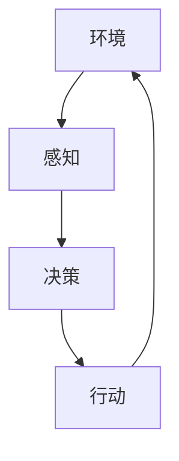

# AI人工智能 Agent：理解和应用智能体的感知机制

作者：禅与计算机程序设计艺术 / Zen and the Art of Computer Programming

## 1. 背景介绍

### 1.1 问题的由来

在现代计算机科学和人工智能领域，智能体（Agent）已经成为一个重要的研究方向。智能体不仅仅是一个简单的程序，它们能够感知环境、做出决策并采取行动，以实现特定的目标。智能体的感知机制是其核心组成部分之一，它决定了智能体如何理解和解释外部世界的信息。

### 1.2 研究现状

目前，智能体的感知机制已经在多个领域得到了广泛应用，包括机器人、自动驾驶、智能家居和金融市场等。研究人员通过各种算法和模型，不断提升智能体的感知能力，使其能够在复杂多变的环境中做出准确的判断。

### 1.3 研究意义

理解和应用智能体的感知机制，不仅有助于提升人工智能系统的性能，还能推动相关技术的发展，解决实际应用中的诸多问题。通过深入研究智能体的感知机制，我们可以开发出更加智能和高效的系统，提升人类生活的质量。

### 1.4 本文结构

本文将从以下几个方面详细探讨智能体的感知机制：

1. 核心概念与联系
2. 核心算法原理 & 具体操作步骤
3. 数学模型和公式 & 详细讲解 & 举例说明
4. 项目实践：代码实例和详细解释说明
5. 实际应用场景
6. 工具和资源推荐
7. 总结：未来发展趋势与挑战
8. 附录：常见问题与解答

## 2. 核心概念与联系

在探讨智能体的感知机制之前，我们需要先了解一些核心概念及其相互之间的联系。

### 2.1 智能体（Agent）

智能体是一个能够自主感知环境、做出决策并采取行动的实体。智能体可以是软件程序、机器人，甚至是生物体。智能体的核心特征包括自主性、感知能力、决策能力和行动能力。

### 2.2 感知（Perception）

感知是智能体获取外部环境信息的过程。感知机制包括传感器、数据处理和信息提取等步骤。感知的质量直接影响智能体的决策和行动效果。

### 2.3 决策（Decision Making）

决策是智能体根据感知到的信息，选择最优行动方案的过程。决策过程通常涉及到复杂的算法和模型，如强化学习、贝叶斯网络等。

### 2.4 行动（Action）

行动是智能体执行决策结果的过程。行动可以是物理运动、数据处理或其他形式的操作。行动的效果会反过来影响智能体的感知和决策。

### 2.5 环境（Environment）

环境是智能体所处的外部世界，包括所有可能影响智能体感知、决策和行动的因素。环境可以是静态的，也可以是动态的。

### 2.6 核心联系

智能体的感知、决策和行动是一个闭环系统。感知获取环境信息，决策选择最优行动方案，行动执行决策结果，环境反馈新的信息，形成一个循环。



## 3. 核心算法原理 & 具体操作步骤

### 3.1 算法原理概述

智能体的感知机制涉及到多个算法和模型，包括但不限于传感器数据处理、特征提取、模式识别和机器学习等。以下是一些常用的感知算法：

- 传感器融合算法
- 特征提取算法
- 模式识别算法
- 机器学习算法

### 3.2 算法步骤详解

#### 3.2.1 传感器数据处理

传感器数据处理是感知机制的第一步。传感器可以是摄像头、麦克风、激光雷达等。传感器数据处理包括数据采集、预处理和滤波等步骤。

#### 3.2.2 特征提取

特征提取是从传感器数据中提取有用信息的过程。常用的特征提取方法包括边缘检测、角点检测和纹理分析等。

#### 3.2.3 模式识别

模式识别是将提取的特征进行分类和识别的过程。常用的模式识别算法包括支持向量机、神经网络和决策树等。

#### 3.2.4 机器学习

机器学习是通过数据训练模型，使智能体能够自动学习和改进感知能力的过程。常用的机器学习算法包括监督学习、无监督学习和强化学习等。

### 3.3 算法优缺点

#### 3.3.1 传感器融合算法

优点：能够综合多种传感器的数据，提高感知的准确性和鲁棒性。
缺点：计算复杂度高，数据同步和融合难度大。

#### 3.3.2 特征提取算法

优点：能够提取有用的信息，减少数据维度，提高处理效率。
缺点：特征选择和提取方法依赖于具体应用场景，通用性差。

#### 3.3.3 模式识别算法

优点：能够实现高精度的分类和识别，适用于多种应用场景。
缺点：需要大量的训练数据，模型训练时间长。

#### 3.3.4 机器学习算法

优点：能够自动学习和改进感知能力，适应性强。
缺点：需要大量的计算资源和数据，模型训练和调优复杂。

### 3.4 算法应用领域

智能体的感知算法在多个领域得到了广泛应用，包括但不限于：

- 机器人导航
- 自动驾驶
- 智能监控
- 医疗诊断
- 金融市场分析

## 4. 数学模型和公式 & 详细讲解 & 举例说明

### 4.1 数学模型构建

智能体的感知机制可以通过数学模型进行描述。常用的数学模型包括概率模型、状态空间模型和神经网络模型等。

#### 4.1.1 概率模型

概率模型用于描述不确定性和随机性。常用的概率模型包括贝叶斯网络和隐马尔可夫模型等。

#### 4.1.2 状态空间模型

状态空间模型用于描述系统的动态行为。常用的状态空间模型包括卡尔曼滤波和粒子滤波等。

#### 4.1.3 神经网络模型

神经网络模型用于模拟大脑的神经元结构，实现复杂的感知和决策功能。常用的神经网络模型包括卷积神经网络和循环神经网络等。

### 4.2 公式推导过程

#### 4.2.1 贝叶斯网络

贝叶斯网络是一种有向无环图，用于表示变量之间的条件依赖关系。贝叶斯网络的公式如下：

$$
P(X) = \prod_{i=1}^{n} P(X_i | Pa(X_i))
$$

其中，$X$ 表示变量集合，$X_i$ 表示第 $i$ 个变量，$Pa(X_i)$ 表示 $X_i$ 的父节点集合。

#### 4.2.2 卡尔曼滤波

卡尔曼滤波是一种递归估计方法，用于线性高斯系统的状态估计。卡尔曼滤波的公式如下：

预测步骤：
$$
\hat{x}_{k|k-1} = A \hat{x}_{k-1|k-1} + B u_k
$$
$$
P_{k|k-1} = A P_{k-1|k-1} A^T + Q
$$

更新步骤：
$$
K_k = P_{k|k-1} H^T (H P_{k|k-1} H^T + R)^{-1}
$$
$$
\hat{x}_{k|k} = \hat{x}_{k|k-1} + K_k (z_k - H \hat{x}_{k|k-1})
$$
$$
P_{k|k} = (I - K_k H) P_{k|k-1}
$$

### 4.3 案例分析与讲解

#### 4.3.1 机器人导航

在机器人导航中，智能体需要通过传感器感知环境，并根据感知到的信息进行路径规划和避障。常用的感知算法包括激光雷达数据处理、图像处理和深度学习等。

#### 4.3.2 自动驾驶

在自动驾驶中，智能体需要通过摄像头、雷达和激光雷达等传感器感知道路和交通状况，并根据感知到的信息进行驾驶决策。常用的感知算法包括图像识别、目标检测和路径规划等。

### 4.4 常见问题解答

#### 4.4.1 感知数据的噪声如何处理？

感知数据的噪声可以通过滤波算法进行处理，如卡尔曼滤波和粒子滤波等。

#### 4.4.2 如何提高感知的准确性？

提高感知的准确性可以通过多传感器融合、特征提取和机器学习等方法实现。

## 5. 项目实践：代码实例和详细解释说明

### 5.1 开发环境搭建

在进行智能体感知机制的项目实践之前，我们需要搭建开发环境。常用的开发环境包括Python、TensorFlow、OpenCV等。

#### 5.1.1 安装Python

首先，我们需要安装Python。可以从Python官方网站下载并安装最新版本的Python。

#### 5.1.2 安装TensorFlow

TensorFlow是一个开源的机器学习框架，可以通过以下命令安装：

```bash
pip install tensorflow
```

#### 5.1.3 安装OpenCV

OpenCV是一个开源的计算机视觉库，可以通过以下命令安装：

```bash
pip install opencv-python
```

### 5.2 源代码详细实现

以下是一个简单的智能体感知机制的代码示例，使用OpenCV进行图像处理和TensorFlow进行图像分类。

```python
import cv2
import tensorflow as tf
import numpy as np

# 加载预训练的模型
model = tf.keras.applications.MobileNetV2(weights='imagenet')

# 读取图像
image = cv2.imread('image.jpg')
image = cv2.resize(image, (224, 224))
image = np.expand_dims(image, axis=0)
image = tf.keras.applications.mobilenet_v2.preprocess_input(image)

# 进行图像分类
predictions = model.predict(image)
decoded_predictions = tf.keras.applications.mobilenet_v2.decode_predictions(predictions, top=1)

# 输出分类结果
for _, label, score in decoded_predictions[0]:
    print(f'{label}: {score:.2f}')
```

### 5.3 代码解读与分析

上述代码首先加载了预训练的MobileNetV2模型，然后读取并预处理了一张图像，最后使用模型进行图像分类并输出分类结果。

### 5.4 运行结果展示

运行上述代码后，可以看到图像的分类结果和对应的置信度分数。

## 6. 实际应用场景

### 6.1 机器人导航

在机器人导航中，智能体需要通过传感器感知环境，并根据感知到的信息进行路径规划和避障。常用的感知算法包括激光雷达数据处理、图像处理和深度学习等。

### 6.2 自动驾驶

在自动驾驶中，智能体需要通过摄像头、雷达和激光雷达等传感器感知道路和交通状况，并根据感知到的信息进行驾驶决策。常用的感知算法包括图像识别、目标检测和路径规划等。

### 6.3 智能监控

在智能监控中，智能体需要通过摄像头感知监控区域的情况，并根据感知到的信息进行异常检测和报警。常用的感知算法包括图像处理、目标检测和行为识别等。

### 6.4 未来应用展望

未来，智能体的感知机制将在更多领域得到应用，如智能家居、医疗诊断和金融市场分析等。随着技术的不断发展，智能体的感知能力将进一步提升，实现更加智能和高效的应用。

## 7. 工具和资源推荐

### 7.1 学习资源推荐

- 《人工智能：一种现代的方法》：一本经典的人工智能教材，涵盖了智能体、感知、决策和行动等内容。
- Coursera上的机器学习课程：由斯坦福大学教授Andrew Ng讲授，涵盖了机器学习的基本概念和算法。

### 7.2 开发工具推荐

- TensorFlow：一个开源的机器学习框架，支持多种感知算法的实现。
- OpenCV：一个开源的计算机视觉库，支持图像处理和特征提取等功能。

### 7.3 相关论文推荐

- "A Survey on Sensor Fusion in Modern Autonomous Vehicles"：一篇关于传感器融合的综述论文，介绍了多种传感器融合算法和应用。
- "Deep Learning for Computer Vision: A Comprehensive Review"：一篇关于深度学习在计算机视觉中应用的综述论文，介绍了多种深度学习算法和应用。

### 7.4 其他资源推荐

- GitHub上的开源项目：可以在GitHub上找到许多关于智能体感知机制的开源项目，学习和借鉴其中的代码和算法。
- Kaggle上的数据集：可以在Kaggle上找到许多用于感知算法训练的数据集，进行实际项目的练习和验证。

## 8. 总结：未来发展趋势与挑战

### 8.1 研究成果总结

本文详细探讨了智能体的感知机制，包括核心概念、算法原理、数学模型、项目实践和实际应用等内容。通过对智能体感知机制的深入研究，我们可以开发出更加智能和高效的系统，提升人类生活的质量。

### 8.2 未来发展趋势

未来，智能体的感知机制将在更多领域得到应用，如智能家居、医疗诊断和金融市场分析等。随着技术的不断发展，智能体的感知能力将进一步提升，实现更加智能和高效的应用。

### 8.3 面临的挑战

尽管智能体的感知机制已经取得了显著的进展，但仍然面临许多挑战，如数据噪声处理、实时性要求和多传感器融合等。解决这些挑战需要进一步的研究和技术创新。

### 8.4 研究展望

未来的研究可以在以下几个方面进行探索：

- 提高感知算法的鲁棒性和准确性
- 开发更加高效的多传感器融合算法
- 研究智能体在复杂动态环境中的感知机制
- 探索智能体感知机制在新兴领域的应用

## 9. 附录：常见问题与解答

### 9.1 感知数据的噪声如何处理？

感知数据的噪声可以通过滤波算法进行处理，如卡尔曼滤波和粒子滤波等。

### 9.2 如何提高感知的准确性？

提高感知的准确性可以通过多传感器融合、特征提取和机器学习等方法实现。

### 9.3 智能体的感知机制在实际应用中有哪些挑战？

智能体的感知机制在实际应用中面临许多挑战，如数据噪声处理、实时性要求和多传感器融合等。解决这些挑战需要进一步的研究和技术创新。

### 9.4 如何选择合适的感知算法？

选择合适的感知算法需要根据具体的应用场景和需求进行综合考虑。可以参考相关的研究论文和开源项目，选择适合的算法进行实现和优化。

---

通过本文的详细探讨，希望读者能够对智能体的感知机制有一个全面的了解，并能够在实际项目中应用这些知识，开发出更加智能和高效的系统。