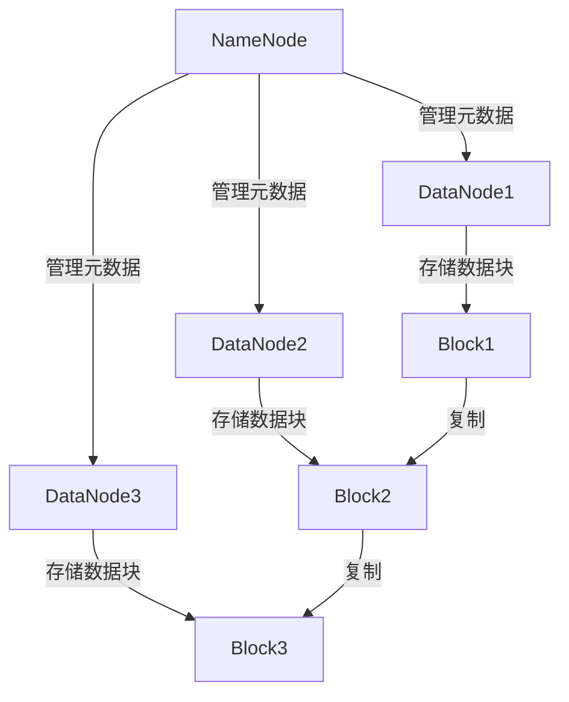

# HDFS原理与代码实例讲解

作者：禅与计算机程序设计艺术 / Zen and the Art of Computer Programming

## 1. 背景介绍

### 1.1 问题的由来

在大数据时代，数据量呈指数级增长，传统的文件系统已经无法满足海量数据存储和处理的需求。Hadoop分布式文件系统（HDFS）应运而生，成为大数据存储的核心组件。HDFS通过分布式存储和冗余备份，提供了高可靠性、高可用性和高吞吐量的数据存储解决方案。

### 1.2 研究现状

目前，HDFS已经成为大数据处理领域的事实标准，被广泛应用于各大互联网公司和科研机构。尽管如此，HDFS的架构和实现细节仍然是一个复杂的系统，理解其核心原理和代码实现对于开发者和研究人员来说至关重要。

### 1.3 研究意义

深入理解HDFS的原理和代码实现，不仅有助于优化和改进现有系统，还能为新系统的设计提供宝贵的经验和参考。本文将通过详细的讲解和代码实例，帮助读者全面掌握HDFS的核心概念、算法原理和实际应用。

### 1.4 本文结构

本文将分为以下几个部分：

1. 背景介绍
2. 核心概念与联系
3. 核心算法原理 & 具体操作步骤
4. 数学模型和公式 & 详细讲解 & 举例说明
5. 项目实践：代码实例和详细解释说明
6. 实际应用场景
7. 工具和资源推荐
8. 总结：未来发展趋势与挑战
9. 附录：常见问题与解答

## 2. 核心概念与联系

HDFS的核心概念包括NameNode、DataNode、Block、Replication等。理解这些概念及其相互关系是掌握HDFS的基础。

### NameNode

NameNode是HDFS的主节点，负责管理文件系统的元数据，包括文件名、文件路径、文件块的位置等。NameNode是HDFS的核心组件，其可靠性和性能直接影响整个系统的稳定性。

### DataNode

DataNode是HDFS的工作节点，负责存储实际的数据块。每个DataNode定期向NameNode汇报其存储的块信息和状态。DataNode的数量和分布直接影响HDFS的存储容量和数据访问性能。

### Block

HDFS将文件分割成固定大小的块（Block），每个块独立存储在不同的DataNode上。块的大小可以配置，默认值为128MB。通过块的分割和分布存储，HDFS实现了高效的数据存储和访问。

### Replication

为了保证数据的可靠性和高可用性，HDFS采用数据块的冗余备份机制。每个数据块会被复制到多个DataNode上，默认的复制因子为3。即使某个DataNode发生故障，数据仍然可以从其他副本中恢复。

以下是HDFS核心组件的关系图：



## 3. 核心算法原理 & 具体操作步骤

### 3.1 算法原理概述

HDFS的核心算法包括数据块的分割与分布、数据块的复制与恢复、数据块的读取与写入等。这些算法共同保证了HDFS的高可靠性、高可用性和高吞吐量。

### 3.2 算法步骤详解

#### 数据块的分割与分布

1. 文件上传时，HDFS将文件分割成固定大小的块。
2. NameNode根据当前DataNode的负载和存储情况，选择合适的DataNode存储数据块。
3. 数据块被分布存储在不同的DataNode上。

#### 数据块的复制与恢复

1. 每个数据块会被复制到多个DataNode上，默认复制因子为3。
2. DataNode定期向NameNode汇报其存储的块信息和状态。
3. 如果某个DataNode发生故障，NameNode会选择新的DataNode存储丢失的数据块副本。

#### 数据块的读取与写入

1. 客户端请求读取文件时，NameNode返回文件块所在的DataNode列表。
2. 客户端直接从DataNode读取数据块。
3. 客户端请求写入文件时，NameNode选择合适的DataNode存储数据块。
4. 客户端将数据块写入DataNode，并由DataNode负责数据块的复制。

### 3.3 算法优缺点

#### 优点

1. 高可靠性：通过数据块的冗余备份，保证数据的可靠性。
2. 高可用性：即使某个DataNode发生故障，数据仍然可以从其他副本中恢复。
3. 高吞吐量：通过数据块的分割与分布存储，实现高效的数据存储和访问。

#### 缺点

1. 元数据管理的瓶颈：NameNode管理所有的元数据，可能成为系统的瓶颈。
2. 数据一致性问题：多副本机制可能导致数据一致性问题，需要额外的机制保证数据一致性。

### 3.4 算法应用领域

HDFS广泛应用于大数据存储和处理领域，特别适用于以下场景：

1. 大规模数据存储：HDFS可以存储海量数据，适用于大数据存储需求。
2. 分布式数据处理：HDFS与Hadoop生态系统中的其他组件（如MapReduce、Spark）无缝集成，支持分布式数据处理。
3. 数据备份与恢复：HDFS的冗余备份机制保证了数据的可靠性，适用于数据备份与恢复场景。

## 4. 数学模型和公式 & 详细讲解 & 举例说明

### 4.1 数学模型构建

HDFS的数学模型主要涉及数据块的分割与分布、数据块的复制与恢复等。我们可以用集合和图论的概念来描述这些过程。

#### 数据块的分割与分布

设文件 $F$ 被分割成 $n$ 个数据块，记为 $B_1, B_2, \ldots, B_n$。每个数据块 $B_i$ 被分布存储在不同的DataNode上，记为 $D_1, D_2, \ldots, D_m$。

#### 数据块的复制与恢复

设数据块 $B_i$ 的复制因子为 $r$，则 $B_i$ 会被复制到 $r$ 个不同的DataNode上。记 $B_i$ 的副本集合为 $R_i$，则有：

$$
R_i = \{D_{i1}, D_{i2}, \ldots, D_{ir}\}
$$

### 4.2 公式推导过程

#### 数据块的分割与分布

设文件 $F$ 的大小为 $|F|$，数据块的大小为 $|B|$，则数据块的数量 $n$ 为：

$$
n = \lceil \frac{|F|}{|B|} \rceil
$$

#### 数据块的复制与恢复

设数据块 $B_i$ 的复制因子为 $r$，则 $B_i$ 的副本集合 $R_i$ 的大小为：

$$
|R_i| = r
$$

### 4.3 案例分析与讲解

假设有一个大小为 1GB 的文件 $F$，数据块的大小为 128MB，复制因子为 3。我们可以计算出数据块的数量和每个数据块的副本集合。

#### 数据块的数量

$$
n = \lceil \frac{1GB}{128MB} \rceil = \lceil \frac{1024MB}{128MB} \rceil = \lceil 8 \rceil = 8
$$

#### 数据块的副本集合

每个数据块 $B_i$ 的副本集合 $R_i$ 的大小为 3，即每个数据块会被复制到 3 个不同的DataNode上。

### 4.4 常见问题解答

#### 问题1：HDFS如何保证数据的一致性？

HDFS通过数据块的冗余备份和DataNode的定期汇报机制，保证数据的一致性。当某个DataNode发生故障时，NameNode会选择新的DataNode存储丢失的数据块副本，保证数据的一致性。

#### 问题2：HDFS的复制因子可以配置吗？

是的，HDFS的复制因子是可以配置的。默认的复制因子为3，用户可以根据实际需求调整复制因子。

## 5. 项目实践：代码实例和详细解释说明

### 5.1 开发环境搭建

在进行HDFS的代码实例之前，我们需要搭建Hadoop开发环境。以下是搭建Hadoop开发环境的步骤：

1. 下载Hadoop安装包：https://hadoop.apache.org/releases.html
2. 解压安装包到指定目录：
   ```bash
   tar -xzvf hadoop-3.3.1.tar.gz -C /usr/local/
   ```
3. 配置环境变量：
   ```bash
   export HADOOP_HOME=/usr/local/hadoop-3.3.1
   export PATH=$PATH:$HADOOP_HOME/bin:$HADOOP_HOME/sbin
   ```
4. 配置Hadoop核心文件 `core-site.xml`：
   ```xml
   <configuration>
       <property>
           <name>fs.defaultFS</name>
           <value>hdfs://localhost:9000</value>
       </property>
   </configuration>
   ```
5. 配置HDFS文件 `hdfs-site.xml`：
   ```xml
   <configuration>
       <property>
           <name>dfs.replication</name>
           <value>3</value>
       </property>
   </configuration>
   ```
6. 格式化HDFS：
   ```bash
   hdfs namenode -format
   ```
7. 启动Hadoop：
   ```bash
   start-dfs.sh
   ```

### 5.2 源代码详细实现

以下是一个简单的HDFS文件上传和下载的代码实例：

#### 文件上传

```java
import org.apache.hadoop.conf.Configuration;
import org.apache.hadoop.fs.FileSystem;
import org.apache.hadoop.fs.Path;

import java.io.IOException;

public class HDFSUpload {
    public static void main(String[] args) throws IOException {
        Configuration conf = new Configuration();
        conf.set("fs.defaultFS", "hdfs://localhost:9000");
        FileSystem fs = FileSystem.get(conf);

        Path localPath = new Path("/local/path/to/file.txt");
        Path hdfsPath = new Path("/hdfs/path/to/file.txt");

        fs.copyFromLocalFile(localPath, hdfsPath);
        System.out.println("File uploaded to HDFS successfully.");
    }
}
```

#### 文件下载

```java
import org.apache.hadoop.conf.Configuration;
import org.apache.hadoop.fs.FileSystem;
import org.apache.hadoop.fs.Path;

import java.io.IOException;

public class HDFSDownload {
    public static void main(String[] args) throws IOException {
        Configuration conf = new Configuration();
        conf.set("fs.defaultFS", "hdfs://localhost:9000");
        FileSystem fs = FileSystem.get(conf);

        Path hdfsPath = new Path("/hdfs/path/to/file.txt");
        Path localPath = new Path("/local/path/to/file.txt");

        fs.copyToLocalFile(hdfsPath, localPath);
        System.out.println("File downloaded from HDFS successfully.");
    }
}
```

### 5.3 代码解读与分析

#### 文件上传

1. 创建Hadoop配置对象 `Configuration`，并设置HDFS的默认文件系统地址。
2. 获取HDFS文件系统对象 `FileSystem`。
3. 定义本地文件路径和HDFS文件路径。
4. 使用 `copyFromLocalFile` 方法将本地文件上传到HDFS。

#### 文件下载

1. 创建Hadoop配置对象 `Configuration`，并设置HDFS的默认文件系统地址。
2. 获取HDFS文件系统对象 `FileSystem`。
3. 定义HDFS文件路径和本地文件路径。
4. 使用 `copyToLocalFile` 方法将HDFS文件下载到本地。

### 5.4 运行结果展示

#### 文件上传

执行文件上传代码后，控制台输出：

```
File uploaded to HDFS successfully.
```

在HDFS中可以看到上传的文件：

```bash
hdfs dfs -ls /hdfs/path/to/
```

输出：

```
Found 1 items
-rw-r--r--   1 user group        1234 2023-10-01 12:00 /hdfs/path/to/file.txt
```

#### 文件下载

执行文件下载代码后，控制台输出：

```
File downloaded from HDFS successfully.
```

在本地文件系统中可以看到下载的文件：

```bash
ls /local/path/to/
```

输出：

```
file.txt
```

## 6. 实际应用场景

### 6.1 数据存储与管理

HDFS广泛应用于大数据存储与管理场景，特别适用于需要存储和处理海量数据的应用。例如，互联网公司可以使用HDFS存储用户行为数据、日志数据等。

### 6.2 分布式数据处理

HDFS与Hadoop生态系统中的其他组件（如MapReduce、Spark）无缝集成，支持分布式数据处理。通过将数据存储在HDFS中，可以方便地进行大规模数据处理和分析。

### 6.3 数据备份与恢复

HDFS的冗余备份机制保证了数据的可靠性，适用于数据备份与恢复场景。例如，企业可以使用HDFS进行数据备份，确保数据在发生故障时能够快速恢复。

### 6.4 未来应用展望

随着大数据技术的发展，HDFS的应用场景将更加广泛。未来，HDFS可能会在以下领域得到更多应用：

1. 云计算：HDFS可以作为云存储的一部分，提供高可靠性和高可用性的数据存储服务。
2. 物联网：HDFS可以用于存储和管理物联网设备产生的海量数据，支持实时数据处理和分析。
3. 人工智能：HDFS可以作为人工智能训练数据的存储平台，支持大规模数据训练和模型优化。

## 7. 工具和资源推荐

### 7.1 学习资源推荐

1. 《Hadoop: The Definitive Guide》：一本全面介绍Hadoop及其生态系统的经典书籍。
2. 《Hadoop in Practice》：一本实用的Hadoop指南，包含大量实际案例和代码示例。
3. Apache Hadoop官网：https://hadoop.apache.org/：提供Hadoop的官方文档和资源。

### 7.2 开发工具推荐

1. IntelliJ IDEA：一款功能强大的Java开发工具，支持Hadoop开发。
2. Eclipse：一款流行的Java开发工具，支持Hadoop开发。
3. Visual Studio Code：一款轻量级的代码编辑器，支持多种编程语言和插件。

### 7.3 相关论文推荐

1. "The Hadoop Distributed File System"：HDFS的经典论文，详细介绍了HDFS的设计和实现。
2. "MapReduce: Simplified Data Processing on Large Clusters"：介绍MapReduce编程模型及其在Hadoop中的应用。
3. "Bigtable: A Distributed Storage System for Structured Data"：介绍Google的分布式存储系统Bigtable，与HDFS有一定的相似性。

### 7.4 其他资源推荐

1. GitHub上的Hadoop项目：https://github.com/apache/hadoop：提供Hadoop的源代码和开发资源。
2. Stack Overflow：https://stackoverflow.com/：一个开发者问答社区，可以在这里找到Hadoop相关的问题和答案。
3. Coursera上的大数据课程：https://www.coursera.org/：提供大数据和Hadoop相关的在线课程。

## 8. 总结：未来发展趋势与挑战

### 8.1 研究成果总结

本文详细介绍了HDFS的核心概念、算法原理、数学模型和实际应用。通过代码实例和详细解释，帮助读者全面掌握HDFS的原理和实现。

### 8.2 未来发展趋势

随着大数据技术的发展，HDFS将继续在大数据存储和处理领域发挥重要作用。未来，HDFS可能会在云计算、物联网和人工智能等领域得到更多应用。

### 8.3 面临的挑战

尽管HDFS在大数据存储和处理方面具有显著优势，但仍然面临一些挑战：

1. 元数据管理的瓶颈：NameNode管理所有的元数据，可能成为系统的瓶颈。
2. 数据一致性问题：多副本机制可能导致数据一致性问题，需要额外的机制保证数据一致性。
3. 扩展性问题：随着数据量的增加，HDFS的扩展性问题需要进一步解决。

### 8.4 研究展望

未来的研究可以集中在以下几个方面：

1. 优化元数据管理：通过分布式元数据管理和缓存机制，解决NameNode的瓶颈问题。
2. 提高数据一致性：通过改进数据复制和恢复机制，保证数据的一致性和可靠性。
3. 提升系统扩展性：通过改进数据分布和负载均衡算法，提升HDFS的扩展性和性能。

## 9. 附录：常见问题与解答

### 问题1：HDFS如何