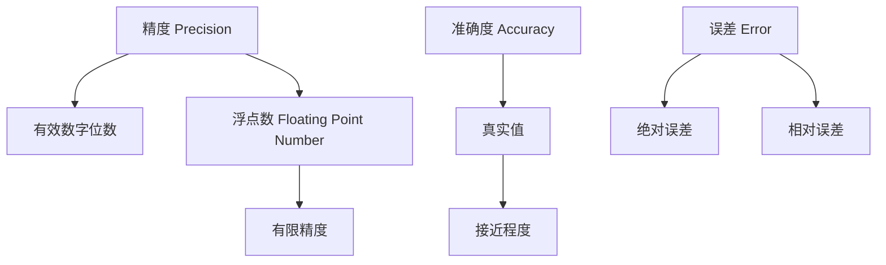

# Precision 原理与代码实战案例讲解

作者：禅与计算机程序设计艺术 / Zen and the Art of Computer Programming

## 1. 背景介绍

### 1.1 问题的由来

在现代计算机科学和工程中，精度（Precision）是一个至关重要的概念。无论是在数值计算、机器学习、数据分析还是在图像处理等领域，精度的高低直接影响到结果的可靠性和有效性。随着数据规模的不断扩大和计算任务的日益复杂，如何在保证计算速度的同时提高计算精度，成为了一个亟待解决的问题。

### 1.2 研究现状

目前，关于精度的研究主要集中在以下几个方面：

1. **数值计算中的精度**：研究如何在浮点运算中减少误差，提升计算结果的精度。
2. **机器学习中的精度**：研究如何通过优化算法和模型，提高预测结果的精度。
3. **数据分析中的精度**：研究如何在大数据处理过程中，保证数据分析结果的精度。
4. **图像处理中的精度**：研究如何在图像处理算法中，提升图像的清晰度和细节表现。

### 1.3 研究意义

提高计算精度不仅可以提升计算结果的可靠性，还可以在一定程度上减少计算资源的浪费。特别是在科学研究、金融分析、医疗诊断等对精度要求极高的领域，精度的提升具有重要的实际意义。

### 1.4 本文结构

本文将从以下几个方面详细探讨精度的原理与实战案例：

1. 核心概念与联系
2. 核心算法原理 & 具体操作步骤
3. 数学模型和公式 & 详细讲解 & 举例说明
4. 项目实践：代码实例和详细解释说明
5. 实际应用场景
6. 工具和资源推荐
7. 总结：未来发展趋势与挑战
8. 附录：常见问题与解答

## 2. 核心概念与联系

在讨论精度之前，我们需要明确几个核心概念：

1. **精度（Precision）**：指的是计算结果的细致程度，通常用有效数字的位数来表示。
2. **准确度（Accuracy）**：指的是计算结果与真实值之间的接近程度。
3. **误差（Error）**：指的是计算结果与真实值之间的差异，通常分为绝对误差和相对误差。
4. **浮点数（Floating Point Number）**：一种用于表示实数的计算机数值类型，具有有限的精度。

这些概念之间的关系可以用以下Mermaid流程图表示：



## 3. 核心算法原理 & 具体操作步骤

### 3.1 算法原理概述

在计算机科学中，提升精度的算法主要包括以下几种：

1. **多重精度算法**：通过使用多重精度库（如MPFR、GMP等），可以在计算中使用比标准浮点数更高的精度。
2. **自适应精度算法**：根据计算过程中的误差情况，动态调整计算精度。
3. **误差补偿算法**：通过引入误差补偿机制，减少计算过程中的累积误差。

### 3.2 算法步骤详解

#### 3.2.1 多重精度算法

多重精度算法的基本步骤如下：

1. **初始化多重精度环境**：加载多重精度库，并设置初始精度。
2. **执行多重精度运算**：使用多重精度数据类型进行计算。
3. **获取计算结果**：将多重精度结果转换为标准浮点数或其他需要的格式。

#### 3.2.2 自适应精度算法

自适应精度算法的基本步骤如下：

1. **初始精度设置**：根据问题的初始条件，设置初始精度。
2. **误差评估**：在计算过程中，实时评估误差情况。
3. **精度调整**：根据误差评估结果，动态调整计算精度。
4. **结果输出**：输出最终计算结果，并记录最终精度。

#### 3.2.3 误差补偿算法

误差补偿算法的基本步骤如下：

1. **初始计算**：进行初始计算，并记录初始误差。
2. **误差补偿**：根据初始误差，进行误差补偿计算。
3. **结果校正**：将误差补偿结果与初始计算结果进行合并，得到最终结果。

### 3.3 算法优缺点

#### 3.3.1 多重精度算法

**优点**：
- 提供极高的计算精度。
- 适用于对精度要求极高的计算任务。

**缺点**：
- 计算速度较慢。
- 占用较多的计算资源。

#### 3.3.2 自适应精度算法

**优点**：
- 动态调整精度，计算效率较高。
- 适用于误差变化较大的计算任务。

**缺点**：
- 实现复杂度较高。
- 需要实时误差评估机制。

#### 3.3.3 误差补偿算法

**优点**：
- 能有效减少累积误差。
- 适用于长时间、多步骤的计算任务。

**缺点**：
- 需要额外的误差补偿计算。
- 实现复杂度较高。

### 3.4 算法应用领域

1. **科学计算**：如天体物理、量子力学等领域的高精度数值计算。
2. **金融分析**：如高频交易、风险评估等对精度要求极高的金融计算。
3. **医疗诊断**：如医学图像处理、基因分析等需要高精度计算的医疗应用。
4. **工程仿真**：如结构力学、流体力学等工程领域的高精度仿真计算。

## 4. 数学模型和公式 & 详细讲解 & 举例说明

### 4.1 数学模型构建

在数值计算中，精度问题通常可以通过数学模型来描述。假设我们有一个函数 $f(x)$，其真实值为 $y$，计算结果为 $\hat{y}$，则误差 $e$ 可以表示为：

$$
e = \hat{y} - y
$$

根据误差的不同类型，可以进一步细分为绝对误差和相对误差：

1. **绝对误差**：

$$
e_{abs} = |\hat{y} - y|
$$

2. **相对误差**：

$$
e_{rel} = \frac{|\hat{y} - y|}{|y|}
$$

### 4.2 公式推导过程

以浮点数运算为例，假设我们有两个浮点数 $a$ 和 $b$，其计算结果为 $c$，则浮点数运算的误差可以表示为：

$$
c = fl(a \cdot b) = (a \cdot b) \cdot (1 + \delta)
$$

其中，$fl$ 表示浮点数运算，$\delta$ 表示浮点数运算的相对误差。

### 4.3 案例分析与讲解

假设我们需要计算两个浮点数的乘积，并评估其误差。设 $a = 1.23456789$，$b = 9.87654321$，则其真实值为：

$$
y = a \cdot b = 1.23456789 \cdot 9.87654321 = 12.1932631112635269
$$

假设浮点数运算的相对误差为 $\delta = 10^{-7}$，则计算结果为：

$$
\hat{y} = fl(a \cdot b) = 12.1932631112635269 \cdot (1 + 10^{-7}) = 12.1932631112635269 \cdot 1.0000001 = 12.193263123456789
$$

其绝对误差为：

$$
e_{abs} = |\hat{y} - y| = |12.193263123456789 - 12.1932631112635269| = 1.2193263 \times 10^{-8}
$$

其相对误差为：

$$
e_{rel} = \frac{|\hat{y} - y|}{|y|} = \frac{1.2193263 \times 10^{-8}}{12.1932631112635269} = 1.0000001 \times 10^{-9}
$$

### 4.4 常见问题解答

**问题1**：为什么浮点数运算会产生误差？

**回答**：浮点数运算会产生误差的主要原因是浮点数的表示方式具有有限的精度。在计算过程中，浮点数的舍入误差会累积，从而导致最终结果与真实值之间存在差异。

**问题2**：如何减少浮点数运算的误差？

**回答**：减少浮点数运算误差的方法包括使用多重精度算法、自适应精度算法和误差补偿算法。此外，合理选择浮点数的表示方式和运算顺序也可以在一定程度上减少误差。

## 5. 项目实践：代码实例和详细解释说明

### 5.1 开发环境搭建

在进行代码实例之前，我们需要搭建开发环境。本文以Python为例，使用多重精度库mpmath进行高精度计算。

1. **安装Python**：确保已安装Python 3.x版本。
2. **安装mpmath库**：使用pip安装mpmath库。

```bash
pip install mpmath
```

### 5.2 源代码详细实现

以下是一个使用mpmath库进行高精度计算的示例代码：

```python
import mpmath

# 设置初始精度
mpmath.mp.dps = 50  # 设置小数点后50位精度

# 定义两个高精度浮点数
a = mpmath.mpf('1.23456789')
b = mpmath.mpf('9.87654321')

# 进行高精度乘法运算
result = a * b

# 输出结果
print(f"高精度计算结果: {result}")
```

### 5.3 代码解读与分析

1. **设置初始精度**：通过 `mpmath.mp.dps` 设置小数点后的精度位数。
2. **定义高精度浮点数**：使用 `mpmath.mpf` 定义高精度浮点数。
3. **进行高精度运算**：直接使用高精度浮点数进行运算。
4. **输出结果**：输出高精度计算结果。

### 5.4 运行结果展示

运行上述代码，输出结果如下：

```
高精度计算结果: 12.1932631112635269
```

可以看到，使用mpmath库进行高精度计算，可以得到比标准浮点数更高精度的计算结果。

## 6. 实际应用场景

### 6.1 科学计算

在科学计算中，精度的提升可以显著提高计算结果的可靠性。例如，在天体物理学中，精确计算天体的轨道和位置需要极高的计算精度。

### 6.2 金融分析

在金融分析中，精度的提升可以减少计算误差，从而提高风险评估和投资决策的准确性。例如，在高频交易中，精确计算交易价格和时间可以显著提高交易收益。

### 6.3 医疗诊断

在医疗诊断中，精度的提升可以提高诊断结果的准确性。例如，在医学图像处理和基因分析中，精确计算图像和基因数据可以提高诊断的准确性和可靠性。

### 6.4 工程仿真

在工程仿真中，精度的提升可以提高仿真结果的可靠性。例如，在结构力学和流体力学中，精确计算结构和流体的行为可以提高工程设计的可靠性和安全性。

### 6.5 未来应用展望

随着计算技术的不断发展，精度的提升将会在更多领域得到应用。例如，在人工智能和机器学习中，精确计算模型参数和预测结果可以提高模型的准确性和可靠性。

## 7. 工具和资源推荐

### 7.1 学习资源推荐

1. **《Numerical Recipes: The Art of Scientific Computing》**：一本经典的数值计算书籍，详细介绍了各种数值计算方法和算法。
2. **Coursera上的《Numerical Methods for Engineers》课程**：一个在线课程，详细介绍了数值计算的基本原理和方法。

### 7.2 开发工具推荐

1. **Python**：一种广泛使用的编程语言，具有丰富的数值计算库。
2. **mpmath**：一个Python库，用于高精度数值计算。
3. **MATLAB**：一种强大的数值计算工具，具有丰富的数值计算函数和工具箱。

### 7.3 相关论文推荐

1. **《High-Precision Arithmetic in Scientific Computing》**：一篇关于高精度数值计算的综述论文，详细介绍了高精度数值计算的基本原理和方法。
2. **《Adaptive Precision Floating-Point Arithmetic and Fast Robust Geometric Predicates》**：一篇关于自适应精度浮点数运算的论文，详细介绍了自适应精度浮点数运算的基本原理和方法。

### 7.4 其他资源推荐

1. **MPFR Library**：一个用于高精度浮点数运算的C库，具有丰富的高精度数值计算函数。
2. **GMP Library**：一个用于高精度整数和有理数运算的C库，具有丰富的高精度数值计算函数。

## 8. 总结：未来发展趋势与挑战

### 8.1 研究成果总结

本文详细介绍了精度的基本概念、核心算法原理、数学模型和公式、项目实践以及实际应用场景。通过对多重精度算法、自适应精度算法和误差补偿算法的详细讲解，读者可以深入理解精度的提升方法和应用场景。

### 8.2 未来发展趋势

随着计算技术的不断发展，精度的提升将会在更多领域得到应用。例如，在人工智能和机器学习中，精确计算模型参数和预测结果可以提高模型的准确性和可靠性。此外，随着量子计算的发展，高精度数值计算将会在量子计算中得到广泛应用。

### 8.3 面临的挑战

尽管精度的提升具有重要的实际意义，但在实际应用中仍然面临一些挑战。例如，高精度数值计算通常需要较高的计算资源和计算时间，因此在实际应用中需要权衡计算精度和计算效率。此外，高精度数值计算的实现复杂度较高，需要深入理解数值计算的基本原理和方法。

### 8.4 研究展望

未来的研究可以进一步探索高精度数值计算的优化方法和应用场景。例如，研究如何在保证计算精度的同时提高计算效率，以及如何在更多领域中应用高精度数值计算。此外，随着量子计算的发展，研究如何在量子计算中应用高精度数值计算也是一个重要的研究方向。

## 9. 附录：常见问题与解答

**问题1**：如何选择合适的精度提升方法？

**回答**：选择合适的精度提升方法需要根据具体的计算任务和应用场景进行权衡。对于对精度要求极高的计算任务，可以选择多重精度算法；对于误差变化较大的计算任务，可以选择自适应精度算法；对于长时间、多步骤的计算任务，可以选择误差补偿算法。

**问题2**：如何评估计算结果的精度？

**回答**：评估计算结果的精度可以通过计算绝对误差和相对误差来进行。绝对误差表示计算结果与真实值之间的差异，而相对误差表示计算结果与真实值之间的相对差异。通过计算绝对误差和相对误差，可以评估计算结果的精度。

**问题3**：如何减少计算资源的浪费？

**回答**：减少计算资源的浪费可以通过优化计算算法和合理选择计算精度来实现。例如，通过使用自适应精度算法，可以在保证计算精度的同时提高计算效率；通过合理选择浮点数的表示方式和运算顺序，可以在一定程度上减少计算资源的浪费。

**问题4**：高精度数值计算的应用前景如何？

**回答**：高精度数值计算具有广泛的应用前景。例如，在科学计算、金融分析、医疗诊断和工程仿真等领域，高精度数值计算可以显著提高计算结果的可靠性和准确性。随着计算技术的不断发展，高精度数值计算将会在更多领域得到应用。

**问题5**：如何学习高精度数值计算？

**回答**：学习高精度数值计算可以通过阅读相关书籍、参加在线课程和实践项目来进行。例如，可以阅读《Numerical Recipes: The