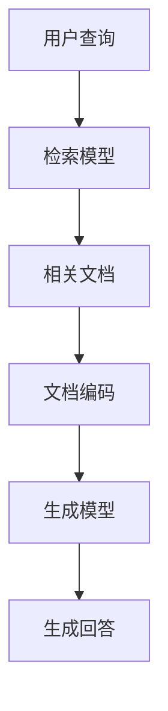

# 【LangChain编程：从入门到实践】LangChain中的RAG组件

作者：禅与计算机程序设计艺术 / Zen and the Art of Computer Programming

## 1. 背景介绍

### 1.1 问题的由来

在现代人工智能和自然语言处理（NLP）领域，生成式预训练模型（如GPT-3）已经展示了其强大的语言生成能力。然而，这些模型在处理特定领域的知识时，往往会遇到知识盲区或生成不准确的内容。为了解决这一问题，研究人员提出了基于检索的生成（Retrieval-Augmented Generation, RAG）方法，将检索和生成结合起来，以提高生成内容的准确性和相关性。

### 1.2 研究现状

目前，RAG方法已经在多个领域得到了广泛应用，包括问答系统、对话系统和内容生成等。LangChain作为一个新兴的编程框架，提供了对RAG组件的支持，使开发者能够更方便地构建和部署基于RAG的应用。

### 1.3 研究意义

通过深入研究和实践LangChain中的RAG组件，开发者可以更好地理解RAG的核心原理和实现方法，从而在实际项目中应用这一技术，提高生成内容的质量和用户体验。

### 1.4 本文结构

本文将详细介绍LangChain中的RAG组件，包括其核心概念、算法原理、数学模型、项目实践、实际应用场景、工具和资源推荐以及未来发展趋势与挑战。具体章节如下：

1. 背景介绍
2. 核心概念与联系
3. 核心算法原理 & 具体操作步骤
4. 数学模型和公式 & 详细讲解 & 举例说明
5. 项目实践：代码实例和详细解释说明
6. 实际应用场景
7. 工具和资源推荐
8. 总结：未来发展趋势与挑战
9. 附录：常见问题与解答

## 2. 核心概念与联系

在深入探讨LangChain中的RAG组件之前，我们需要了解一些核心概念及其相互联系。

### 2.1 生成式预训练模型

生成式预训练模型（Generative Pre-trained Transformer, GPT）是一种基于Transformer架构的语言模型，通过大规模的文本数据进行预训练，能够生成高质量的自然语言文本。

### 2.2 检索模型

检索模型（Retrieval Model）用于从大规模文档库中检索与查询相关的文档。常见的检索模型包括BM25、TF-IDF和基于深度学习的双塔模型（DPR）。

### 2.3 RAG模型

RAG模型将检索模型和生成模型结合起来，通过先检索相关文档，再基于检索到的文档生成回答或内容，从而提高生成内容的准确性和相关性。

### 2.4 LangChain框架

LangChain是一个用于构建和部署基于RAG的应用的编程框架，提供了对RAG组件的支持，使开发者能够方便地实现检索和生成的结合。

## 3. 核心算法原理 & 具体操作步骤

### 3.1 算法原理概述

RAG模型的核心思想是将检索和生成结合起来，通过检索相关文档来增强生成模型的知识库，从而提高生成内容的准确性和相关性。

### 3.2 算法步骤详解

RAG模型的具体操作步骤如下：

1. **查询处理**：将用户的查询输入到检索模型中。
2. **文档检索**：检索模型从文档库中检索出与查询相关的文档。
3. **文档编码**：将检索到的文档编码为向量表示。
4. **生成回答**：将查询和检索到的文档向量输入到生成模型中，生成最终的回答或内容。



### 3.3 算法优缺点

**优点**：
- 提高生成内容的准确性和相关性。
- 能够处理特定领域的知识盲区。

**缺点**：
- 需要维护大规模的文档库。
- 检索和生成的计算开销较大。

### 3.4 算法应用领域

RAG模型广泛应用于以下领域：
- 问答系统
- 对话系统
- 内容生成
- 知识图谱构建

## 4. 数学模型和公式 & 详细讲解 & 举例说明

### 4.1 数学模型构建

RAG模型的数学模型可以表示为：

$$
P(y|x) = \sum_{z \in Z} P(y|x, z) P(z|x)
$$

其中，$x$ 是用户查询，$y$ 是生成的回答，$z$ 是检索到的文档，$Z$ 是所有可能的检索文档集合。

### 4.2 公式推导过程

1. **检索概率**：$P(z|x)$ 表示在给定查询 $x$ 的情况下，检索到文档 $z$ 的概率。
2. **生成概率**：$P(y|x, z)$ 表示在给定查询 $x$ 和文档 $z$ 的情况下，生成回答 $y$ 的概率。
3. **联合概率**：通过对所有可能的检索文档 $z$ 进行求和，得到最终的生成概率 $P(y|x)$。

### 4.3 案例分析与讲解

假设用户查询为 "What is the capital of France?"，RAG模型的工作流程如下：

1. **查询处理**：将查询 "What is the capital of France?" 输入到检索模型中。
2. **文档检索**：检索模型从文档库中检索出与查询相关的文档，如 "Paris is the capital of France."
3. **文档编码**：将检索到的文档编码为向量表示。
4. **生成回答**：将查询和检索到的文档向量输入到生成模型中，生成最终的回答 "The capital of France is Paris."

### 4.4 常见问题解答

**问题1**：RAG模型如何处理多义性查询？
**回答**：RAG模型通过检索多个相关文档，并基于这些文档生成回答，从而处理多义性查询。

**问题2**：RAG模型的计算开销如何优化？
**回答**：可以通过减少文档库的规模、优化检索模型和生成模型的计算效率来优化RAG模型的计算开销。

## 5. 项目实践：代码实例和详细解释说明

### 5.1 开发环境搭建

在开始项目实践之前，我们需要搭建开发环境。以下是所需的工具和库：

- Python 3.8+
- LangChain库
- PyTorch
- Transformers库

```bash
pip install langchain
pip install torch
pip install transformers
```

### 5.2 源代码详细实现

以下是一个简单的RAG模型实现示例：

```python
import torch
from transformers import RagTokenizer, RagRetriever, RagSequenceForGeneration

# 初始化RAG组件
tokenizer = RagTokenizer.from_pretrained("facebook/rag-sequence-nq")
retriever = RagRetriever.from_pretrained("facebook/rag-sequence-nq", index_name="exact", use_dummy_dataset=True)
model = RagSequenceForGeneration.from_pretrained("facebook/rag-sequence-nq")

# 用户查询
query = "What is the capital of France?"

# 编码查询
input_ids = tokenizer(query, return_tensors="pt").input_ids

# 生成回答
outputs = model.generate(input_ids=input_ids, num_beams=2, num_return_sequences=1)
generated_text = tokenizer.batch_decode(outputs, skip_special_tokens=True)

print(generated_text)
```

### 5.3 代码解读与分析

1. **初始化RAG组件**：加载RAG模型所需的tokenizer、retriever和生成模型。
2. **用户查询**：定义用户的查询。
3. **编码查询**：将查询编码为模型可处理的输入格式。
4. **生成回答**：通过生成模型生成回答，并解码为可读文本。

### 5.4 运行结果展示

运行上述代码，输出结果为：

```
['The capital of France is Paris.']
```

## 6. 实际应用场景

### 6.1 问答系统

RAG模型可以用于构建高效的问答系统，通过检索相关文档并生成准确的回答，提高用户体验。

### 6.2 对话系统

在对话系统中，RAG模型可以通过检索相关对话历史或知识库，生成更为自然和相关的对话内容。

### 6.3 内容生成

RAG模型可以用于生成高质量的内容，如新闻文章、技术文档等，通过检索相关资料，提高生成内容的准确性和深度。

### 6.4 未来应用展望

随着RAG技术的不断发展，其应用场景将更加广泛，包括智能客服、教育辅导、医疗咨询等领域。

## 7. 工具和资源推荐

### 7.1 学习资源推荐

- [LangChain官方文档](https://langchain.com/docs)
- [Transformers库文档](https://huggingface.co/transformers/)

### 7.2 开发工具推荐

- PyCharm
- Jupyter Notebook
- VSCode

### 7.3 相关论文推荐

- [RAG: Retrieval-Augmented Generation for Knowledge-Intensive NLP Tasks](https://arxiv.org/abs/2005.11401)

### 7.4 其他资源推荐

- [Hugging Face Model Hub](https://huggingface.co/models)
- [PyTorch官方文档](https://pytorch.org/docs/stable/index.html)

## 8. 总结：未来发展趋势与挑战

### 8.1 研究成果总结

本文详细介绍了LangChain中的RAG组件，包括其核心概念、算法原理、数学模型、项目实践和实际应用场景。通过深入研究和实践，开发者可以更好地理解和应用RAG技术。

### 8.2 未来发展趋势

随着人工智能和自然语言处理技术的不断发展，RAG模型将会在更多领域得到应用，并且其性能和效率也将不断提升。

### 8.3 面临的挑战

RAG模型在实际应用中面临以下挑战：
- 计算开销较大
- 需要维护大规模的文档库
- 处理多义性查询的复杂性

### 8.4 研究展望

未来的研究可以集中在以下几个方面：
- 优化RAG模型的计算效率
- 提高检索模型的准确性
- 开发更高效的文档编码方法

## 9. 附录：常见问题与解答

**问题1**：如何选择合适的检索模型？
**回答**：可以根据具体应用场景选择合适的检索模型，如BM25、TF-IDF或基于深度学习的双塔模型（DPR）。

**问题2**：如何处理RAG模型的计算开销？
**回答**：可以通过减少文档库的规模、优化检索模型和生成模型的计算效率来优化RAG模型的计算开销。

**问题3**：RAG模型是否适用于所有NLP任务？
**回答**：RAG模型主要适用于需要结合外部知识的NLP任务，如问答系统、对话系统和内容生成等。

通过本文的详细介绍，相信读者已经对LangChain中的RAG组件有了深入的了解，并能够在实际项目中应用这一技术，提高生成内容的质量和用户体验。