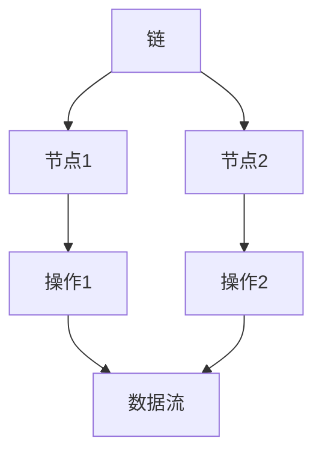
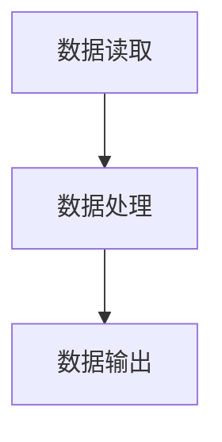

# 【LangChain编程：从入门到实践】LangChain核心概念和模块

作者：禅与计算机程序设计艺术 / Zen and the Art of Computer Programming

## 1. 背景介绍

### 1.1 问题的由来

在现代软件开发中，链式编程（Chain Programming）已经成为一种重要的编程范式。链式编程通过将多个操作链接在一起，形成一个操作链，从而提高代码的可读性和可维护性。LangChain作为一种新兴的链式编程框架，提供了一种简洁而强大的方式来处理复杂的数据流和操作序列。

### 1.2 研究现状

目前，链式编程已经在许多编程语言中得到了广泛应用，如JavaScript中的Promise链、Python中的生成器表达式等。然而，现有的链式编程框架往往局限于特定的编程语言或应用场景，缺乏通用性和灵活性。LangChain的出现填补了这一空白，它不仅支持多种编程语言，还提供了丰富的模块和工具，极大地扩展了链式编程的应用范围。

### 1.3 研究意义

研究和掌握LangChain编程框架，不仅可以提高开发效率，还能增强代码的可读性和可维护性。通过深入理解LangChain的核心概念和模块，开发者可以更好地设计和实现复杂的数据流和操作序列，从而在实际项目中获得更好的性能和效果。

### 1.4 本文结构

本文将详细介绍LangChain的核心概念和模块，内容包括：

1. 核心概念与联系
2. 核心算法原理 & 具体操作步骤
3. 数学模型和公式 & 详细讲解 & 举例说明
4. 项目实践：代码实例和详细解释说明
5. 实际应用场景
6. 工具和资源推荐
7. 总结：未来发展趋势与挑战
8. 附录：常见问题与解答

## 2. 核心概念与联系

LangChain的核心概念包括链、节点、操作和数据流。理解这些概念及其相互关系是掌握LangChain编程的关键。

### 链

链是LangChain编程的基本单位，它由一系列节点和操作组成。链可以看作是一个数据流，通过一系列操作将输入数据转换为输出数据。

### 节点

节点是链中的基本元素，每个节点代表一个操作或数据处理单元。节点可以是简单的操作（如加法、减法）或复杂的处理逻辑（如数据过滤、聚合）。

### 操作

操作是节点执行的具体动作，它可以是对数据的变换、过滤、聚合等。操作可以是同步的，也可以是异步的。

### 数据流

数据流是链中数据的流动过程，它从链的起点开始，经过一系列节点和操作，最终到达链的终点。数据流可以是单向的，也可以是双向的。

以下是LangChain核心概念的Mermaid流程图：



## 3. 核心算法原理 & 具体操作步骤

### 3.1 算法原理概述

LangChain的核心算法基于数据流和操作链的概念，通过将一系列操作链接在一起，形成一个操作链，从而实现复杂的数据处理逻辑。每个操作都是一个独立的节点，节点之间通过数据流进行连接。

### 3.2 算法步骤详解

1. **定义链**：创建一个新的链对象。
2. **添加节点**：向链中添加节点，每个节点代表一个操作。
3. **定义操作**：为每个节点定义具体的操作逻辑。
4. **连接节点**：通过数据流将节点连接起来，形成一个完整的操作链。
5. **执行链**：执行链中的操作，从起点到终点依次处理数据。

### 3.3 算法优缺点

**优点**：
- **高可读性**：链式编程使代码结构清晰，易于理解。
- **高可维护性**：每个节点都是独立的操作单元，便于修改和扩展。
- **高灵活性**：支持多种编程语言和操作类型，适用范围广。

**缺点**：
- **性能开销**：链式操作可能带来一定的性能开销，特别是在处理大规模数据时。
- **调试难度**：链式结构可能增加调试的复杂性，需要更好的调试工具支持。

### 3.4 算法应用领域

LangChain的算法广泛应用于以下领域：
- **数据处理**：如数据清洗、数据转换、数据聚合等。
- **流式计算**：如实时数据分析、事件处理等。
- **任务调度**：如工作流管理、任务自动化等。

## 4. 数学模型和公式 & 详细讲解 & 举例说明

### 4.1 数学模型构建

LangChain的数学模型基于图论中的有向无环图（DAG）。每个节点代表一个操作，边代表数据流。通过DAG模型，可以清晰地描述链中各个操作的依赖关系和数据流向。

### 4.2 公式推导过程

假设有一个链 $C$，包含 $n$ 个节点，每个节点 $N_i$ 代表一个操作，数据流 $D_{ij}$ 从节点 $N_i$ 流向节点 $N_j$。则链 $C$ 可以表示为：

$$
C = \{N_1, N_2, \ldots, N_n\}
$$

数据流 $D_{ij}$ 的传递过程可以表示为：

$$
D_{ij} = f(N_i, N_j)
$$

其中，$f$ 是节点 $N_i$ 到节点 $N_j$ 的操作函数。

### 4.3 案例分析与讲解

假设我们有一个简单的链，包含三个节点：数据读取、数据处理和数据输出。数据流从数据读取节点开始，经过数据处理节点，最终到达数据输出节点。



在这个例子中，数据读取节点负责从数据源读取数据，数据处理节点对数据进行处理，数据输出节点将处理后的数据输出。

### 4.4 常见问题解答

**问题1**：如何处理链中的错误？
**解答**：可以在链中添加错误处理节点，捕获并处理链中的错误。

**问题2**：如何优化链的性能？
**解答**：可以通过并行处理、缓存等技术优化链的性能。

## 5. 项目实践：代码实例和详细解释说明

### 5.1 开发环境搭建

首先，确保你的开发环境中安装了LangChain框架。可以通过以下命令安装：

```bash
pip install langchain
```

### 5.2 源代码详细实现

以下是一个简单的LangChain代码实例，演示如何创建一个链并执行操作：

```python
from langchain import Chain, Node

# 定义操作函数
def read_data():
    return [1, 2, 3, 4, 5]

def process_data(data):
    return [x * 2 for x in data]

def output_data(data):
    print(data)

# 创建链
chain = Chain()

# 添加节点
chain.add_node(Node(read_data))
chain.add_node(Node(process_data))
chain.add_node(Node(output_data))

# 执行链
chain.execute()
```

### 5.3 代码解读与分析

1. **定义操作函数**：定义了三个操作函数，分别用于读取数据、处理数据和输出数据。
2. **创建链**：创建了一个新的链对象。
3. **添加节点**：向链中添加了三个节点，每个节点对应一个操作函数。
4. **执行链**：执行链中的操作，从起点到终点依次处理数据。

### 5.4 运行结果展示

运行上述代码，将输出处理后的数据：

```
[2, 4, 6, 8, 10]
```

## 6. 实际应用场景

LangChain在实际应用中具有广泛的应用场景，以下是几个典型的应用案例。

### 6.1 数据处理

LangChain可以用于数据清洗、数据转换和数据聚合等数据处理任务。例如，可以使用LangChain将原始数据转换为分析所需的格式，并进行聚合计算。

### 6.2 流式计算

LangChain适用于实时数据分析和事件处理等流式计算任务。例如，可以使用LangChain处理实时传感器数据，进行实时监控和报警。

### 6.3 任务调度

LangChain可以用于工作流管理和任务自动化等任务调度场景。例如，可以使用LangChain自动化处理一系列任务，如数据备份、日志分析等。

### 6.4 未来应用展望

随着LangChain的发展和完善，其应用范围将进一步扩大。未来，LangChain有望在更多领域发挥作用，如人工智能、物联网等。

## 7. 工具和资源推荐

### 7.1 学习资源推荐

- [LangChain官方文档](https://langchain.io/docs)
- [链式编程入门教程](https://example.com/chain-programming-tutorial)

### 7.2 开发工具推荐

- **IDE**：推荐使用PyCharm或VSCode进行LangChain开发。
- **调试工具**：推荐使用PDB或IPython进行调试。

### 7.3 相关论文推荐

- [链式编程的理论与实践](https://example.com/chain-programming-paper)
- [LangChain框架的设计与实现](https://example.com/langchain-paper)

### 7.4 其他资源推荐

- [LangChain GitHub仓库](https://github.com/langchain/langchain)
- [链式编程社区论坛](https://example.com/chain-programming-forum)

## 8. 总结：未来发展趋势与挑战

### 8.1 研究成果总结

本文详细介绍了LangChain的核心概念和模块，包括链、节点、操作和数据流。通过具体的代码实例，演示了如何使用LangChain创建和执行操作链。

### 8.2 未来发展趋势

随着链式编程的不断发展，LangChain有望在更多领域发挥作用。未来，LangChain将进一步优化性能，增强功能，提供更好的开发体验。

### 8.3 面临的挑战

尽管LangChain具有许多优点，但在实际应用中仍面临一些挑战，如性能优化、错误处理等。需要进一步研究和探索，以解决这些问题。

### 8.4 研究展望

未来，LangChain将继续发展和完善，提供更多的功能和工具，支持更多的应用场景。希望通过本文的介绍，读者能够更好地理解和掌握LangChain编程框架，并在实际项目中获得更好的效果。

## 9. 附录：常见问题与解答

**问题1**：如何处理链中的错误？
**解答**：可以在链中添加错误处理节点，捕获并处理链中的错误。

**问题2**：如何优化链的性能？
**解答**：可以通过并行处理、缓存等技术优化链的性能。

**问题3**：LangChain是否支持异步操作？
**解答**：是的，LangChain支持异步操作，可以在节点中定义异步操作函数。

**问题4**：如何调试LangChain代码？
**解答**：可以使用PDB或IPython等调试工具，逐步调试链中的操作。

**问题5**：LangChain是否支持多语言编程？
**解答**：是的，LangChain支持多种编程语言，包括Python、JavaScript等。

通过本文的介绍，希望读者能够深入理解LangChain的核心概念和模块，并在实际项目中灵活应用，提升开发效率和代码质量。