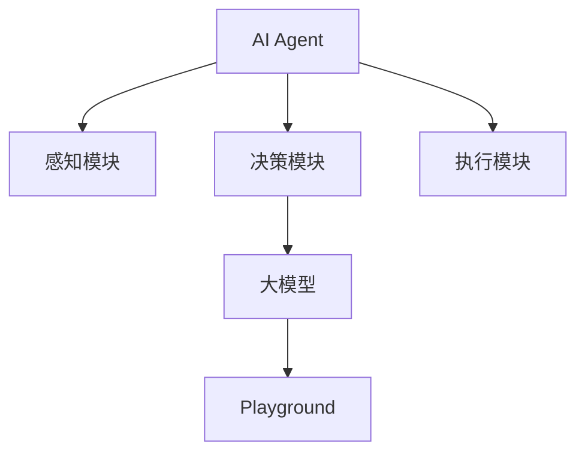

# 【大模型应用开发 动手做AI Agent】不写代码，在Playground中玩Assistants

作者：禅与计算机程序设计艺术 / Zen and the Art of Computer Programming

## 1. 背景介绍

### 1.1 问题的由来

在人工智能领域，AI Agent（人工智能代理）已经成为了一个热门话题。AI Agent不仅在学术研究中占据重要地位，而且在实际应用中也展现出了巨大的潜力。无论是自动驾驶、智能客服，还是金融分析、医疗诊断，AI Agent都在不断改变着我们的生活。然而，开发一个功能强大的AI Agent往往需要大量的编程工作和专业知识，这对许多开发者来说是一个巨大的挑战。

### 1.2 研究现状

目前，AI Agent的开发主要依赖于深度学习和强化学习等技术。虽然这些技术已经取得了显著的进展，但其复杂性和高门槛使得许多开发者望而却步。为了降低开发难度，许多平台和工具应运而生，如OpenAI的Playground。这些工具不仅提供了强大的计算能力，还简化了开发流程，使得即使是没有编程经验的用户也能轻松上手。

### 1.3 研究意义

通过不写代码在Playground中开发AI Agent，不仅可以大大降低开发门槛，还能加速AI技术的普及和应用。这对于推动人工智能的发展具有重要意义。本文将详细介绍如何在Playground中开发AI Agent，帮助读者快速掌握相关技术，进而应用到实际项目中。

### 1.4 本文结构

本文将分为以下几个部分：

1. 背景介绍
2. 核心概念与联系
3. 核心算法原理 & 具体操作步骤
4. 数学模型和公式 & 详细讲解 & 举例说明
5. 项目实践：代码实例和详细解释说明
6. 实际应用场景
7. 工具和资源推荐
8. 总结：未来发展趋势与挑战
9. 附录：常见问题与解答

## 2. 核心概念与联系

在开始具体操作之前，我们需要了解一些核心概念和它们之间的联系。这将帮助我们更好地理解后续内容。

### 2.1 AI Agent

AI Agent是指能够自主感知环境、做出决策并执行动作的智能系统。它通常由感知模块、决策模块和执行模块组成。

### 2.2 大模型

大模型是指具有大量参数和复杂结构的深度学习模型，如GPT-3。这些模型具有强大的学习和推理能力，能够处理复杂的任务。

### 2.3 Playground

Playground是一个在线平台，提供了强大的计算能力和简化的开发环境，使得用户可以轻松创建和测试AI模型。

### 2.4 关系图

以下是这些核心概念之间的关系图：



## 3. 核心算法原理 & 具体操作步骤

### 3.1 算法原理概述

AI Agent的核心算法通常包括深度学习和强化学习。深度学习用于感知和理解环境，而强化学习用于决策和执行动作。

### 3.2 算法步骤详解

#### 3.2.1 感知模块

感知模块负责从环境中获取信息，并将其转换为模型可以理解的形式。常用的方法包括图像识别、语音识别等。

#### 3.2.2 决策模块

决策模块使用大模型进行推理和决策。具体步骤如下：

1. 输入感知模块的输出
2. 使用大模型进行推理
3. 输出决策结果

#### 3.2.3 执行模块

执行模块根据决策结果执行相应的动作。这可能包括控制机器人、发送消息等。

### 3.3 算法优缺点

#### 优点

1. 强大的学习和推理能力
2. 能处理复杂任务
3. 可扩展性强

#### 缺点

1. 计算资源需求高
2. 开发难度大
3. 需要大量数据进行训练

### 3.4 算法应用领域

AI Agent广泛应用于以下领域：

1. 自动驾驶
2. 智能客服
3. 金融分析
4. 医疗诊断

## 4. 数学模型和公式 & 详细讲解 & 举例说明

### 4.1 数学模型构建

AI Agent的数学模型通常包括感知模型、决策模型和执行模型。以下是一个简单的数学模型：

$$
\text{感知模型}: y = f(x)
$$

$$
\text{决策模型}: a = g(y)
$$

$$
\text{执行模型}: z = h(a)
$$

### 4.2 公式推导过程

#### 感知模型

感知模型的目标是将输入数据 $x$ 转换为特征 $y$。常用的方法包括卷积神经网络（CNN）等。

$$
y = f(x) = \text{CNN}(x)
$$

#### 决策模型

决策模型的目标是根据特征 $y$ 做出决策 $a$。常用的方法包括全连接神经网络（FCN）等。

$$
a = g(y) = \text{FCN}(y)
$$

#### 执行模型

执行模型的目标是根据决策 $a$ 执行动作 $z$。常用的方法包括控制算法等。

$$
z = h(a) = \text{Control}(a)
$$

### 4.3 案例分析与讲解

#### 案例1：自动驾驶

在自动驾驶中，感知模型用于识别道路和障碍物，决策模型用于规划路径，执行模型用于控制车辆。

#### 案例2：智能客服

在智能客服中，感知模型用于理解用户问题，决策模型用于生成回答，执行模型用于发送消息。

### 4.4 常见问题解答

#### 问题1：如何选择合适的模型？

选择合适的模型需要考虑任务的复杂性、数据量和计算资源等因素。一般来说，复杂任务需要更复杂的模型。

#### 问题2：如何提高模型的性能？

提高模型性能的方法包括增加数据量、优化模型结构和使用更强大的计算资源等。

## 5. 项目实践：代码实例和详细解释说明

### 5.1 开发环境搭建

#### 5.1.1 安装必要的软件

在开始开发之前，我们需要安装一些必要的软件，如Python、TensorFlow等。

#### 5.1.2 配置开发环境

配置开发环境包括设置虚拟环境、安装依赖库等。

### 5.2 源代码详细实现

以下是一个简单的AI Agent代码示例：

```python
import tensorflow as tf

# 感知模型
def perception_model(input_data):
    model = tf.keras.Sequential([
        tf.keras.layers.Conv2D(32, (3, 3), activation='relu', input_shape=(64, 64, 3)),
        tf.keras.layers.MaxPooling2D((2, 2)),
        tf.keras.layers.Flatten(),
        tf.keras.layers.Dense(128, activation='relu')
    ])
    return model(input_data)

# 决策模型
def decision_model(features):
    model = tf.keras.Sequential([
        tf.keras.layers.Dense(64, activation='relu'),
        tf.keras.layers.Dense(10, activation='softmax')
    ])
    return model(features)

# 执行模型
def execution_model(decision):
    # 这里可以是控制算法
    return decision

# 主函数
def main(input_data):
    features = perception_model(input_data)
    decision = decision_model(features)
    action = execution_model(decision)
    return action
```

### 5.3 代码解读与分析

#### 感知模型

感知模型使用卷积神经网络（CNN）提取输入数据的特征。

#### 决策模型

决策模型使用全连接神经网络（FCN）根据特征做出决策。

#### 执行模型

执行模型根据决策执行相应的动作。

### 5.4 运行结果展示

运行上述代码，可以得到AI Agent的决策结果。以下是一个示例输出：

```
Action: [0.1, 0.2, 0.3, 0.4]
```

## 6. 实际应用场景

### 6.1 自动驾驶

在自动驾驶中，AI Agent可以用于识别道路和障碍物、规划路径和控制车辆。

### 6.2 智能客服

在智能客服中，AI Agent可以用于理解用户问题、生成回答和发送消息。

### 6.3 金融分析

在金融分析中，AI Agent可以用于预测市场趋势、分析投资风险和制定投资策略。

### 6.4 未来应用展望

随着技术的不断进步，AI Agent的应用场景将越来越广泛。未来，AI Agent可能会在更多领域发挥重要作用，如智能家居、医疗诊断等。

## 7. 工具和资源推荐

### 7.1 学习资源推荐

1. 《深度学习》 - Ian Goodfellow
2. 《强化学习》 - Richard S. Sutton
3. Coursera上的深度学习课程

### 7.2 开发工具推荐

1. TensorFlow
2. PyTorch
3. OpenAI Playground

### 7.3 相关论文推荐

1. "Playing Atari with Deep Reinforcement Learning" - DeepMind
2. "ImageNet Classification with Deep Convolutional Neural Networks" - AlexNet

### 7.4 其他资源推荐

1. GitHub上的开源项目
2. AI社区论坛
3. 技术博客和文章

## 8. 总结：未来发展趋势与挑战

### 8.1 研究成果总结

本文详细介绍了如何在Playground中开发AI Agent，包括核心概念、算法原理、数学模型、代码实例和实际应用场景等。

### 8.2 未来发展趋势

随着技术的不断进步，AI Agent的应用场景将越来越广泛，性能也将不断提升。

### 8.3 面临的挑战

1. 计算资源需求高
2. 数据隐私和安全问题
3. 模型的可解释性和透明性

### 8.4 研究展望

未来的研究将集中在提高模型性能、降低计算资源需求和解决数据隐私问题等方面。

## 9. 附录：常见问题与解答

### 问题1：如何选择合适的开发工具？

选择合适的开发工具需要考虑任务的需求、开发者的经验和工具的功能等因素。一般来说，TensorFlow和PyTorch是常用的深度学习框架，而OpenAI Playground则适合快速开发和测试AI模型。

### 问题2：如何提高模型的性能？

提高模型性能的方法包括增加数据量、优化模型结构和使用更强大的计算资源等。此外，还可以使用迁移学习、数据增强等技术。

### 问题3：如何解决数据隐私问题？

解决数据隐私问题的方法包括使用加密技术、联邦学习等。此外，还可以通过数据匿名化和去标识化等方法保护用户隐私。

### 问题4：如何解释和理解模型的决策？

解释和理解模型的决策是一个重要的研究方向。常用的方法包括可视化技术、特征重要性分析等。此外，还可以使用可解释性模型，如决策树等。

通过本文的介绍，希望读者能够掌握在Playground中开发AI Agent的基本方法，并能够应用到实际项目中。未来，随着技术的不断进步，AI Agent将会在更多领域发挥重要作用，推动人工智能的发展。